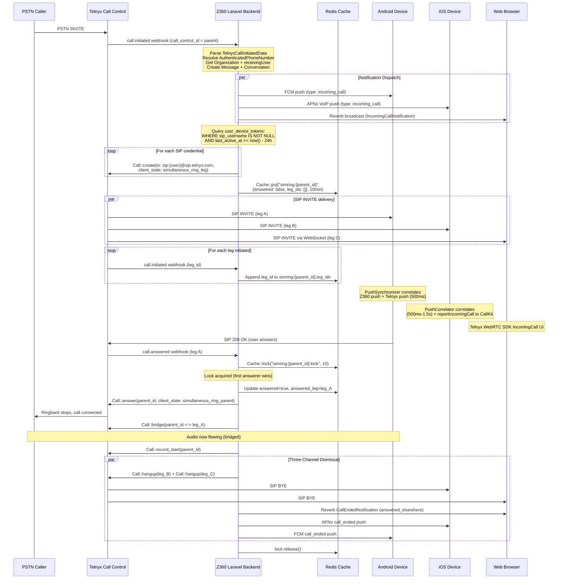

# Z360 VoIP Platform -- Technical Whitepaper

**Version**: 1.0 Draft
**Date**: February 2026
**Scope**: Complete VoIP subsystem architecture, implementation, and hardening guide
**Source Corpus**: 54 research documents (~550,000 tokens of analysis across 15 sessions)

---

## Table of Contents

- [1. Executive Summary](#1-executive-summary)
- [2. System Architecture Overview](#2-system-architecture-overview)
  - [2.1 What Z360 Is](#21-what-z360-is)
  - [2.2 Master System Diagram](#22-master-system-diagram)
  - [2.3 Component Architecture Summary](#23-component-architecture-summary)
  - [2.4 VoIP Dual-Mode Architecture](#24-voip-dual-mode-architecture)
  - [2.5 Platform Comparison Matrix](#25-platform-comparison-matrix)
  - [2.6 Key Architectural Decisions](#26-key-architectural-decisions)
  - [2.7 Data Flow Overview](#27-data-flow-overview)
  - [2.8 Control Flow Overview](#28-control-flow-overview)
- [3. Technology Landscape](#3-technology-landscape)
  - [3.1 Telnyx Call Control API](#31-telnyx-call-control-api)
  - [3.2 Telnyx Credential Model](#32-telnyx-credential-model)
  - [3.3 Telnyx WebRTC SDKs (Android, iOS, Web)](#33-telnyx-webrtc-sdks-android-ios-web)
  - [3.4 Capacitor Bridge Architecture](#34-capacitor-bridge-architecture)
  - [3.5 Platform Requirements and Constraints](#35-platform-requirements-and-constraints)
- [4. Android Platform Deep Dive](#4-android-platform-deep-dive)
  - [4.1 Current State: Component Documentation](#41-current-state-component-documentation)
  - [4.2 Target Architecture](#42-target-architecture)
  - [4.3 Gap Analysis (28 items)](#43-gap-analysis-28-items)
- [5. iOS Platform Deep Dive](#5-ios-platform-deep-dive)
  - [5.1 Current State: Architecture Reference](#51-current-state-architecture-reference)
  - [5.2 Target Architecture](#52-target-architecture)
  - [5.3 Gap Analysis (10 items)](#53-gap-analysis-10-items)
- [6. Web and Laravel Platform Deep Dive](#6-web-and-laravel-platform-deep-dive)
  - [6.1 Laravel Backend Call Orchestration](#61-laravel-backend-call-orchestration)
  - [6.2 Web Client VoIP Implementation](#62-web-client-voip-implementation)
  - [6.3 Target Design and Gap Analysis](#63-target-design-and-gap-analysis)
- [7. Call Management](#7-call-management)
  - [7.1 Credential Lifecycle (All Platforms)](#71-credential-lifecycle-all-platforms)
  - [7.2 Authentication and Security](#72-authentication-and-security)
  - [7.3 Inbound Call Flow: Backend Orchestration](#73-inbound-call-flow-backend-orchestration)
  - [7.4 Inbound Call Flow: Android Trace](#74-inbound-call-flow-android-trace)
  - [7.5 Inbound Call Flow: iOS Trace](#75-inbound-call-flow-ios-trace)
  - [7.6 Inbound Call Flow: Web Trace](#76-inbound-call-flow-web-trace)
  - [7.7 Inbound Call Flow: Unified End-to-End](#77-inbound-call-flow-unified-end-to-end)
  - [7.8 Simultaneous Ringing: Happy Path](#78-simultaneous-ringing-happy-path)
  - [7.9 Simultaneous Ringing: Failure Modes](#79-simultaneous-ringing-failure-modes)
  - [7.10 Simultaneous Ringing: Alternative Approaches](#710-simultaneous-ringing-alternative-approaches)
  - [7.11 Call State Machine](#711-call-state-machine)
  - [7.12 Cross-Platform Call State Synchronization](#712-cross-platform-call-state-synchronization)
- [8. Push Notification Architecture](#8-push-notification-architecture)
  - [8.1 Two-Push Architecture](#81-two-push-architecture)
  - [8.2 Push Credential Configuration](#82-push-credential-configuration)
  - [8.3 Non-VoIP Notifications](#83-non-voip-notifications)
- [9. Edge Cases, Race Conditions, and Failure Modes](#9-edge-cases-race-conditions-and-failure-modes)
  - [9.1 Backend Race Conditions](#91-backend-race-conditions)
  - [9.2 Mobile Race Conditions](#92-mobile-race-conditions)
  - [9.3 Network and System Failures](#93-network-and-system-failures)
  - [9.4 Failure Analysis Synthesis](#94-failure-analysis-synthesis)
- [10. Configuration and Deployment](#10-configuration-and-deployment)
  - [10.1 Configuration Reference](#101-configuration-reference)
  - [10.2 Build and Deployment Guide](#102-build-and-deployment-guide)
- [11. Consolidated Gap Analysis](#11-consolidated-gap-analysis)
  - [11.1 Gap Inventory (127 items by severity)](#111-gap-inventory-127-items-by-severity)
  - [11.2 Root Cause Analysis (5 systemic causes)](#112-root-cause-analysis-5-systemic-causes)
  - [11.3 Cross-Platform Gap Matrix](#113-cross-platform-gap-matrix)
- [12. Hardening Roadmap](#12-hardening-roadmap)
  - [12.1 Phase 1: Critical Path (Week 1-2)](#121-phase-1-critical-path-week-1-2)
  - [12.2 Phase 2: High-Priority Stability (Week 3-4)](#122-phase-2-high-priority-stability-week-3-4)
  - [12.3 Phase 3: Medium-Priority Improvements (Week 5-8)](#123-phase-3-medium-priority-improvements-week-5-8)
  - [12.4 Phase 4: Polish and Optimization (Backlog)](#124-phase-4-polish-and-optimization-backlog)
  - [12.5 Quick Wins (Day 1)](#125-quick-wins-day-1)
- [13. Glossary](#13-glossary)
- [14. Source Document Index](#14-source-document-index)

---

## 1. Executive Summary

### What Z360 VoIP Is

Z360 is a **multi-tenant SaaS platform** for business communications and contact management. Its VoIP subsystem enables real-time voice calling across three client platforms -- web browser, iOS, and Android -- backed by a Laravel 12 server that orchestrates calls through the **Telnyx Call Control API**.

- The system handles **inbound and outbound PSTN calls** routed through Telnyx SIP infrastructure.
- Calls ring **simultaneously on all registered devices** for a given user (web, phone, tablet).
- **Contacts** are the foundational data model: every call resolves the caller to a contact for name, avatar, and organizational context.
- The platform is **multi-tenant**: users belong to multiple organizations, and calls arrive scoped to a specific org. Answering a call for a different org triggers a live credential switch.

### The Key Architectural Insight

The most important design decision in the system is the **separation of native VoIP from the Capacitor WebView**:

- Mobile apps are Capacitor 8 hybrid apps (web UI in a WebView).
- VoIP calls do **NOT** go through the WebView. Native Kotlin (Android) and Swift (iOS) code speaks **directly** to the Telnyx SDK.
- The `TelnyxVoipPlugin` Capacitor bridge carries only JS-initiated commands and native-to-JS event notifications -- never audio or call signaling.
- This prevents the dual-WebSocket problem (one from the web SPA, one from native) and ensures calls work even when the WebView is frozen or unloaded.

### How Calls Work (High Level)

**Inbound call flow** -- the system's most complex path:

1. **PSTN caller dials** a Telnyx number assigned to a Z360 organization.
2. **Telnyx sends a webhook** (`call.initiation`) to the Z360 backend.
3. **Backend resolves the caller** (blocked? after hours? which user owns this number?) and finds the contact name/avatar.
4. **Backend dispatches three parallel signals**:
   - **Z360 push** (FCM for Android, APNs for iOS) with caller display info (name, avatar, org context).
   - **SIP legs** to each registered device's per-device SIP credential (triggers the Telnyx SDK push).
   - **Reverb WebSocket broadcast** to web browsers (IncomingCallNotification event).
5. **Devices correlate two pushes**: The Z360 push (display data) and the Telnyx push (call control metadata) arrive independently, in arbitrary order. Both platforms implement a **500ms synchronization window** (`PushSynchronizer` on Android, `PushCorrelator` on iOS) that merges them by normalizing phone numbers to last 10 digits.
6. **User sees ringing UI**: Android shows a custom `IncomingCallActivity`, iOS shows the native CallKit system UI, web shows a React dialpad overlay.
7. **User answers**: The answering device sends a SIP 200 OK. The backend acquires a **distributed Redis lock** (`simring:{parentId}:lock`), bridges the parent call to the winning device, and hangs up all other SIP legs via **three-channel dismissal** (SIP BYE + Reverb broadcast + push notification).

**Credential model**:

- **Web**: Org-level JWT token (10-hour TTL), one per user+org, used for WebRTC.
- **Mobile**: Per-device SIP credentials (30-day TTL), one per device+org, enabling unique SIP REGISTER for simultaneous ring.

### The Three Platforms

| Aspect | Web | Android | iOS |
|--------|-----|---------|-----|
| VoIP SDK | `@telnyx/react-client` (WebRTC) | Telnyx Android SDK (native) | Telnyx iOS SDK / `TxClient` (native) |
| Push channel | Reverb WebSocket | Firebase FCM | Apple PushKit (VoIP push) |
| Call UI | React DialpadContext | Native IncomingCallActivity / ActiveCallActivity | System CallKit UI |
| System integration | None | TelecomManager / ConnectionService | CallKit / CXProvider |
| Background calls | Not supported | Foreground service + TelecomManager | Background modes: voip, audio |
| Startup model | Page load | Single-phase (plugin load) | **Two-phase** (Phase 1: PushKit + CallKit only in ~50ms; Phase 2: Firebase, audio, network deferred to `sceneDidBecomeActive`) |
| Hard timing constraint | None | ANR after 5s | **Must report CallKit in 5s or iOS permanently revokes VoIP push** |

### Biggest Risks and Known Fragilities

The system has **127 identified gaps** after deduplication across all research tracks. The most dangerous clusters:

- **14 CRITICAL issues** that can cause permanent system damage, security breaches, or silent call failure.
- **23 HIGH issues** that degrade reliability for 5-15% of calls.
- **38 MEDIUM issues** affecting edge cases and code quality.
- **38 LOW issues** that are polish and optimization items.
- **7 CONFIGURATION/BUILD issues** that block production mobile releases.

**Five systemic root causes** account for 60%+ of all issues:

1. **Asynchronous webhook state population** (11 issues) -- The backend creates SIP legs but stores an empty `leg_ids` array, relying on async webhooks to populate it. Every coordination operation (answer, hangup, bridge) has a window where it works with incomplete data.
2. **No infrastructure graceful degradation** (8 issues) -- Redis, Telnyx API, and push services are treated as infallible. No fallback paths, retries, or circuit breakers exist.
3. **iOS 5-second PushKit deadline coupling** (3 issues) -- Org switching, credential fetching, and SDK reconnection are coupled into the critical 5-second path. Exceeding it causes Apple to **permanently revoke VoIP push capability**.
4. **Missing Android network resilience** (4 issues) -- SDK auto-reconnect is explicitly disabled (`autoReconnect = false`). Every network blip drops the active call. iOS has this fixed.
5. **Zero webhook authentication** (2 issues) -- All Telnyx webhook routes have no signature verification. An attacker who discovers the webhook URL can forge call events, terminate active calls, or inject fake data.

### Top Priorities for the Development Team

**Day 1 quick wins** (under 4 hours total):

- Enable Android SDK `autoReconnect = true` (30 min -- stops all network-blip call drops)
- Add credential expiry check to SIP destination query (30 min -- stops dialing expired credentials)
- Extend simring cache TTL from 10 min to 2 hours (30 min -- fixes long-call cleanup)
- Replace hardcoded `API_BASE_URL` with BuildConfig (30 min -- fixes non-production environments)

**Week 1-2 critical path** (22.5 engineer-days across 3 engineers):

- Implement Telnyx webhook signature verification (security)
- Fix caller hangup to cancel all SIP legs (devices ring 10-30s after caller hung up today)
- Capture leg IDs synchronously from `Call::create()` response (fixes 6 downstream issues)
- Decouple iOS CallKit reporting from org switch (prevents permanent VoIP push revocation)
- Sync Android FCM token on refresh (calls silently stop after token rotation today)
- Trigger iOS Phase 2 initialization from PushKit handler on cold start

> **Key Takeaways -- Executive Summary**
>
> - Z360's VoIP architecture is **sound in design** but **not yet production-hardened**.
> - The native/WebView separation, two-push correlation, and Redis-coordinated simultaneous ring represent strong engineering.
> - However, 14 critical issues must be fixed before any production VoIP traffic: missing webhook auth, unhandled caller hangup, empty leg_ids race, iOS CallKit deadline coupling, and silent Android FCM token drift.
> - Five systemic root causes account for most issues. Fixing the root causes (especially synchronous leg ID capture and webhook auth) resolves multiple downstream bugs simultaneously.
> - A 2-week sprint with 3 engineers (Backend, iOS, Android) addresses all critical issues.

---

## 2. System Architecture Overview

### 2.1 What Z360 Is

Z360 is a multi-tenant SaaS platform combining:

- **Web Platform**: Laravel 12 + React 19 + TypeScript + Inertia.js SPA
- **Mobile Apps**: Capacitor 8 hybrid apps (iOS + Android) with native VoIP layers
- **Real-time Layer**: Laravel Reverb WebSocket broadcasting
- **AI Layer**: External Python agent gateway with 45-tool MCP server
- **CPaaS Integration**: Telnyx for voice, SMS, RCS, and WebRTC
- **Infrastructure**: PostgreSQL, Redis/Valkey, S3/MinIO, Docker

The platform operates in two system layers:

- **Organizational Layer** -- Tenant-scoped business operations (Contacts, Inbox, Tickets, Inquiries, AI Studio, Settings)
- **Administrative Layer** -- Platform-wide management and oversight

All data is tenant-isolated via session-based organization switching with automatic query scoping across 32 Eloquent models using the `BelongsToTenant` trait.

### 2.2 Master System Diagram


**What this shows**: The complete Z360 system with all major components and their communication paths. The diagram emphasizes the dual-push architecture (Z360 push for display data, Telnyx push for call control) arriving on mobile devices through independent channels, and the native VoIP layer sitting beneath the Capacitor WebView bridge. Web browsers receive call notifications via Reverb WebSocket broadcast instead of push notifications.

### 2.3 Component Architecture Summary

**Backend (Laravel 12)**:

- **50+ Controllers** -- Thin orchestrators; validate via Form Requests, delegate to Services/Observers
- **20+ Services** -- Business logic: CPaaSService (Telnyx), PushNotificationService, AgentService, ApnsVoipService
- **40+ Models** -- 32 tenant-aware via `BelongsToTenant` trait; `Contact` is the central data model
- **23 Observers** -- Lifecycle hooks receiving data via temporary properties (`$model->_propertyName`)
- **60+ Form Requests** -- Validation logic extracted from controllers
- **39 Enums** -- Domain enums across communication, AI, billing, inquiry, and organization
- **11+ Jobs** -- Async processing: email, SMS, AI runs, workflows, usage metering
- **16+ Events** -- 4 broadcastable (VoIP + org), 12 organization lifecycle
- **45 MCP Tools** -- AI agent tools across Contacts, Conversations, Tickets, Inquiries

**Frontend (React 19 + Inertia.js)**:

- **200+ Pages** -- Inertia page components across 10+ domains
- **4 Layouts** -- App, Settings, Auth, Onboarding
- **17+ Hooks** -- State management, platform detection, VoIP, real-time
- **7+ Providers** -- Error boundary, Toast, Modal, VoIP (platform-conditional), Dialpad, Sidebar

**Provider hierarchy** (outermost to innermost):
```
AppErrorBoundary -> GlobalToastProvider -> ModalStackProvider ->
  [Web: TelnyxRTCProvider | Native: NativeVoipProvider] ->
    DialpadProvider -> SidebarProvider -> Page Content
```

**Mobile (Capacitor 8 Hybrid)**:

- **Android**: 26 native files -- `TelnyxVoipPlugin`, `Z360ConnectionService`, `IncomingCallActivity`, `ActiveCallActivity`, `Z360FirebaseMessagingService`, `PushSynchronizer`
- **iOS**: 25 native files -- `TelnyxVoipPlugin`, `Z360VoIPService`, `CallKitManager`, `PushKitManager`, `TelnyxService`, `PushCorrelator`

**External Services (14+)**:

| Service | Protocol | Purpose |
|---------|----------|---------|
| Telnyx (8 sub-services) | HTTPS + webhooks | Voice, SMS, RCS, WebRTC, A2P, credentials |
| Firebase FCM | HTTPS (OAuth2) | Android push notifications |
| Apple APNs | HTTP/2 (JWT/cert) | iOS VoIP push notifications |
| Stripe | HTTPS + webhooks | Billing, subscriptions, PAYG metering |
| Google/Gmail | HTTPS + Pub/Sub | OAuth, Gmail email integration |
| AI Agent Gateway | HTTPS + webhooks | AI reasoning, MCP tools, transcription |
| Laravel Reverb | WebSocket | Real-time event broadcasting |
| Redis/Valkey | TCP | Cache, queue, session store, distributed locks |
| PostgreSQL | TCP | Primary database |

### 2.4 VoIP Dual-Mode Architecture

The VoIP layer operates differently based on platform detection at startup:

| Platform | VoIP Provider | Connection | Call UI |
|----------|--------------|------------|---------|
| Web browser | `TelnyxRTCProvider` | WebRTC via `@telnyx/react-client` | React components in browser |
| Android native | `NativeVoipProvider` via Telnyx Android SDK | Native WebSocket/WebRTC | `IncomingCallActivity` / `ActiveCallActivity` |
| iOS native | `NativeVoipProvider` via Telnyx iOS SDK (`TxClient`) | Native WebSocket/WebRTC | iOS CallKit system UI |

- On native platforms, `NativeVoipProvider` replaces `TelnyxRTCProvider` to prevent dual WebSocket connections.
- The `Capacitor.isNativePlatform()` check at app startup determines which provider to mount.
- Native VoIP code runs entirely outside the WebView -- audio, signaling, and call control never touch the web layer.

*(See also: [Section 3.4 -- Capacitor Bridge Architecture](#34-capacitor-bridge-architecture) for how the native-to-WebView bridge works, and [Section 4.1](#41-current-state-component-documentation) / [Section 5.1](#51-current-state-architecture-reference) for platform-specific implementations.)*

### 2.5 Platform Comparison Matrix

| Aspect | Web | Android | iOS |
|--------|-----|---------|-----|
| **Runtime** | Browser (React SPA) | Capacitor WebView + native | Capacitor WebView + native |
| **VoIP SDK** | `@telnyx/react-client` (WebRTC) | Telnyx Android SDK (native) | Telnyx iOS SDK / `TxClient` (native) |
| **Push delivery** | Reverb WebSocket broadcast | FCM (Firebase) | PushKit (Apple VoIP push) |
| **Push handler** | Echo listener to React state | `Z360FirebaseMessagingService` | `PushKitManager` |
| **Call UI** | React DialpadContext | Native Activities | CallKit system UI |
| **System integration** | None | TelecomManager / ConnectionService | CallKit / CXProvider |
| **Credential storage** | Session / Inertia props | SharedPreferences | Keychain |
| **Startup** | Page load | Single-phase (plugin load) | Two-phase (deferred init) |
| **Push timing constraint** | N/A | ANR after 5s | Must report CallKit in 5s or app killed |
| **Background calls** | Not supported | Foreground service + TelecomManager | Background modes: voip, audio |
| **Credential type** | Org-level JWT (10h TTL) | Per-device SIP (30-day TTL) | Per-device SIP (30-day TTL) |

### 2.6 Key Architectural Decisions

This subsection explains **why** the system is built the way it is.

**Decision 1: Native VoIP layer separate from Capacitor WebView**

- **Why**: WebView WebRTC is unreliable on mobile (Capacitor doesn't guarantee WebView lifecycle during background calls). Native Telnyx SDKs integrate with OS-level call APIs (ConnectionService, CallKit) that WebView cannot access. Audio session management must happen at the native layer.
- **What can break**: The Capacitor bridge (`TelnyxVoipPlugin`) becomes a fragile translation layer. Four TypeScript bridge methods currently have no Android implementation (GAP AND-02).

**Decision 2: Two-push architecture for incoming calls**

- **Why**: The Z360 backend has caller identity data (name, avatar, org context) that the Telnyx push cannot carry. The Telnyx push carries call control metadata that the backend push cannot replicate (SDK needs it to establish the SIP session). Neither push alone is sufficient.
- **What can break**: The two pushes arrive independently with arbitrary ordering. The 500ms sync timeout means ~5% of calls show "Unknown Caller" when pushes are delayed. International numbers with fewer than 10 digits may fail the phone-number correlation. (See: flows-unified.md)

**Decision 3: Per-device SIP credentials for simultaneous ring**

- **Why**: Each device needs a unique SIP registration so Telnyx can create independent SIP legs to each device. Org-level credentials would ring only one device.
- **What can break**: Credential lifecycle is complex -- per-device creation, 30-day expiry (currently not enforced), 7-day stale cleanup (orphans Telnyx credentials), and org switching requires credential regeneration + SDK reconnect.

**Decision 4: Redis distributed lock for simultaneous ring coordination**

- **Why**: When multiple devices answer within milliseconds, only one should bridge to the parent call. A distributed lock ensures exactly-once bridge semantics.
- **What can break**: Redis unavailability causes all coordination to fail (no fallback). Lock TTL of 10 seconds can expire during slow bridge operations. The `usleep(2s)` retry blocks PHP-FPM workers. (See: flows-unified.md)

**Decision 5: iOS two-phase startup**

- **Why**: `AVAudioSession.setCategory()` during `didFinishLaunchingWithOptions` starves WebKit IPC, causing 37-43 second WebView launch delays. Deferring heavy initialization to `sceneDidBecomeActive` prevents this.
- **What can break**: A PushKit wake on cold start runs Phase 1 only -- no audio config, no SDK connection. The system must bootstrap enough to report CallKit within 5 seconds while deferring everything else.

**Decision 6: Three-channel dismissal for non-answering devices**

- **Why**: When one device answers, other devices must stop ringing immediately. Because push delivery, SIP signaling, and WebSocket broadcasts have different latencies, all three channels are used to maximize the chance of prompt dismissal.
- **What can break**: If SIP BYE arrives before the device finishes rendering the call UI, the UI may flash briefly. If all three channels fail (extremely rare), a device rings until the SIP timeout (30s).

### 2.7 Data Flow Overview

**Inbound Call (End-to-End)**:


**What this shows**: The parallel dispatch pattern where three signals (Z360 push, SIP legs/Telnyx push, Reverb broadcast) are sent simultaneously. Mobile devices must correlate two independent pushes before showing the call UI. Web receives a single WebSocket event. *(See also: [Section 7.7 -- Inbound Call Flow: Unified End-to-End](#77-inbound-call-flow-unified-end-to-end) for the complete annotated trace, and [Section 8.1 -- Two-Push Architecture](#81-two-push-architecture) for correlation details.)*

**Call Answer with Simultaneous Ring**:


**What this shows**: The distributed coordination protocol for simultaneous ring. The Redis lock ensures exactly-once bridge semantics. Three-channel dismissal (SIP BYE, Reverb broadcast, push notification) ensures other devices stop ringing regardless of which channel arrives first. *(See also: [Section 7.8 -- Simultaneous Ringing: Happy Path](#78-simultaneous-ringing-happy-path) for the complete sequence, and [Section 7.9 -- Failure Modes](#79-simultaneous-ringing-failure-modes) for when this coordination breaks down.)*

### 2.8 Control Flow Overview

**Timing Budget (iOS worst case)**:

| Phase | Time | Cumulative | Hard Deadline |
|-------|------|------------|---------------|
| Telnyx webhook arrives at backend | T+0ms | 0ms | -- |
| Contact resolution + push construction | T+5-15ms | 15ms | -- |
| Z360 push dispatched | T+15ms | 15ms | -- |
| Reverb broadcast dispatched | T+15ms | 15ms | -- |
| SIP legs created | T+20ms | 20ms | -- |
| Telnyx SDK push dispatched | T+20-25ms | 25ms | -- |
| Z360 push received on device | T+100ms | 100ms | -- |
| Telnyx push received on device | T+150ms | 150ms | -- |
| Push synchronization window | T+100-600ms | 600ms | -- |
| Call UI displayed | T+200-600ms | 600ms | **CallKit report: 5000ms from PushKit delivery** |
| User decision time | variable | -- | -- |
| Cross-org switch (if needed) | ~2000ms | -- | -- |
| SDK answer | ~100ms | -- | -- |
| Backend bridge | ~200ms | -- | -- |

**Critical timing constraints**:

| Constraint | Value | Enforced By | Violation Consequence |
|------------|-------|-------------|----------------------|
| PushKit to CallKit report | 5 seconds | Apple (iOS) | **App terminated, VoIP push permanently revoked** |
| Push sync timeout | 500ms | PushSynchronizer / PushCorrelator | Display with partial info ("Unknown Caller") |
| SDK login timeout | 8 seconds (Android) | TelnyxVoipPlugin | Connection failure, retry needed |
| SDK reconnect on org switch | 3 seconds (iOS) | OrganizationSwitcher | Org switch failure, rollback |
| Cross-org switch total | <5 seconds (iOS) | CallKit deadline | Answer fails gracefully |
| Audio settle delay | 250ms (Android) | IncomingCallActivity | Audio artifacts |
| Simultaneous ring lock | 10 second TTL | Redis distributed lock | Lock expiry, second answer may re-bridge |
| SIP ring timeout | 30 seconds | Telnyx transfer command | No answer, goes to voicemail |
| JWT token validity | 10 hours (web) | Telnyx credential API | WebRTC auth expires |
| Device credential validity | 30 days (mobile) | CPaaSService | Credential renewal required |
| Stale device cleanup | 7 days | DeviceTokenController | Old devices removed |
| APNs expiration | 0 (immediate only) | ApnsVoipService | No store-and-forward |
| FCM TTL | 60 seconds | PushNotificationService | Push dropped after 60s |

> **Key Takeaways -- System Architecture**
>
> - Z360 VoIP is a **three-platform system** (web, Android, iOS) unified by a Laravel backend that orchestrates calls through Telnyx Call Control API.
> - The **native VoIP layer** (separate from Capacitor WebView) is the defining architectural choice -- it enables OS-level call integration but introduces bridge complexity.
> - **Two-push correlation** is the most complex synchronization point: two independent pushes must merge within 500ms.
> - **Per-device SIP credentials** enable simultaneous ring but create complex credential lifecycle management.
> - **Redis distributed locks** coordinate simultaneous ring across devices, with three-channel dismissal for prompt ring cancellation.
> - iOS has the tightest constraints: a **5-second hard deadline** from PushKit delivery to CallKit reporting, with permanent consequences for violation.
> - The system's **weakest links**: push correlation timing, iOS CallKit mandate, cross-org credential switching during answer, and simultaneous ring lock coordination.

---

## 3. Technology Landscape

This section documents the external technologies, protocols, SDKs, and platform constraints that Z360's VoIP subsystem depends on. Every architectural decision in Sections 4-9 is constrained by the capabilities and limitations described here.

### 3.1 Telnyx Call Control API

#### 3.1.1 What It Is

- Telnyx Call Control v2 is an **asynchronous command/webhook REST API** for programmatic voice call management.
- The application sends REST commands (answer, bridge, transfer, hangup, speak, record) to Telnyx, and Telnyx sends webhook callbacks describing what happened.
- Z360 uses this API as the sole voice orchestration layer -- all PSTN call routing, bridging, recording, and voicemail flows through Call Control.
- The PHP SDK (`telnyx/telnyx-php`) provides typed classes for call commands; some non-call operations use direct Guzzle HTTP via `CPaaSService::telnyxRequest()`.

*(See also: [Section 6.1 -- Laravel Backend Call Orchestration](#61-laravel-backend-call-orchestration) for how Z360 uses Call Control, and [Section 7.3 -- Inbound Call Flow: Backend Orchestration](#73-inbound-call-flow-backend-orchestration) for the complete webhook processing pipeline.)*

(See: telnyx-call-control-api.md, telnyx-reference-unified.md)

#### 3.1.2 Core Concepts

- **Call Control ID** -- Unique identifier for a single call leg; used to address commands to that specific leg.
- **Call Session ID** -- Groups related call legs (e.g., inbound PSTN leg + transfer leg) into a logical call session.
- **Connection ID** -- The Call Control Application or Credential Connection through which calls are routed; required for `Call::create`.
- **client_state** -- Base64-encoded JSON string passed through webhooks for application-level state tracking across the asynchronous webhook lifecycle.
- **command_id** -- Idempotency key; Telnyx ignores duplicate commands with the same `command_id` for the same `call_control_id`. (Z360 does not currently use this.)

#### 3.1.3 API Actions Used by Z360

| Action | PHP SDK Method | Key Parameters | Expected Webhooks | Z360 Usage |
|--------|---------------|----------------|-------------------|------------|
| **Answer** | `$call->answer()` | `client_state`, `webhook_url` | `call.answered` | Answer inbound calls, attach direction context via `client_state` |
| **Bridge** | `$call->bridge()` | `call_control_id` (target) | `call.bridged` (both legs) | Connect parent PSTN call to winning device leg in simultaneous ring |
| **Transfer** | `$call->transfer()` | `to` (SIP/DID), `from`, `timeout_secs`, `custom_headers` | `call.initiated`, `call.bridged`, `call.answered`/`call.hangup` | Single-device call routing, AI agent transfer with custom SIP headers |
| **Dial/Create** | `Call::create()` | `to`, `from`, `connection_id`, `webhook_url`, `timeout_secs` | `call.initiated`, `call.answered`/`call.hangup` | Create simultaneous ring legs (one per registered device) |
| **Hangup** | `$call->hangup()` | `client_state` | `call.hangup` | Terminate losing ring legs, blocked callers |
| **Speak** | `$call->speak()` | `payload`, `voice` | `call.speak.started`, `call.speak.ended` | Voicemail greeting (AWS Polly TTS), blocked caller message |
| **Record** | `$call->record_start()` | `channels`, `format`, `play_beep` | `call.recording.saved` | Voicemail recording after greeting completes |

#### 3.1.4 Webhook Events Handled by Z360

| Event | Handler | Controller | Purpose |
|-------|---------|------------|---------|
| `call.initiated` | `callInitiated()` + `handleCall()` | Base + Inbound | New PSTN call arrives -- answer and route |
| `call.initiated` | `onSimultaneousRingLegInitiated()` | Inbound (methodMap) | Track outbound ring leg ID in Redis cache |
| `call.answered` | `callAnswered()` + `onCallAnswered()` | Base + Inbound | Device answered -- acquire Redis lock, bridge, dismiss others |
| `call.hangup` | `onCallHangup()` | Inbound (methodMap) | Cleanup ring session; fallback to voicemail if all legs rejected |
| `call.speak.ended` | `onSpeakEnded()` | Inbound (methodMap) | Voicemail greeting done -- start recording |
| `call.recording.saved` | `callRecordingSaved()` | Base | Persist recording URL and metadata |
| `call.bridged` | *(not handled)* | -- | Z360 does not process bridge confirmations; success is inferred |

- **Unhandled events**: `call.dtmf.received`, `call.gather.ended`, `call.playback.*`, `call.speak.started`, `call.machine.detection.ended`, `streaming.*`, `call.sip_info.received`, `siprec.*`.

#### 3.1.5 client_state Routing Mechanism

Z360 uses a `type` field within the base64-encoded `client_state` JSON to route webhook processing:

| Type | Context | Key Data Carried | Purpose |
|------|---------|-----------------|---------|
| `user_call` | Standard call to user | `user_id`, `organization_id` | Normal inbound call routed to a device |
| `simultaneous_ring_leg` | One device leg of multi-ring | `parent_call_control_id`, `user_id`, `message_id` | Identifies this as one leg of a simultaneous ring |
| `simultaneous_ring_parent` | Parent call after answer-for-bridge | `user_id` | Marks the parent call during bridge sequence |
| `voicemail_parent` | Recording voicemail | `user_id`, `message_id` | Call is in voicemail recording mode |
| `voicemail_greeting` | Playing greeting | `user_id`, `message_id` | TTS voicemail greeting is playing |

- The `is_outbound` flag is derived from presence of `user_id` in the decoded state, enabling direction gating between inbound and outbound controllers.
- Both `TelnyxInboundWebhookController` (`direction = 'incoming'`) and `TelnyxOutboundWebhookController` (`direction = 'outgoing'`) declare their expected direction; mismatched webhooks return `204 No Content`.

#### 3.1.6 Webhook Routing Architecture


**What this shows**: The single webhook endpoint dispatches events through a base controller (handles common events), then to direction-specific child controllers via the `methodMap` pattern. The inbound controller handles the bulk of call orchestration; the outbound controller is minimal (41 lines).

#### 3.1.7 The Call Model: Legs, Sessions, and Bridging

- A **call leg** is one endpoint in a call, identified by `call_control_id`. Z360 creates one SIP leg per registered device during simultaneous ring.
- A **call session** groups related legs via `call_session_id`. The parent PSTN call and all ring legs share a session.
- **Bridging** connects two legs so audio flows bidirectionally. Both legs must be answered (or `playRingtone: true` set). Telnyx sends `call.bridged` to both legs.
- **Transfer** creates a new outbound leg and auto-bridges when the destination answers -- used for single-device routing.
- **Call::create** creates a new outbound leg without auto-bridge -- the application must explicitly `answer()` the parent and `bridge()` manually. Used for simultaneous ring.
- **Park** keeps a call alive without audio. The parent PSTN call is parked while device legs ring.

#### 3.1.8 Telnyx API Interaction Model


**What this shows**: The asynchronous command/webhook interaction model. Z360 sends REST commands, Telnyx responds with webhook events. The pattern is always: command -> webhook confirmation. Call audio flows through Telnyx infrastructure -- the Z360 backend never touches media.

#### 3.1.9 Unused SDK Capabilities (Potential Future Use)

| Capability | What It Does | Potential Z360 Benefit |
|-----------|-------------|----------------------|
| `bridgeOnAnswer` + `linkTo` | Auto-bridge when leg answers | Could simplify simultaneous ring (eliminate manual bridge) |
| `command_id` | Idempotency for outbound commands | Prevent duplicate bridge/hangup on retries |
| `parkAfterUnbridge` | Park call after bridge ends | Enable hold/transfer without hangup |
| `ActionRejectParams` | Reject with SIP cause code | Cleaner blocked-caller handling (no need to answer first) |
| `ActionStartPlaybackParams` | Play audio files | Pre-recorded voicemail greetings instead of TTS |
| `ActionGatherParams` | DTMF collection | IVR menus, phone-based navigation |
| `ActionStartStreamingParams` | Real-time audio to WebSocket | AI-powered real-time call processing |
| `ActionStartTranscriptionParams` | Live transcription | Call transcription, compliance recording |

(See: telnyx-call-control-api.md, telnyx-reference-unified.md)

---

### 3.2 Telnyx Credential Model

#### 3.2.1 Telnyx Resource Hierarchy

Z360 provisions four infrastructure resources at the Telnyx account level via the `telnyx:setup` Artisan command. All are shared across tenants (organizations). *(See also: [Section 7.1 -- Credential Lifecycle](#71-credential-lifecycle-all-platforms) for how these credentials are provisioned, rotated, and consumed by each platform.)*

```
Telnyx Account
 |
 +-- Outbound Voice Profile (OVP)
 |    Config: cpaas.telnyx.ovp_id
 |    Purpose: Controls outbound call routing for both connections
 |
 +-- Credential Connection
 |    Config: cpaas.telnyx.credential_connection_id
 |    Purpose: WebRTC SIP registrations (devices connect here)
 |    Contains: N Telephony Credentials (per-user, per-device)
 |    Webhook: /webhooks/cpaas/telnyx/credential
 |
 +-- Call Control Application
 |    Config: cpaas.telnyx.call_control_id
 |    Purpose: PSTN inbound/outbound call management
 |    Webhook: /webhooks/cpaas/telnyx/inbound (and /outbound)
 |
 +-- Notification Profile + Channel
      Config: cpaas.telnyx.notifications_profile_id
      Purpose: Telnyx notification events (webhooks)
      Channel: webhook -> /webhooks/cpaas/telnyx/notifications
```

- **Key insight**: The Credential Connection and Call Control Application are *separate resources* serving different roles. The Credential Connection hosts SIP registrations (devices connect here); the Call Control App handles PSTN call events (webhooks). Z360 bridges between them programmatically when routing inbound PSTN calls to WebRTC devices.
- **Single Credential Connection** shared across all organizations -- simplifies provisioning but means a Telnyx-side connection issue affects all tenants.

#### 3.2.2 Credential Connection vs Call Control App

| Aspect | Credential Connection | Call Control Application |
|--------|----------------------|------------------------|
| **Purpose** | WebRTC SIP registrations | PSTN call control |
| **Webhook URL** | `/webhooks/cpaas/telnyx/credential` | `/webhooks/cpaas/telnyx/inbound` (and `/outbound`) |
| **Created via** | `POST /credential_connections` (raw HTTP) | Telnyx PHP SDK |
| **Hosts** | Telephony Credentials (SIP users) | Call legs (PSTN calls) |
| **Key feature** | `call_parking_enabled: true` | `receive_settings_verification: true` |

#### 3.2.3 Two-Tier Credential Architecture

Z360 implements a **two-tier credential system** to support both web WebRTC sessions and multi-device simultaneous ring:

| Tier | Scope | Storage Model | Naming Pattern | Expiry | Purpose |
|------|-------|--------------|----------------|--------|---------|
| **Org-level** | 1 per (user, organization) | `UserTelnyxTelephonyCredential` | `Org-{orgId}_{random}` | No explicit expiry | Web WebRTC fallback |
| **Per-device** | 1 per (user, org, device) | `UserDeviceToken` | `Device-{deviceId}_{random}` | 30 days (`credential_expires_at`) | Multi-device simultaneous ring |

- Both tiers create `TelephonyCredential` resources on the **same Credential Connection**.
- A user in N organizations has N separate org-level credentials + up to N x D device credentials (D = number of devices).
- Per-device credentials prevent **SIP registration stealing** -- when two devices register with the same SIP credential, the newer registration displaces the older one.

#### 3.2.4 JWT Token Generation

- WebRTC clients authenticate using JWT tokens generated from stored Telnyx credentials.
- `$cred->token()` returns a JWT with approximately 10-hour TTL (36,000 seconds, Telnyx default).
- JWTs are delivered to clients at device registration time (via `DeviceTokenController::store()` response) and via `VoipCredentialController::show()` for on-demand refresh.
- The JWT is used to authenticate the Verto WebSocket connection to `wss://rtc.telnyx.com`.

#### 3.2.5 Credential Lifecycle

| Phase | Org-Level | Per-Device |
|-------|-----------|------------|
| **Created when** | `handleCredentials()` called (web app loads VoIP, org switch) | `DeviceTokenController::store()` called (device registers) |
| **JWT TTL** | 10 hours | 10 hours |
| **SIP credential expiry** | No explicit expiry; persists indefinitely | 30 days (`credential_expires_at`) |
| **JWT refresh** | Re-requested on each `handleCredentials()` call | Re-requested on each `getDeviceJwt()` call |
| **Cleanup: stale** | Persists until user leaves org or manual delete | Removed when same-platform device inactive 7+ days |
| **Cleanup: web dedup** | N/A | Max 1 web device per user+org (older web devices deleted) |
| **Cleanup: push failure** | N/A | FCM `UNREGISTERED` or `INVALID_ARGUMENT` -> `removeToken()` |
| **Cleanup: manual** | `deleteTelnyxCredential()` | `DELETE /api/device-tokens/{deviceId}` |

```
Creation                          Active                          Cleanup
---------                         ------                          -------
Device register ->                JWT expires (10h) ->            Stale device (7d inactive) ->
  createDeviceCredential()          Client requests new JWT         Delete credential + token
  30-day expiry set                 via getDeviceJwt()
                                                                  Web dedup (max 1/user/org) ->
Web app loads VoIP ->             Credential expires (30d) ->       Delete older web devices
  handleCredentials()               New credential on next
  No explicit expiry                registration                  Push failure (UNREGISTERED) ->
                                                                    removeToken()
Org switch ->
  handleCredentials()                                             Manual DELETE ->
  for target org                                                    deleteTelnyxCredential()
```

#### 3.2.6 Server-Mediated Push (Critical Architectural Decision)

- **Z360 does NOT use Telnyx's native push credential binding.** Instead, Z360 implements a fully server-mediated push model.
- When an inbound call arrives, the Z360 backend sends push notifications **directly** to devices via FCM (Android) and APNs (iOS), and broadcasts to web sessions via Reverb WebSocket.
- This decision gives Z360 full control over push payloads (caller name, avatar, org context), unified push/SIP leg coordination, and independence from Telnyx's push infrastructure.

| Benefit | Explanation |
|---------|-------------|
| Multi-org routing | Push includes `organization_id` for client-side org context |
| Rich payloads | Caller name, avatar, channel number from Z360's contact database |
| Unified control | Push, WebSocket broadcast, and SIP leg creation coordinated in one sequence |
| Call correlation | Push includes `call_session_id` and `call_control_id` |

(See: telnyx-credentials-and-push.md, telnyx-reference-unified.md)

---

### 3.3 Telnyx WebRTC SDKs (Android, iOS, Web)

#### 3.3.1 SDK Overview

All three Telnyx WebRTC SDKs share the same protocol architecture but differ in implementation language, OS integration, and event patterns. *(See also: [Section 4.1](#41-current-state-component-documentation), [Section 5.1](#51-current-state-architecture-reference), and [Section 6.2](#62-web-client-voip-implementation) for how each platform integrates its respective SDK.)*

| Aspect | Android | iOS | Web |
|--------|---------|-----|-----|
| **Package** | `com.telnyx.webrtc.sdk` | `TelnyxRTC` | `@telnyx/webrtc` + `@telnyx/react-client` |
| **Language** | Kotlin | Swift | TypeScript |
| **Top-level client** | `TelnyxClient.kt` | `TxClient.swift` | `TelnyxRTC.ts` |
| **WebSocket library** | OkHttp | Starscream | Native browser `WebSocket` |
| **Signaling protocol** | Verto (JSON-RPC over WebSocket) | Verto (JSON-RPC over WebSocket) | Verto (JSON-RPC over WebSocket) |
| **Signaling host** | `wss://rtc.telnyx.com:443` | `wss://rtc.telnyx.com` | `wss://rtc.telnyx.com` |
| **TURN/STUN** | Hardcoded `turn.telnyx.com:3478` | Hardcoded `turn.telnyx.com:3478` | From login response |
| **Media** | WebRTC (SRTP/DTLS) | WebRTC (SRTP/DTLS) | WebRTC (SRTP/DTLS) |

#### 3.3.2 The Verto Protocol

- **Verto** is a JSON-RPC signaling protocol carried over WebSocket. It is the **only signaling protocol** used by all Telnyx WebRTC SDKs -- there is no REST-based call signaling alternative.
- Verto handles: login/authentication, call setup (`INVITE`), call answer (`ANSWER`), call termination (`BYE`), hold/unhold (`MODIFY`), DTMF (`INFO`), and session management.
- Verto differs from SIP in that it is WebSocket-native (no UDP/TCP SIP transport) and JSON-based (not text-based SIP headers). The SDKs never speak raw SIP -- Telnyx translates between Verto and SIP at its gateway.
- Gateway state transitions during login: `UNREGED` -> `TRYING` -> `REGISTER` -> `REGED` (ready for calls).

#### 3.3.3 Authentication Comparison

| Aspect | Android | iOS | Web |
|--------|---------|-----|-----|
| **Config class** | Sealed class `TelnyxConfig` | Struct `TxConfig` | Interface `IClientOptions` |
| **Credential login** | `CredentialConfig(sipUser, sipPassword, ...)` | `TxConfig(sipUser:, password:)` | `{ login, password }` |
| **Token login** | `TokenConfig(sipToken, ...)` | `TxConfig(token:)` | `{ login_token }` |
| **Anonymous login** | `AuthenticateAnonymously` message | `AnonymousLoginMessage` | `{ anonymous_login: true }` |
| **Push token field** | `fcmToken` (FCM) | `pushDeviceToken` (APNs) | N/A |
| **Auto-reconnect default** | `false` (credential) / `true` (token) | `true` (both modes) | `true` (both modes) |

- Z360 uses **token login** (JWT) on all platforms. The JWT is generated server-side from stored Telnyx credentials.
- The Android SDK's `autoReconnect` defaulting to `false` for credential login is a significant discrepancy -- Android devices may not auto-reconnect unless explicitly configured. (This is one of the "Day 1 quick wins" identified in the gap analysis.)

#### 3.3.4 Call States (Unified Map)

| Android | iOS | Web | Meaning |
|---------|-----|-----|---------|
| `NEW` | `NEW` | `New` | Call object created |
| `CONNECTING` | `CONNECTING` | `Requesting` / `Trying` | Signaling in progress |
| -- | -- | `Early` | Early media (Web only) |
| `RINGING` | `RINGING` | `Ringing` | Remote party ringing |
| -- | -- | `Answering` | Answer in progress (Web only) |
| `ACTIVE` | `ACTIVE` | `Active` | Media flowing |
| `RENEGOTIATING` | -- | -- | SDP renegotiation (Android only) |
| `HELD` | `HELD` | `Held` | Call on hold |
| `RECONNECTING(reason)` | `RECONNECTING(reason)` | `Recovering` | Call recovery in progress |
| `DROPPED(reason)` | `DROPPED(reason)` | -- | Network drop (mobile only) |
| `ERROR` | -- | -- | Call error (Android only) |
| `DONE(reason)` | `DONE(reason)` | `Hangup` | Call ended |

- Web has more granular pre-answer states (`Requesting`, `Trying`, `Early`, `Answering`) compared to mobile.
- Mobile platforms have explicit `DROPPED` and `RECONNECTING` states not present on web.
- Android alone has `RENEGOTIATING` and `ERROR` states.

#### 3.3.5 SDK Event/Callback Patterns

| Aspect | Android | iOS | Web |
|--------|---------|-----|-----|
| **Pattern** | LiveData / callbacks | Delegate protocol (`TxClientDelegate`) | EventEmitter (`on` / `off`) |
| **Incoming call** | `onIncomingCall` callback | `onIncomingCall(call:)` delegate | `telnyx.notification` event |
| **State updates** | `onCallStateChanged` | `onCallStateUpdated()` delegate | `telnyx.notification` event |
| **Client ready** | `onClientReady` | `onClientReady()` delegate | `telnyx.ready` event |
| **Error** | `onClientError` | `onClientError()` delegate | `telnyx.error` event |
| **Socket connected** | `onSocketConnected` | `onSocketConnected()` delegate | `telnyx.socket.open` event |

#### 3.3.6 Push Notification Handling

| Aspect | Android | iOS | Web |
|--------|---------|-----|-----|
| **Push system** | FCM (data-only, HIGH priority, 60s TTL) | PushKit VoIP push + APNs | N/A (persistent WebSocket) |
| **OS integration** | -- | CallKit (required iOS 13+) | -- |
| **SDK push method** | `handlePushNotification(txPushMetaData, txConfig)` | `processVoIPNotification(txConfig:serverConfiguration:pushMetaData:)` | -- |
| **Push metadata class** | `PushMetaData` data class | `TxServerConfiguration` struct | -- |
| **Answer from push** | `AnswerIncomingPushCall` Verto message | `answerFromCallkit(callId:customHeaders:)` | -- |

- **SDK expectation vs Z360 reality**: The SDKs expect Telnyx-native push delivery (where Telnyx sends push directly to devices via registered push credentials). Z360 instead sends push notifications **directly** via FCM/APNs from the Laravel backend, with custom payloads containing org context and caller info. Mobile clients parse Z360's custom payload rather than the SDK-expected `PushMetaData` fields.

#### 3.3.7 Reconnection Comparison

| Aspect | Android | iOS | Web |
|--------|---------|-----|-----|
| **Auto-reconnect default** | `false` (cred) / `true` (token) | `true` | `true` |
| **Reconnect timeout** | 60 seconds | 60 seconds | Not specified |
| **Max retries** | 3 (exponential backoff: 1s -> 2s -> 4s) | -- | `reconnectDelay()` method |
| **Network monitor** | -- (implicit via SDK) | `NWPathMonitor` | Browser `online`/`offline` events |
| **ICE restart** | Not supported | Yes (`Call+IceRestart.swift`) | Not supported |
| **Session preservation** | `sessid` across reconnects | `sessid` across reconnects | `sessid` + `reconnection: true` flag |

- ICE restart support is iOS-only -- this enables media path recovery without a full WebSocket reconnection.
- Android's lack of explicit network monitoring and ICE restart means network transitions are less gracefully handled than on iOS.

#### 3.3.8 What Each SDK Does and Does Not Handle

**What the SDKs handle**:
- Verto WebSocket connection management and login
- WebRTC peer connection creation and SDP negotiation
- Audio capture and playback via WebRTC
- Call state machine transitions
- Hold/unhold, mute/unmute, DTMF
- Push notification-to-call flow (when using SDK-native push)
- Reconnection attempts (when enabled)

**What the SDKs do NOT handle** (Z360 must implement):
- System call UI integration (CallKit on iOS, ConnectionService on Android)
- Push notification delivery (Z360 uses server-mediated push, not SDK-native)
- Two-push correlation (merging Z360 display push with Telnyx call control push)
- Multi-device simultaneous ring coordination
- Cross-organization credential switching
- Crash recovery and orphan call detection
- Audio session management (iOS CallKit owns the audio session)
- Lock screen call UI
- Bluetooth and car integration

(See: telnyx-sdks-reference.md, telnyx-reference-unified.md)

---

### 3.4 Capacitor Bridge Architecture

#### 3.4.1 What Capacitor Does in Z360

- Z360 uses **Capacitor 8** to wrap a React/TypeScript SPA (Inertia.js) inside native iOS and Android apps.
- The `TelnyxVoipPlugin` is a custom Capacitor plugin that bridges JavaScript control commands to native VoIP code.
- On web, `TelnyxVoipWeb` provides stub implementations -- the web platform uses `@telnyx/react-client` directly instead of the Capacitor plugin.

#### 3.4.2 The Critical Insight: VoIP Audio/Signaling NEVER Crosses the Bridge

- **VoIP call handling on mobile operates INDEPENDENTLY of the WebView/Capacitor layer.**
- The native layer handles push reception, SDK connection, system call UI, and audio -- all without requiring the WebView to exist.
- Capacitor is used only for control commands (connect, makeCall, mute), state queries (isConnected, getPendingIncomingCall), and event notifications (incomingCall, callEnded).
- This separation is **mandated by platform constraints**, not a design choice:

| Constraint | Why Native-Only Is Required |
|------------|---------------------------|
| iOS 5-second PushKit deadline | WebView takes seconds to load; CallKit must be reported to immediately |
| Android process-killed state | FCM wakes the process, but WebView is not loaded; native `IncomingCallActivity` shows directly |
| Lock screen calls | Both platforms require native system APIs (CallKit / ConnectionService) for lock screen UI |
| Audio session ownership | iOS CallKit owns the audio session; Android ConnectionService manages audio focus |
| Bluetooth/car integration | System-level audio routing requires native Telecom/CallKit integration |

#### 3.4.3 Bridge Communication Model

- All plugin calls are **asynchronous** (Promise-based). The TypeScript interface defines every method as returning `Promise<T>`.
- The bridge serializes JS arguments to JSON, posts a message via `WKScriptMessageHandler` (iOS) / JS interface (Android), routes to the native plugin, and resolves the Promise via `call.resolve()` / `call.reject()`.


**What this shows**: The Capacitor bridge carries only control commands and event notifications (left side). The native VoIP path (right side) operates independently -- push reception, system call UI, SDK connection, and audio all work without the WebView existing. The WebView may not even be loaded during steps 1-6 of an incoming call from killed state.

#### 3.4.4 What Goes Through the Bridge vs What Stays Native

**Through the Capacitor Bridge** (WebView required):

- **Control commands** (JS -> Native): `connect()`, `disconnect()`, `makeCall()`, `setMute()`, `setSpeaker()`, `setHold()`, `sendDTMF()`, `setCallDisplayInfo()`, `setCurrentOrganization()`
- **State queries** (JS -> Native -> JS): `isConnected()`, `getPendingIncomingCall()`, `getNetworkStatus()`, `getFcmToken()`
- **Event notifications** (Native -> JS): 22+ event types via `notifyListeners()` -- `connected`, `disconnected`, `incomingCall`, `callAnswered`, `callEnded`, `callQuality`, `muteStateChanged`, `orgSwitchCompleted`, etc.
- **Non-VoIP push**: `@capacitor/push-notifications` for messages, reminders, deep link navigation

**Stays Entirely Native** (no WebView required):

- VoIP push reception (PushKit / FCM data-only)
- System call UI (CallKit / ConnectionService)
- Telnyx SDK connection with persisted credentials (Keychain on iOS, SharedPreferences on Android)
- WebRTC media (audio capture + playback)
- Audio routing (speaker, Bluetooth, car)
- Two-push correlation (`PushCorrelator` on iOS, `PushSynchronizer` on Android)
- Lock screen incoming/active call UI
- Crash recovery (orphan call detection)

#### 3.4.5 Plugin Registration

| Aspect | Android | iOS | TypeScript |
|--------|---------|-----|------------|
| **Registration point** | `MainActivity.onCreate()` | `Z360BridgeViewController.capacitorDidLoad()` | Module load time |
| **Mechanism** | `registerPlugin(TelnyxVoipPlugin::class.java)` before `super.onCreate()` | `bridge?.registerPluginType(TelnyxVoipPlugin.self)` | `registerPlugin<TelnyxVoipPlugin>('TelnyxVoip', { web: ... })` |
| **Annotation** | `@CapacitorPlugin(name = "TelnyxVoip")` | `@objc(TelnyxVoipPlugin)` + `CAPBridgedPlugin` protocol | -- |
| **Method exposure** | `@PluginMethod` (17 methods) | `@objc` + explicit `pluginMethods` array (20 methods) | TypeScript interface |
| **Permissions** | Declared in `@CapacitorPlugin.permissions` | Handled at OS level (Info.plist) | -- |

#### 3.4.6 Event System (Native -> JavaScript)

- Both platforms use `notifyListeners(eventName, data)` to push events from native code to JavaScript listeners.
- The React hook `useTelnyxVoip` sets up typed listeners via `TelnyxVoip.addListener()`.
- 22+ event types cover: connection state, call lifecycle, audio state, monitoring, crash recovery, and multi-tenancy.
- **iOS-only events**: `holdStateChanged`, `speakerStateChanged`, `audioRouteChanged`, `callDropped`, `callRejectedBusy`, `orphanCallRecovered`, `orgSwitchStarted`/`Completed`/`Failed`, `networkTransition` -- these lack Android parity (identified as Gap 3).

#### 3.4.7 Cold Start and WebView Lifecycle

- When the app is killed and a VoIP push arrives, the WebView does not exist yet.
- **iOS solution**: Call data is persisted to `UserDefaults` by `PushKitManager`. When WebView loads, `getPendingIncomingCall()` reads it back.
- **Android solution**: `Z360FirebaseMessagingService` receives FCM push, `ConnectionService` creates a `Z360Connection`, and `IncomingCallActivity` launches as a pure native Activity -- no WebView needed. WebView loads in parallel.
- **JavaScript cold-start safety**: Module-level listeners in `use-push-notifications.ts` register at import time to capture notification taps during cold start. `visitDeepLink()` queues navigation until the Inertia router is ready.

#### 3.4.8 Web Platform Fallback

- On web, `TelnyxVoipWeb` provides stub implementations for all plugin methods (logs to console).
- The web platform uses `@telnyx/react-client` (`TelnyxRTCProvider` + `useTelnyxRTC` hook) directly for WebRTC.
- Platform detection: `Capacitor.isNativePlatform()` returns `true` on iOS/Android, `false` on web. `Capacitor.getPlatform()` returns `'ios'` | `'android'` | `'web'`.
- Provider hierarchy switches at startup: `[Web: TelnyxRTCProvider | Native: NativeVoipProvider]`.

(See: capacitor-architecture.md, platform-requirements-unified.md)

---

### 3.5 Platform Requirements and Constraints

#### 3.5.1 iOS Constraints

| Requirement | Type | Details | Consequence of Violation |
|-------------|------|---------|------------------------|
| **PushKit -> CallKit in 5 seconds** | Hard deadline | Every PushKit VoIP push MUST result in a `reportNewIncomingCall` to CallKit | App terminated; repeated failures permanently revoke VoIP push delivery |
| **CallKit mandatory for VoIP** | Apple policy (iOS 13+) | All VoIP apps must use CallKit for incoming call UI | App Store rejection; custom call UI not permitted |
| **CallKit owns audio session** | System constraint | App must NOT call `setActive(true/false)` directly; configure category/mode only, wait for `didActivate`/`didDeactivate` callbacks | Audio failures, system conflicts |
| **AVAudioSession + WebKit IPC starvation** | Performance constraint | `AVAudioSession.setCategory()` during `didFinishLaunchingWithOptions` starves WebKit IPC pipe causing 37-43s launch delays | Catastrophic startup delay; requires two-phase startup |
| **Background modes** | Build-time entitlement | `voip` (PushKit), `audio` (active call), `remote-notification` (silent push), `fetch` (periodic refresh) | Missing modes -> features silently fail |
| **`aps-environment` entitlement** | Build-time | Required for APNs push delivery | No push notifications |
| **NSMicrophoneUsageDescription** | Info.plist | Runtime microphone permission dialog | Crash on first call |
| **CXProvider singleton** | CallKit constraint | Only ONE `CXProvider` instance per app | Multiple instances cause undefined behavior |
| **CXProviderDelegate actions** | CallKit constraint | Every action MUST call `fulfill()` or `fail()` | Orphaned actions, system UI stuck |
| **PushKit completion handler** | System constraint | Must be called after `reportNewIncomingCall`; race condition workaround with `asyncAfter` delay needed | App termination |

**iOS two-phase startup** (prevents 37-43s WebKit IPC starvation):

```
Phase 1: didFinishLaunchingWithOptions (~50ms)
  -> PushKitManager.initialize()
  -> Z360VoIPService.setupMinimal(callKitManager:)
  -> NOTHING ELSE (no audio, no Firebase, no WebView init)

Phase 2: sceneDidBecomeActive (deferred)
  -> configureAudioSessionForVoIP()
  -> Complete VoIP service setup
  -> Start NetworkMonitor
```

#### 3.5.2 Android Constraints

| Requirement | Type | Details | Consequence of Violation |
|-------------|------|---------|------------------------|
| **FCM data-only messages** | Push constraint | Must use data-only messages (no `notification` key) to ensure `onMessageReceived()` always fires | Notification messages may be handled by system, not app |
| **HIGH priority for VoIP push** | Push constraint | Required to bypass Doze mode (10s execution window) | Push delayed or dropped in Doze |
| **Foreground service within 10 seconds** | System constraint | Must call `startForeground()` within 10s of `startForegroundService()` | ANR crash |
| **Foreground service types** | Android 14+ | Must declare `phoneCall` + `microphone` types; three-tier fallback for compatibility | Crash on service start |
| **`USE_FULL_SCREEN_INTENT`** | Android 14+ (API 34+) | Special permission for lock screen incoming call UI; requires runtime check + settings redirect | Lock screen call UI not shown |
| **`RECORD_AUDIO` runtime permission** | Runtime (all versions) | Required before first call; requested at app startup | No microphone access during calls |
| **`POST_NOTIFICATIONS` runtime permission** | Runtime (API 33+) | Required to show call notifications | Silent incoming calls |
| **`BLUETOOTH_CONNECT` runtime permission** | Runtime (API 31+) | Required before Bluetooth headset use | No Bluetooth audio routing |
| **ConnectionService** | System integration | `CAPABILITY_SELF_MANAGED` for app-managed UI; provides lock screen, Bluetooth, car integration | No system-level call integration |
| **Process isolation** | Architecture | `CallForegroundService` runs in `:call_service` separate process to isolate from WebView crashes | Call survives WebView crash |
| **Android 15+ FGS restriction** | API 35+ | Cannot start `phoneCall` foreground service from `BOOT_COMPLETED` | Use FCM to trigger (not broadcast receiver) |

**Android permissions summary**:

| Permission | Runtime? | Purpose |
|------------|----------|---------|
| `INTERNET` | No | WebRTC/SIP connections |
| `RECORD_AUDIO` | **Yes** | Microphone for calls |
| `POST_NOTIFICATIONS` | **Yes (API 33+)** | Show call notifications |
| `READ_PHONE_STATE` | **Yes** | Phone state monitoring |
| `MANAGE_OWN_CALLS` | No | Self-managed ConnectionService |
| `USE_FULL_SCREEN_INTENT` | **Special (API 34+)** | Lock screen incoming call UI |
| `FOREGROUND_SERVICE` | No | Run foreground services |
| `FOREGROUND_SERVICE_PHONE_CALL` | No | Phone call type FGS |
| `FOREGROUND_SERVICE_MICROPHONE` | No | Microphone type FGS |
| `WAKE_LOCK` | No | CPU awake during push handling |
| `BLUETOOTH_CONNECT` | **Yes (API 31+)** | Bluetooth headset |
| `MODIFY_AUDIO_SETTINGS` | No | Audio routing |
| `BIND_TELECOM_CONNECTION_SERVICE` | No (system) | ConnectionService binding |

#### 3.5.3 Web Constraints

| Requirement | Type | Details | Consequence |
|-------------|------|---------|-------------|
| **Persistent WebSocket** | Connection model | No push notifications; incoming calls arrive via Reverb WebSocket broadcast | Calls only work when browser tab is active with WebSocket connected |
| **No background calls** | Browser limitation | Tab suspension kills WebSocket; no OS-level call integration | Active calls drop when tab is backgrounded or browser minimized |
| **Browser permissions** | Runtime | Microphone permission required on first call | No audio without permission |
| **WebRTC browser support** | Compatibility | Requires modern browser with WebRTC API (Chrome, Firefox, Safari, Edge) | Older browsers cannot make calls |
| **No lock screen integration** | Platform limitation | No system-level call UI, Bluetooth routing, or car integration | Calls only visible in browser |
| **Credential via Inertia props** | Architecture | JWT token delivered as server-rendered Inertia prop; no persistent storage | Token lost on page reload until re-rendered |

#### 3.5.4 Cross-Platform Constraint Matrix

##### Hard Deadlines

| Deadline | iOS | Android | Web |
|----------|-----|---------|-----|
| Push -> call UI | **5 seconds** (app terminated by iOS) | **10 seconds** (notification deprioritized) | N/A |
| Foreground service start | N/A | **10 seconds** from `startForegroundService()` | N/A |
| Audio session activation | Only in CallKit `didActivate` callback | After audio focus granted | Immediate (browser controls) |
| Push correlation timeout | 1.5s (`PushCorrelator`) | 500ms (`PushSynchronizer`) | N/A |
| SDK reconnect from killed | Part of 5s budget | 5s timeout (`ensureTelnyxSdkConnected`) | N/A |

##### Feature Parity Matrix

| Feature | iOS | Android | Web |
|---------|-----|---------|-----|
| Incoming calls (app killed) | PushKit -> CallKit | FCM -> ConnectionService | N/A (WebSocket only) |
| Incoming calls (foreground) | WebSocket + PushKit | WebSocket + FCM | WebSocket (WebRTC) |
| Lock screen calls | CallKit native UI | `IncomingCallActivity` + `showWhenLocked` | N/A |
| Bluetooth/car | CallKit automatic | ConnectionService + `BluetoothAudioManager` | N/A |
| Outgoing calls | Capacitor -> SDK | Capacitor -> SDK | `@telnyx/react-client` direct |
| Call quality monitoring | `CallQualityMonitor` | `callQuality` events | N/A |
| Network monitoring | `NWPathMonitor` (debounced 500ms) | Implicit via SDK | N/A |
| Crash recovery | Orphan call detection | `CrashRecoveryManager` | N/A |
| Credential storage | Keychain (hardware-backed) | SharedPreferences (plaintext) | Session/memory |
| Multi-org switching | `OrganizationSwitcher` (5s deadline) | `VoipStore` org context | Inertia session switch |
| Audio management | CallKit-owned `AVAudioSession` | `AudioFocusRequest` + `BluetoothAudioManager` | Browser-managed |
| Incoming call UI | System-provided CallKit UI | Custom native `IncomingCallActivity` | React DialpadContext |
| Recents integration | `includesCallsInRecents = true` | Not available (self-managed) | N/A |

##### System Call Integration Comparison

| Feature | iOS (CallKit) | Android (ConnectionService) |
|---------|--------------|---------------------------|
| Lock screen UI | System-provided (native iOS call UI) | Custom `IncomingCallActivity` with `showWhenLocked` + `turnScreenOn` |
| Bluetooth integration | Automatic via CallKit | `BluetoothAudioManager` + SCO routing |
| Car integration | Automatic via CallKit | Automatic via ConnectionService |
| Audio ownership | CallKit owns audio session | App manages `AudioFocusRequest` |
| Recents integration | `includesCallsInRecents = true` | Not available for self-managed |
| DTMF | `CXPlayDTMFCallAction` | Custom implementation |
| Hold | `CXSetHeldCallAction` | Custom state management |
| Incoming call UI | System UI (cannot customize) | Fully custom native Activity |

##### Threading Model

| Thread | iOS | Android |
|--------|-----|---------|
| **Main thread** | WebView + Capacitor bridge + `TelnyxVoipPlugin` + CallKit `CXProviderDelegate` (queue: nil) + `notifyListeners()` | WebView + Capacitor bridge + `TelnyxVoipPlugin` + `CoroutineScope(Dispatchers.Main)` + `notifyListeners()` + ConnectionService callbacks |
| **Background threads** | Telnyx SDK WebSocket (SDK-managed) + `TelnyxService` delegate callbacks (dispatched to main) + PushKit delegate (PushKit queue) + Network monitor (custom queue) | Telnyx SDK WebSocket (own thread) + `Z360FirebaseMessagingService` (FCM thread) |
| **Special scopes** | `callsQueue` serial queue (thread-safe call tracking) + `VoipStore` Swift Actor (compile-time safety) | `ProcessLifecycleOwner.lifecycleScope` (survives Activity destruction) + `synchronized` blocks for `VoipStore` |

#### 3.5.5 Identified Platform Gaps

| Gap | Current State | Recommended State | Impact |
|-----|-------------|------------------|--------|
| **Android missing CallStyle notifications** | Basic `NotificationCompat.Builder` with `fullScreenIntent` | `NotificationCompat.CallStyle.forIncomingCall()` (Android 12+) | Native call appearance, better UX |
| **Android missing ongoing call notification** | Generic `CallForegroundService` notification | `CallStyle.forOngoingCall()` with caller info and duration | No branded active call notification |
| **iOS event parity with Android** | Several events iOS-only (hold, speaker, audio route, call dropped, org switch) | Matching events on Android | Platform-specific handling in React |
| **Android network monitoring** | Implicit via SDK | `ConnectivityManager.NetworkCallback` | Less visibility into network transitions |
| **Android credential storage security** | SharedPreferences (plaintext) | `EncryptedSharedPreferences` or Android Keystore | SIP credentials stored in plaintext on disk |

(See: platform-requirements-unified.md, capacitor-architecture.md)

---

> **Key Takeaways -- Technology Landscape**
>
> - **Telnyx Call Control is asynchronous**: Z360 sends REST commands and receives webhook callbacks. The backend never touches call media -- all audio flows through Telnyx infrastructure between PSTN and WebRTC endpoints.
> - **Verto is the only signaling protocol**: All three WebRTC SDKs use Verto JSON-RPC over WebSocket. There is no REST-based call signaling alternative. A WebSocket connection must be established before any call can be answered.
> - **Two separate Telnyx resources work together**: The Credential Connection hosts SIP registrations (devices); the Call Control Application handles PSTN call events. Z360 bridges between them programmatically.
> - **Server-mediated push is a hard dependency**: Z360 sends push notifications directly via FCM/APNs rather than using Telnyx's native push. This enables rich payloads and multi-org routing but means Z360's push infrastructure must be reliable independently.
> - **Per-device SIP credentials enable simultaneous ring** but create complex lifecycle management: 30-day expiry, JWT refresh every 10 hours, stale cleanup after 7 days, and org-switching requires credential regeneration.
> - **The Capacitor bridge carries control, never media**: VoIP audio, signaling, push reception, and system call UI all operate natively without the WebView. The bridge carries only JS-initiated commands and native-to-JS event notifications.
> - **iOS has the tightest platform constraints**: A 5-second hard deadline from PushKit delivery to CallKit reporting, CallKit audio session ownership, and two-phase startup to avoid WebKit IPC starvation.
> - **Android has the most missing platform integration**: No `CallStyle` notifications, plaintext credential storage, no explicit network monitoring, and `autoReconnect` defaulting to `false` for credential login.
> - **Web is the simplest but most limited platform**: No background calls, no push notifications (WebSocket only), no system call integration, and credential lost on page reload.

---

## 4. Android Platform Deep Dive

Z360's Android VoIP layer is a **Capacitor 8 hybrid architecture** with 23 Kotlin files (~8,000+ lines) implementing native call handling independent of the WebView. The system uses a server-mediated dual-push architecture (Z360 push for caller info + Telnyx push for call control), a self-managed `ConnectionService` for Android Telecom integration, and a shared `TelnyxViewModel` singleton across the Capacitor plugin and native Activities.

- **Current state**: Functionally capable but fragile. Core inbound/outbound calling works. Cross-org calls work. Audio routing, Bluetooth, crash recovery, and observability stacks exist. However, the code has significant gaps in reliability, platform compliance, and maintainability.
- **Gap analysis results**: 28 gaps identified -- 4 Critical, 9 High, 10 Medium, 5 Low. Estimated remediation: 35-50 person-days across 4 sprints.
- **Top 3 risks**:
  - Bridge contract broken -- 4 TypeScript interface methods have no Android implementation (GAP-007, GAP-008, GAP-030)
  - Push delivery failure -- FCM token refresh never syncs to backend; calls silently stop arriving (GAP-024)
  - Calls die on network drops -- SDK auto-reconnect defaults to `false` on Android but `true` on iOS/Web (GAP-017)

*(See also: [Section 7.4 -- Inbound Call Flow: Android Trace](#74-inbound-call-flow-android-trace) for the complete call flow, and [Section 11.1 -- Gap Inventory](#111-gap-inventory-127-items-by-severity) for how these gaps fit into the consolidated analysis.)*

(See: android-architecture-complete.md)

### 4.1 Current State: Component Documentation

#### 4.1.1 Architecture Overview


**What this shows**: The four-layer Android VoIP architecture. The WebView layer contains the React SPA with Capacitor bridge hooks. The Native Bridge layer (`TelnyxVoipPlugin`) translates between JS and native. The Native VoIP Core layer contains all call handling logic -- FCM processing, push synchronization, ConnectionService integration, call UI Activities, audio management, and crash recovery. The Telnyx SDK layer handles actual SIP signaling and WebRTC media. An Observability layer (logging, analytics, performance tracing, remote config, Crashlytics) instruments the entire stack. Arrows show the primary communication paths: JS commands flow down, native events flow up via `notifyListeners()`, and SDK state flows through the shared `TelnyxViewModel`.

#### 4.1.2 Component Inventory

| Class Name | File Path | Responsibility | Lines | Status |
|-----------|-----------|---------------|-------|--------|
| `TelnyxVoipPlugin` | `voip/TelnyxVoipPlugin.kt` | Capacitor bridge: routes JS commands to native, forwards events to JS | 789 | Active |
| `TelnyxViewModelProvider` | `voip/TelnyxViewModelProvider.kt` | Singleton access to shared `TelnyxViewModel` | 28 | Active |
| `Z360VoipStore` | `voip/Z360VoipStore.kt` | Persists Z360 metadata (org context, call display info) | 324 | Active |
| `Z360FirebaseMessagingService` | `fcm/Z360FirebaseMessagingService.kt` | FCM push processing, dual-push routing | 614 | Active |
| `PushSynchronizer` | `fcm/PushSynchronizer.kt` | Correlates Z360 + Telnyx pushes with timeout | 299 | Active |
| `TokenHolder` | `fcm/TokenHolder.kt` | FCM token lifecycle (obtain, refresh, persist) | 267 | Active |
| `Z360ConnectionService` | `voip/Z360ConnectionService.kt` | Android Telecom framework integration | 162 | Active (inbound only) |
| `Z360Connection` | `voip/Z360Connection.kt` | Single call's Telecom framework lifecycle | 212 | Active |
| `IncomingCallActivity` | `voip/IncomingCallActivity.kt` | Incoming call UI (answer/reject, lock screen) | 925 | Active |
| `ActiveCallActivity` | `voip/ActiveCallActivity.kt` | Active call UI (controls, quality, timer) | 1387 | Active (god class risk) |
| `BluetoothAudioManager` | `voip/BluetoothAudioManager.kt` | Bluetooth SCO audio routing | 422 | Active (deprecated APIs) |
| `AudioDiagnostics` | `voip/AudioDiagnostics.kt` | Audio focus management, state logging | 385 | Active |
| `CallStatePersistence` | `voip/CallStatePersistence.kt` | Persists active call state for crash recovery | 205 | Active |
| `CrashRecoveryManager` | `voip/CrashRecoveryManager.kt` | Detects and recovers from abandoned calls | 195 | Active |
| `OrgSwitchHelper` | `voip/OrgSwitchHelper.kt` | Backend API call for org switching during calls | 137 | Active (hardcoded URL) |
| `MissedCallNotificationManager` | `voip/MissedCallNotificationManager.kt` | Missed call notifications with badge count | 274 | Active |
| `CallTimerManager` | `voip/CallTimerManager.kt` | Call duration tracking and broadcasting | 163 | Active |
| `VoipLogger` | `voip/VoipLogger.kt` | Structured logging (Logcat + file + Crashlytics) | 640 | Active |
| `VoipAnalytics` | `voip/VoipAnalytics.kt` | Firebase Analytics events (25+ event types) | 847 | Active |
| `VoipPerformance` | `voip/VoipPerformance.kt` | Firebase Performance custom traces | 294 | Active |
| `VoipRemoteConfig` | `voip/VoipRemoteConfig.kt` | Firebase Remote Config for runtime tuning | 245 | Active |
| `CrashlyticsHelper` | `voip/CrashlyticsHelper.kt` | Structured error logging with custom keys | 353 | Active |
| `PhoneNumberFormatter` | `voip/PhoneNumberFormatter.kt` | US phone number formatting for display | 40 | Active |

**Total**: 23 components, ~8,000+ lines of Kotlin code.

(See: android-architecture-complete.md, Section 2)

#### 4.1.3 Key Classes Deep Dive

##### TelnyxVoipPlugin (Capacitor Bridge) -- 789 lines

- **What it does**: The sole bridge between the React SPA and all native VoIP functionality. Annotated with `@CapacitorPlugin`, it exposes 20 `@PluginMethod` methods grouped into five categories: Connection (`connect`, `disconnect`, `reconnectWithCredentials`, `isConnected`), Calling (`makeCall`, `answerCall`, `rejectCall`, `hangup`), Controls (`setMute`, `setSpeaker`, `setHold`, `sendDTMF`), State (`setCurrentOrganization`, `setCallDisplayInfo`, `getFcmToken`, `getDeviceId`), and Permissions (`requestVoipPermissions`, `checkCallPermissions`, `requestBatteryOptimizationExemption`, `openFullScreenIntentSettings`).
- **Key methods**:
  - `connect(call: PluginCall)` -- Extracts SIP credentials from JS, calls `TelnyxViewModel.credentialLogin()`, waits up to 8s for `ClientLoggedIn` state before resolving the Promise (BUG-006 fix)
  - `load()` -- Plugin initialization: registers `PhoneAccount` with `TelecomManager`, starts observing three Kotlin Flows from `TelnyxViewModel` (`uiState`, `callQualityMetrics`, `connectionStatus`), and forwards changes to JS via `notifyListeners()`
  - `makeCall(call: PluginCall)` -- Sends SIP INVITE via SDK, launches `ActiveCallActivity`, and notifies JS with `callStarted` event
- **How it connects**: Reads/writes `Z360VoipStore` for org context. Accesses `TelnyxViewModel` through `TelnyxViewModelProvider` singleton. Notifies JS via `notifyListeners("eventName", data)`. Permission management via Android `TelecomManager` and system intents.
- **Critical gap**: 4 methods defined in the TypeScript interface (`connectWithToken`, `getNetworkStatus`, `getConnectionState`, `getFcmTokenWithWait`) are NOT implemented on Android (GAP-007, GAP-008, GAP-030). Three Android-only methods (`requestBatteryOptimizationExemption`, `checkCallPermissions`, `openFullScreenIntentSettings`) lack TypeScript definitions.

##### Z360ConnectionService (Android Telecom Framework) -- 162 lines + Z360Connection 212 lines

- **What it does**: Integrates with the Android Telecom framework to receive system-mediated inbound call intents. The `Z360ConnectionService` creates `Z360Connection` instances for each call, and `Z360Connection` manages a single call's lifecycle within the Telecom framework (state transitions, audio routing hints, call UI triggers).
- **Key methods**:
  - `Z360ConnectionService.onCreateIncomingConnection()` -- Creates a `Z360Connection`, sets caller display name, marks state as `RINGING`, returns to Telecom
  - `Z360Connection.onShowIncomingCallUi()` -- Posts full-screen intent notification and launches `IncomingCallActivity`
  - `Z360Connection.onAnswer()` / `onReject()` / `onDisconnect()` -- Forward system actions (e.g., Bluetooth headset button press) to the native call handler
- **How it connects**: Called by Android `TelecomManager` when `addIncomingCall()` is invoked from FCM handler. `Z360Connection` tracks a single active connection via `AtomicReference` (no call waiting/conference). Stores/retrieves `Z360Connection.activeConnection` as a static reference for system-to-app communication.
- **Critical gap**: `onCreateOutgoingConnection()` is NOT implemented (GAP-004, GAP-020). All outbound calls bypass `ConnectionService` entirely, meaning no system integration for outbound calls (no Bluetooth buttons, no car display, no system call log entry).

##### IncomingCallActivity (Lock-Screen UI) -- 925 lines

- **What it does**: Full-screen incoming call UI with accept/reject buttons. Supports lock-screen display (`setShowWhenLocked(true)`, `setTurnScreenOn(true)`), system ringtone with looping, vibration pattern (1s on/1s off), avatar loading via Coil with initials fallback, and cross-org answer flow via `OrgSwitchHelper`.
- **Key methods**:
  - `answerCall()` -- Guarded by `AtomicBoolean.compareAndSet` to prevent double-tap (BUG-005). Checks if cross-org, routes through `OrgSwitchHelper` if needed, stops ringtone, waits 250ms for audio settle, then calls `telnyxViewModel.answerCall(uuid)`. If no call UUID available, waits up to 5s for SDK INVITE.
  - `handleZ360CallerInfoPush()` -- BroadcastReceiver for late-arriving Z360 push data to update caller display info after Activity is already shown
  - `handleCallEndedBroadcast()` -- BroadcastReceiver for `ACTION_CALL_ENDED` dismissal (simultaneous ring: another device answered)
- **How it connects**: Launched by `Z360Connection.onShowIncomingCallUi()` or directly by FCM fallback path. Reads `Z360VoipStore` for caller display info. Uses `TelnyxViewModelProvider` to access shared ViewModel. Transitions to `ActiveCallActivity` on answer.

##### Z360VoipStore (State Management) -- 324 lines

- **What it does**: Persists Z360-specific metadata to `SharedPreferences` for cross-component access. Stores current organization context (`organizationId`, `organizationName`), call display info (`callerName`, `callerNumber`, `avatarUrl`), and call timing metadata. Provides `markCallEnded()` with a 15-second cooldown to prevent ghost re-INVITEs after hangup.
- **Key methods**:
  - `setCurrentOrganization(orgId, orgName)` -- Called from Capacitor bridge when user switches orgs in React SPA
  - `setCallDisplayInfo(name, number, avatar, orgId)` -- Called from FCM handler with Z360 push data
  - `wasRecentlyEnded()` -- Returns `true` if a call was ended within the last 15 seconds, used as re-INVITE guard
- **How it connects**: Read by `IncomingCallActivity` and `ActiveCallActivity` for UI display. Written by `Z360FirebaseMessagingService` and `TelnyxVoipPlugin`. Uses `synchronized` blocks for thread safety.
- **Gap**: Stored in plain `SharedPreferences` (GAP-026 -- should use `EncryptedSharedPreferences`). Cleanup not triggered after call ends, causing stale entries to accumulate (GAP-027).

##### Z360FirebaseMessagingService (Push Handling) -- 614 lines

- **What it does**: Entry point for all FCM push notifications on Android. Discriminates push type (Z360 caller info vs. Telnyx call control vs. dismissal), applies guards (login check US-014, active call check US-018, re-INVITE 15s cooldown), ensures Telnyx SDK is connected (5s timeout), coordinates two-push synchronization via `PushSynchronizer` (500ms timeout), and triggers the incoming call notification/Activity flow.
- **Key methods**:
  - `onMessageReceived(message)` -- Entry point; discriminates push type by `data["type"]` and `voice_sdk_id`/`telnyx_` prefix
  - `handleZ360CallerInfoPush()` -- Stores caller display data in `Z360VoipStore`, feeds to `PushSynchronizer`
  - `handleTelnyxMetadataPush()` -- Passes Telnyx push metadata to SDK, waits for Z360 push correlation via `PushSynchronizer`, then triggers call notification
  - `ensureTelnyxSdkConnected()` -- If SDK not already connected, calls `credentialLogin()` with 5s timeout. Critical for cold-start: app may be killed when push arrives.
  - `showIncomingCallNotification()` -- Three-tier display: Tier 1 `TelecomManager.addIncomingCall()` via ConnectionService, Tier 2 Telnyx SDK notification (fallback), Tier 3 direct Activity launch (final fallback).
- **How it connects**: Reads credentials from `ProfileManager` (Telnyx Common). Writes to `Z360VoipStore`. Delegates to `PushSynchronizer` for correlation. Invokes `Z360ConnectionService` via `TelecomManager`. Uses `TokenHolder` for FCM token access.
- **Critical gap**: Uses `runBlocking` on the FCM thread, which can cause ANR under rapid consecutive pushes (GAP-006). `onNewToken()` saves locally but never syncs to backend (GAP-024).

#### 4.1.4 Data Flow: Push Arrival to Audio Playing

The complete inbound call data flow through the Android VoIP stack proceeds as follows:

1. **PSTN call arrives at Telnyx Platform** -- Telnyx sends webhook to Z360 Laravel backend
2. **Z360 backend sends two FCM pushes**:
   - FCM Push #1 (Z360): Contains `type=incoming_call`, caller name, number, avatar URL, organization ID
   - FCM Push #2 (Telnyx): Contains `voice_sdk_id`, Telnyx push metadata for SDK call control
3. **`Z360FirebaseMessagingService.onMessageReceived()`** -- Receives both pushes (order unpredictable)
   - Applies guards: login check (US-014), active call check (US-018), re-INVITE cooldown (15s)
4. **Push synchronization via `PushSynchronizer`**:
   - Z360 push stores caller info keyed by normalized phone (last 10 digits)
   - Telnyx push waits up to 500ms for Z360 data via `CompletableDeferred`
   - Result: merged data (caller name + avatar + SIP control) or timeout (partial data)
5. **SDK connection ensured** -- `ensureTelnyxSdkConnected()` checks if SDK already connected; if not, calls `credentialLogin()` with 5s timeout
6. **Notification display via three-tier fallback**:
   - Tier 1: `TelecomManager.addIncomingCall()` triggers `Z360ConnectionService.onCreateIncomingConnection()` which creates `Z360Connection` and calls `onShowIncomingCallUi()`
   - Tier 2 (fallback): Telnyx SDK internal notification
   - Tier 3 (fallback): Direct `IncomingCallActivity` launch
7. **`IncomingCallActivity` displays** -- Lock screen support, ringtone, vibration, caller info from `Z360VoipStore`
8. **User taps Answer**:
   - `AtomicBoolean.compareAndSet` prevents double-tap
   - Cross-org check: if `organizationId != currentOrgId`, calls `OrgSwitchHelper` for credential swap (~10s budget)
   - Stop ringtone, 250ms audio settle delay
   - `telnyxViewModel.answerCall(uuid)` sends SIP 200 OK via Telnyx SDK
9. **Telnyx SDK establishes WebRTC session** -- ICE negotiation, DTLS handshake, SRTP media flow begins
10. **`ActiveCallActivity` launches** -- `AudioDiagnostics` requests audio focus (`GAIN_TRANSIENT`), sets `MODE_IN_COMMUNICATION`, `BluetoothAudioManager` detects headset, call timer starts via `CallTimerManager`, `CallStatePersistence` persists active state for crash recovery
11. **Audio plays** -- Bidirectional SRTP audio via Telnyx WebRTC stack. UI shows call controls, quality metrics (MOS/jitter/RTT), Bluetooth indicator, proximity sensor active.

**Outbound call flow** (abbreviated): React SPA calls `TelnyxVoip.makeCall(number)` via Capacitor bridge. `TelnyxVoipPlugin.makeCall()` calls `TelnyxViewModel.sendInvite()`. SDK sends SIP INVITE. `ActiveCallActivity` launches with 30s setup timeout (US-016). On remote answer, audio connects. **Note**: Outbound calls bypass `ConnectionService` entirely (GAP-004, GAP-020).

(See: android-architecture-complete.md, Sections 3-7)

### 4.2 Target Architecture

#### 4.2.1 Target Architecture Vision

The ideal Android VoIP architecture builds on the existing four-layer structure but addresses the key weaknesses: missing bridge method parity, absent formal state machine, incomplete `ConnectionService` integration, insecure credential storage, and no network monitoring. The target preserves the design principles (native-first, single source of truth, defensive push handling, graceful degradation) while closing all Critical and High gaps.

- **Full bridge parity**: Every method in the TypeScript `TelnyxVoipPlugin` interface has a working Android implementation, and every Android-only method has a corresponding TypeScript definition
- **Formal call state machine**: A `sealed class VoipCallState` with 10 states and 20 validated transitions replaces scattered boolean flags
- **Complete ConnectionService integration**: Both inbound AND outbound calls route through `ConnectionService`, enabling Bluetooth buttons, car display, and system call log for all call directions
- **CallStyle notifications**: `NotificationCompat.CallStyle.forIncomingCall()` and `forOngoingCall()` replace basic notification builders on Android 12+
- **Encrypted credential storage**: `EncryptedSharedPreferences` or Android Keystore replaces plaintext `SharedPreferences` for SIP credentials
- **Active network monitoring**: `ConnectivityManager.NetworkCallback` provides explicit network state tracking and proactive SDK reconnection
- **Auto-reconnect enabled**: `autoReconnect = true` on all `credentialLogin()` calls, matching iOS/Web behavior
- **Test coverage**: Unit tests for core logic components (PushSynchronizer, Z360VoipStore, CallStatePersistence, TokenHolder, PhoneNumberFormatter)

#### 4.2.2 Target Component Diagram


**What this shows**: The target architecture retains the same four-layer structure but with key enhancements marked in each component. New components include `NetworkMonitor` (explicit network state tracking) and a formal `VoipCallState` state machine. Existing components are enhanced: `Z360VoipStore` uses encrypted storage, `Z360ConnectionService` handles both inbound and outbound, `BluetoothAudioManager` uses modern APIs, FCM service removes `runBlocking`, and `ActiveCallActivity` is refactored from 1387 lines. A separate Notification layer shows the new `CallStyle` notifications.

#### 4.2.3 Key Improvements Over Current State

- **Bridge method parity** -- Implement `connectWithToken()`, `getNetworkStatus()`, `getConnectionState()`, `getFcmTokenWithWait()` natively; add TypeScript definitions for `requestBatteryOptimizationExemption`, `checkCallPermissions`, `openFullScreenIntentSettings`
- **Formal state machine** -- Replace scattered booleans (`isAnswering`, `isCallActive`, `isCallConnected`, `isHeld`) with a `sealed class VoipCallState` governing 10 states (IDLE, RINGING_INBOUND, RINGING_OUTBOUND, CONNECTING, ACTIVE, ON_HOLD, RECONNECTING, DISCONNECTING, ENDED, FAILED) and 20 validated transitions
- **Full ConnectionService** -- Add `onCreateOutgoingConnection()` so outbound calls integrate with Bluetooth, car displays, and system call log
- **CallStyle notifications** -- `NotificationCompat.CallStyle.forIncomingCall()` for incoming (Android 12+), `CallStyle.forOngoingCall()` for active calls with caller info, duration, and hangup action
- **Encrypted credentials** -- Migrate `Z360VoipStore` and relevant `ProfileManager` data to `EncryptedSharedPreferences`
- **NetworkMonitor** -- New `ConnectivityManager.NetworkCallback`-based component for proactive network state tracking, with debounced SDK reconnection on network transitions
- **FCM token sync** -- `onNewToken()` calls backend `POST /api/device-tokens` immediately on token rotation
- **Modern audio APIs** -- `setCommunicationDevice()` (API 31+) with fallback to legacy `setSpeakerphoneOn()`/`startBluetoothSco()`. Audio focus upgraded to `GAIN_TRANSIENT_EXCLUSIVE`.
- **Credential login mutex** -- `Mutex` around all credential login paths (FCM handler, plugin `connect()`, org switch) to prevent race conditions
- **Dynamic base URL** -- `OrgSwitchHelper` reads `API_BASE_URL` from `BuildConfig` or `VoipRemoteConfig` instead of hardcoding `https://app.z360.cloud`

#### 4.2.4 Threading Model


**What this shows**: The target threading model. The main thread handles all Capacitor bridge calls, `notifyListeners()`, ConnectionService callbacks, and Activity UI. VoIP operations (SDK login, call answer/invite, network monitoring) run on `Dispatchers.IO` coroutine scope. FCM processing runs on the FCM thread but launches coroutines on IO instead of using `runBlocking`. Background work (foreground service, crash persistence, log file I/O) runs in the `:call_service` process, isolated from WebView crashes.

#### 4.2.5 Service Lifecycle Management

- **Foreground Service** -- Runs in `:call_service` process, isolated from WebView. Starts when a call becomes active, stops when call ends. Uses `FOREGROUND_SERVICE_PHONE_CALL` type. Displays `CallStyle.forOngoingCall()` notification with caller info, duration, and hangup action.
- **ConnectionService binding** -- Android `TelecomManager` binds to `Z360ConnectionService` when `addIncomingCall()` or `placeCall()` is invoked. The service creates `Z360Connection` objects. For inbound: `onCreateIncomingConnection()` sets state to RINGING. For outbound (target): `onCreateOutgoingConnection()` sets state to DIALING. Connection is destroyed on call end via `setDisconnected()` + `destroy()`.
- **FCM Service lifecycle** -- `Z360FirebaseMessagingService` is instantiated by the system on push arrival. Must complete work within 20 seconds (FCM limit). For VoIP pushes, it launches coroutines for SDK connection and push synchronization, then delegates to `ConnectionService`/Activity for long-running call handling.
- **Activity lifecycle** -- `IncomingCallActivity` uses `singleTop` launch mode to prevent duplicates. `ActiveCallActivity` uses `singleTop` with `launchMode` to survive configuration changes. Both observe `ProcessLifecycleOwner.lifecycleScope` for state that survives Activity recreation.

(See: android-architecture-complete.md, Sections 1, 5, 11)

### 4.3 Gap Analysis (28 items)

#### 4.3.1 Summary by Severity

| Severity | Count | Estimated Effort | Sprint Target |
|----------|-------|-----------------|---------------|
| **Critical** | 4 | ~5 days | Sprint 1 |
| **High** | 9 | ~10 days | Sprint 2 |
| **Medium** | 10 | ~12 days | Sprint 3 |
| **Low** | 5 | ~8-15 days | Sprint 4 / Backlog |
| **Total** | **28** | **~35-50 person-days** | 4 sprints |

*(See also: [Section 12 -- Hardening Roadmap](#12-hardening-roadmap) for how these Android gaps are prioritized within the overall remediation plan.)*

#### 4.3.2 Critical Gaps (4) -- Fix Immediately

| ID | Description | Current State | Required State | Affected Files | Effort |
|----|------------|--------------|---------------|----------------|--------|
| **GAP-007** | `connectWithToken()` defined in TypeScript interface but NOT implemented in Android | Bridge contract broken -- JS call returns undefined/error | Working native implementation that accepts a JWT token and calls SDK `tokenLogin()` | `voip/TelnyxVoipPlugin.kt`, TypeScript plugin definition | Small (<1 day) |
| **GAP-023** | `OrgSwitchHelper` hardcodes `API_BASE_URL = "https://app.z360.cloud"` | All non-production environments (staging, dev, local) hit production for org switch API calls | URL read from `BuildConfig.API_BASE_URL` or `VoipRemoteConfig` | `voip/OrgSwitchHelper.kt` | Small (<1 day) |
| **GAP-024** | `onNewToken()` stores FCM token locally but never syncs to backend | After FCM token rotation (which happens unpredictably), all future pushes fail silently. Calls stop arriving with no error visible to user or backend. | `onNewToken()` calls backend `POST /api/device-tokens` immediately. Retry with exponential backoff on failure. | `fcm/TokenHolder.kt`, `fcm/Z360FirebaseMessagingService.kt` | Medium (1-2 days) |
| **GAP-030** | 4 TypeScript interface methods missing from Android native (`connectWithToken`, `getNetworkStatus`, `getConnectionState`, `getFcmTokenWithWait`) | Bridge contract broken for 4 methods. JS calls these methods expecting native responses but gets nothing. | All 4 methods implemented natively. 3 Android-only methods get TypeScript definitions added. | `voip/TelnyxVoipPlugin.kt`, TypeScript plugin definition | Medium (1-2 days) |

**Why these matter**:
- **GAP-007 / GAP-030** (Bridge contract broken): The TypeScript interface is the contract between the React SPA and native. When methods are defined but not implemented, the SPA may call them expecting functionality that silently fails. This creates hard-to-debug issues where features appear to work in the web build but fail on Android.
- **GAP-023** (Hardcoded URL): Every non-production environment sends org-switch API calls to production. This means staging/dev testing of cross-org calls modifies production data, and developers cannot test org-switch flows in isolation.
- **GAP-024** (FCM token not synced): FCM tokens rotate unpredictably (app reinstall, token expiry, Google Services update). When the token rotates and the backend is not informed, the backend sends pushes to the old token. All inbound calls silently fail with no error on either side. The user simply stops receiving calls.

#### 4.3.3 High Gaps (9) -- Fix Soon

| ID | Category | Description | Current State | Required State | Affected Files | Effort |
|----|----------|------------|--------------|---------------|----------------|--------|
| **GAP-001** | Notifications | No `CallStyle` notifications | Basic `NotificationCompat.Builder` with `fullScreenIntent` | `NotificationCompat.CallStyle.forIncomingCall()` on Android 12+, fallback to current on older | `fcm/Z360FirebaseMessagingService.kt`, new notification builder | Small |
| **GAP-002** | Notifications | No ongoing call notification | Only generic Telnyx `CallForegroundService` notification during active call | `CallStyle.forOngoingCall()` with caller info, duration, hangup button | New `OngoingCallNotification` class, `voip/ActiveCallActivity.kt` | Medium |
| **GAP-006** | Push | `runBlocking` on FCM thread | FCM handler uses `runBlocking` for coroutine operations -- potential ANR under rapid consecutive pushes | Replace with `CoroutineScope(Dispatchers.IO).launch` with structured concurrency | `fcm/Z360FirebaseMessagingService.kt` | Medium |
| **GAP-008** | Bridge | 3 additional TS methods missing from Android | `getNetworkStatus`, `getConnectionState`, `getFcmTokenWithWait` not implemented | All implemented; returns current SDK connection state, network reachability, and FCM token with async wait | `voip/TelnyxVoipPlugin.kt` | Medium |
| **GAP-009** | Race Condition | No mutex between FCM handler and plugin credential login paths | FCM `ensureTelnyxSdkConnected()` and plugin `connect()` can race during org switch, causing double login or credential overwrite | `Mutex` wrapping all `credentialLogin()` call sites | `voip/TelnyxVoipPlugin.kt`, `fcm/Z360FirebaseMessagingService.kt` | Medium |
| **GAP-017** | SDK | Auto-reconnect NOT enabled on Android | `autoReconnect` defaults to `false` for `credentialLogin()` on Android (but `true` on iOS/Web) -- calls die on brief network drops | Set `autoReconnect = true` in all `credentialLogin()` calls | `voip/TelnyxVoipPlugin.kt` | Small |
| **GAP-025** | Backend | `OrgSwitchHelper` uses WebView cookies for auth | Fails on cold-start cross-org calls where WebView has not loaded (no cookies available) | Use persistent API token stored in `EncryptedSharedPreferences` instead of WebView cookies | `voip/OrgSwitchHelper.kt` | Medium |
| **GAP-033** | Testing | Zero test coverage for 8,000+ lines of VoIP code | No unit tests, no integration tests | Unit tests for `PushSynchronizer`, `Z360VoipStore`, `CallStatePersistence`, `TokenHolder`, `PhoneNumberFormatter` | New test files | Large |
| **GAP-015** | Platform | No network change monitoring | Relies implicitly on SDK's internal network handling | `ConnectivityManager.NetworkCallback`-based `NetworkMonitor` with debounced reconnection triggers | New `NetworkMonitor` class | Medium |

**Why the most impactful of these matter**:
- **GAP-017** (Auto-reconnect disabled): On iOS and Web, the Telnyx SDK auto-reconnects after brief network drops (e.g., elevator, tunnel). On Android, it does not. A 2-second network blip kills the call on Android while the same blip is transparent on iOS/Web. This is a one-line fix (`autoReconnect = true`) with outsized reliability impact.
- **GAP-009** (Credential login race): When a cross-org call arrives, the FCM handler tries to connect the SDK with new credentials while the plugin may already be logging in with current credentials. Without a mutex, the SDK can end up in an inconsistent state where it is logged in with the wrong org's credentials.
- **GAP-006** (`runBlocking` ANR risk): The FCM handler uses `runBlocking` which blocks the FCM thread. If multiple pushes arrive in rapid succession (e.g., simultaneous ring to multiple devices followed by dismissal), the thread pool can be exhausted, causing an Application Not Responding (ANR) dialog.

#### 4.3.4 Medium Gaps (10) -- Plan for Next Sprint

| ID | Category | Summary | Effort |
|----|----------|---------|--------|
| **GAP-003** | Architecture | No formal call state machine -- scattered booleans (`isAnswering`, `isCallActive`, `isCallConnected`, `isHeld`) instead of a `sealed class VoipCallState` | Large |
| **GAP-004** | Architecture | `ConnectionService` missing `onCreateOutgoingConnection()` -- outbound calls have no system integration | Medium |
| **GAP-005** | Flow | No client-side inbound ringing timeout -- relies entirely on Telnyx platform timeout | Small |
| **GAP-010** | Race Condition | Simultaneous answer and call-ended push race -- user can tap Answer while dismissal broadcast is in flight, transitioning to `ActiveCallActivity` for a dead call | Small |
| **GAP-011** | Credentials | No credential refresh mechanism during active call -- if JWT expires mid-call, SDK disconnects | Medium |
| **GAP-013** | Platform | Uses deprecated `setSpeakerphoneOn()` and `startBluetoothSco()` -- no modern `setCommunicationDevice()` API (API 31+) | Medium |
| **GAP-014** | UI | No accessibility support in call UI (`contentDescription`, TalkBack navigation) -- ADA/WCAG compliance concern for enterprise SaaS | Small |
| **GAP-020** | Outbound | Outbound calls lack `ConnectionService` integration entirely | Medium |
| **GAP-026** | Credentials | SIP credentials stored in plain `SharedPreferences` -- should use `EncryptedSharedPreferences` | Medium |
| **GAP-028** | Notifications | Missed call "Call Back" action may not work for cross-org calls (triggers call in current org, not the call's org) | Medium |

#### 4.3.5 Low Gaps (5) -- Backlog

| ID | Category | Summary | Effort |
|----|----------|---------|--------|
| **GAP-012** | Audio | Audio focus uses `GAIN_TRANSIENT` instead of `GAIN_TRANSIENT_EXCLUSIVE` -- other apps can duck audio during calls | Small |
| **GAP-016** | Platform | Full-screen intent permission not proactively checked on Android 14+ (`USE_FULL_SCREEN_INTENT` revocable) | Small |
| **GAP-018** | SDK | Hardcoded Telnyx SDK notification ID (`1234`) for suppression -- may break on SDK update | Small |
| **GAP-019** | SDK | No ICE restart support -- media path cannot recover from network path changes mid-call | Small |
| **GAP-021** | UI | `IncomingCallActivity` not following Material Design 3 -- inconsistent with Android ecosystem | Medium |
| **GAP-022** | UI | `ActiveCallActivity` at 1387 lines -- god class handling 10+ responsibilities | Large |
| **GAP-027** | State | `Z360VoipStore` cleanup not triggered after call ends -- stale entries accumulate | Small |
| **GAP-029** | Analytics | Hardcoded SDK version `"3.2.0"` in analytics -- should read dynamically from SDK at runtime | Small |
| **GAP-031** | Isolation | Web stubs don't throw/warn for native-only methods -- silent failures on wrong platform | Small |
| **GAP-032** | Isolation | No runtime guard against accidental web WebRTC on native -- relies solely on `Capacitor.isNativePlatform()` check | Small |

#### 4.3.6 Gaps Grouped by Category

| Category | Gap IDs | Count | Severity Range |
|----------|---------|-------|---------------|
| **Bridge / Interface** | GAP-007, GAP-008, GAP-030 | 3 | Critical-High |
| **Backend Communication** | GAP-023, GAP-024, GAP-025 | 3 | Critical-High |
| **Notifications** | GAP-001, GAP-002, GAP-028 | 3 | High-Medium |
| **Architecture** | GAP-003, GAP-004 | 2 | Medium |
| **Race Conditions** | GAP-009, GAP-010 | 2 | High-Medium |
| **SDK Usage** | GAP-017, GAP-018, GAP-019 | 3 | High-Low |
| **Platform Compliance** | GAP-013, GAP-015, GAP-016 | 3 | High-Medium |
| **Credentials / Security** | GAP-011, GAP-026 | 2 | Medium |
| **UI / UX** | GAP-014, GAP-021, GAP-022 | 3 | Medium-Low |
| **Call Flow** | GAP-005, GAP-020 | 2 | Medium |
| **State Management** | GAP-027 | 1 | Low |
| **Analytics** | GAP-029 | 1 | Low |
| **Isolation** | GAP-031, GAP-032 | 2 | Low |
| **Testing** | GAP-033 | 1 | High |

#### 4.3.7 Remediation Roadmap

**Sprint 1: Critical Fixes (~5 days)**

| Priority | Gap | Action | Days |
|----------|-----|--------|------|
| 1 | GAP-023 | Replace hardcoded `API_BASE_URL` with `BuildConfig` | 0.5 |
| 2 | GAP-007 | Implement `connectWithToken()` native method | 0.5 |
| 3 | GAP-030 | Add 3 remaining missing native methods + update TS interface | 2 |
| 4 | GAP-017 | Enable `autoReconnect = true` in all `credentialLogin()` calls | 0.5 |
| 5 | GAP-024 | Sync FCM token to backend on `onNewToken()` | 1.5 |

Exit criteria: All TypeScript interface methods have working Android implementations. SDK auto-reconnects on network drops. Push delivery reliable after token rotation. Non-production environments work.

**Sprint 2: High Priority (~10 days)**

| Priority | Gap | Action | Days |
|----------|-----|--------|------|
| 1 | GAP-001 | Implement `CallStyle.forIncomingCall()` (API 31+, fallback) | 1 |
| 2 | GAP-002 | Create ongoing call notification with `CallStyle.forOngoingCall()` | 2 |
| 3 | GAP-009 | Add `Mutex` around credential login paths | 2 |
| 4 | GAP-025 | Replace WebView cookie auth with persistent API token | 2 |
| 5 | GAP-006 | Replace `runBlocking` with `CoroutineScope(IO).launch` in FCM handler | 1.5 |
| 6 | GAP-015 | Create `NetworkMonitor` with `ConnectivityManager.NetworkCallback` | 1.5 |

Exit criteria: CallStyle notifications on Android 12+. Ongoing call notification visible. No credential race conditions. Cross-org cold-start calls work. Network monitoring active.

**Sprint 3: Medium Priority (~12 days)**

| Priority | Gap | Action | Days |
|----------|-----|--------|------|
| 1 | GAP-003 | Implement formal `sealed class VoipCallState` state machine | 4 |
| 2 | GAP-004/020 | Add `onCreateOutgoingConnection()` to ConnectionService | 2 |
| 3 | GAP-013 | Add modern audio routing APIs (API 31+) with legacy fallback | 2 |
| 4 | GAP-005 | Add 35s client-side inbound ringing timeout | 0.5 |
| 5 | GAP-010 | Add dismissed `AtomicBoolean` to prevent answer-after-dismissal race | 0.5 |
| 6 | GAP-014 | Add accessibility (`contentDescription`) to call UI elements | 1 |
| 7 | GAP-026 | Migrate `Z360VoipStore` to `EncryptedSharedPreferences` | 2 |

Exit criteria: Formal state machine governing all call transitions. Outbound calls integrated with ConnectionService. Modern audio routing. Accessibility basics in place.

**Sprint 4: Testing and Low Priority (~10 days)**

| Priority | Gap | Action | Days |
|----------|-----|--------|------|
| 1 | GAP-033 | Unit tests for `PushSynchronizer`, `Z360VoipStore`, `PhoneNumberFormatter`, `CallStatePersistence`, `TokenHolder` | 5 |
| 2 | GAP-011 | Credential refresh monitoring during active calls | 2 |
| 3 | GAP-028 | Fix cross-org "Call Back" in missed call notifications | 1 |
| 4 | Low gaps | GAP-012, 016, 018, 027, 029, 031 | 2 |

Exit criteria: Core logic components have unit tests. Credential refresh handled. Low-priority gaps closed.

(See: android-architecture-complete.md, Sections 10-11)

---

> **Key Takeaways -- Android Platform Deep Dive**
>
> - **Functionally capable, architecturally fragile**: The 23-component, 8,000+ line Android VoIP layer handles inbound/outbound calls, cross-org switching, Bluetooth, crash recovery, and observability. However, the code has 28 identified gaps across 14 categories, with 4 Critical and 9 High severity items.
> - **Bridge contract is the top risk**: 4 TypeScript interface methods have no Android implementation. The React SPA can call methods that silently fail on Android. This is the highest-priority fix because it affects the fundamental contract between web and native layers.
> - **Push reliability is a silent killer**: FCM token rotation (GAP-024) causes all future inbound calls to silently fail. There is no error signal to the user or backend -- calls simply stop arriving. Combined with auto-reconnect being disabled (GAP-017), Android is significantly less reliable than iOS for call delivery.
> - **ConnectionService is half-implemented**: Inbound calls route through `ConnectionService` for system integration (lock screen, Bluetooth). Outbound calls bypass it entirely, losing all system integration for outgoing calls.
> - **No formal state machine**: Call state is tracked via scattered booleans across multiple components. This makes it impossible to reason about valid state transitions and creates race conditions (GAP-009, GAP-010).
> - **Security gap in credential storage**: SIP credentials stored in plaintext `SharedPreferences` (GAP-026). Android provides `EncryptedSharedPreferences` specifically for this use case. iOS uses Keychain (hardware-backed).
> - **Remediation is tractable**: 35-50 person-days across 4 sprints. Sprint 1 (Critical, 5 days) addresses the highest-risk items. The architecture is fundamentally sound -- the gaps are in implementation completeness, not design.

---

## 5. iOS Platform Deep Dive

Z360's iOS VoIP layer is a **native Swift implementation** operating independently of the Capacitor WebView. It provides full VoIP calling capability using the Telnyx WebRTC SDK, Apple's CallKit for system call UI, and PushKit for VoIP push notification handling. The codebase spans **25 Swift files totaling 10,636 lines**.

- **Current state**: Architecturally strong with critical innovations. The two-phase startup prevents a 37-43 second WebKit IPC freeze. PushKit-to-CallKit reporting meets Apple's 5-second deadline for same-org calls. Audio session lifecycle correctly delegates activation to CallKit callbacks. Outbound calling is thoroughly implemented with double-tap prevention, single-call enforcement, and crash recovery.
- **Gap analysis results**: 10 gaps identified -- 1 Critical, 3 High, 4 Medium, 2 Low. Estimated remediation: ~15-20 person-days across 4 phases.
- **Top 3 risks**:
  - Cross-org switch timing has only 0.5-1.0s margin against Apple's 5-second CallKit deadline -- risk of **permanent VoIP push revocation** (G-01)
  - PushCorrelator cannot update CallKit display after initial fallback report -- "Unknown Caller" persists for legitimate calls (G-02)
  - Cold-start push arrives before Phase 2 initialization completes -- delayed or no audio on cold-start calls (G-04)

*(See also: [Section 7.5 -- Inbound Call Flow: iOS Trace](#75-inbound-call-flow-ios-trace) for the complete call flow, and [Section 11.1 -- Gap Inventory](#111-gap-inventory-127-items-by-severity) for how these gaps fit into the consolidated analysis.)*

(See: ios-architecture-complete.md)

### 5.1 Current State: Architecture Reference

#### 5.1.1 Architecture Overview


**What this shows**: The four-layer iOS VoIP architecture. The App Layer manages the two-phase startup sequence -- `AppDelegate` handles Phase 1 (PushKit registration and minimal CallKit wiring in ~50ms), while `SceneDelegate` triggers Phase 2 (audio configuration, Firebase, network monitoring) after the WebView loads. The VoIP Orchestration Layer centers on `Z360VoIPService` (2,253 lines), which coordinates 10 sub-components via delegate protocols. `PushKitManager` feeds into `PushCorrelator` for two-push synchronization before reaching the central orchestrator. The Bridge Layer (`TelnyxVoipPlugin`) translates between the native Swift layer and the React SPA via 21 `@objc` methods and 22+ event types. The Telnyx SDK handles SIP signaling (Verto protocol) and WebRTC media. Arrows show the primary communication paths: JS commands flow down through the bridge, native events flow up via `notifyListeners()`, and PushKit pushes flow directly into the native layer without requiring the WebView.

#### 5.1.2 Component Inventory

| Class Name | File Path | Responsibility | Lines | Status |
|-----------|-----------|---------------|------:|--------|
| `Z360VoIPService` | `ios/App/App/VoIP/Services/Z360VoIPService.swift` | Central orchestrator -- coordinates all VoIP components | 2,253 | Active (God Object risk) |
| `PushKitManager` | `ios/App/App/VoIP/Managers/PushKitManager.swift` | VoIP push handling, PKPushRegistry, push dispatch | 949 | Active |
| `VoIPLogger` | `ios/App/App/VoIP/Utils/VoIPLogger.swift` | Structured logging with Crashlytics integration | 711 | Active |
| `TelnyxService` | `ios/App/App/VoIP/Services/TelnyxService.swift` | Telnyx SDK wrapper (TxClient lifecycle) | 667 | Active |
| `PushCorrelator` | `ios/App/App/VoIP/Services/PushCorrelator.swift` | Two-push synchronization (Swift Actor) | 611 | Active |
| `OrganizationSwitcher` | `ios/App/App/VoIP/Utils/OrganizationSwitcher.swift` | Cross-org credential switch with rollback | 481 | Active |
| `CallKitManager` | `ios/App/App/VoIP/Managers/CallKitManager.swift` | CXProvider + CXCallController integration | 456 | Active |
| `AudioManager` | `ios/App/App/VoIP/Managers/AudioManager.swift` | Audio routing: mute, hold, speaker, DTMF | 445 | Active |
| `NetworkMonitor` | `ios/App/App/VoIP/Utils/NetworkMonitor.swift` | NWPathMonitor with 500ms debounce + reconnection | 419 | Active |
| `VoipStore` | `ios/App/App/VoIP/Services/VoipStore.swift` | Persistent state (Keychain + UserDefaults, Actor) | 343 | Active |
| `AppDelegate` | `ios/App/App/AppDelegate.swift` | App lifecycle, Phase 1 initialization | 336 | Active |
| `CallQualityMonitor` | `ios/App/App/VoIP/Utils/CallQualityMonitor.swift` | Quality metrics: MOS, jitter, RTT | 286 | Active |
| `TelnyxVoipPlugin` | `ios/App/App/VoIP/TelnyxVoipPlugin.swift` | Capacitor bridge (21 methods, 22+ events) | ~900 | Active |
| `KeychainManager` | `ios/App/App/VoIP/Utils/KeychainManager.swift` | Secure credential storage via iOS Keychain | 111 | Active |
| `SceneDelegate` | `ios/App/App/SceneDelegate.swift` | Phase 2 trigger (deferred initialization) | 89 | Active |
| `VoIPModels` | `ios/App/App/VoIP/Models/VoIPModels.swift` | SIP credentials, call states, error types | 169 | Active |
| `CallInfo` | `ios/App/App/VoIP/Models/CallInfo.swift` | Call metadata model | 61 | Active |
| `ActionGuard` | `ios/App/App/VoIP/Utils/ActionGuard.swift` | Double-tap prevention (Swift Actor) | ~60 | Active |
| `ActiveCallGuard` | `ios/App/App/VoIP/Utils/ActiveCallGuard.swift` | Single-call enforcement (Swift Actor) | ~80 | Active |
| `CallTimerManager` | `ios/App/App/VoIP/Utils/CallTimerManager.swift` | Call duration tracking | ~100 | Active |
| `NotificationHelper` | `ios/App/App/VoIP/Utils/NotificationHelper.swift` | Missed call notifications | ~100 | Active |

**Total**: 25 components, 10,636 lines of Swift code across Services, Managers, Utils, and Models directories.

#### 5.1.3 Key Classes Deep Dive

##### Z360VoIPService (Central Orchestrator) -- 2,253 lines

- **What it does**: The single point of coordination for all VoIP operations on iOS. Manages the complete lifecycle of inbound and outbound calls, including push handling dispatch, Telnyx SDK connection, CallKit integration, audio management, cross-org switching, network resilience, crash recovery, and bridge event forwarding. It is the delegate target for 5 protocols: `TelnyxServiceDelegate`, `CallKitManagerDelegate`, `NetworkMonitorDelegate`, `CallQualityMonitorDelegate`, and `CallTimerManagerDelegate`.
- **Key methods**:
  - `setupMinimal(callKitManager:)` -- Phase 1 initialization: delegate wiring only, no heavy operations. Called from `AppDelegate.didFinishLaunchingWithOptions`.
  - `makeCall(destination:callerName:callerNumber:organizationId:)` -- Outbound call flow: validates destination, acquires `ActionGuard`, acquires `ActiveCallGuard`, reports `CXStartCallAction` to CallKit, invokes `TelnyxService.makeCall()` to send Verto INVITE.
  - `handleIncomingCall(payload:)` -- Inbound call orchestration: cross-org detection, `PushCorrelator` feeding, CallKit reporting, SDK answer coordination.
  - `cleanupOrphanCallState()` -- Crash recovery (US-026): reads persisted `PersistableCallState` from `VoipStore`, detects orphans by 1-hour threshold, reports ended call to CallKit.
- **How it connects**: Receives delegate callbacks from `TelnyxService` (SDK state), `CallKitManager` (user actions), `NetworkMonitor` (connectivity changes), `CallQualityMonitor` (quality metrics), and `CallTimerManager` (duration updates). Forwards events to `TelnyxVoipPlugin` via `Z360VoIPServicePluginDelegate`. All dependencies are `lazy var` to avoid singleton cascade during startup.
- **Critical concern**: At 2,253 lines with 12+ dependencies, this is a God Object (G-06). Target decomposition into `IncomingCallHandler`, `OutboundCallHandler`, `CallStateManager`, and `CrossOrgCoordinator` with `Z360VoIPService` as a thin facade.

##### CallKitManager (System Call UI) -- 456 lines

- **What it does**: Wraps Apple's `CXProvider` and `CXCallController` to manage the system call UI. Handles `CXProviderDelegate` callbacks for user actions (answer, end, mute, hold, DTMF) and provider events (audio session activation/deactivation). Configures CallKit with Z360 branding: app name, 40x40pt monochrome icon template, custom ringtone (`.caf` file, <30 seconds), `maximumCallsPerCallGroup = 1`, `supportsVideo = false`, `includesCallsInRecents = true`.
- **Key methods**:
  - `reportNewIncomingCall(uuid:handle:displayName:completion:)` -- Reports an incoming call to iOS. Must be called within 5 seconds of PushKit delivery or iOS terminates the app and revokes VoIP push capability permanently.
  - `provider(_:perform:)` for `CXAnswerCallAction` -- Forwards answer action to `CallKitManagerDelegate` (Z360VoIPService). Action must be fulfilled synchronously.
  - `provider(_:didActivate:)` -- Audio session activated by CallKit. Triggers `TelnyxService.enableAudioSession()`.
  - `provider(_:didDeactivate:)` -- Audio session deactivated by CallKit. Triggers `TelnyxService.disableAudioSession()`.
- **How it connects**: Delegates all call actions to `Z360VoIPService` via `CallKitManagerDelegate`. Does not directly interact with the Telnyx SDK -- maintains separation of concerns. Receives reporting commands from `PushKitManager` (incoming) and `Z360VoIPService` (outgoing, state updates).

##### PushKitManager (VoIP Push Handling) -- 949 lines

- **What it does**: Manages `PKPushRegistry` for VoIP push notifications. Handles the critical PushKit-to-CallKit reporting contract. Discriminates between Z360 pushes (caller info) and Telnyx pushes (call control metadata). Feeds the `PushCorrelator` for two-push synchronization. Persists incoming call data to `UserDefaults` for cold-start recovery (app killed, WebView not loaded).
- **Key methods**:
  - `pushRegistry(_:didReceiveIncomingPushWith:for:completion:)` -- PushKit delegate entry point. Extracts caller info, generates/extracts CallKit UUID, reports to CallKit immediately (within ~5ms), then asynchronously feeds `PushCorrelator` and ensures Telnyx SDK connection.
  - `initialize()` -- Called in Phase 1 (`AppDelegate`). Registers `PKPushRegistry` on main queue. Must be the first VoIP-related initialization.
- **How it connects**: Reports incoming calls to `CallKitManager`. Feeds push data to `PushCorrelator` for correlation. Persists call metadata to `VoipStore` for cold-start recovery. Delegates call orchestration to `Z360VoIPService`.
- **Known TODOs**: VoIP token registration with Z360 backend not implemented in native code (~line 1783). Token cleanup on invalidation not implemented (~line 1836).

##### TelnyxService (SDK Wrapper) -- 667 lines

- **What it does**: Wraps the Telnyx WebRTC SDK (`TxClient`). Manages SDK lifecycle: credential login, call operations (make, answer, hangup), audio session bridging, and quality metrics. Implements `TxClientDelegate` to receive SDK state changes and call events.
- **Key configuration divergences from Telnyx demo app**:
  - `forceRelayCandidate: true` -- forces all media through TURN relay servers, avoiding iOS Local Network permission prompt but adding latency
  - `enableQualityMetrics: true` + `CallQualityMonitor` for MOS/jitter/RTT tracking
  - Opus @ 48kHz preferred codec
  - Audio activation delegated to CallKit (`didActivate` callback only) -- never calls `setActive(true)` directly
- **Key methods**:
  - `connect(sipUser:sipPassword:)` -- `TxClient.credentialLogin()` with Keychain-stored SIP credentials
  - `makeCall(destination:callerName:callerNumber:callId:)` -- Sends Verto INVITE via SDK
  - `answerCall(callId:)` -- Sends SIP 200 OK for incoming call
  - `enableAudioSession()` / `disableAudioSession()` -- Bridged to SDK from CallKit audio activation callbacks
- **How it connects**: Receives commands from `Z360VoIPService`. Reports state changes via `TelnyxServiceDelegate`. Interacts directly with `TxClient` (Telnyx SDK).

##### AudioManager (Audio Session Management) -- 445 lines

- **What it does**: Manages audio routing for VoIP calls: mute, hold, speaker toggle, DTMF tone generation. Implements the auto-mute-on-hold pattern (BUG-012): saves mute state before hold, auto-mutes during hold negotiation to prevent audio leaks, restores mute state on unhold.
- **Key methods**:
  - `setMute(enabled:)` -- Toggles microphone mute via Telnyx SDK
  - `setHold(enabled:callId:)` -- Hold with auto-mute: save mute state, auto-mute, send hold to SDK, restore on unhold
  - `setSpeaker(enabled:)` -- Routes audio between earpiece and speaker via `AVAudioSession.overrideOutputAudioPort()`
  - `sendDTMF(digit:callId:)` -- Sends DTMF tone via Telnyx SDK
- **Audio session configuration**: Category `.playAndRecord` with mode `.voiceChat`. Configured in Phase 2 (`SceneDelegate.sceneDidBecomeActive`) but NOT activated -- CallKit owns activation via `didActivate(audioSession:)` and `didDeactivate(audioSession:)` callbacks.
- **Audio routes**: Earpiece (default) <-> Speaker <-> Bluetooth (automatic when connected).

#### 5.1.4 Two-Phase Startup Pattern

The two-phase startup is the most critical architectural pattern in the iOS layer. It prevents a **37-43 second WebKit IPC starvation** measured on real devices.

**The problem**: `AVAudioSession.setCategory()` triggers the `mediaserverd` audio daemon. During cold launch, this daemon initialization starves WebKit's IPC pipe -- Mach messages between the WebView process and the app process are blocked. Without mitigation: 37-43 second freeze. With two-phase: ~2 second launch.

**Phase 1** -- `AppDelegate.didFinishLaunchingWithOptions` (~50ms):

1. `PushKitManager.shared.initialize()` -- `PKPushRegistry` on main queue
2. `Z360VoIPService.shared.setupMinimal(callKitManager:)` -- delegate wiring only
3. `UNUserNotificationCenter.current().delegate = self`
4. **Nothing else** -- no audio, no Firebase, no network monitoring

**Phase 2** -- `SceneDelegate.sceneDidBecomeActive()`:

1. `configureAudioSessionForVoIP()` -- `.playAndRecord` + `.voiceChat` (configure only, do NOT activate)
2. `startNetworkMonitoringIfNeeded()` -- `NWPathMonitor` with 500ms debounce
3. `initializeFirebase()` -- background queue for Crashlytics + Analytics
4. `checkSessionExpiry()` -- 7-day VoIP token TTL check
5. `cleanupOrphanCallState()` -- crash recovery (US-026)

**Key constraint**: Phase 1 must complete in under 50ms. PushKit registration must happen here because VoIP pushes can arrive immediately after registration, and Apple requires CallKit reporting within 5 seconds of push delivery. Phase 2 is deferred until the WebView has loaded and the scene is active.

(See: ios-architecture-complete.md, Section 1.2)

#### 5.1.5 Two-Push Correlation System

Z360 uses a **server-mediated push model** generating two independent pushes per incoming call:

| Push Source | Content | Purpose |
|-------------|---------|---------|
| **Z360 Backend** (APNs VoIP) | Caller name, avatar, org context, call ID | Rich display info from contact database |
| **Telnyx Platform** (APNs VoIP) | Call ID, signaling server, SDP info | Call control metadata for SDK connection |

**PushCorrelator** (Swift Actor) matches them by normalized phone number (last 10 digits) within a configurable timeout (500ms-1.5s). Three scenarios:

1. **Z360 first (~60%)**: Report to CallKit with full display info -> Telnyx arrives -> merge and connect SDK
2. **Telnyx first (~35%)**: Report to CallKit with phone number only -> wait up to 500ms -> Z360 arrives -> merge
3. **Timeout (~5%)**: Report to CallKit with phone number only -> proceed with partial info ("Unknown Caller" persists -- see G-02)

**Thread safety**: `PushCorrelator` uses Swift Actor isolation for concurrent push processing. Entries expire automatically. Cleanup runs periodically.

#### 5.1.6 Delegate Protocol Chain

Seven delegate protocols define the component communication boundaries:

```
Apple CallKit System
    | CXProviderDelegate
CallKitManager
    | CallKitManagerDelegate
Z360VoIPService (central orchestrator)
    ^ TelnyxServiceDelegate
TelnyxService
    ^ TxClientDelegate
Telnyx SDK (TxClient)

Z360VoIPService
    | Z360VoIPServicePluginDelegate
TelnyxVoipPlugin
    | notifyListeners()
WebView (React SPA via Capacitor bridge)
```

- `TelnyxServiceDelegate` -> `Z360VoIPService` (SDK state changes, call events)
- `CallKitManagerDelegate` -> `Z360VoIPService` (user actions: answer, end, mute, hold)
- `AudioManagerDelegate` -> `TelnyxVoipPlugin` (audio state changes for UI)
- `NetworkMonitorDelegate` -> `Z360VoIPService` (connectivity transitions)
- `CallQualityMonitorDelegate` -> `Z360VoIPService` (MOS, jitter, RTT metrics)
- `CallTimerManagerDelegate` -> `Z360VoIPService` (call duration updates)
- `Z360VoIPServicePluginDelegate` -> `TelnyxVoipPlugin` (event forwarding to JS)

#### 5.1.7 Telnyx SDK Integration Divergences

Z360 diverges from the Telnyx demo app in several significant ways:

| Aspect | Telnyx Demo | Z360 Implementation |
|--------|-------------|---------------------|
| Push delivery | SDK-managed push binding | Z360 backend sends push directly via APNs |
| Push payload | SDK-defined metadata only | Custom payload with org context, avatar, caller info |
| Push processing | `processVoIPNotification()` | Two-push correlation + custom processing |
| Audio init | Immediate in `didFinishLaunching` | Deferred to `sceneDidBecomeActive` (Phase 2) |
| Audio activation | Direct `setActive(true)` | CallKit-managed via `didActivate` callback only |
| Org switching | None (single-tenant) | Full cross-org with credential regeneration + rollback |
| Connection | `forceRelayCandidate: false` (default) | `forceRelayCandidate: true` (avoids Local Network prompt) |
| Quality metrics | Not enabled | `enableQualityMetrics: true` + `CallQualityMonitor` |
| Codecs | SDK defaults | Opus @ 48kHz preferred |
| Reconnection | SDK built-in | SDK + `OrganizationSwitcher` for cross-org reconnection |

#### 5.1.8 State Persistence Model

| Data | Storage | Reason |
|------|---------|--------|
| SIP credentials | Keychain (`kSecAttrAccessibleWhenUnlocked`) | Security -- accessible only when device unlocked |
| VoIP push token | UserDefaults | Needed across restarts, not sensitive |
| Token timestamp | UserDefaults | Session expiry check (7-day TTL) |
| Active call state | UserDefaults + Memory | Crash recovery (US-026) |
| Organization context | UserDefaults | Cross-org detection |
| Call display info | In-memory only | Transient per-call data |
| Incoming call meta | In-memory only | Transient per-call data |
| Pending incoming call | UserDefaults | Cold start recovery (app killed -> push arrives) |

#### 5.1.9 Timing Constraints

| Constraint | Value | Consequence of Violation |
|-----------|-------|--------------------------|
| PushKit -> CallKit report | **5 seconds** | **App terminated by iOS; VoIP push permanently revoked** |
| Push correlation timeout | 500ms-1.5s | Partial caller info displayed ("Unknown Caller") |
| SDK reconnection timeout | 5s | Answer may fail |
| Cross-org switch total | 4.5s max | Switch fails, rollback to original org |
| API request timeout | 4.0s | `OrganizationSwitchError` thrown |
| Network reconnection | 30s | Call dropped gracefully |
| Ring timeout | 30s | Treated as missed call |
| Session expiry | 7 days | VoIP data cleared, re-registration required |
| Audio activation retry | 5s | Call may have no audio |
| Debounce (network) | 500ms | Filters brief connectivity blips |

#### 5.1.10 Data Flow: Push Arrival to Audio Playing

The complete inbound call data flow through the iOS VoIP stack proceeds as follows:

1. **PSTN call arrives at Telnyx Platform** -- Telnyx sends webhook to Z360 Laravel backend
2. **Z360 backend sends two APNs VoIP pushes**:
   - APNs Push #1 (Z360): Contains caller name, avatar URL, organization ID, call metadata
   - APNs Push #2 (Telnyx): Contains call ID, signaling server info, SDP metadata for SDK
3. **`PushKitManager.pushRegistry(_:didReceiveIncomingPushWith:for:completion:)`** -- Receives both pushes (order unpredictable)
   - Extracts caller info from payload (T+1ms)
   - Generates or extracts CallKit UUID (T+2ms)
   - **Reports to CallKit immediately** via `CXProvider.reportNewIncomingCall()` (T+3ms)
   - iOS shows system call UI (T+5ms)
4. **Post-CallKit-report async work** (non-blocking):
   - Feeds `PushCorrelator` for two-push synchronization (normalized phone number, last 10 digits)
   - Ensures Telnyx SDK connected via Keychain credentials
   - Persists call info to `VoipStore` for cold-start recovery
5. **PushCorrelator resolves** (within 500ms):
   - Z360 push provides caller name + avatar
   - Telnyx push provides SDK call control metadata
   - Merged result delivered to `Z360VoIPService`
6. **User taps Answer** in CallKit UI:
   - `CXAnswerCallAction` fires -> `CallKitManager` -> `Z360VoIPService`
   - `ActionGuard.tryStartAction(.answer)` -- prevents double-tap (BUG-005)
   - Cross-org check: if `organizationId != currentOrgId`, triggers `OrganizationSwitcher` (4.5s budget, with rollback on failure)
   - `TelnyxService.answerCall(callId:)` -- sends SIP 200 OK via Telnyx SDK
7. **CallKit activates audio session** -- `provider(_:didActivate:)` fires
   - `TelnyxService.enableAudioSession()` -- SDK receives audio session
   - WebRTC ICE negotiation completes, DTLS handshake, SRTP media flow begins
8. **Audio plays** -- Bidirectional SRTP audio via Telnyx WebRTC stack. Bridge notifies JS of call state via `notifyListeners("callAnswered", data)`.

**Outbound call flow** (abbreviated): React SPA calls `TelnyxVoip.makeCall(number)` via Capacitor bridge (~5ms). `TelnyxVoipPlugin.makeCall()` -> `Z360VoIPService.makeCall()`. Validates destination, acquires `ActionGuard` + `ActiveCallGuard`, reports `CXStartCallAction` to CallKit, invokes `TelnyxService.makeCall()` (Verto INVITE). CallKit `didActivate` -> audio flows. Total: user taps -> hears ringing in ~300-600ms.

#### 5.1.11 Known Technical Debt

| Item | Location | Description |
|------|----------|-------------|
| VoIP token registration | `PushKitManager.swift` ~line 1783 | TODO: Send VoIP push token to Z360 backend -- not implemented in native code |
| Token cleanup | `PushKitManager.swift` ~line 1836 | TODO: Notify backend to remove invalidated token -- not implemented |
| TURN relay forcing | `TelnyxService.swift` | `forceRelayCandidate: true` forces all media through TURN, adding latency -- avoids iOS Local Network permission prompt |
| Cookie-based auth | `OrganizationSwitcher.swift` | Reads cookies from `WKWebsiteDataStore` for cross-org API calls -- fragile coupling between native and WebView state |
| Dual call-end path | `Z360VoIPService.swift` | Both `callStateDidChange(.done)` and `remoteCallEnded()` can fire for same call -- deduplicated via `callEndProcessedForUUID` flag but fragile |

(See: ios-architecture-complete.md, Part 1)

### 5.2 Target Architecture

#### 5.2.1 Target Architecture Vision

The iOS VoIP architecture is fundamentally sound. The target preserves the core design patterns (two-phase startup, report-first-correlate-later, CallKit-managed audio, Actor isolation) while addressing the 10 identified gaps. The most impactful changes are:

- **Decoupled CallKit reporting from org switch** -- report to CallKit immediately with placeholder info, perform org switch in background, update display via `CXCallUpdate` refresh
- **Cold-start Phase 2 trigger from PushKit** -- when a VoIP push arrives during cold start (between Phase 1 and Phase 2), trigger Phase 2 from the PushKit handler rather than waiting for `sceneDidBecomeActive`
- **CallKit display update path** -- implement `provider.reportCall(with:updated:)` to update caller info after initial fallback report
- **Audio state save/restore on org switch failure** -- `OrganizationSwitcher.restoreOriginalOrgContext()` must also restore `AVAudioSession` and `AudioManager` state
- **Z360VoIPService decomposition** -- break the 2,253-line God Object into focused handlers while retaining a thin facade

#### 5.2.2 Target Component Diagram


**What this shows**: The target architecture retains the same four-layer structure but decomposes `Z360VoIPService` from a 2,253-line God Object into a thin facade (~500 lines) delegating to four focused handlers: `IncomingCallHandler` (incoming call orchestration, push routing, cross-org detection), `OutboundCallHandler` (outbound call initiation, validation, cancel logic), `CallStateManager` (state persistence, orphan recovery, crash recovery), and `CrossOrgCoordinator` (org switch orchestration, builds on existing `OrganizationSwitcher`). Enhanced components are marked: `CallKitManager` gains a `CXCallUpdate` refresh path, `PushKitManager` can trigger Phase 2 on cold-start push, `PushCorrelator` forwards late matches for display update, `AudioManager` gains state save/restore, and `TelnyxVoipPlugin` adds an `isNativeVoIPActive` guard.

#### 5.2.3 Critical iOS Constraints (Non-Negotiable)

These constraints are enforced by Apple and cannot be worked around. Violation results in app termination, App Store rejection, or permanent capability revocation.

| Constraint | Enforcement | Consequence of Violation |
|-----------|-------------|--------------------------|
| **PushKit MUST report to CallKit within 5 seconds** | iOS runtime enforcement | App terminated immediately. VoIP push entitlement **permanently revoked** for that device. Only fix: user reinstalls. |
| **PushKit handler MUST report every push to CallKit** | iOS 13+ enforcement | App terminated. Cannot silently discard VoIP pushes. Must report even spam/duplicate pushes. |
| **30-second background execution limit** | iOS background task enforcement | App suspended. Any work not completed within 30 seconds is killed. |
| **CallKit owns audio session activation** | AVAudioSession contract | Calling `setActive(true)` directly during a CallKit-managed call causes undefined behavior. Must wait for `didActivate(audioSession:)` callback. |
| **VoIP push entitlement required** | App Store review | App rejected without `aps-environment` entitlement and `voip` `UIBackgroundModes`. |
| **PushKit registration on main queue** | UIKit requirement | Crash if registered on background queue. |

#### 5.2.4 Initialization Sequence (Target)

The two-phase startup is preserved with one enhancement: cold-start push triggers Phase 2.

```
Phase 1 (AppDelegate, ~50ms)           Phase 2 (Trigger varies)
+-- PushKitManager.initialize()        +-- configureAudioSessionForVoIP()
+-- Z360VoIPService.setupMinimal()     +-- startNetworkMonitoring()
+-- UNUserNotificationCenter           +-- configureFirebase() [background queue]
+-- return true                        +-- checkSessionExpiry()
                                       +-- cleanupOrphanCallState()

Trigger:
  Normal launch    -> sceneDidBecomeActive
  Cold-start push  -> PushKit handler (NEW -- ensures audio ready for call)
```

**Why the cold-start trigger matters**: Between Phase 1 and Phase 2, the push handler operates without audio configuration, SDK connection, or Firebase logging. If a VoIP push arrives during cold start (app killed), the call may connect but have no audio because `AVAudioSession` is not configured. The target triggers Phase 2 from the PushKit handler to close this gap (G-04).

#### 5.2.5 PushKit/CallKit Contract (Target)

The non-negotiable principle: **Report first, correlate later.**

```
VoIP Push arrives (T+0ms)
  +-- Extract caller info from payload (T+1ms)
  +-- Generate or extract CallKit UUID (T+2ms)
  +-- *** REPORT TO CALLKIT IMMEDIATELY *** (T+3ms)
  |   +-- CXProvider.reportNewIncomingCall()
  |   +-- Use whatever data is available
  +-- iOS shows system call UI (T+5ms)
  +-- AFTER CallKit report (async, non-blocking):
      +-- Feed PushCorrelator for two-push sync
      +-- Ensure Telnyx SDK connected (Keychain credentials)
      +-- Persist call info to VoipStore
      +-- Update CallKit display when richer data arrives (NEW -- G-02 fix)
          +-- provider.reportCall(with: uuid, updated: CXCallUpdate)

TOTAL: Push -> CallKit report in ~5ms
Safety margin: ~4,995ms (1000x margin)
```

**Key target improvement**: Implement `CXCallUpdate` refresh path so CallKit display updates when Z360 push arrives after the initial Telnyx-only report. Currently, "Unknown Caller" persists for the entire call if the Z360 push arrives after the 500ms correlation timeout.

#### 5.2.6 Call State Machine (Target)

```
                                +----------+
                                |   IDLE   |
                                +----+-----+
                    +----------------+----------------+
               VoIP push       JS makeCall()     crash recovery
                    |                |                |
                    v                v                v
              +-----------+   +-----------+    +--------+
              |RINGING_IN |   |RINGING_OUT|    | FAILED |---> IDLE
              +-----+-----+   +-----+-----+
           +--------+----+          |
      user Answer  Decline  timeout |
           |        |    |          |
           |        v    v          |
           |   DISCONNECTING <------+ (remote hangs up from any state)
           |        |               |
           |     ENDED -> IDLE      |
           |                        |
           v                        v
     CONNECTING               CONNECTING
           |                        |
     SDP + audio             SDP + audio
           |                        |
           v                        v
       ACTIVE                   ACTIVE
     +----+------+                  |
  hold() network end            (same)
     |    drop    |
     v    |       |
  ON_HOLD |  DISCONNECTING
     |    v
  unhold RECONNECTING
     |  +----+----+
     | success  failure
     |    |       |
     v    v       v
  ACTIVE      FAILED -> IDLE
```

**CallKit Action -> State Mapping**:

| CallKit Action | From State | To State | Side Effects |
|---|---|---|---|
| `CXAnswerCallAction` | RINGING_IN | CONNECTING | `ActionGuard` check, cross-org switch if needed, SDK answer |
| `CXStartCallAction` | IDLE | RINGING_OUT | `ActiveCallGuard.acquire()`, `TelnyxService.makeCall()` |
| `CXEndCallAction` | Any active | DISCONNECTING | SDK hangup, audio cleanup, guard release |
| `CXSetMutedCallAction` | ACTIVE / ON_HOLD | Same | `AudioManager.setMute()` |
| `CXSetHeldCallAction` | ACTIVE | ON_HOLD | `AudioManager.setHold()`, auto-mute (BUG-012) |
| `CXPlayDTMFCallAction` | ACTIVE | ACTIVE | `AudioManager.sendDTMF()` |
| `didActivate audioSession` | CONNECTING | ACTIVE | `TelnyxService.enableAudioSession()` |
| `didDeactivate audioSession` | Any -> ENDED | ENDED | `TelnyxService.disableAudioSession()` |

#### 5.2.7 Audio Session Management (Target)

CallKit owns the audio session for all VoIP calls. The target preserves this correct pattern:

1. **Phase 2**: Configure only (`AVAudioSession.setCategory(.playAndRecord, mode: .voiceChat)`) -- do NOT activate
2. **Call connects**: CallKit activates audio internally -> `didActivate(audioSession:)` fires -> `TelnyxService.enableAudioSession()`
3. **Call ends**: CallKit deactivates -> `didDeactivate(audioSession:)` fires -> `TelnyxService.disableAudioSession()`

**Target enhancement**: Save and restore audio configuration during org switch. Currently, `OrganizationSwitcher.restoreOriginalOrgContext()` restores credentials and org state but ignores `AVAudioSession` and `AudioManager` state. A failed org switch leaves the audio session in an undefined state requiring app restart (G-03).

#### 5.2.8 Platform Isolation (Target)

The target uses a **provider swap pattern** to prevent dual VoIP stacks:

```
if (Capacitor.isNativePlatform()) {
  // NativeVoipProvider -- bridges to native TelnyxVoipPlugin
  // Does NOT create WebSocket to Telnyx
  // Does NOT import @telnyx/react-client
  // All call handling delegated to native layer
} else {
  // TelnyxRTCProvider -- browser-based WebRTC
  // Direct WebSocket connection to Telnyx
}
```

**Target enhancement**: Add native-side `isNativeVoIPActive` flag in `TelnyxVoipPlugin` to prevent any WebRTC-related JavaScript calls when native VoIP is handling a call (defense-in-depth, G-05).

#### 5.2.9 CallKit UI Customization

| Element | Customizable? | Z360 Config |
|---|---|---|
| App name | At init only | "Z360" (`CFBundleDisplayName`) |
| App icon | At init only | 40x40pt monochrome PNG template |
| Ringtone | At init only | Custom `.caf` file (<30 seconds) |
| Caller name | Yes, updatable via `CXCallUpdate` | From Z360 push or "Unknown Caller" |
| Phone number | Yes, updatable via `CXCallUpdate` | From push payload |
| Recents | Config flag | `includesCallsInRecents = true` |
| Video | Config flag | `supportsVideo = false` |
| Max calls | Config | `maximumCallsPerCallGroup = 1` |

(See: ios-architecture-complete.md, Part 2)

### 5.3 Gap Analysis (10 items)

#### 5.3.1 Summary by Severity

| Severity | Count | Estimated Effort | Phase Target |
|----------|-------|-----------------|--------------|
| **Critical** | 1 | ~3 days | Phase 1 (Week 1-2) |
| **High** | 3 | ~5 days | Phase 1-2 (Week 1-4) |
| **Medium** | 4 | ~4 days | Phase 3 (Week 5-6) |
| **Low** | 2 | ~5-8 days | Phase 4 (Week 7+) |
| **Total** | **10** | **~15-20 person-days** | 4 phases |

*(See also: [Section 12 -- Hardening Roadmap](#12-hardening-roadmap) for how these iOS gaps are prioritized within the overall remediation plan.)*

#### 5.3.2 Detailed Gap Table

| ID | Description | Severity | Current State | Required State | Affected Files | Effort |
|----|------------|----------|--------------|---------------|----------------|--------|
| **G-01** | Cross-org switch timing margin (0.5-1.0s) | **Critical** | 4.0s API timeout + 4.5s total cap leaves 0.5-1.0s for SDK reconnection + CallKit report | Decouple CallKit reporting from org switch -- report first, switch in background | `OrganizationSwitcher.swift`, `Z360VoIPService.swift`, `PushKitManager.swift` | Medium |
| **G-02** | No CallKit display update after fallback | **High** | When Z360 push arrives after 500ms timeout, "Unknown Caller" persists for entire call | `CXCallUpdate` refresh path triggered by late `PushCorrelator` matches | `CallKitManager.swift`, `PushCorrelator.swift`, `Z360VoIPService.swift` | Medium |
| **G-03** | Audio not restored on failed org switch | **High** | `restoreOriginalOrgContext()` restores credentials and org state but ignores `AVAudioSession` and `AudioManager` state | Save/restore audio configuration alongside credential rollback | `OrganizationSwitcher.swift`, `AudioManager.swift` | Small |
| **G-04** | Cold-start push before Phase 2 init | **High** | Between Phase 1 and Phase 2, push handler operates without audio config, SDK connection, or Firebase | Trigger Phase 2 init from PushKit handler on cold-start wake | `PushKitManager.swift`, `AppDelegate.swift`, `SceneDelegate.swift` | Medium |
| **G-05** | No native WebView/call isolation guard | **Medium** | Both native VoIP and web WebRTC stacks could theoretically handle the same call | Add `isNativeVoIPActive` flag in `TelnyxVoipPlugin` to block WebRTC JS calls | `TelnyxVoipPlugin.swift` | Small |
| **G-06** | Z360VoIPService God Object (2,253 lines) | **Medium** | Single class with 12+ dependencies handles all VoIP orchestration | Decompose into `IncomingCallHandler`, `OutboundCallHandler`, `CallStateManager`, `CrossOrgCoordinator` with thin facade | `Z360VoIPService.swift` | Large |
| **G-07** | Firebase logging disabled during cold-start | **Medium** | Firebase initializes in Phase 2; cold-start pushes in Phase 1 have zero crash/analytics reporting | Add `os_log` fallback + in-memory log buffer, flush to Firebase when Phase 2 completes | `VoIPLogger.swift`, `AppDelegate.swift` | Small |
| **G-08** | No active call check before org switch | **Medium** | If an org switch is initiated while a call is active, both calls are dropped | Add `ActiveCallGuard` check before initiating org switch | `OrganizationSwitcher.swift`, `Z360VoIPService.swift` | Small |
| **G-09** | Sign In with Apple -- zero implementation | **Low** | No native Apple authentication flow exists | Full implementation: native `ASAuthorizationController`, backend API, credential lifecycle integration | Multiple new files + backend API | Large |
| **G-10** | Crash recovery re-entry unprotected | **Low** | `cleanupOrphanCallState()` can theoretically be invoked twice on extremely rare double-crash scenarios | Add recovery-in-progress flag and re-entry protection | `VoipStore.swift`, `Z360VoIPService.swift` | Small |

#### 5.3.3 Critical Gap Detail: G-01 Cross-Org Switch Timing

**The problem**: Apple's PushKit contract demands CallKit reporting within 5 seconds. Z360's cross-org switch (triggered when an incoming call targets a different organization than the currently active one) allocates:

- 4.0s for API request (`requestTimeoutSeconds` in `OrganizationSwitcher.swift`)
- 4.5s total cap (`maxSwitchTimeSeconds`)
- Remaining: **0.5-1.0s** for SDK reconnection + credential storage + call answering

Under CPU load (cold start, background wake), the 50ms polling intervals for SDK readiness could overshoot the remaining margin.

**Why this is Critical on iOS specifically**: Unlike Android (which uses `ConnectionService` and has more lenient timing), iOS **permanently revokes VoIP push capability** for the device if the 5-second deadline is missed. The only recovery is for the user to reinstall the app. This is not a temporary failure -- it is a permanent loss of VoIP functionality for that installation.

**Evidence**: `OrganizationSwitcher.swift:8050-8054`, `Z360VoIPService.swift:4545`

**Recommended fix**: Decouple CallKit reporting from org switch. Report to CallKit immediately with placeholder info (phone number only, ~5ms). Perform org switch in background with no time pressure. Update CallKit display via `provider.reportCall(with:updated:)` after switch completes. This gives the full 5 seconds for the CallKit report (used in ~5ms) and unlimited time for the org switch (runs in parallel).

#### 5.3.4 High Gap Details

**G-02 -- PushCorrelator display update**:

- **Current behavior**: When Z360 push arrives after the 500ms correlation timeout, the "Unknown Caller" display persists for the entire call duration. This affects ~5% of incoming calls.
- **iOS-specific impact**: CallKit displays "Unknown Caller" on the lock screen, in the Phone app recents, and in the system call UI. Users may decline legitimate calls because they cannot identify the caller. No mechanism exists to update the CallKit display after the initial report.
- **Fix**: Add `CXCallUpdate` refresh path in `CallKitManager`. When `PushCorrelator` resolves a late match, call `provider.reportCall(with: uuid, updated: updatedCallInfo)` to update the display name and handle. Apple's API supports this -- it is simply not implemented.

**G-03 -- Audio restoration on failed org switch**:

- **Current behavior**: `OrganizationSwitcher.restoreOriginalOrgContext()` restores credentials (Keychain) and organization state (UserDefaults) but does not restore `AVAudioSession` category/mode or `AudioManager` internal state (mute, speaker, hold flags).
- **iOS-specific impact**: A failed org switch during an active call leaves the audio session in an undefined state. The user hears nothing or hears distorted audio. The only recovery is to force-quit and relaunch the app. This is particularly dangerous because it affects active calls -- the user is mid-conversation when audio breaks.
- **Fix**: Save `AVAudioSession` configuration and `AudioManager` state before org switch. Restore both alongside credential rollback on failure.

**G-04 -- Cold-start initialization gap**:

- **Current behavior**: Between Phase 1 (PushKit + CallKit only) and Phase 2 (audio + Firebase + network), the push handler operates without audio configuration, SDK connection, or crash reporting. If a VoIP push arrives during this window (cold start: app was killed), the call is reported to CallKit but may connect without audio.
- **iOS-specific impact**: The user sees the incoming call UI, taps Answer, but hears nothing because `AVAudioSession` is not configured. The call appears to be connected (CallKit shows active call) but has no audio. This is confusing and degrades trust in the app.
- **Fix**: Trigger Phase 2 initialization from the PushKit handler when a cold-start push is detected (check a flag set at end of Phase 1). This ensures audio configuration happens before the call can be answered.

#### 5.3.5 Documented Strengths

These areas are well-implemented and require no changes:

| Area | Status | Evidence |
|------|--------|----------|
| PushKit -> CallKit path (same-org) | **Strong** | Well within 5s deadline, multiple CRITICAL-level code comments |
| Two-phase startup design | **Strong** | 37-43s freeze reduced to ~2s launch -- measured on real devices |
| Audio session lifecycle | **Strong** | CallKit-managed activation, never calls `setActive(true)` directly |
| Outbound calling | **Strong** | Full validation, `ActionGuard` + `ActiveCallGuard`, crash recovery, cancel support |
| PushCorrelator thread safety | **Strong** | Swift Actor isolation, automatic entry expiry, periodic cleanup |
| Crash recovery (US-026) | **Strong** | `PersistableCallState` in UserDefaults, 1-hour orphan threshold, CallKit end reporting |
| Weak reference patterns | **Strong** | Consistent `[weak self]` throughout all closures and callbacks |
| Network resilience | **Strong** | `NWPathMonitor`, 500ms debouncing, call-aware network transitions |

#### 5.3.6 iOS-Specific Risks

| Risk | Probability | Impact | Mitigation |
|------|------------|--------|------------|
| **PushKit revocation** (G-01) | Low per-call, but cumulative | Permanent -- user must reinstall | Decouple CallKit reporting from org switch |
| **App Store rejection** (entitlements) | Low if configured correctly | Blocks release entirely | Verify `aps-environment`, `voip` background mode, PushKit entitlement |
| **CallKit timing violation** | Very low (same-org), moderate (cross-org) | App terminated, VoIP revoked | Report-first-correlate-later pattern (already implemented for same-org) |
| **Background audio session crash** | Low | Call drops, potential data loss | CallKit-managed activation (already implemented correctly) |
| **WebKit IPC starvation** (regression) | Low if two-phase maintained | 37-43s app freeze | Regression test: measure launch time with audio init in Phase 1 vs Phase 2 |

#### 5.3.7 Remediation Roadmap

**Phase 1: Critical Fixes (Week 1-2)**

| Priority | Gap | Action | Days |
|----------|-----|--------|------|
| 1 | **G-01** | Decouple CallKit reporting from org switch -- report first, switch in background | 3 |
| 2 | **G-04** | Trigger Phase 2 init from PushKit handler on cold-start wake | 2 |
| 3 | **G-08** | Add `ActiveCallGuard` check before org switch initiation | 0.5 |

Exit criteria: Cross-org calls have full 5-second safety margin. Cold-start calls have audio configured before answer. Active calls cannot be dropped by org switch.

**Phase 2: High-Priority UX and Reliability (Week 3-4)**

| Priority | Gap | Action | Days |
|----------|-----|--------|------|
| 4 | **G-03** | Add audio state save/restore to `OrganizationSwitcher` | 1 |
| 5 | **G-02** | Implement `CXCallUpdate` refresh for late Z360 push matches | 2 |
| 6 | **G-07** | Add `os_log` fallback + log buffering in `VoIPLogger` | 1 |

Exit criteria: Failed org switches restore audio state. Late caller info updates CallKit display. Cold-start pushes have logging.

**Phase 3: Defensive Hardening (Week 5-6)**

| Priority | Gap | Action | Days |
|----------|-----|--------|------|
| 7 | **G-05** | Add native-side `isNativeVoIPActive` flag in `TelnyxVoipPlugin` | 1 |
| 8 | **G-10** | Add recovery-in-progress flag and re-entry protection | 0.5 |

Exit criteria: Dual VoIP stack impossible at runtime. Crash recovery is re-entrant-safe.

**Phase 4: Architecture and New Features (Week 7+)**

| Priority | Gap | Action | Days |
|----------|-----|--------|------|
| 9 | **G-06** | Decompose `Z360VoIPService` into `IncomingCallHandler`, `OutboundCallHandler`, `CallStateManager`, `CrossOrgCoordinator` | 5-8 |
| 10 | **G-09** | Implement Sign In with Apple (native `ASAuthorizationController` + backend API + credential lifecycle) | 5-8 |

Exit criteria: `Z360VoIPService` reduced to ~500-line thin facade. Apple Sign In functional end-to-end.

#### 5.3.8 Architecture Patterns Reference (iOS)

| # | Pattern | Problem | Solution | Key Files |
|---|---------|---------|----------|-----------|
| 1 | Two-Phase Startup | `AVAudioSession` starves WebKit IPC | Phase 1 (PushKit + CallKit only), Phase 2 (everything else after WebView loads) | `AppDelegate.swift`, `SceneDelegate.swift` |
| 2 | Two-Push Correlation | Two independent push systems must be correlated | `PushCorrelator` Swift Actor, phone normalization (last 10 digits), 500ms timeout | `PushCorrelator.swift`, `PushKitManager.swift` |
| 3 | Report First, Correlate Later | Must report to CallKit within 5 seconds | Report immediately with available data, update display info asynchronously | `PushKitManager.swift`, `CallKitManager.swift` |
| 4 | Actor Isolation | Thread-safe state across concurrent contexts | Swift Actors for `VoipStore`, `PushCorrelator`, `ActionGuard`, `ActiveCallGuard` | Respective actor files |
| 5 | Cross-Org Rollback | Org switch can fail mid-way through credential regeneration | Capture original context, switch, rollback on any failure | `OrganizationSwitcher.swift` |
| 6 | Auto-Mute on Hold (BUG-012) | Audio leaks during hold negotiation | Save mute state -> auto-mute -> hold -> unhold -> restore mute state | `AudioManager.swift` |
| 7 | Lazy Initialization | Singleton cascade starves WebKit during load | All `Z360VoIPService` dependencies are `lazy var` | `Z360VoIPService.swift` |
| 8 | Cold Start Persistence | App killed, VoIP push arrives, WebView not loaded | Persist call data to UserDefaults; plugin reads on WebView load | `PushKitManager.swift`, `TelnyxVoipPlugin.swift` |
| 9 | Crash Recovery (US-026) | App crashes during active call | Persist `PersistableCallState` on call active; detect and clean up on next launch | `VoipStore.swift`, `AppDelegate.swift`, `Z360VoIPService.swift` |
| 10 | Double-Tap Prevention (BUG-005) | Users can double-tap answer/decline/call buttons | `ActionGuard` actor with atomic check-and-set | `ActionGuard.swift`, `Z360VoIPService.swift` |

(See: ios-architecture-complete.md, Parts 3-5)

---

> **Key Takeaways -- iOS Platform Deep Dive**
>
> - **Architecturally strong, with targeted gaps**: The 25-component, 10,636-line iOS VoIP layer demonstrates strong engineering in critical areas -- two-phase startup (37-43s freeze eliminated), PushKit/CallKit compliance (same-org), CallKit-managed audio sessions, Swift Actor thread safety, and comprehensive crash recovery. The 10 identified gaps (1 Critical, 3 High, 4 Medium, 2 Low) are implementation gaps, not design flaws.
> - **Cross-org timing is the single Critical risk**: G-01 leaves only 0.5-1.0 seconds of margin against Apple's 5-second PushKit deadline. Unlike Android (where timing violations cause user-visible errors), iOS **permanently revokes VoIP push capability** for the device. The fix (decouple CallKit reporting from org switch) is well-understood and preserves the existing "report first, correlate later" pattern.
> - **Cold-start calls are the most common failure mode**: G-04 affects every call that arrives when the app is killed. Audio is not configured, SDK is not connected, and Firebase is not logging. The user sees the incoming call UI but gets no audio on answer. Triggering Phase 2 from the PushKit handler closes this gap.
> - **"Unknown Caller" erodes user trust**: G-02 causes ~5% of incoming calls to display "Unknown Caller" for the entire call duration, even when the caller is a known contact. The fix (CXCallUpdate refresh) is a straightforward use of an existing Apple API.
> - **iOS is more mature than Android**: 10 gaps (iOS) vs 28 gaps (Android). iOS has no bridge contract issues, no missing TypeScript methods, correct auto-reconnect, hardware-backed credential storage (Keychain), and active network monitoring. The iOS gaps are primarily timing edge cases and UX improvements rather than fundamental missing functionality.
> - **Remediation is compact**: ~15-20 person-days across 4 phases. Phase 1 (Critical + High timing, 5.5 days) addresses the highest-risk items. The architecture is fundamentally sound -- most fixes are additions to existing patterns, not rewrites.

---

## 6. Web and Laravel Platform Deep Dive

Z360's Web/Laravel VoIP architecture centers on **Telnyx Call Control webhooks** orchestrated by a 1,060-line inbound controller, a 41-line outbound controller, and a 543-line CPaaS service. The **web client** uses `@telnyx/react-client` WebRTC through a dual-provider pattern that isolates web VoIP from native VoIP. The backend spans 18 source files (~3,400 lines) and the frontend spans 16 source files (~2,400 lines).

- **Current state**: Functionally capable with structured webhook parsing (Spatie Data), idempotency guards, dual-credential architecture cleanly separating web JWT from mobile SIP, Redis-backed simultaneous ring coordination, and three-channel notification delivery (Push + Broadcast + SIP). However, the architecture has significant reliability gaps.
- **Gap analysis results**: 27 gaps identified -- 6 HIGH severity, 16 MEDIUM, 5 LOW. Critical gaps include no webhook signature verification, blocking sleep in webhook handlers, cache-only ring state, unbounded credential growth, no web cross-org call capability, and message-dependent idempotency.
- **Top 3 risks**:
  - **Webhook security** -- No Telnyx signature verification; any HTTP POST to webhook URLs is processed (GAP-B1)
  - **Worker exhaustion** -- Blocking `usleep(2s)` in simultaneous ring retry path can exhaust PHP-FPM workers under concurrent call load (GAP-B3)
  - **Ring state loss** -- Redis cache-only ring sessions with no DB fallback; Redis failure orphans active ring sessions (GAP-B4)

*(See also: [Section 7.6 -- Inbound Call Flow: Web Trace](#76-inbound-call-flow-web-trace) for the complete web call flow, and [Section 11.1 -- Gap Inventory](#111-gap-inventory-127-items-by-severity) for how these gaps fit into the consolidated analysis.)*

(See: web-laravel-architecture-complete.md)

### 6.1 Laravel Backend Call Orchestration

#### 6.1.1 Architecture Overview

The Laravel backend handles VoIP through a layered architecture: **webhook routes** receive Telnyx HTTP callbacks, **Spatie Data DTOs** parse payloads, **controllers** dispatch to event-specific handlers, **CPaaSService** manages Telnyx API calls and credentials, **Eloquent models** persist call and device state, and **Reverb broadcast events** push real-time updates to connected web clients. *(See also: [Section 7.3 -- Inbound Call Flow: Backend Orchestration](#73-inbound-call-flow-backend-orchestration) for the complete step-by-step backend call trace, and [Section 3.1 -- Telnyx Call Control API](#31-telnyx-call-control-api) for the underlying API.)*


**What this shows**: The full backend VoIP component hierarchy from webhook ingress through data parsing, controller dispatch, service orchestration, model persistence, and real-time broadcast. The inbound controller (1,060 lines) is the dominant component, handling simultaneous ring, voicemail routing, and AI agent transfer.

#### 6.1.2 Webhook Routing

- All Telnyx webhooks are **public endpoints with no auth middleware** under `/webhooks` (defined in `routes/webhooks.php:27-61`, loaded from `routes/web.php:50`)
- Inbound PSTN calls route to `/call-control` (via Telnyx Call Control Application)
- Outbound calls via SIP credentials route to `/credential` (via Telnyx Credential Connection)
- **Simultaneous ring legs** are created via `Call::create()` using the Call Control App connection, so their webhooks arrive at the **inbound** controller despite being outbound SIP legs. The `ensureDirection()` method bypasses the direction mismatch check for sim-ring types.

| Endpoint | Controller | Purpose |
|----------|-----------|---------|
| `POST /webhooks/cpaas/telnyx/call-control` | `TelnyxInboundWebhookController` | Inbound PSTN calls |
| `POST /webhooks/cpaas/telnyx/call-control/failover` | `TelnyxInboundWebhookController@failover` | Inbound failover (log-only) |
| `POST /webhooks/cpaas/telnyx/credential` | `TelnyxOutboundWebhookController` | Outbound calls via SIP |
| `POST /webhooks/cpaas/telnyx/credential/failover` | `TelnyxOutboundWebhookController@failover` | Outbound failover (log-only) |
| `POST /webhooks/cpaas/telnyx/notifications` | `TelnyxNotificationsWebhookController` | Number orders |
| `POST /webhooks/cpaas/telnyx/sms` | `TelnyxSMSWebhookController` | SMS |
| `POST /webhooks/cpaas/telnyx/rcs` | `TelnyxRCSWebhookController` | RCS |
| `POST /webhooks/cpaas/telnyx/a2p` | `TelnyxA2PWebhookController` | 10DLC brand/campaign |

(See: web-laravel-architecture-complete.md, Section 1.1)

#### 6.1.3 Webhook Parsing (Spatie Data Layer)

- All webhooks are parsed via **Spatie Laravel Data** DTOs (`app/Data/Telnyx/TelnyxWebhook.php:1-58`)
- `TelnyxPayloadCast` (`app/Data/Telnyx/Casts/TelnyxPayloadCast.php`) provides polymorphic dispatch:
  - `call.*` events -> `TelnyxBaseCallPayloadData`
  - `10dlc.*` events -> `TelnyxBaseA2PPayloadData`
  - `message.*` events -> `TelnyxSMSPayload`

**Call payload DTOs** (6 types in `app/Data/Telnyx/Calls/`):

| DTO Class | Key Fields |
|-----------|-----------|
| `TelnyxBaseCallPayloadData` | `call_control_id`, `call_session_id`, `from`, `to`, `client_state`, `direction` |
| `TelnyxCallInitiatedData` | `recipient()`, `channel()`, `organization()`, `message()` |
| `TelnyxCallAnsweredData` | `message()` resolver |
| `TelnyxCallHangupData` | `hangup_cause`, `hangup_source`, `sip_hangup_cause`, `start_time`, `end_time` |
| `TelnyxCallRecordingSavedData` | `recording_id`, `recording_urls` |
| `TelnyxCallSpeakEndedData` | `message()` resolver |

#### 6.1.4 Controller Hierarchy

**TelnyxCallController (Base)** -- `app/Http/Controllers/Telnyx/TelnyxCallController.php` (375 lines)

Abstract base class providing common webhook processing:

- **`__invoke()`** (lines 42-97): Main entry point. Parses webhook via Spatie Data -> `ensureDirection()` -> dispatches to event handlers -> child `methodMap` -> catches `IdempotencyException`
- **`ensureDirection()`** (lines 107-140): Resolves direction from `client_state` (base64 JSON). Returns `null` (bypasses gate) for types: `simultaneous_ring_leg`, `simultaneous_ring_parent`, `voicemail_parent`, `voicemail_greeting`
- **`callInitiated()`** (lines 145-213): Common call setup -- resolves `AuthenticatedPhoneNumber` -> `Organization` -> sets `CurrentTenant` -> creates `Conversation` (type PHONE) -> creates `Message` (type PHONE_CALL, keyed by `call_session_id`) -> delegates to abstract `handleCall()`
- **`callAnswered()`** (lines 218-259): Starts recording via `$call->record_start()` (WAV, dual channel, trim silence). Skips for sim-ring and voicemail types
- **`callRecordingSaved()`** (lines 264-311): DB transaction with `lockForUpdate()` -> saves recording metadata -> dispatches transcription -> creates `Ledger` entry for billing
- **`ensureIdempotent()`** (lines 322-334): Per-message key-based idempotency via `message.metadata.keys[]`

**TelnyxInboundWebhookController** -- `app/Http/Controllers/Telnyx/TelnyxInboundWebhookController.php` (1,060 lines)

The core inbound call routing engine with method map:
```
$this->methodMap = [
    'call.hangup'      => fn() => $this->onCallHangup(),
    'call.answered'     => fn() => $this->onCallAnswered(),
    'call.initiated'    => fn() => $this->onSimultaneousRingLegInitiated(),
    'call.speak.ended'  => fn() => $this->onSpeakEnded(),
];
```

- **`handleCall()`** -- Inbound call decision tree:
  - `call.initiated` -> idempotency check -> blocked caller check -> schedule check
  - `receivingUser` exists?
    - NO -> voicemail
    - YES + within schedule: `user_id !== 0` -> `transferToUser()` (human); `user_id === 0` -> `transferToAgent()` (AI agent -- sentinel value)
    - YES + outside schedule: `unavailability_option === 'voicemail'` -> voicemail; else -> `transferToAgent()`

- **`transferToUser()`** (~lines 1790-1974) -- Multi-device alerting system:
  1. Gathers SIP credentials + FCM/APNs tokens from `UserDeviceToken` (active within 24h)
  2. Sends push notifications (FCM + APNs VoIP) to all mobile devices
  3. Broadcasts `IncomingCallNotification` to web via Reverb
  4. Single device -> `$call->transfer()` (simple SIP transfer)
  5. Multiple devices -> `Call::create()` per device + Redis ring session for coordination
  - **Critical**: Org-level credential (`$sipUsername`) is NOT dialed -- it exists only for web JWT auth. Dialing it creates a phantom SIP leg that answers first and steals the bridge (comment at line 1843-1844)

- **Simultaneous ring answer** (`onCallAnswered()`, ~lines 2030-2174):
  1. Acquires Redis lock: `Cache::lock("simring:{$parentId}:lock", 10)`
  2. First to acquire -> bridges parent <-> answered leg, hangs up all other legs, broadcasts `CallEndedNotification`
  3. Lock not acquired -> hangs up this late leg

- **Hangup handling** (`onCallHangup()`, ~lines 1694-1788):
  - `simultaneous_ring_leg` hangup -> removes from ring session; if all legs gone -> voicemail
  - `simultaneous_ring_parent` hangup -> hangs up bridged leg, cleans up cache
  - Regular hangup -> notifications + voicemail routing if unanswered

**TelnyxOutboundWebhookController** -- `app/Http/Controllers/Telnyx/TelnyxOutboundWebhookController.php` (41 lines)

- Minimal: idempotency check -> block/DND check -> `$call->transfer()`
- No recording, no sim-ring, no voicemail

#### 6.1.5 CPaaSService -- The Central Orchestrator

**File**: `app/Services/CPaaSService.php` (543 lines)

The CPaaSService manages all Telnyx API interactions and the dual credential architecture:

| Method | Purpose |
|--------|---------|
| `telnyxRequest()` | Guzzle HTTP client, 45-second timeout, Bearer auth |
| `tunnelSafeUrl()` | Prefers ngrok tunnel host for dev environments |
| `parseClientState()` | Base64 -> JSON with direction derivation |
| `handleCredentials()` | Org-level credential: lazy-create per (user, org), returns JWT (10h TTL) |
| `createDeviceCredential()` | Per-device credential: creates on Telnyx, stores SIP username/password, 30-day expiry |
| `deleteTelnyxCredential()` | Deletes from Telnyx API (silent catch on errors) |
| `getDeviceJwt()` | Returns JWT for a device's Telnyx credential |

**Dual credential architecture**:

| | Org-Level (Web JWT Auth) | Per-Device (Mobile SIP Registration) |
|-|--------------------------|--------------------------------------|
| Model | `UserTelnyxTelephonyCredential` | `UserDeviceToken` |
| Identifier | `credential_id` | `telnyx_credential_id` |
| SIP username | NOT dialed -- web JWT auth only | DIALED for simultaneous ring |
| Expiry | Never (no cleanup) | 30-day `credential_expires_at` |
| Connection | `connection_id` | `connection_id` |

(See: web-laravel-architecture-complete.md, Section 1.4)

#### 6.1.6 Push Notification System

Three notification pathways deliver call events to mobile and web clients:

- **PushNotificationService** (`app/Services/PushNotificationService.php`, 321 lines):
  - `sendIncomingCallPush()` -- FCM (HTTP v1 API, data-only message) + APNs VoIP push
  - `sendCallEndedPush()` -- Simplified `{type: "call_ended", call_session_id}` to both platforms
  - FCM uses OAuth2 service account auth with 5-minute token cache
  - Invalid tokens auto-removed on `UNREGISTERED`/`INVALID_ARGUMENT` responses

- **ApnsVoipService** (`app/Services/ApnsVoipService.php`, 182 lines):
  - Direct HTTP/2 push to Apple Push Notification service
  - Token-based auth (ES256 JWT, 50-minute cache) or certificate-based auth
  - Priority 10 (immediate delivery), expiration 0 (don't store if device offline)

- **FcmChannel** (`app/Channels/FcmChannel.php`, 137 lines):
  - Separate notification path using `kreait/firebase-php` SDK
  - Used for non-VoIP pushes (notification + data messages)
  - Different auth flow from `PushNotificationService` -- **two FCM implementations with different auth is a code quality concern**

#### 6.1.7 Reverb WebSocket Broadcast Events

Real-time call state updates are pushed to web clients via Laravel Reverb:

| Event | Channel Pattern | Payload |
|-------|----------------|---------|
| `IncomingCallNotification` | `private-org.{orgId}.App.Models.User.{userId}` | `call_session_id`, `call_control_id`, `caller_number`, `caller_name`, `channel_number`, `organization_id`, `organization_name` |
| `CallEndedNotification` | `private-org.{orgId}.App.Models.User.{userId}` | `call_session_id`, `reason` (`answered_elsewhere` or `call_completed`) |

- Both use `TenantPrivateChannel` (`app/Broadcasting/TenantPrivateChannel.php`, 25 lines) which prefixes channels with `org.{orgId}`
- The `IncomingCallNotification` triggers the web client ring UI
- The `CallEndedNotification` dismisses ringing on other devices/tabs when one device answers

#### 6.1.8 Database Models

**UserDeviceToken** (`app/Models/UserDeviceToken.php`, 166 lines) -- 16 columns:

| Column | Type | Purpose |
|--------|------|---------|
| `user_id` | FK | Owning user |
| `organization_id` | FK | Tenant scope |
| `device_id` | string | Unique device identifier |
| `fcm_token` | string | Stores FCM tokens AND APNs tokens (naming confusion) |
| `platform` | enum | `android` / `ios` / `web` |
| `telnyx_credential_id` | string | Per-device Telnyx credential |
| `sip_username` | string | Per-device SIP username (DIALED for sim-ring) |
| `sip_password` | string | Per-device SIP password |
| `connection_id` | string | Telnyx connection ID |
| `credential_expires_at` | timestamp | 30-day credential expiry |
| `app_version` | string | Client app version |
| `device_name` | string | Human-readable device name |
| `last_active_at` | timestamp | Last activity (24h window for sim-ring eligibility) |

**UserTelnyxTelephonyCredential** (`app/Models/UserTelnyxTelephonyCredential.php`, 22 lines) -- 8 columns:

| Column | Type | Purpose |
|--------|------|---------|
| `user_id` | FK | Owning user |
| `organization_id` | FK | Tenant scope |
| `credential_id` | string | Telnyx credential ID (or `'failed'` on error) |
| `connection_id` | string | Telnyx connection ID |
| `sip_username` | string | NOT dialed -- web JWT auth only |
| `sip_password` | string | SIP password |

#### 6.1.9 Voicemail System

Two-phase async voicemail flow:

1. `transferToVoicemail()` -> answers parent call with `voicemail_parent` client_state
2. `onVoicemailParentAnswered()` -> TTS greeting (hardcoded: "We're not available...") via AWS Polly Joanna-Neural voice
3. `onSpeakEnded()` -> starts recording (WAV, single channel, beep)
4. `call.recording.saved` webhook -> transcription dispatch + billing via `Ledger` entry
- **Note**: Voicemail greeting is hardcoded (no per-organization customization)

#### 6.1.10 AI Agent Transfer

`transferToAgent()` (~lines 2495-2578 in inbound controller):

- Creates thread UUID, answers the incoming call, transfers to **LiveKit SIP endpoint**
- Custom SIP headers carry context to the AI agent:
  - `X-Org-Id`, `X-Thread-Id`, `X-Base-Url`, `X-User-Status`
  - `X-User-Data` (base64-encoded PII -- **security concern: unencrypted in SIP headers**)
  - `X-Agent-Introduction`, `X-Agent-Voice`, `X-Agent-Personality`
  - `X-Conversation-Summary` (AI-generated via `/summarize` endpoint, cached)

#### 6.1.11 Observability

- **VoipLog** (`app/Support/VoipLog.php`, 51 lines): Structured logging to dedicated `voip` channel
- Auto-prefix with first 8 characters of `call_session_id` for correlation
- Methods: `debug()`, `info()`, `warning()`, `error()`
- **Limitation**: No webhook event store, no dead letter queue, no timeout monitoring

### 6.2 Web Client VoIP Implementation

#### 6.2.1 Architecture Overview

The web client uses a **dual-provider architecture** where platform detection (`Capacitor.isNativePlatform()`) selects between `TelnyxRTCProvider` (web WebRTC) and `NativeVoipProvider` (no-op context for native). Both providers feed into a unified `DialpadProvider` that manages call state regardless of platform.


**What this shows**: The full web client VoIP component tree from platform detection through provider selection, credential management, call state orchestration, and UI rendering. The key architectural decision is that web and native VoIP paths are **mutually exclusive** -- only one provider loads per platform.

#### 6.2.2 TelnyxRTCProvider and `@telnyx/react-client` Integration

- **Provider**: `TelnyxRTCProvider` from `@telnyx/react-client` wraps the Telnyx WebRTC SDK
- Initialized with JWT token -> creates WebSocket connection to Telnyx SIP gateway -> handles SIP REGISTER -> manages WebRTC peer connections
- **Audio element**: Hidden `<Audio>` component with `id="dialpad-remote-audio"` rendered in `WebAppOverlays`
- **Connection monitoring**: `useSafeCallbacks()` wraps `onReady`/`onSocketError` (sets `isSocketError` state for UI feedback)
- **Key dependency**: Requires a valid JWT at initialization time. If JWT is `'undefined'` string (fallback failure), auth silently fails

#### 6.2.3 NativeVoipProvider

**File**: `resources/js/providers/native-voip-provider.tsx` (39 lines)

- Minimal React context: `{ isNativeProvider: true }`
- **No WebSocket, no SIP, no WebRTC** -- exists solely to prevent `TelnyxRTCProvider` from loading on native platforms, which would cause duplicate SIP registrations
- **Limitation**: Does not strictly block WebRTC SDK initialization (the SDK module is still bundled). A stronger isolation would use dynamic imports to exclude the SDK entirely on native platforms

#### 6.2.4 Web Credential Management

**Per-device credential flow** (`resources/js/hooks/useWebVoipCredentials.ts`, 170 lines):

1. Generate persistent browser device ID: `web_${crypto.randomUUID()}` stored in `localStorage`
2. POST to `/api/device-tokens` with `{ device_id, fcm_token: web_${id}, platform: 'web' }`
3. Backend (`DeviceTokenController`) creates `UserDeviceToken` + Telnyx credential, returns SIP credentials + JWT
4. JWT passed to `TelnyxRTCProvider` for WebSocket auth

**Fallback JWT** (`app-layout.tsx:55-66`):

- Per-user JWT from Inertia prop (org-level credential via `CPaaSService::handleCredentials()`)
- Cached in `sessionStorage` for 30 minutes via `useSessionCache` hook
- Auto-refreshed via Inertia partial reload

**Token priority**: per-device JWT > fallback per-user JWT > string `'undefined'` (silent auth failure)

#### 6.2.5 DialpadProvider -- Unified Call State

**File**: `resources/js/components/.../dialpad/context.tsx` (645 lines)

The central call state manager that routes all VoIP operations to either the web SDK or native Capacitor plugin:

```typescript
const call = useMemo(() => {
    if (useNativeVoip && nativeCallState) {
        return { identifier, status: nativeCallState.status, isMuted, elapsedTime };
    }
    return activeCall ? { identifier, status: activeCall?.state, isMuted, elapsedTime } : null;
}, [...]);
```

**Exported API**:

| Function/State | Purpose |
|----------------|---------|
| `placeCall()` | Validates input, calls `client.newCall()` (web) or native plugin |
| `answer()` | Answers incoming call via SDK |
| `hangUp()` | Ends active call |
| `toggleMute()` | Toggles microphone mute |
| `sendDTMF()` | Sends DTMF tones |
| `call` | Current call state object (identifier, status, mute, elapsed time) |
| `callIdentifier` | Resolved caller/callee display info |
| Audio device mgmt | `getAudioInDevices()`, `getAudioOutDevices()`, `setSinkId()` |

#### 6.2.6 Call Flows

**Outbound call (web)**:

1. User selects caller ID via `CallAsSelect` -> enters destination in `ToInput` -> taps call button
2. `placeCall()` validates input -> `client.newCall()` with `{ destinationNumber, callerNumber, clientState }`
3. TelnyxRTC SDK sends SIP INVITE via WebSocket to Telnyx gateway
4. Call state updates via SDK events -> `useNotification()` -> UI transitions in `Dialer` component
5. On answer: WebRTC peer connection established, audio flows through hidden `<Audio>` element

**Inbound call (web)**:

1. Backend `transferToUser()` broadcasts `IncomingCallNotification` via Reverb
2. **Simultaneously**: Telnyx sends SIP INVITE to registered WebSocket (if web has per-device credential)
3. `useNotification()` fires with `notification.call` (state `'ringing'`)
4. Lazy-loads caller identifier from backend via Inertia partial reload
5. UI shows `<IncomingCall>` component with accept/reject buttons in `Dialer`
6. On answer: SIP 200 OK via SDK -> WebRTC negotiation -> audio flows
7. `CallEndedNotification` Reverb broadcast dismisses ringing on other devices/tabs

**Critical gap (GAP-B5)**: Web browsers cannot receive direct SIP INVITEs for inbound calls unless the web client has a per-device credential with an active WebSocket. The Reverb broadcast provides the ring notification, but the actual call answering still requires the SDK to have received the SIP INVITE.

#### 6.2.7 Dialpad UI Components

| Component | File | Purpose |
|-----------|------|---------|
| `CallAsSelect` | `.../dialpad/components/call-as-select.tsx` (26 lines) | Caller ID dropdown -- lists authenticated phone numbers |
| `ToInput` | `.../dialpad/components/to-input.tsx` (63 lines) | Dual mode: phone number entry or contact search |
| `Suggestions` | `.../dialpad/components/suggestions.tsx` (65 lines) | Contact suggestions (lazy-loaded from backend) |
| `Dialer` | `.../dialpad/components/dialer.tsx` (274 lines) | 4 states: socket error, incoming call, active call, numpad |
| `CallDisplay` | `.../dialpad/components/call-display.tsx` (15 lines) | Persistent sidebar widget showing active call status |
| `MobileDialpad` | `mobile/pages/inbox/components/mobile-dialpad.tsx` | Mobile-specific bottom drawer variant |

The `Dialer` component is the main state machine, rendering different UIs based on:
- **Socket error**: Connection failure message
- **Incoming call**: Caller info + accept/reject buttons
- **Active call**: Duration timer + mute/hold/DTMF controls
- **Idle**: Numpad + call-as selector + destination input

#### 6.2.8 Multi-Tab Behavior

- **Problem**: All browser tabs share `localStorage` device ID -> same SIP credentials -> each tab creates a separate WebSocket -> all tabs receive the SIP INVITE -> all tabs ring simultaneously
- **Partial mitigation**: `CallEndedNotification` Reverb broadcast dismisses ringing in other tabs when one tab answers. But there is a race window, and the backend broadcast is asynchronous
- **No tab-to-tab communication**: No `BroadcastChannel` API, no `SharedWorker`, no other cross-tab synchronization mechanism
- **Risk**: User answers in Tab A, Tab B still rings briefly until Reverb broadcast arrives. If user answers in Tab B during the race window, two answer attempts compete

#### 6.2.9 Audio Device Management

- Web-only feature (`context.tsx:792-825`)
- Enumerates input/output devices via `client.getAudioInDevices()` / `client.getAudioOutDevices()`
- Listens for `navigator.mediaDevices.devicechange` events
- Output routing via `HTMLMediaElement.setSinkId()` -- **limited browser support** (Chrome/Edge only; Firefox behind flag; Safari unsupported)
- No audio device persistence across sessions

### 6.3 Target Design and Gap Analysis

#### 6.3.1 Backend Improvements Required

**Webhook security and reliability**:

- **T-B1: Webhook signature verification** -- Add `VerifyTelnyxWebhook` middleware using ED25519 signature from `telnyx-signature-ed25519` header. Apply via route group in `routes/webhooks.php`. Use `\Telnyx\Webhook::constructEvent()` from the PHP SDK
- **T-B2: Active failover processing** -- Failover endpoints should replay the full webhook pipeline. Idempotency via `ensureIdempotent()` prevents double-processing, so this is safe to enable
- **T-WH1: Message-independent idempotency** -- Use Telnyx's event ID (`data.id`) for deduplication BEFORE message lookup, via `Cache::has("webhook_processed:{$webhookId}")`
- **T-WH2: Webhook event store** -- Persist all webhooks to a `webhook_events` table (source, event_type, event_id UNIQUE, payload JSONB, processed_at, error) for auditing and replay
- **T-WH3: Pre-create ring session** -- Move `Cache::put("simring:{id}")` BEFORE `Call::create()` to prevent race condition where a fast answer webhook arrives before the ring session exists

**Call orchestration**:

- **T-B3: Replace blocking retry with queued job** -- Replace `usleep(2_000_000)` with `SimRingRetryJob::dispatch($call_control_id, $message->id, $sipDestinations)->delay(now()->addSeconds(2))`
- **T-B4: Redis resilience** -- Health check before sim-ring; fallback to single-device transfer if Redis unavailable; consider DB-backed ring sessions (Redis for locking, DB for state); monitoring/alerting for Redis connectivity

**Credential management**:

- **T-C1: Scheduled credential cleanup** -- Daily artisan command for org-level credentials (users no longer in org, deactivated orgs) and per-device credentials past `credential_expires_at`
- **T-C2: Fix failed credential state** -- If `credential_id === 'failed'`, delete the broken record and fall through to create a new one
- **T-C3: Credential health check** -- Verify stored credentials still exist on Telnyx; delete and recreate on 404

#### 6.3.2 Web Client Improvements Required

- **T-W-Creds: Per-device credentials for all flows** -- Web clients should consistently use per-device credentials (already provisioned via `DeviceTokenController`) instead of org-level credentials. This enables web to participate in sim-ring as a proper SIP leg target
- **T-W-Refresh: Proactive JWT refresh** -- Timer-based refresh before 10-hour expiry (e.g., refresh at 8 hours) with SDK reconnection using the new JWT
- **T-W-MultiTab: Tab coordination** -- Use `BroadcastChannel` API for cross-tab call state sync, or `SharedWorker` for single WebSocket connection across all tabs. Minimum: `BroadcastChannel` to coordinate "answered elsewhere" across tabs without depending on Reverb latency
- **T-W-Isolation: Stronger VoIP provider isolation** -- Dynamic import `@telnyx/react-client` only on web (lazy/conditional import). `NativeVoipProvider` should actively prevent any WebRTC SDK loading. Add active call guard preventing web-side call actions while native call is in progress
- **T-M1: Web cross-org call answer** -- Broadcast `IncomingCallNotification` on a non-org-scoped channel (or broadcast to all user orgs). Web client detects org mismatch -> calls `POST /api/voip/switch-org` -> refreshes credentials + WebRTC connection -> answers call
- **T-M2: Separate VoIP session from web session** -- `switchOrg()` should NOT call `$organization->switchTo()`. Instead, temporarily scope credential operations to the target org without changing the web session

#### 6.3.3 Gap Inventory

**HIGH Severity (6 gaps -- must fix before production VoIP)**:

| ID | Area | Description | Current State | Required State | Key Files |
|----|------|-------------|--------------|----------------|-----------|
| GAP-B1 | Backend | No Telnyx webhook signature verification -- any HTTP POST processed | No auth middleware on webhook routes | ED25519 signature verification middleware | `routes/webhooks.php` |
| GAP-B3 | Backend | Blocking `usleep(2s)` in sim-ring retry exhausts PHP-FPM workers | Synchronous sleep in webhook handler | Queued job with delay | `TelnyxInboundWebhookController.php:~1915` |
| GAP-B4 | Backend | Redis cache-only ring state -- no DB fallback | `Cache::put("simring:{id}")` only | Redis for locking + DB for state persistence | `TelnyxInboundWebhookController.php:~1955,2057,2070` |
| GAP-C1 | Credentials | Org-level credentials never expire or cleaned up -- unbounded growth | No cleanup path in `CPaaSService::handleCredentials()` | Scheduled cleanup command | `app/Services/CPaaSService.php` |
| GAP-M1 | Multi-org | Web has no cross-org call answer -- native has `OrgSwitchHelper`, web has nothing | No web equivalent of `VoipCredentialController::switchOrg()` | Web org-switch + credential refresh flow | `app/Http/Controllers/Api/VoipCredentialController.php` |
| GAP-W1 | Webhooks | Idempotency depends on Message existence -- fails on out-of-order webhooks | `ensureIdempotent()` requires `Message` instance | Telnyx event ID-based dedup before message lookup | `TelnyxCallController.php:322-334` |

**MEDIUM Severity (16 gaps)**:

| ID | Area | Description |
|----|------|-------------|
| GAP-B2 | Backend | Failover endpoints are log-only (no processing) |
| GAP-B5 | Backend | Web browsers can't receive SIP INVITE without per-device credential with active WebSocket |
| GAP-B6 | Backend | `sendCallEndedPush()` not org-scoped (potential cross-org dismissal) |
| GAP-B8 | Backend | No webhook dead letter queue or replay mechanism |
| GAP-O1 | Outbound | Web outbound calls use org-level credential, not per-device |
| GAP-O3 | Outbound | Outbound calls not recorded |
| GAP-I1 | Isolation | `NativeVoipProvider` doesn't strictly block WebRTC SDK initialization |
| GAP-I3 | Isolation | No guard against placing web call while native call is active |
| GAP-M2 | Multi-org | `switchOrg()` changes web session globally (affects Capacitor WebView) |
| GAP-M3 | Multi-org | Phone-to-org mapping assumes single match |
| GAP-M4 | Multi-org | No session restoration after cross-org call ends |
| GAP-W2 | Webhooks | No webhook event store for auditing/replay |
| GAP-W3 | Webhooks | Ring session created AFTER SIP legs (race window) |
| GAP-C2 | Credentials | Per-device credential expiry not enforced by scheduler |
| GAP-C3 | Credentials | JWT refresh race on web (10h TTL, no proactive refresh) |
| GAP-C4 | Credentials | `'failed'` credential_id state gets stuck permanently |

**LOW Severity (5 gaps)**:

| ID | Area | Description |
|----|------|-------------|
| GAP-B7 | Backend | `call.bridged` webhook not handled |
| GAP-O2 | Outbound | No click-to-call backend API |
| GAP-I2 | Isolation | `call_ended` Echo listener runs on native too (potential state conflict) |
| GAP-W4 | Webhooks | No webhook timeout monitoring |
| GAP-C5 | Credentials | No credential health check against Telnyx API |

#### 6.3.4 Code Quality Issues

| Issue | Location | Type |
|-------|----------|------|
| `fcm_token` column stores APNs tokens for iOS | `UserDeviceToken` schema | Naming confusion |
| Hardcoded voicemail greeting (no per-org customization) | `TelnyxInboundWebhookController` | Feature gap |
| Sentinel `receivingUser.id === 0` for AI routing | `handleCall()` | Fragile convention |
| Two FCM implementations with different auth flows | `PushNotificationService` vs `FcmChannel` | Duplication |
| User PII in unencrypted SIP headers | `transferToAgent()` X-User-Data | Security |
| Duplicate `normalizeNumber`/`numbersMatch` utilities | `context.tsx` + `use-telnyx-voip.ts` | Code duplication |
| Dual logging: `voipLogger` vs raw `console.debug` | `use-telnyx-voip.ts` vs `context.tsx` | Inconsistency |
| `'undefined'` string as JWT fallback | `useWebVoipCredentials.ts:161` | Silent failure |
| `useSafeNotification` always calls `useNotification()` | `context.tsx:528-534` | Fragile hook pattern |
| Conversation summary loads ALL messages to memory | `encodedConversationSummaryForAgent()` | Memory risk |

#### 6.3.5 Web-Specific Concerns

- **Browser tab lifecycle**: Background tabs may have throttled timers and suspended WebSocket connections. A backgrounded tab may miss SIP INVITE events or have delayed Reverb broadcasts
- **Multiple tabs**: All tabs ring on inbound calls with no coordination mechanism. Race conditions on simultaneous answer attempts from different tabs
- **Audio permissions**: Browser requires user gesture before allowing `getUserMedia()`. First-time callers may see a permission prompt that delays call setup
- **`setSinkId()` support**: Output device routing only works on Chromium-based browsers. Safari and Firefox users cannot select audio output devices
- **Page refresh**: Refreshing the page during an active call drops the call immediately (WebRTC peer connection destroyed). No call persistence across page loads

#### 6.3.6 Implementation Roadmap

**Phase 1: Immediate (Before Production VoIP Launch)**:

| Priority | Gap | Action |
|----------|-----|--------|
| P0 | GAP-B1 | Implement `VerifyTelnyxWebhook` middleware with ED25519 signature verification |
| P0 | GAP-B3 | Replace `usleep()` with `SimRingRetryJob::dispatch()->delay(2s)` |
| P0 | GAP-C4 | Fix stuck `'failed'` credential state -- delete and recreate |
| P0 | GAP-W1 | Add Telnyx event ID-based idempotency before message lookup |
| P0 | GAP-W3 | Pre-create ring session before SIP leg creation |

**Phase 2: Short-Term (First Sprint After Launch)**:

| Priority | Gap | Action |
|----------|-----|--------|
| P1 | GAP-B4 | Redis health check + single-device transfer fallback |
| P1 | GAP-C1 | Scheduled org-level credential cleanup artisan command |
| P1 | GAP-M1 | Web cross-org call answer flow |
| P1 | GAP-B2 | Activate failover webhook processing |
| P1 | GAP-C3 | Proactive JWT refresh on web (timer-based, 8h interval) |

**Phase 3: Medium-Term (2-3 Sprints)**:

| Priority | Gap | Action |
|----------|-----|--------|
| P2 | GAP-M2 | Separate VoIP session from web session |
| P2 | GAP-C2 | Per-device credential expiry enforcement via scheduler |
| P2 | GAP-O3 | Outbound call recording |
| P2 | GAP-I1 | Stronger VoIP isolation via dynamic imports |
| P2 | GAP-W2 | Webhook event store for auditing and replay |
| P2 | GAP-B6 | Org-scope `sendCallEndedPush()` |

**Phase 4: Long-Term (Backlog)**:

| Priority | Gap | Action |
|----------|-----|--------|
| P3 | GAP-O2 | Backend-initiated outbound call API (click-to-call) |
| P3 | GAP-B5 | Web SIP leg for inbound calls (major architecture change) |
| P3 | GAP-I3 | Active call guard across platforms |
| P3 | Multi-tab | `BroadcastChannel` / `SharedWorker` for tab coordination |

#### 6.3.7 File Reference Index

**Backend files**:

| File | Lines | Role |
|------|-------|------|
| `routes/webhooks.php` | 61 | Webhook route definitions |
| `app/Http/Controllers/Telnyx/TelnyxCallController.php` | 375 | Abstract base controller |
| `app/Http/Controllers/Telnyx/TelnyxInboundWebhookController.php` | 1,060 | Inbound call routing engine |
| `app/Http/Controllers/Telnyx/TelnyxOutboundWebhookController.php` | 41 | Outbound call handling |
| `app/Services/CPaaSService.php` | 543 | Telnyx API client + credential management |
| `app/Services/PushNotificationService.php` | 321 | FCM + APNs push dispatch |
| `app/Services/ApnsVoipService.php` | 182 | Direct APNs HTTP/2 push |
| `app/Channels/FcmChannel.php` | 137 | Laravel notification FCM channel |
| `app/Events/IncomingCallNotification.php` | 57 | Reverb broadcast (incoming) |
| `app/Events/CallEndedNotification.php` | 46 | Reverb broadcast (ended) |
| `app/Broadcasting/TenantPrivateChannel.php` | 25 | Org-scoped channel |
| `app/Models/UserDeviceToken.php` | 166 | Device token + SIP credential model |
| `app/Models/UserTelnyxTelephonyCredential.php` | 22 | Org-level credential model |
| `app/Http/Controllers/Api/DeviceTokenController.php` | ~200 | Device registration API |
| `app/Http/Controllers/Api/VoipCredentialController.php` | ~220 | Credential + org switch API |
| `app/Support/VoipLog.php` | 51 | Structured VoIP logger |
| `app/Data/Telnyx/TelnyxWebhook.php` | 58 | Webhook DTO root |
| `app/Data/Telnyx/Casts/TelnyxPayloadCast.php` | 44 | Polymorphic payload casting |

**Frontend files**:

| File | Lines | Role |
|------|-------|------|
| `resources/js/layouts/app-layout.tsx` | 308 | Provider switching + credential init |
| `resources/js/utils/platform.ts` | 37 | Platform detection utilities |
| `resources/js/providers/native-voip-provider.tsx` | 39 | No-op native VoIP context |
| `resources/js/hooks/useWebVoipCredentials.ts` | 170 | Per-device browser credential registration |
| `resources/js/hooks/useSessionCache.ts` | 74 | Session-scoped JWT cache |
| `resources/js/components/.../dialpad/context.tsx` | 645 | Unified call state manager |
| `resources/js/components/.../dialpad/dialpad.tsx` | 33 | Desktop dialpad page |
| `resources/js/components/.../dialpad/components/dialer.tsx` | 274 | Numpad / incoming / on-call UI |
| `resources/js/components/.../dialpad/components/call-as-select.tsx` | 26 | Caller ID dropdown |
| `resources/js/components/.../dialpad/components/to-input.tsx` | 63 | Phone/search input |
| `resources/js/components/.../dialpad/components/suggestions.tsx` | 65 | Contact autocomplete suggestions |
| `resources/js/components/.../dialpad/components/call-display.tsx` | 15 | Sidebar active call widget |
| `resources/js/hooks/use-push-notifications.ts` | 206 | Non-VoIP push handling |
| `resources/js/lib/voip-logger.ts` | 57 | Browser console VoIP logger |
| `resources/js/plugins/telnyx-voip.ts` | 247 | Capacitor plugin interface definition |
| `resources/js/plugins/use-telnyx-voip.ts` | 458 | Native VoIP hook for Capacitor |

> **Key Takeaways -- Section 6**
>
> - The Laravel backend is the **VoIP orchestration hub**: it receives all Telnyx webhooks, resolves organizations and users, coordinates simultaneous ring across devices, manages voicemail and AI agent transfer, and pushes real-time state to clients via Reverb and push notifications.
> - The web client uses a **dual-provider architecture** (`TelnyxRTCProvider` vs `NativeVoipProvider`) that cleanly separates web WebRTC from native VoIP, with `DialpadProvider` (645 lines) unifying call state management across both paths.
> - The **dual credential system** (org-level for web JWT, per-device for mobile SIP) is architecturally sound but has operational gaps: org-level credentials never expire, per-device credential expiry is not enforced, and the `'failed'` credential state gets stuck permanently.
> - **27 gaps identified**: 6 HIGH (webhook security, blocking sleep, cache-only ring state, credential sprawl, no web cross-org, message-dependent idempotency), 16 MEDIUM, 5 LOW. The P0 items (webhook verification, non-blocking retry, event-ID idempotency, pre-create ring session) should be addressed before production VoIP launch.
> - **Web-specific risks**: multi-tab race conditions with no cross-tab coordination, background tab WebSocket throttling, no call persistence across page refresh, and limited `setSinkId()` browser support for audio output routing.
>
> (See: web-laravel-architecture-complete.md)

---

## 7. Call Management

> **Source docs**: credentials-unified.md, inbound-call-flow-unified.md, credential-lifecycle.md, authentication-and-security.md, inbound-call-backend-flow.md, inbound-call-android-flow.md, inbound-call-ios-flow.md, inbound-call-web-flow.md

Z360's call management system is built on a **backend-orchestrated simultaneous ring** architecture. The Laravel backend is the single controller of call state: it receives Telnyx webhooks, creates SIP legs to all registered devices, coordinates which device wins the answer via a Redis distributed lock, bridges the winning leg to the PSTN caller, and dismisses all other devices through a three-channel mechanism (SIP BYE + push notification + Reverb broadcast). Three client platforms -- Android, iOS, and Web -- operate as independent endpoints, each with platform-specific call UI, audio management, and push handling. *(See also: [Section 4 -- Android Platform Deep Dive](#4-android-platform-deep-dive), [Section 5 -- iOS Platform Deep Dive](#5-ios-platform-deep-dive), and [Section 6 -- Web and Laravel Platform Deep Dive](#6-web-and-laravel-platform-deep-dive) for platform-specific implementation details.)*

### 7.1 Credential Lifecycle (All Platforms)

#### 7.1.1 What Credentials Are

- Z360's VoIP system uses **Telnyx Telephony Credentials** -- SIP/Verto identities created via the Telnyx API (`POST /v2/telephony_credentials`) and associated with a single **Credential Connection** per deployment
- The Credential Connection is provisioned once via `php artisan telnyx:setup` and referenced by `config('cpaas.telnyx.credential_connection_id')` (See: credentials-unified.md, [Section 3.2 -- Telnyx Credential Model](#32-telnyx-credential-model))
- Each Telephony Credential yields a `sip_username` and `sip_password` pair that a Telnyx SDK can use to register on the WebRTC/SIP gateway
- The system operates a **two-tier credential model**:
  - **Org-level credential** (`UserTelnyxTelephonyCredential`) -- one per (user, organization) pair; used primarily for JWT generation on web
  - **Device-level credential** (stored on `UserDeviceToken`) -- one per (user, organization, device); used for SIP registration and simultaneous ring dialing
- Only **device-level credentials** are dialed during inbound call routing; org-level credentials must never be dialed (dialing them creates a phantom leg that auto-answers and steals the bridge) (See: inbound-call-flow-unified.md, Section 5.4)

#### 7.1.2 Credential Lifecycle Diagram

```mermaid
stateDiagram-v2
    [*] --> DeviceRegistration: User logs in / app opens

    state DeviceRegistration {
        [*] --> CheckExisting: POST /api/device-tokens
        CheckExisting --> CreateOrgCred: No org-level credential exists
        CheckExisting --> ReuseOrgCred: Org-level credential exists
        CreateOrgCred --> CreateDeviceCred: CPaaSService::handleCredentials()
        ReuseOrgCred --> CreateDeviceCred: CPaaSService::createDeviceCredential()
        CreateDeviceCred --> BindPushToken: Telnyx credential created
        BindPushToken --> ReturnCreds: sip_username + sip_password + JWT
    }

    ReturnCreds --> SDKConnect: Client connects Telnyx SDK
    SDKConnect --> Active: SDK registers SIP endpoint

    Active --> InboundCall: Telnyx SIP INVITE arrives
    Active --> OutboundCall: User initiates call
    Active --> OrgSwitch: User switches organization
    Active --> StaleCleanup: Inactive > 7 days (registration) or scheduled job
    Active --> Logout: User logs out

    OrgSwitch --> DeviceRegistration: POST /api/voip/switch-org + re-register

    InboundCall --> Active: Call completes
    OutboundCall --> Active: Call completes

    StaleCleanup --> DeleteTelnyx: CPaaSService::deleteTelnyxCredential()
    Logout --> DeleteTelnyx: DeviceTokenController::destroy()
    DeleteTelnyx --> DeleteDB: Telnyx API DELETE succeeds
    DeleteDB --> [*]: DB row removed
```

#### 7.1.3 Per-Device Credential Model

- Every physical device (phone, tablet, browser tab) gets its own Telnyx Telephony Credential, enabling **simultaneous ring** across all a user's devices
- The backend queries `user_device_tokens` filtered by `last_active_at >= now() - 1 day` to determine which devices to ring (See: inbound-call-flow-unified.md, Section 4 Phase 2)
- Credential naming convention: `Z360_{userId}_{deviceId}_{randomSuffix}` (e.g., `Z360_42_ios_A1B2C3_Xr4m`) -- this allows operational visibility in the Telnyx dashboard (See: credentials-unified.md, Section 4.3)

#### 7.1.4 Credential Creation Flow

1. **Device registration request**: Client sends `POST /api/device-tokens` with `{device_id, fcm_token/voip_token, platform}` (See: credentials-unified.md, Section 1.1)
2. **Org-level credential check**: `CPaaSService::handleCredentials()` checks for existing `UserTelnyxTelephonyCredential` for (user, org); creates one via `Telnyx\TelephonyCredential::create()` if absent. Called on every Inertia page load (`Inertia::optional()`) and on every device registration
3. **Device-level credential creation**: `CPaaSService::createDeviceCredential()` creates a per-device credential only when `sip_username` is null on the `UserDeviceToken` row
4. **Telnyx API call**: Both paths call `Telnyx\TelephonyCredential::create({name, connection_id})` to provision the credential on Telnyx
5. **Push token binding**: The device's push token (FCM for Android, APNs VoIP for iOS, placeholder `web_{id}` for web) is stored alongside the SIP credential for push-based wake
6. **Response**: Backend returns `sip_username`, `sip_password`, and (for web) a JWT token

**Source files**: `app/Services/CPaaSService.php:161-265`, `app/Http/Controllers/Api/DeviceTokenController.php`, `app/Http/Controllers/Api/VoipCredentialController.php`

#### 7.1.5 Credential Storage by Platform

| Platform | Storage Mechanism | Encryption | Access Control | What Is Stored |
|----------|------------------|------------|---------------|----------------|
| **Backend (DB)** | `user_telnyx_telephony_credentials` table (org-level); `user_device_tokens` table (device-level) | **Plaintext** (no `encrypted` cast) -- **Critical gap C3** | Database access controls | `sip_username`, `sip_password`, `telnyx_credential_id`, `connection_id` |
| **iOS** | Apple Keychain via `KeychainManager` | **Encrypted at rest** (hardware-backed) | `kSecAttrAccessibleWhenUnlocked` | Keys: `z360_sip_username`, `z360_sip_password`, `z360_caller_id_name`, `z360_caller_id_number` |
| **Android** | Telnyx SDK `ProfileManager` -> plain `SharedPreferences` (`TelnyxCommonSharedPreferences.xml`) | **Plaintext** -- **High gap H1** | `Context.MODE_PRIVATE` (app-sandboxed only) | `sipUsername`, `sipPass`, `callerIdName`, `callerIdNumber`, `isUserLoggedIn` |
| **Web** | None (ephemeral) | N/A | N/A | JWT received fresh on each registration; no persistent SIP credential storage |

(See: credentials-unified.md, Sections 1.2-1.4)

#### 7.1.6 Credential Rotation and Expiry

- `credential_expires_at` is set to 30 days from creation in `CPaaSService.php:231` **but is never enforced** -- no code reads this field (**High gap H3**) (See: credentials-unified.md, Section 2.2)
- Telnyx SIP credentials **never expire** on the Telnyx side; they persist until explicitly deleted via `DELETE /v2/telephony_credentials/{id}` (See: credentials-unified.md, Section 3.1)
- JWT tokens (used by web) have a **10-hour TTL** controlled by Telnyx, generated via `GET /v2/telephony_credentials/{id}/token`
- iOS implements a **30-day session check** based on the VoIP token date; when exceeded, it clears VoIP data but keeps the web session (See: credentials-unified.md, Section 1.3)
- Android has **no session expiry** -- credentials persist indefinitely until explicit logout (**Medium gap M4**) (See: credentials-unified.md, Section 1.4)
- Web credentials refresh on every page load via `handleCredentials()` (called as `Inertia::optional()`) with a 30-minute session cache in `useSessionCache`

#### 7.1.7 Credential Deletion and Cleanup

- **Explicit device removal** (`DeviceTokenController::destroy()`): Deletes Telnyx credential via API before removing DB row -- correct order (See: credentials-unified.md, Section 1.1)
- **Web logout** (`AuthenticatedSessionController`): Iterates web devices, deletes Telnyx credentials for each
- **Stale cleanup on registration**: When a new device registers, backend deletes same-platform devices inactive for 7+ days
- **`CleanStaleDeviceTokens` scheduled command**: **BUG (Critical C1)** -- bulk-deletes DB rows via `->delete()` WITHOUT calling the Telnyx API to delete credentials first, causing orphaned credentials to accumulate on Telnyx indefinitely (See: credentials-unified.md, Section 2.1)
- **Org-level credentials**: **Never deleted** -- no lifecycle management exists for `UserTelnyxTelephonyCredential` rows (**Critical C2**); they accumulate without bound
- **`deleteTelnyxCredential()` failure handling**: Catches exceptions and logs a warning but continues -- failed deletions result in orphaned Telnyx credentials (**Medium M6**, `CPaaSService.php:240-250`)

#### 7.1.8 Organization Switch and Credentials

- **iOS**: `OrganizationSwitcher.swift` calls `POST /api/voip/switch-org`, stores new credentials in Keychain, reconnects SDK. Must complete within **5 seconds** (CallKit deadline); rolls back to original org on failure (See: credentials-unified.md, Section 1.3)
- **Android**: `OrgSwitchHelper.kt` performs the same flow but with a **10s connect + 10s read** timeout; no explicit overall deadline (See: credentials-unified.md, Section 1.4)
- **Web**: `useWebVoipCredentials` detects `organizationId` change, re-registers with the new org, gets a new JWT (See: credentials-unified.md, Section 1.2)
- **Cross-org call answer issue (High H4)**: `VoipCredentialController::switchOrg()` returns org-level SIP credentials, not per-device credentials. The SIP identity answering the call may differ from what Telnyx expects to dial (See: credentials-unified.md, Section 2.2)

### 7.2 Authentication and Security

#### 7.2.1 JWT Token Generation

- The backend generates JWT tokens for Telnyx SDK authentication via `GET /v2/telephony_credentials/{id}/token` (See: credentials-unified.md, Section 3.1)
- JWT tokens have a **10-hour TTL** controlled by Telnyx (not configurable by Z360)
- Web platform uses JWT auth exclusively: `@telnyx/react-client` `TelnyxRTCProvider` accepts the JWT as a login credential
- Token priority on web: per-device JWT (from `POST /api/device-tokens`) -> server-side fallback JWT (from `handleCredentials()` Inertia prop with 30-minute cache) -> string `'undefined'` (error fallback) (See: credentials-unified.md, Section 1.2)
- JWT is **not used on native mobile** because the Android Telnyx SDK 3.3.0 has a known JWT authentication bug (**Design observation D3**); all native platforms use SIP credential auth instead

#### 7.2.2 Token Refresh Mechanism

- **Web fallback JWT**: Refreshed on every Inertia page load via `HandleInertiaRequests` middleware calling `handleCredentials()`, with a 30-minute session cache (`useSessionCache`)
- **Per-device JWT**: No auto-refresh mechanism exists -- once the 10-hour TTL expires, the web client must re-register the device to get a new JWT (**Moderate gap G-8**) (See: inbound-call-flow-unified.md, Section 10.2)
- **Native SIP credentials**: Do not expire on the Telnyx side; persist until deleted. No rotation is enforced by the application (See: credentials-unified.md, Section 3.1)

#### 7.2.3 API Authentication for Device Registration

- All VoIP API endpoints are protected by `['web', 'auth', 'set-current-tenant']` middleware (See: credentials-unified.md, Section 1.1)
- Key endpoints:
  - `POST /api/device-tokens` -- register device, receive SIP credentials + JWT
  - `DELETE /api/device-tokens/{deviceId}` -- unregister device, delete credentials
  - `GET /api/voip/credentials` -- get org-level SIP credentials + JWT
  - `POST /api/voip/switch-org` -- switch organization, receive new credentials
- CSRF is disabled for `/api/*` routes (`bootstrap/app.php:66-72`), mitigated by `SameSite=lax` cookie attribute (**Medium M3**)
- **No rate limiting** exists on any VoIP API endpoint (**Medium M2**) (See: credentials-unified.md, Section 2.2)
- Native mobile apps authenticate API calls via WebView cookies: Android uses `CookieManager`, iOS uses `WKWebsiteDataStore` (See: inbound-call-flow-unified.md, Section 5.3)

#### 7.2.4 Security Concerns

| Issue ID | Severity | Description | Evidence |
|----------|----------|-------------|----------|
| **C3** | Critical | SIP passwords stored in plaintext in database | `UserTelnyxTelephonyCredential` and `UserDeviceToken` models have no `encrypted` cast on `sip_password` |
| **C4** | Critical | No Telnyx webhook signature verification | Grep for `verify\|signature\|hmac\|signing_key` in `app/Http/Controllers/Telnyx/` returns zero matches. Telnyx provides ED25519 verification via `telnyx-signature-ed25519` + `telnyx-timestamp` headers |
| **H1** | High | Android SIP credentials in plain SharedPreferences | Telnyx SDK `TelnyxCommon.getSharedPreferences()` uses `Context.MODE_PRIVATE` without encryption; rooted device or ADB backup exposes credentials |
| **H2** | High | SIP passwords exposed in API responses | `VoipCredentialController.php:76-87` and `DeviceTokenController.php:125-129` return `sip_password` in JSON; visible in network logs, proxy servers, devtools |
| **M5** | Medium | SIP username logged without redaction on Android | `IncomingCallActivity.kt:5053` -- username visible in logcat during org switch |
| **D5** | Design | iOS Keychain not device-only | Uses `kSecAttrAccessibleWhenUnlocked` vs `...ThisDeviceOnly` -- credentials could appear in iCloud backup |
| **D6** | Design | Session data not encrypted at rest | `config/session.php` -- `encrypt = false` |

(See: credentials-unified.md, Sections 2.1-2.4)

#### 7.2.5 Multi-Org Authentication

- When a user switches organizations, credentials must change because each organization maps to separate Telnyx Call Control App configurations
- **iOS flow**: `OrganizationSwitcher.swift` -- `POST /api/voip/switch-org` -> store new creds in Keychain -> disconnect SDK -> reconnect with new SIP creds. Must complete within 5s CallKit deadline; backs up pre-switch context and rolls back on failure (See: credentials-unified.md, Section 1.3)
- **Android flow**: `OrgSwitchHelper.kt` -- same API call -> store in Telnyx `ProfileManager` SharedPreferences -> reconnect SDK. 10s connect + 10s read timeout; uses hardcoded base URL `https://app.z360.cloud` (See: inbound-call-flow-unified.md, Section 10.4)
- **Web flow**: `useWebVoipCredentials` hook detects `organizationId` change in Inertia props, re-registers device with new org, receives new JWT (See: credentials-unified.md, Section 1.2)
- **Critical issue**: Cross-org call answer uses org-level SIP credentials (from `switchOrg()`) instead of per-device credentials, creating a SIP identity mismatch (**High H4**)

### 7.3 Inbound Call Flow: Backend Orchestration

#### 7.3.1 End-to-End Backend Sequence

```mermaid
sequenceDiagram
    participant PSTN as PSTN Caller
    participant Telnyx as Telnyx Platform
    participant Backend as Laravel Backend
    participant Redis as Redis Cache
    participant FCM as FCM (Android)
    participant APNs as APNs (iOS)
    participant Reverb as Reverb WebSocket
    participant DeviceSIP as Device SIP Endpoints

    PSTN->>Telnyx: Dials Z360 number
    Telnyx->>Backend: POST /webhooks/cpaas/telnyx/call-control<br/>event: call.initiated

    Note over Backend: TelnyxInboundWebhookController
    Backend->>Backend: TelnyxCallInitiatedData::fromRequest()
    Backend->>Backend: Resolve AuthenticatedPhoneNumber -> org -> user
    Backend->>Backend: Check blocked caller list
    Backend->>Backend: Check business hours schedule

    alt Blocked or Outside Hours
        Backend->>Telnyx: Transfer to voicemail
    end

    par Push Dispatch (parallel)
        Backend->>FCM: PushNotificationService::sendCallInfoPush()<br/>FCM data message (high priority, 60s TTL)
        Backend->>APNs: ApnsVoipService::sendVoipPush()<br/>VoIP push with caller info
        Backend->>Reverb: IncomingCallNotification broadcast
    end

    Backend->>Backend: Query user_device_tokens<br/>WHERE last_active_at >= now() - 1 day

    loop For each active device SIP credential
        Backend->>Telnyx: Telnyx\Call::create()<br/>to: sip:{device_sip}@sip.telnyx.com<br/>client_state: {type: simultaneous_ring_leg}
    end

    Telnyx->>DeviceSIP: SIP INVITE (parallel to all devices)

    Backend->>Redis: Cache simring:{parent_call_control_id}<br/>{answered: false, leg_ids: [...], user_id, message_id}

    Note over DeviceSIP: Devices ring simultaneously

    DeviceSIP->>Telnyx: SIP 200 OK (first device to answer)
    Telnyx->>Backend: call.answered webhook

    Backend->>Redis: Acquire simring:{parent}:lock (10s TTL)
    Backend->>Redis: Set answered=true, answered_leg=leg_id
    Backend->>Telnyx: Telnyx\Call::answer() on parent leg
    Backend->>Telnyx: Telnyx\Call::bridge(parent, answered_leg)
    Backend->>Telnyx: Call::record_start() (dual-channel WAV)

    loop For each non-answered leg
        Backend->>Telnyx: Telnyx\Call::hangup()
    end

    par Three-Channel Dismissal
        Note over Telnyx,DeviceSIP: SIP BYE to non-answered devices
        Backend->>FCM: PushNotificationService::sendCallEndedPush()
        Backend->>APNs: call_ended push
        Backend->>Reverb: CallEndedNotification broadcast
    end

    PSTN<-->DeviceSIP: Audio bridge established (WebRTC)
```

(See: inbound-call-flow-unified.md, Section 3)

#### 7.3.2 Step-by-Step Backend Processing

1. **Webhook receipt**: Telnyx sends `call.initiated` to `POST /webhooks/cpaas/telnyx/call-control` (`routes/webhooks.php:40`)
2. **Data parsing**: `TelnyxCallInitiatedData::fromRequest()` extracts caller number, destination number, call control IDs (`app/Data/Telnyx/Calls/TelnyxCallInitiatedData.php`)
3. **User resolution**: Backend resolves `AuthenticatedPhoneNumber` to find the organization and receiving user (`TelnyxInboundWebhookController.php:80-81`)
4. **Guard checks**: Blocked caller check, business hours schedule check (`TelnyxInboundWebhookController.php:51-78`)
5. **Push dispatch**: `PushNotificationService` sends Z360 push to all registered devices with caller info payload (caller name, number, avatar, org name, `call_session_id`) (`PushNotificationService.php:20-157`)
6. **Device query**: Backend queries `user_device_tokens` for devices with `last_active_at >= now() - 1 day` (`TelnyxInboundWebhookController.php:267-278`)
7. **SIP leg creation**: For each active device, `Telnyx\Call::create()` with `to: "sip:{device_sip_username}@sip.telnyx.com"` and `client_state` encoding the leg type (`TelnyxInboundWebhookController.php:311-333`)
8. **Ring session caching**: Stores `simring:{parent_call_control_id}` in Redis with `{answered: false, leg_ids: [...], user_id, message_id}` and 10-minute TTL (`TelnyxInboundWebhookController.php:377-383`)

#### 7.3.3 The `transferToUser()` Method

- `transferToUser()` is the central orchestration method that creates multiple outbound call legs -- one for each registered device with active SIP credentials
- For each device, it calls `Telnyx\Call::create()` with:
  - `to`: `sip:{device_sip_username}@sip.telnyx.com`
  - `from`: the Z360 number that was dialed
  - `client_state`: Base64-encoded JSON with `{type: "simultaneous_ring_leg", parent_call_control_id, user_id, message_id}`
- The parent call (PSTN leg) is **parked** (not answered) while device legs ring
- Only per-device SIP credentials from `user_device_tokens` are dialed -- **never** org-level credentials from `user_telnyx_telephony_credentials` (See: inbound-call-flow-unified.md, Section 5.4)

#### 7.3.4 The Two-Push Dispatch

- The backend dispatches **two separate push notifications** per mobile device, arriving via different channels:
  1. **Z360 push** (sent by `PushNotificationService`): Contains rich caller info -- caller name, number, avatar URL, organization name/slug, `call_session_id`
  2. **Telnyx push** (sent by Telnyx platform when SIP INVITE targets a device with a push token): Contains call control metadata needed to answer the call via the SDK
- **Ordering**: Z360 push is sent first (before SIP legs are created), but network delivery order is non-deterministic. Either push may arrive first on the device.
- **Correlation**: Mobile clients correlate the two pushes by matching the normalized phone number (last 10 digits). The `PushSynchronizer` (Android) and `PushCorrelator` (iOS) handle this with a 500ms timeout.
- **Race condition**: If only one push arrives within the timeout window, the client proceeds with partial data (e.g., no avatar or org name if Z360 push is missing, or no call control metadata if Telnyx push is missing)
- **Web exception**: Web does **not** receive either push. It receives the SIP INVITE directly via the Telnyx WebSocket connection. The `IncomingCallNotification` Reverb broadcast is sent but **no web listener consumes it** (**Moderate gap G-3**) (See: inbound-call-flow-unified.md, Sections 4 Phase 2-3, 6.1)

#### 7.3.5 Webhook Events During Inbound Call

| Webhook Event | When | Backend Action | Code Reference |
|--------------|------|---------------|---------------|
| `call.initiated` | PSTN call arrives | Resolve user, dispatch pushes, create SIP legs, cache ring session | `TelnyxInboundWebhookController.php:51-383` |
| `call.answered` | A device sends SIP 200 OK | Acquire Redis lock, answer parent, bridge, start recording, hang up other legs | `TelnyxInboundWebhookController.php:452-596` |
| `call.hangup` (parent) | PSTN caller hangs up | Hang up bridged device leg, clean cache, notify user | `TelnyxInboundWebhookController.php:603-666` |
| `call.hangup` (leg, answered) | Answered device hangs up | Hang up parent, clean cache, notify user | `TelnyxInboundWebhookController.php:694-769` |
| `call.hangup` (leg, unanswered) | Non-answered leg times out or fails | Remove from `leg_ids` cache; if all legs failed, transfer to voicemail | Implicit via Telnyx |
| `call.bridged` | Parent and device audio connected | Logging only | `TelnyxCallController.php` |
| `call.recording.saved` | Recording file ready | Store recording URL | `TelnyxCallController.php` |

(See: inbound-call-flow-unified.md, Sections 4 Phase 5, Phase 8)

### 7.4 Inbound Call Flow: Android Trace

#### 7.4.1 Android Inbound Sequence


(See: inbound-call-flow-unified.md, Sections 4 Phase 3-5, 6.2)

#### 7.4.2 Step-by-Step Android Processing

1. **FCM receipt**: `Z360FirebaseMessagingService.onMessageReceived()` (`Z360FirebaseMessagingService.kt:688-756`) receives both Z360 and Telnyx pushes as FCM data messages
2. **Push synchronization**: `PushSynchronizer` (`PushSynchronizer.kt:33-230`) correlates the two pushes using normalized phone number (last 10 digits, `PushSynchronizer.kt:386-393`). Uses `CompletableDeferred` with 500ms timeout. If Telnyx arrives first, waits 500ms for Z360 push.
3. **Caller info parsing**: `handleZ360CallerInfoPush()` extracts `caller_name`, `caller_number`, `caller_avatar`, `organization_id`, `organization_name` from the push payload
4. **Cross-org detection**: If the incoming call's `organization_id` differs from current org, `OrgSwitchHelper.switchOrg()` calls `POST /api/voip/switch-org` and reconnects the SDK with new SIP credentials
5. **ConnectionService integration**: `Z360ConnectionService.addIncomingCall()` (`Z360ConnectionService.kt:8873-8979`) creates a `Z360Connection` object and registers it with Android's Telecom framework
6. **UI display**: `Z360Connection.onShowIncomingCallUi()` (`Z360Connection.kt:8655-8769`) launches `IncomingCallActivity` with `showWhenLocked` and `turnScreenOn` flags for lock-screen display, or shows a `CallStyle` notification when unlocked
7. **Call display**: `IncomingCallActivity` (`IncomingCallActivity.kt:4378-4574`) renders caller name, phone number, avatar, and organization name
8. **Answer**: User taps answer -> `answerDirectly()` (`IncomingCallActivity.kt:4864-4979`) with `AtomicBoolean` double-tap prevention (`IncomingCallActivity.kt:4840-4843`)
9. **Multi-path answer resolution**: The answer logic tries four paths in order: (a) SDK `currentCall` available, (b) pending call from plugin, (c) wait 5s for SIP INVITE to arrive, (d) push-only fallback via `answerIncomingPushCall(txPushMetaData)` (`IncomingCallActivity.kt:4700-4748`)
10. **Audio**: `AudioManager.MODE_IN_COMMUNICATION` set immediately in `ActiveCallActivity.onCreate()`; `BluetoothAudioManager` handles SCO routing

#### 7.4.3 Android Timing Constraints

| Constraint | Duration | Consequence of Failure |
|-----------|----------|----------------------|
| Push synchronization timeout | 500ms | Proceed with partial data (missing caller info or call control metadata) |
| SIP INVITE wait after answer | 5s | Falls back to push-based answer (`answerIncomingPushCall`) |
| Cross-org API call | 10s connect + 10s read | Answer fails; user sees error |
| SDK reconnect after org switch | ~3-5s (no explicit timeout) | Call may be missed if SDK not ready |
| Re-INVITE cooldown (`wasRecentlyEnded()`) | 15s | Prevents stale re-INVITEs from creating ghost calls |

(See: inbound-call-flow-unified.md, Sections 6.2, 9.7)

### 7.5 Inbound Call Flow: iOS Trace

#### 7.5.1 iOS Inbound Sequence


(See: inbound-call-flow-unified.md, Sections 4 Phase 3-5, 6.2-6.4)

#### 7.5.2 Step-by-Step iOS Processing

1. **PushKit receipt**: `PushKitManager.pushRegistry(_:didReceiveIncomingPushWith:)` (`PushKitManager.swift:1821+`) receives both Z360 and Telnyx VoIP pushes via APNs
2. **Push correlation**: `PushCorrelator` (`PushCorrelator.swift:2541-2660`) is a Swift Actor that correlates the two pushes by normalized phone (last 10 digits). Uses `withCheckedContinuation` with 500ms-1.5s adaptive timeout.
3. **CallKit reporting (CRITICAL)**: `CallKitManager.reportIncomingCall()` (`CallKitManager.swift:559-594`) calls `CXProvider.reportNewIncomingCall()` with `localizedCallerName` and phone handle. **Must occur within 5 seconds of the first PushKit delivery or iOS terminates the app** (`PushKitManager.swift:934-935`)
4. **Native call UI**: iOS displays its native call UI -- banner when unlocked, full-screen when locked. Z360 does not control this UI.
5. **Two-phase startup** (when app is terminated or fully backgrounded):
   - **Phase 1** (~50ms): Minimal initialization in `didFinishLaunchingWithOptions` -- PushKit + CallKit only; report incoming call to CallKit immediately
   - **Phase 2** (deferred): Audio/Firebase/heavy initialization deferred until `sceneDidBecomeActive` -- prevents 37-43s WebKit IPC starvation that was observed in production
6. **Cross-org detection**: If `organization_id` in push differs from current org, `OrganizationSwitcher.performCrossOrgSwitch()` (`OrganizationSwitcher.swift:480 lines`) calls `POST /api/voip/switch-org` with a **4.0s timeout**, stores new credentials in Keychain, disconnects and reconnects SDK. Backs up pre-switch context and rolls back on failure.
7. **SDK connection**: `processVoIPNotification()` reads SIP credentials from Keychain via `KeychainManager` and connects the Telnyx SDK (`TelnyxService.swift:75-108`)
8. **Answer**: User taps answer in CallKit UI -> `CXAnswerCallAction` -> `Z360VoIPService.answerCall()` (`Z360VoIPService.swift:4484-4604`) with `ActionGuard` double-tap prevention (`Z360VoIPService.swift:4487-4490`)
9. **SDK readiness check**: If SDK is not connected, attempts reconnection with a 5s timeout (`Z360VoIPService.swift:4500-4514`); waits for push call to be ready with 5s timeout (`Z360VoIPService.swift:4525-4531`)
10. **SIP answer**: `TelnyxService.answerFromCallKit(answerAction:)` (`TelnyxService.swift:3196-3220`) calls `txClient.answerFromCallkit()` which sends SIP 200 OK
11. **Audio activation**: Audio session is activated **only** in the `didActivate` callback from CallKit (Apple mandate) via `TelnyxService.enableAudioSession()`. A `pendingAudioSession` pattern handles the race where `didActivate` fires before SDK is ready.

#### 7.5.3 iOS Timing Constraints

| Constraint | Duration | Consequence of Failure |
|-----------|----------|----------------------|
| PushKit -> CallKit report deadline | **5 seconds** (hard, enforced by iOS) | iOS kills the app; repeated violations lead to PushKit entitlement revocation |
| Push correlation timeout | 500ms-1.5s (adaptive) | Proceed with partial data; CallKit shows limited caller info |
| Cross-org API timeout | 4.0s | `action.fail()` + rollback to original org |
| SDK reconnection after org switch | ~3s (variable) | Combined with 4s API = potentially 7s total, exceeding 5s deadline |
| SDK readiness wait on answer | 5s | Answer proceeds anyway (may fail) |
| Push call ready wait on answer | 5s | Answer proceeds anyway (may fail) |
| `call_ended` push for non-matching call | Immediate | Must still report a "fake call" to CallKit and immediately end it (PushKit contract, `PushKitManager.swift:1696-1714`) |

(See: inbound-call-flow-unified.md, Sections 6.4, 9.3, 9.7)

#### 7.5.4 iOS-Specific Concerns

- **PushKit "fake call" hack**: If a `call_ended` push arrives but no matching CallKit call exists, iOS requires that a "fake call" be reported to CallKit and immediately ended -- this is the PushKit contract enforcement (`PushKitManager.swift:1696-1714`) (See: inbound-call-flow-unified.md, Section 10.4)
- **Audio activation race**: `didActivate` (from CallKit) can fire before the SDK is ready to handle audio. Mitigated by the `pendingAudioSession` pattern in `TelnyxService` (See: inbound-call-flow-unified.md, Section 6.4)
- **Cross-org deadline risk**: `performCrossOrgSwitch` can theoretically exceed 5s (4s API + 3s reconnect = 7s). The `OrganizationSwitcher` has a 4.5s safety margin but SDK reconnect time is variable (**Critical gap G-4**) (See: inbound-call-flow-unified.md, Section 9.3)
- **Call quality monitoring**: `CallQualityMonitor` samples MOS/jitter every 5 seconds during active calls (`Z360VoIPService.swift:5692-5750`)
- **Network monitoring**: `NetworkMonitor` (`NetworkMonitor.swift:7142-7560`) handles WiFi-to-Cellular handoff with a 30s timeout
- **Crash recovery**: `PersistableCallState` saved to UserDefaults; `recoverOrphanCallState()` reports orphaned calls as ended to CallKit on next launch (See: inbound-call-flow-unified.md, Section 6.5)

### 7.6 Inbound Call Flow: Web Trace

#### 7.6.1 Web Inbound Sequence


(See: inbound-call-flow-unified.md, Sections 4 Phase 2, 4, 6.1)

#### 7.6.2 Step-by-Step Web Processing

1. **SIP INVITE receipt**: The Telnyx WebSocket (maintained by `@telnyx/react-client` `TelnyxRTCProvider`) receives the SIP INVITE directly from the Telnyx WebRTC gateway. **No push notification is involved for web** (See: inbound-call-flow-unified.md, Section 6.1)
2. **Notification callback**: `useNotification()` hook fires, setting `activeCall.state = 'ringing'` (`context.tsx:205-206`)
3. **Caller identity**: DialpadContext lazy-loads caller identity via Inertia partial reload to get contact info from the backend (`context.tsx:265-276`)
4. **UI rendering**: `<IncomingCall />` component (`dialer.tsx:228-274`) displays caller name, phone number, and Answer/Decline buttons in the sidebar dialpad area
5. **Reverb broadcast**: The backend sends `IncomingCallNotification` via Reverb, but **no web listener exists for `.incoming_call`**. This is a known gap -- if the WebSocket to Telnyx drops, the web client misses the call entirely (**Critical gap G-3**) (See: inbound-call-flow-unified.md, Section 10.1)
6. **Answer**: User clicks answer -> `activeCall.answer()` -> SIP 200 OK via WebSocket (`context.tsx:530-547`)
7. **Audio**: Browser handles audio via `getUserMedia()` + WebRTC; mic/speaker selection via `setSinkId()` + `setAudioInDevice()` (Note: `setSinkId()` not universally supported -- Firefox requires a flag)
8. **Active call UI**: `<OnCall />` component (`dialer.tsx:96-226`) with mute, mic/speaker dropdown selectors, DTMF dialpad; elapsed time via `useCountdown()` hook (`useCountdown.ts:1-47`)
9. **Call end (remote)**: SIP BYE via WebSocket -> `activeCall.state = 'destroy'` -> `call = null` -> UI reverts to `<DialPad />` (`context.tsx:205-206`)
10. **Call end (answered elsewhere)**: `.call_ended` Echo listener on Reverb fires with `{call_session_id, reason: 'answered_elsewhere'}` -> `activeCall.hangup()` if state is `ringing` (`context.tsx:208-227`)
11. **Single global audio element**: `REMOTE_AUDIO_ELEMENT_ID` is a single global DOM element for remote audio playback

#### 7.6.3 Web-Specific Concerns

| Concern | Description | Impact |
|---------|-------------|--------|
| **No incoming call fallback** | If Telnyx WebSocket drops (network, sleep, tab throttling), web misses call entirely. Reverb `.incoming_call` broadcast exists but has no listener. | Critical gap G-3 |
| **Multi-tab ringing** | Multiple browser tabs ring simultaneously; brief UI flicker before `call_ended` dismisses non-answering tabs | Moderate gap G-6 |
| **No web push** | Backgrounded/minimized tabs have no Service Worker push to wake them | Moderate gap G-7 |
| **Per-device JWT no refresh** | JWT expires after 10 hours with no auto-refresh mechanism | Moderate gap G-8 |
| **`'undefined'` token fallback** | If no valid JWT exists, string `'undefined'` is passed to `TelnyxRTCProvider`, causing a socket error instead of a clear message | Low gap G-14 |
| **Outbound text bug** | `<IncomingCall />` component shows "Incoming" text even for outbound calls in ringing state | Moderate gap G-5 |
| **`setSinkId()` compatibility** | Not supported in all browsers (Firefox needs flag) | Low |

(See: inbound-call-flow-unified.md, Sections 10.1-10.4)

### 7.7 Inbound Call Flow: Unified End-to-End

#### 7.7.1 Master Cross-Platform Sequence

```mermaid
sequenceDiagram
    participant PSTN as PSTN Caller
    participant Telnyx as Telnyx Platform
    participant Backend as Laravel Backend
    participant Redis as Redis
    participant Android as Android Device
    participant iOS as iOS Device
    participant Web as Web Browser

    Note over PSTN,Web: T=0ms: Call Arrives

    PSTN->>Telnyx: Dials Z360 number
    Telnyx->>Backend: call.initiated webhook (T~50ms)

    Backend->>Backend: Parse webhook, resolve user,<br/>check blocked/schedule (T~100ms)

    Note over Backend,Web: T=150ms: Notification Dispatch (parallel)

    par Push + Broadcast
        Backend->>Android: FCM data push (Z360 caller info)
        Backend->>iOS: APNs VoIP push (Z360 caller info)
        Backend->>Web: Reverb IncomingCallNotification<br/>(sent but NOT consumed by web)
    end

    Backend->>Backend: Query active device SIP credentials (T~200ms)

    loop Each active device
        Backend->>Telnyx: Telnyx\Call::create() per device (T~250ms)
    end

    Backend->>Redis: Cache simring:{parent} session

    par SIP INVITE Delivery
        Telnyx->>Android: SIP INVITE via Telnyx SDK
        Telnyx->>iOS: SIP INVITE via Telnyx SDK
        Telnyx->>Web: SIP INVITE via WebSocket (T~300ms)
    end

    par Telnyx Push Delivery
        Telnyx->>Android: FCM push (Telnyx call control)
        Telnyx->>iOS: APNs push (Telnyx call control)
    end

    Note over Android,iOS: T=300-800ms: Two-Push Correlation (mobile only)

    Android->>Android: PushSynchronizer<br/>correlate 2 pushes (500ms timeout)
    iOS->>iOS: PushCorrelator<br/>correlate 2 pushes (500ms-1.5s timeout)

    Note over Android,Web: T=400-500ms: Call UI Display

    Android->>Android: Z360ConnectionService.addIncomingCall()<br/> IncomingCallActivity
    iOS->>iOS: CallKitManager.reportIncomingCall()<br/> Native iOS call UI
    Web->>Web: useNotification()  <IncomingCall />

    Note over PSTN: PSTN caller hears ringback

    Note over Android,Web: T=3000ms+: User Answers on ONE Device

    rect rgb(200, 255, 200)
        Note over iOS: Example: iOS answers first
        iOS->>iOS: CXAnswerCallAction  Z360VoIPService
        iOS->>Telnyx: SIP 200 OK
    end

    Telnyx->>Backend: call.answered webhook (T~3100ms)

    Backend->>Redis: Acquire simring:{parent}:lock
    Backend->>Telnyx: Answer parent leg
    Backend->>Telnyx: Bridge parent  iOS leg
    Backend->>Telnyx: Start recording (dual-channel WAV)

    par Dismiss Other Devices
        Backend->>Telnyx: Hangup Android leg (SIP BYE)
        Backend->>Telnyx: Hangup Web leg (SIP BYE)
        Backend->>Android: call_ended push
        Backend->>Web: Reverb CallEndedNotification
    end

    Android->>Android: ACTION_CALL_ENDED  dismiss UI
    Web->>Web: .call_ended Echo  activeCall.hangup()

    PSTN<-->iOS: Audio bridge established (T~3500ms)
```

#### 7.7.2 Timing Comparison Across Platforms

| Phase | Android | iOS | Web | Notes |
|-------|---------|-----|-----|-------|
| **Push delivery** | ~150-300ms (FCM data, high priority) | ~150-300ms (APNs VoIP, highest priority) | N/A (no push) | APNs VoIP has iOS-guaranteed priority |
| **SIP INVITE delivery** | ~250-350ms (via SDK) | ~250-350ms (via SDK) | ~300ms (via WebSocket) | Web receives SIP INVITE directly |
| **Two-push correlation** | 0-500ms | 0-1500ms | N/A | iOS has wider adaptive timeout |
| **Call UI display** | ~400-500ms | ~400-500ms | ~300-400ms | Web is slightly faster (no push sync) |
| **First ring audible** | ~400-500ms | ~400-500ms (CallKit tone) | ~300-400ms (browser audio) | Web has lowest latency to first ring |
| **Answer to bridge** | ~100-200ms | ~100-200ms | ~100-200ms | Backend processing is platform-agnostic |
| **Total: push to audio** | ~3500-5000ms (user-dependent) | ~3500-5000ms (user-dependent) | ~3300-4500ms (user-dependent) | Dominated by human reaction time |

(See: inbound-call-flow-unified.md, Section 3)

#### 7.7.3 The Answer Race: First to Answer Wins

- When multiple devices ring simultaneously, the **first device to send SIP 200 OK** triggers the `call.answered` webhook
- The backend acquires a **Redis distributed lock** (`simring:{parent_call_control_id}:lock` with 10-second TTL) to ensure only one device wins (`TelnyxInboundWebhookController.php:479-489`)
- The winning device's leg is bridged to the parent (PSTN) leg; all other legs are hung up via `Telnyx\Call::hangup()`
- **Lock failure**: If Redis is unavailable, lock acquisition fails, no device gets bridged, all legs are eventually hung up, and the call goes to voicemail (**Moderate gap G-10**) (See: inbound-call-flow-unified.md, Section 9.1)
- **Near-simultaneous answers**: If two devices answer within milliseconds, the lock serializes them. The second device's `call.answered` webhook finds `answered: true` in the ring session cache and its leg is hung up immediately.

#### 7.7.4 Cross-Platform Coordination Points

| Coordination Point | Mechanism | Contract |
|-------------------|-----------|----------|
| **Push payload** | JSON with `type: "incoming_call"`, `call_session_id`, caller info, org info | Shared across Android (FCM) and iOS (APNs); any change breaks mobile |
| **Call dismissal** | Three-channel: SIP BYE + Push `call_ended` + Reverb `.call_ended` | All three channels must fire; never rely on a single channel |
| **Cross-org switch API** | `POST /api/voip/switch-org` | Same endpoint for Android (10s+10s timeout), iOS (4.0s timeout), Web (hook-based) |
| **SIP credential scope** | Only `user_device_tokens.sip_username` is dialed | Backend must never dial org-level `user_telnyx_telephony_credentials.sip_username` |
| **Ring session** | Redis `simring:{parent}` cache (10-min TTL) | Single source of truth for which legs exist and which answered |
| **Answer coordination** | Redis distributed lock (10s TTL) | Exactly one device wins the bridge |

(See: inbound-call-flow-unified.md, Section 5)

#### 7.7.5 Race Conditions Summary

| Race Condition | Severity | Mitigation | Residual Risk |
|---------------|----------|-----------|---------------|
| Two devices answer simultaneously | Mitigated | Redis distributed lock (`simring:{parent}:lock`) | Redis unavailability -> all legs hung up |
| Two pushes arrive in either order | Mitigated | `PushSynchronizer` (Android) / `PushCorrelator` (iOS) with timeouts | Partial caller info if one push never arrives |
| iOS 5-second PushKit deadline | Critical | Two-phase startup; report to CallKit before heavy work | Cross-org switch + SDK reconnect can exceed 5s |
| Bridge failure after answer | Not mitigated | Logs error only (`TelnyxInboundWebhookController.php:578-583`) | Both parties hear silence; no recovery |
| Webhook loss (`call.answered` never arrives) | Not mitigated | None | Stuck calls, phantom ringing for 30s then silence |
| Web WebSocket disconnect | Not mitigated | None (Reverb `.incoming_call` sent but not listened for) | Web misses call entirely |
| Cross-org SDK reconnection timing | Partially mitigated | iOS: 4.5s safety margin + rollback. Android: no explicit timeout | iOS can exceed 5s; Android unbounded |
| Stale re-INVITE after hangup | Mitigated | Android: `wasRecentlyEnded()` 15s cooldown. iOS: UUID dedup indexes |  |
| Multi-tab web ringing | Not mitigated | Brief flicker before `call_ended` dismisses | No single-tab coordinator |

(See: inbound-call-flow-unified.md, Section 9)

> **Key Takeaways: Sections 7.1-7.7**
>
> - **Two-tier credential model** (org-level + device-level) creates complexity; only device-level credentials should be dialed. Org-level credentials exist solely for web JWT generation and are candidates for elimination.
> - **13 identified credential issues** (4 critical, 4 high, 5+ moderate) including plaintext SIP password storage, missing webhook verification, orphaned credential accumulation, and unenforced credential expiry.
> - **Backend is the single orchestrator** of inbound calls: it receives the webhook, dispatches pushes, creates SIP legs, coordinates the answer via Redis lock, bridges audio, and dismisses non-answering devices through three channels.
> - **Two-push system** (Z360 caller info + Telnyx call control) requires correlation on mobile clients with 500ms-1.5s timeout windows. Web bypasses this entirely via direct WebSocket SIP INVITE.
> - **iOS has the tightest timing constraints**: 5-second PushKit-to-CallKit deadline is inviolable, and cross-org call answer can theoretically exceed it (4s API + 3s SDK reconnect = 7s).
> - **Web has the fewest safeguards**: no push fallback for incoming calls, no multi-tab coordination, no JWT auto-refresh. If the Telnyx WebSocket drops, calls are silently missed.
> - **Four critical gaps** remain unmitigated: bridge failure recovery, webhook loss detection, web incoming call fallback, and cross-org iOS deadline exceedance.

### 7.8 Simultaneous Ringing: Happy Path

Simultaneous ringing (sim-ring) means **every registered device belonging to the receiving user rings at once** for an inbound PSTN call. Z360 implements this with a manual N-leg architecture on Telnyx Call Control, coordinated by an atomic Redis lock for first-answer-wins semantics.

*(See also: [Section 7.9 -- Simultaneous Ringing: Failure Modes](#79-simultaneous-ringing-failure-modes) for when this coordination breaks down, and [Section 7.10 -- Alternative Approaches](#710-simultaneous-ringing-alternative-approaches) for other patterns considered.)*

(See: simultaneous-ringing-complete.md, Section 1)

#### 7.8.1 End-to-End Happy Path Sequence



#### 7.8.2 Step-by-Step Walkthrough

- **Step 1: Inbound call arrives**
  - PSTN caller dials a Z360 number
  - Telnyx receives the INVITE and sends a `call.initiated` webhook to `POST /webhooks/cpaas/telnyx/call-control`
  - Route: `TelnyxCallController` -> `TelnyxInboundWebhookController::handleCall()`
  - Backend parses `TelnyxCallInitiatedData`, resolves the `AuthenticatedPhoneNumber`, gets the `Organization` and `receivingUser`
  - Creates a `Message` and `Conversation` record for call logging
  - Validates: not blocked, within schedule, user exists

- **Step 2: Notification dispatch** (`transferToUser()`)
  - `PushNotificationService::sendIncomingCallPush()` sends FCM (Android) and APNs VoIP (iOS) pushes with full caller display info (name, number, avatar, org context)
  - `event(new IncomingCallNotification(...))` broadcasts to Reverb channel `private-tenant.App.Models.User.{userId}.{organizationId}`
  - Note: Web does NOT consume this broadcast for incoming call detection -- it relies on SIP INVITE via Telnyx WebSocket. The broadcast is informational only.

- **Step 3: SIP leg creation**
  - Query: `UserDeviceToken::where('user_id', $user->id)->whereNotNull('sip_username')->where('last_active_at', '>=', now()->subDay())`
  - For single device: `Call::transfer()` (simple redirect, no sim-ring)
  - For multiple devices: `Call::create()` for each SIP credential with `client_state.type = 'simultaneous_ring_leg'`
  - Each leg includes: `to: sip:{sip_username}@sip.telnyx.com`, `timeout_secs: 30`, full `client_state` with `parent_call_control_id`, `user_id`, `message_id`, `organization_id`
  - If ALL legs fail: retry once after `usleep(2_000_000)` (2 seconds). If still all fail, route to voicemail.
  - **Parent call stays parked** -- PSTN caller hears carrier ringback.

- **Step 4: Cache session creation**
  - `Cache::put("simring:{$call_control_id}", [...], now()->addMinutes(10))`
  - Initial payload: `parent_call_control_id`, `user_id`, `message_id`, `answered: false`, `leg_ids: []`
  - TTL: 10 minutes (refreshed on each cache update)

- **Step 5: Leg ID tracking** (asynchronous)
  - Each leg's `call.initiated` webhook fires `onSimultaneousRingLegInitiated()`
  - Appends `$legCallControlId` to `$ringSession['leg_ids']`
  - Cache updated: `Cache::put("simring:{$parentId}", $ringSession, now()->addMinutes(10))`

- **Step 6: Device-side reception**
  - **Android**: FCM push -> `Z360FirebaseMessagingService` -> `PushSynchronizer` (500ms two-push correlation) -> `ensureTelnyxSdkConnected()` -> `IncomingCallActivity`
  - **iOS**: PushKit -> `PushKitManager` -> `PushCorrelator` (500ms-1.5s correlation) -> `reportIncomingCall()` to CallKit (must complete within 5s of PushKit delivery) -> native call UI
  - **Web**: Telnyx WebRTC WebSocket -> `useNotification()` -> `<IncomingCall />` UI component

- **Step 7: Answer + bridge coordination** (`onCallAnswered()`)
  - First device sends SIP 200 OK -> Telnyx sends `call.answered` webhook
  - Acquire Redis lock: `Cache::lock("simring:{$parentId}:lock", 10)` (10-second TTL)
  - If lock acquisition fails: this is a late answerer -- hang up this leg immediately
  - If lock acquired and `!$ringSession['answered']`:
    1. Mark answered: `$ringSession['answered'] = true`, `$ringSession['answered_leg'] = $legCallControlId`
    2. Answer parent: `Call::answer($parentId, client_state: simultaneous_ring_parent)` -- PSTN caller stops hearing ringback
    3. Bridge: `Call::bridge($parentId, call_control_id: $legCallControlId)` -- audio flows
    4. Start recording: `Call::record_start($parentId, format: wav, channels: dual)`
    5. Hang up other legs (loop over `$ringSession['leg_ids']`, skip the answered leg)
    6. Notify: `CallEndedNotification` (Reverb) + `sendCallEndedPush()` (FCM/APNs)
  - Release lock in `finally` block

- **Step 8: Three-channel ring dismissal** (see 7.8.3)

(See: simultaneous-ringing-complete.md, Sections 1.1-1.9)

#### 7.8.3 Redis Lock Mechanism

- **Key**: `simring:{parent_call_control_id}:lock`
- **Command**: `Cache::lock()` uses Laravel's atomic lock, which maps to Redis `SET key owner_token NX EX 10`
  - `NX` = set only if not exists (atomic setnx semantics)
  - `EX 10` = 10-second TTL
- **Owner token**: Laravel generates a random token per lock acquisition. Only the owner can release.
- **Who wins**: The first `call.answered` webhook to successfully acquire the lock becomes the bridge winner. All subsequent `call.answered` webhooks fail `$lock->get()` and immediately hang up their own leg.
- **Secondary guard**: Even if the lock expires (>10s processing), the `$ringSession['answered'] === true` cache flag prevents double-bridging.
- **Release**: `$lock->release()` in the `finally` block. If called by non-owner (lock expired and re-acquired), it is a no-op.

#### 7.8.4 Three-Channel Dismissal

Other devices receive dismissal via three independent, redundant channels:

| # | Channel | Mechanism | Target Platforms | Typical Latency |
|---|---------|-----------|-----------------|-----------------|
| 1 | **SIP BYE** | `Call::hangup()` per leg -> Telnyx sends SIP BYE to each device's SDK | All (Android, iOS, Web) | ~200-500ms |
| 2 | **Reverb WebSocket** | `CallEndedNotification` event broadcast on user's private tenant channel | Web sessions only | ~50-200ms |
| 3 | **FCM/APNs Push** | `PushNotificationService::sendCallEndedPush()` | Mobile devices (Android, iOS) | 100ms-30s |

- **Android dismissal path**: `call_ended` FCM -> `ACTION_CALL_ENDED` broadcast -> `IncomingCallActivity.finish()` + notifications cancelled
- **iOS dismissal path**: `call_ended` APNs push -> find matching CallKit UUID -> `reportCallEnded(reason: .answeredElsewhere)`
- **Web dismissal path**: `.call_ended` Reverb event -> `activeCall.hangup()` if call is in `ringing` or `requesting` state

#### 7.8.5 Cache Keys Reference

| Key Pattern | Purpose | TTL | Set By | Consumed By |
|-------------|---------|-----|--------|-------------|
| `simring:{parent_call_control_id}` | Ring session state: parent ID, user ID, message ID, answered flag, answered leg, leg IDs | 10 min | `transferToUser()` | `onCallAnswered()`, `onSimRingParentHangup()`, `onSimRingLegHangup()` |
| `simring:{parent_call_control_id}:lock` | Atomic first-answer-wins lock | 10 sec | `onCallAnswered()` | Auto-released in `finally` block |

#### 7.8.6 Timing Constraints (Happy Path)

| Phase | Constraint | Source |
|-------|-----------|--------|
| Webhook delivery (Telnyx -> Laravel) | Typically <500ms | Telnyx SLA |
| Push notification delivery (FCM/APNs) | 100ms-30s (best effort) | Platform-dependent |
| iOS PushKit -> CallKit report | Must complete within **5 seconds** or app killed | Apple requirement |
| Android PushSynchronizer correlation | **500ms** timeout for two-push merge | `PushSynchronizer.kt` |
| iOS PushCorrelator correlation | **500ms-1.5s** timeout for two-push merge | `PushCorrelator.swift` |
| SIP leg timeout | **30 seconds** (`timeout_secs: 30`) | `Call::create()` parameter |
| Redis answer lock TTL | **10 seconds** | `Cache::lock()` call |
| Simring cache TTL | **10 minutes** | `Cache::put()` call |
| SIP BYE dismissal | ~200-500ms after `Call::hangup()` | Telnyx SIP processing |
| Reverb broadcast | ~50-200ms | Laravel Reverb WebSocket |

(See: simultaneous-ringing-complete.md, Sections 1.8-1.9, 9.1)

---

### 7.9 Simultaneous Ringing: Failure Modes

Z360's simultaneous ringing system has **10+ documented failure modes** across three severity tiers. Several of these are confirmed production bugs. This section catalogs each failure, its root cause, user impact, and recommended mitigation.

*(See also: [Section 9 -- Edge Cases, Race Conditions, and Failure Modes](#9-edge-cases-race-conditions-and-failure-modes) for the broader failure analysis that includes these simring issues, and [Section 12.1 -- Phase 1: Critical Path](#121-phase-1-critical-path-week-1-2) for the remediation timeline.)*

(See: simultaneous-ringing-complete.md, Section 3)

#### 7.9.1 Severity-Ranked Failure Mode Table

| # | Failure Mode | Severity | Root Cause | User Impact | Current Mitigation | Recommended Fix |
|---|-------------|----------|-----------|-------------|-------------------|-----------------|
| RC-1 | **Ghost credentials / phantom SIP legs** | Critical | `createDeviceCredential()` always creates new credential without dedup check. `destroy()` deletes DB row but NOT Telnyx credential. No cleanup on app uninstall/reinstall/FCM token rotation. | Dead devices receive SIP INVITEs nobody answers; 30s timeout per ghost; delayed call setup; wasted Telnyx resources | None | Idempotent credential provisioning: check existing before create, delete from Telnyx API on logout, background job to prune stale (>7d inactive, expired) |
| RC-2 | **Caller hangup doesn't cancel SIP legs** | Critical | When parent `call.hangup` arrives with `originator_cancel`, handler sends push/broadcast but does NOT look up simring cache to cancel SIP legs. The `originator_cancel` early return prevents simring-specific cleanup. | Devices ring until FCM push arrives (100ms-30s) or SIP leg times out (30s) after caller already disconnected | FCM/APNs `call_ended` push (unreliable timing) | In `onCallHangup()`, before `originator_cancel` return, look up `simring:{call_control_id}` cache and `Call::hangup()` all tracked legs |
| RC-3 | **Bridge failure leaves call broken** | Critical | In `onCallAnswered()`, all post-bridge operations (hangup other legs, send notifications) are inside the same try block as bridge. If `Call::bridge()` fails, everything after is skipped. Parent already answered (caller hears silence). Other legs never cancelled. | Both parties hear silence. Other devices keep ringing. System recovers only when someone manually hangs up. | None | Separate try blocks for bridge vs. cleanup. Add bridge retry (1 attempt, 500ms delay). Execute cleanup regardless of bridge success. |
| RC-4 | **"Kept ringing after answer" (Android)** | Critical | Composite failure of all three dismissal channels: (1) SIP BYE fails if `leg_ids` not populated yet (webhook race RC-6) or SDK disconnected. (2) FCM delayed by Doze mode (up to 15min). (3) Broadcast receiver registered in `onStart()`, unregistered in `onStop()` -- backgrounded Activity has no receiver. | Other Android devices show incoming call even after another device answered. Confirmed production bug. Severely degrades user trust. | Three redundant channels (all can fail simultaneously) | Add 4th channel: client-side polling of `GET /api/voip/call-status/{sessionId}` every 3 seconds |
| RC-5 | **Duplicate registrations / double ringing** | High | `createDeviceCredential()` creates new credential without checking for existing `telnyx_credential_id`. App reinstall -> new FCM token -> new DB row + SIP cred -> old row still exists. | Same physical device receives multiple SIP INVITEs; user's phone rings twice for same call | None | Check existing credential before create. Cleanup old rows for same `device_id`. |
| RC-6 | **Webhook out-of-order race** | High | `leg_ids` starts empty (`[]`) in cache, populated asynchronously by `call.initiated` webhooks. If device answers before all webhooks processed, hangup loop iterates over incomplete data. | Legs not in `leg_ids` continue ringing until 30-second timeout | None (inherent race) | Store `call_control_id` from `Call::create()` response synchronously. Keep async `call.initiated` as secondary update. |
| RC-7 | **Lock expiry theoretical risk** | High | Redis lock TTL is 10 seconds. If Telnyx API is slow, lock may expire before `finally { $lock->release() }`. | Theoretical double processing (mitigated by `answered: true` cache flag as secondary guard). Very unlikely in practice. | `answered` flag check after lock | Extend lock TTL to 30s or use cache flag as primary guard |
| RC-8 | **Push notification unreliability** | Medium | Two-push system with best-effort delivery. FCM/APNs not guaranteed. PushSynchronizer has 500ms timeout. If Telnyx push missing, device never rings via SIP. | Device doesn't ring (missing Telnyx push) or shows raw number only (missing Z360 push) | 500ms correlation timeout with graceful degradation | Accept inherent limitation; ensure SIP leg creation is independent of push delivery |
| RC-9 | **Cache expiry during long calls** | Medium | Simring cache TTL is 10 minutes. Calls lasting longer lose their state. | Hangup handler can't find cache -> cleanup notifications not sent | `client_state`-based routing in hangup handlers provides fallback | Extend TTL to 2 hours or refresh on bridge |
| RC-10 | **Cross-org call fragility** | Medium | Org switch requires sequential: API call -> credential regeneration -> SDK reconnect. Inherently slow under iOS 5-second CallKit deadline. | Call fails during org switch on iOS (4s API + 3s SDK reconnect = 7s exceeds 5s deadline) | iOS: 4.5s safety margin + rollback. Android: no explicit timeout | Pre-cache cross-org credentials; background org prefetch |

(See: simultaneous-ringing-complete.md, Section 3)

#### 7.9.2 The Double-Answer Race Condition

When two devices answer within milliseconds of each other, both `call.answered` webhooks arrive at the backend nearly simultaneously. The Redis lock prevents double-bridging, but the sequence of events matters.

```mermaid
sequenceDiagram
    participant A as Android (Device A)
    participant B as iOS (Device B)
    participant Telnyx as Telnyx CC
    participant Laravel as Laravel Backend
    participant Redis as Redis

    Note over A,B: Both devices ringing

    A->>Telnyx: SIP 200 OK (answer)
    B->>Telnyx: SIP 200 OK (answer, ~5ms later)

    par Concurrent webhooks
        Telnyx->>Laravel: call.answered (leg A)
        Telnyx->>Laravel: call.answered (leg B)
    end

    Laravel->>Redis: Cache::lock("simring:{parent}:lock", 10) [Thread A]
    Note over Redis: Lock acquired by Thread A (setnx succeeds)

    Laravel->>Redis: Cache::lock("simring:{parent}:lock", 10) [Thread B]
    Note over Redis: Lock DENIED for Thread B (setnx fails)

    Note over Laravel: Thread B: $lock->get() returns false
    Laravel->>Telnyx: Thread B: Call::hangup(leg B)
    Telnyx->>B: SIP BYE (late answerer hung up)

    Note over Laravel: Thread A: Proceeds with bridge
    Laravel->>Redis: Update answered=true, answered_leg=leg_A
    Laravel->>Telnyx: Call::answer(parent) + Call::bridge(parent <-> leg A)
    Laravel->>Telnyx: Call::hangup(remaining legs)
    Laravel->>Redis: lock.release()
```

- **Lock winner** (Thread A): Proceeds with the full bridge flow -- answer parent, bridge, record, hangup other legs, notify.
- **Lock loser** (Thread B): Immediately hangs up its own leg. The device (iOS) receives SIP BYE and reports `callEnded` to CallKit.
- **Edge case**: If Thread A fails during bridge after acquiring lock, the lock is still released in `finally`, but the call is left in a broken state (parent answered with no audio). There is no compensation logic.

#### 7.9.3 Ghost Ringing Problem

**What it is**: A device continues displaying an incoming call UI even after the call has been answered by another device or the caller has hung up.

**How it manifests**:
- User answers on Android phone. iOS device (or second Android device) continues showing CallKit / `IncomingCallActivity` for up to 30 seconds.
- Caller hangs up. All devices keep ringing until FCM push arrives (100ms-30s delay) or SIP leg timeout (30s).

**Root causes** (composite):
1. `leg_ids` empty at answer time (RC-6) -> `Call::hangup()` loop skips legs not yet tracked -> SIP BYE never sent
2. FCM delayed by Doze mode -> `call_ended` push arrives minutes late
3. Android `IncomingCallActivity` broadcast receiver only active in `onStart()`/`onStop()` lifecycle -> backgrounded Activity misses broadcast
4. Telnyx SDK may show its own notification (ID 1234) that persists independently of Z360's dismissal logic

**User experience**: The non-answering device rings until one of the three channels succeeds or SIP timeout (30s) fires. In worst case (all three channels fail), user must manually dismiss.

#### 7.9.4 No-Dismissal Problem (Caller Hangup)

**When it occurs**: PSTN caller hangs up while devices are still ringing (before any device answers).

**What happens**:
1. Telnyx sends `call.hangup` webhook for the parent call with `hangup_cause: originator_cancel`
2. Backend `onCallHangup()` handler sends `call_ended` push and Reverb broadcast
3. **But**: The handler hits the `originator_cancel` early return BEFORE checking the simring cache
4. SIP legs (which are independent Telnyx calls) are NOT cancelled
5. Result: Devices ring until FCM/APNs push arrives OR SIP leg's `timeout_secs: 30` expires

**Key distinction**: Telnyx does NOT auto-cancel outbound SIP legs when the parent PSTN leg hangs up. These are separate call objects. The backend must explicitly cancel them.

#### 7.9.5 Redis Failure Scenarios

- **Redis down entirely**: `Cache::lock()` throws exception -> `call.answered` handler fails -> no bridge occurs -> parent caller hears silence until timeout -> voicemail (if configured)
- **Network partition** (backend can't reach Redis): Same as above. No lock = no bridge.
- **Clock skew** (multiple Laravel workers): Laravel's atomic locks use Redis server time, not application time. Clock skew on app servers is irrelevant. However, if Redis cluster nodes have skew, lock TTL behavior may vary by a few milliseconds.
- **Redis restart during active call**: Simring cache lost. Hangup handlers fall back to `client_state` routing (encoded in each SIP leg's Telnyx metadata), so basic cleanup still works. But the `answered` flag is lost, theoretically allowing double processing (mitigated by the fact that bridge is idempotent -- re-bridging an already-bridged call is a no-op at Telnyx).

(See: simultaneous-ringing-complete.md, Sections 3.1-3.3)

---

### 7.10 Simultaneous Ringing: Alternative Approaches

Z360's current manual N-leg + Redis lock approach is architecturally sound and follows Telnyx's recommended pattern for Call Control apps with on-demand per-device credentials. However, alternatives exist with different trade-off profiles.

(See: simultaneous-ringing-complete.md, Sections 4-6)

#### 7.10.1 Current Approach Analysis

**How it works**: Backend receives inbound webhook, creates N outbound SIP legs (one per device credential), coordinates first-answer-wins via Redis atomic lock, bridges the winner to the parent call, and dismisses all other legs.

**Strengths**:
- Full per-leg control: each leg can have independent timeout, routing, and metadata
- Unlimited simultaneous legs (no Telnyx-imposed cap)
- Full business logic at every step (webhook-driven)
- Compatible with on-demand (per-device) credentials -- Telnyx's recommended approach
- No vendor lock-in to proprietary ring group features

**Weaknesses**:
- High complexity: 9-phase flow with multiple coordination points
- N+1 API calls per inbound call (1 per leg + answer + bridge + hangups)
- Race conditions between `call.initiated` and `call.answered` webhooks
- Redis is a single point of failure for answer coordination
- All dismissal channels can fail simultaneously (production bug)
- `usleep(2_000_000)` blocks a webhook handler thread for 2 seconds on retry

#### 7.10.2 Alternative 1: Telnyx SIP Connection Forking

**How it works**: Instead of per-device credentials, all devices share a single SIP Connection credential. Telnyx forks the INVITE to all registered SIP endpoints natively, handling first-answer-wins internally.

- **Pros**: Telnyx handles forking, answer coordination, and dismissal automatically. No Redis lock needed. Fewer API calls. Simpler backend.
- **Cons**: All devices share one credential (no per-device identity). Cannot differentiate which device answered without additional signaling. Z360's two-push correlation depends on per-device credentials. Would require a complete redesign of the credential model and push notification system.
- **Migration effort**: Very High -- requires rearchitecting credential provisioning, push correlation, and device identity tracking.

#### 7.10.3 Alternative 2: SFU-Based Approach

**How it works**: Use a Selective Forwarding Unit to create a single media session. All devices connect to the SFU. First device to "unmute" or send media becomes the active participant. Others are silently dropped.

- **Pros**: Single media session reduces Telnyx API calls. Network-efficient (media routed through one path). Could enable future features like call transfer between devices.
- **Cons**: Requires an SFU server (new infrastructure). Telnyx does not provide SFU -- would need a third-party solution (Janus, mediasoup). Significantly higher latency for call setup. Completely different architecture from current.
- **Migration effort**: Extremely High -- new infrastructure, new media path, new client SDKs.

#### 7.10.4 Alternative 3: Enhanced Current Model

**How it works**: Keep the manual N-leg + Redis lock architecture but harden every failure point identified in 7.9.

- **Key enhancements**:
  - Populate `leg_ids` synchronously from `Call::create()` response (eliminates RC-6 webhook race)
  - Cancel SIP legs on caller hangup (fixes RC-2)
  - Separate bridge from post-bridge operations in `onCallAnswered()` (fixes RC-3)
  - Add 4th dismissal channel: client-side polling (fixes RC-4)
  - Idempotent credential provisioning with cleanup on logout/uninstall (fixes RC-1)
  - Extend cache TTL to 2 hours (fixes RC-9)
  - Check `credential_expires_at` before dialing (addresses RC-5 partially)
- **Pros**: Minimal migration. Addresses every known production bug. Preserves per-device identity and full per-leg control.
- **Cons**: Still N+1 API calls per call. Still Redis-dependent for coordination. Complexity remains high.
- **Migration effort**: Low -- incremental changes to existing handlers.

#### 7.10.5 Comparison Table

| Dimension | Current (Manual N-Leg) | Alt 1: SIP Connection Forking | Alt 2: SFU-Based | Alt 3: Enhanced Current |
|-----------|----------------------|-------------------------------|-------------------|------------------------|
| **Complexity** | High | Low | Very High | High (but hardened) |
| **Reliability** | Medium (3 dismissal channels, all can fail) | High (Telnyx-managed) | High (single session) | High (4 dismissal channels + polling) |
| **Per-device identity** | Yes | No (shared credential) | Possible (with work) | Yes |
| **API calls per inbound** | N+3 (N legs + answer + bridge + hangups) | 0 (Telnyx handles) | 1 (SFU session) | N+3 (same, but more reliable) |
| **Redis dependency** | Critical (lock + cache) | None | None | Critical (same, but more resilient) |
| **Migration effort** | N/A | Very High | Extremely High | **Low** |
| **Production bug fixes** | No | Yes (eliminates class of bugs) | Yes | **Yes** |
| **Recommended** | No (known bugs) | No (too disruptive) | No (wrong architecture) | **Yes** |

#### 7.10.6 Recommended Path Forward

**Alternative 3 (Enhanced Current Model)** is the recommended path. It addresses every identified production bug with minimal migration effort while preserving the architectural strengths of the current approach (per-device identity, full per-leg control, webhook-driven business logic).

The implementation checklist in simultaneous-ringing-complete.md Section 7 provides a prioritized P0/P1/P2 breakdown:
- **P0 (must fix)**: Caller-hangup leg cancellation, credential cleanup on logout, credential deduplication, bridge/post-bridge separation, synchronous leg ID population
- **P1 (should fix)**: Credential expiry check, background cleanup job, Telnyx `expires_at` on creation, Android polling fallback
- **P2 (nice to have)**: Cache TTL extension, Telnyx credential tagging, replace `usleep` with queued retry, web cross-tab coordination

(See: simultaneous-ringing-complete.md, Sections 4-7)

---

### 7.11 Call State Machine

Z360's call state management is **distributed across four independent layers with no unified state machine**. Each platform tracks state differently, devices do not communicate state to each other, and the backend maintains only minimal coordination state during the ring phase.

(See: call-state-complete.md, Sections 1-3)

#### 7.11.1 Canonical 14-State Model

This model encompasses every state observed across all four platforms:

```mermaid
stateDiagram-v2
    [*] --> IDLE

    IDLE --> REQUESTING: User initiates outbound (web)
    IDLE --> CONNECTING: User initiates outbound (mobile)
    IDLE --> RINGING_INBOUND: Push + SIP INVITE received

    REQUESTING --> RINGING_OUTBOUND: SIP 180/183 received
    CONNECTING --> RINGING_OUTBOUND: SIP 180/183 received
    CONNECTING --> FAILED: SIP 4xx/5xx error

    RINGING_INBOUND --> ACTIVE: User answers (SIP 200 OK)
    RINGING_INBOUND --> MISSED: 30s timeout or caller hangup
    RINGING_INBOUND --> ENDED: User declines

    RINGING_OUTBOUND --> ACTIVE: Remote answers (SIP 200 OK)
    RINGING_OUTBOUND --> FAILED: Remote declines (SIP 486/603)
    RINGING_OUTBOUND --> MISSED: Timeout or no answer

    ACTIVE --> ON_HOLD: User presses hold
    ACTIVE --> REMOTE_HOLD: Remote sends hold re-INVITE
    ACTIVE --> RECONNECTING: Network change detected
    ACTIVE --> RENEGOTIATING: Media update required (Android)
    ACTIVE --> ENDED: Hangup (user or remote)
    ACTIVE --> DROPPED: Network lost completely

    ON_HOLD --> ACTIVE: User resumes
    REMOTE_HOLD --> ACTIVE: Remote resumes
    RECONNECTING --> ACTIVE: Network restored, ICE succeeds
    RECONNECTING --> DROPPED: Recovery timeout exceeded
    RENEGOTIATING --> ACTIVE: Media update complete

    DROPPED --> ENDED: Cleanup after drop
    FAILED --> [*]
    ENDED --> [*]
    MISSED --> [*]
    DROPPED --> [*]
```

#### 7.11.2 State Inventory

| State | Definition | Entry Conditions | Exit Conditions |
|-------|-----------|-----------------|-----------------|
| **IDLE** | No call exists on this device | App launch; previous call ended | User initiates outbound; push + SIP INVITE received |
| **REQUESTING** | Outbound call initiated, SIP INVITE being sent (web terminology) | User taps "Call" on web | SIP 180/183 provisional response |
| **CONNECTING** | SIP INVITE sent, awaiting provisional response (mobile terminology) | User taps "Call" on iOS/Android | SIP 180/183 or 4xx/5xx error |
| **RINGING_INBOUND** | Incoming call, device is ringing | Push + SIP INVITE correlation succeeds | User answers (200 OK), user declines, 30s timeout, caller hangup |
| **RINGING_OUTBOUND** | Outbound call, waiting for remote party to answer | SIP 180/183 received | Remote answers (200 OK), remote declines (486/603), timeout |
| **ACTIVE** | Call connected, audio flowing between parties | SIP 200 OK received (inbound answer or remote answer) | Hangup, hold, network loss, media renegotiation |
| **ON_HOLD** | Local user placed the call on hold | User presses hold button | User presses resume |
| **REMOTE_HOLD** | Remote party placed the call on hold | Remote sends hold re-INVITE (sendonly) | Remote sends resume re-INVITE (sendrecv) |
| **RECONNECTING** | Network disruption detected, attempting ICE restart | Network interface change or packet loss threshold | ICE restart succeeds or recovery timeout exceeded |
| **RENEGOTIATING** | SIP media renegotiation in progress (Android-specific) | SDP re-INVITE for codec or media change | Re-INVITE completes |
| **DISCONNECTING** | Hangup initiated, awaiting SIP BYE acknowledgment | User or remote hangs up | SIP BYE confirmed |
| **ENDED** | Call completed normally | Hangup confirmed; cleanup after drop | Terminal state |
| **FAILED** | Call setup or mid-call error | SIP 4xx/5xx; SDK internal error | Terminal state |
| **MISSED** | Inbound call not answered within timeout | 30s SIP timeout; caller hangup during ring | Terminal state |
| **DROPPED** | Call dropped due to unrecoverable network loss | ICE recovery timeout exceeded | Terminal state (after cleanup) |

#### 7.11.3 Full Transition Table

| From | To | Trigger | Platform Support | Side Effects |
|------|-----|---------|-----------------|--------------|
| IDLE | REQUESTING | User initiates outbound (web) | Web only | SIP INVITE via WebSocket |
| IDLE | CONNECTING | User initiates outbound (mobile) | iOS, Android | SIP INVITE via SDK |
| IDLE | RINGING_INBOUND | Push + SIP INVITE received | All | Show call UI, play ringtone |
| REQUESTING | RINGING_OUTBOUND | SIP 180/183 received | Web | Show "calling..." UI |
| CONNECTING | RINGING_OUTBOUND | SIP 180/183 received | iOS, Android | Show "calling..." UI |
| CONNECTING | FAILED | SIP 4xx/5xx error | All | Show error, cleanup |
| RINGING_INBOUND | ACTIVE | User answers (SIP 200 OK) | All | Backend bridges, audio starts, dismiss other devices |
| RINGING_INBOUND | MISSED | 30s timeout or caller hangup | All | Backend routes to voicemail |
| RINGING_INBOUND | ENDED | User declines | All | Send SIP 486/603 |
| RINGING_OUTBOUND | ACTIVE | Remote answers (SIP 200 OK) | All | Audio starts, persist call state |
| RINGING_OUTBOUND | FAILED | Remote declines (SIP 486/603) | All | Show "call declined" |
| RINGING_OUTBOUND | MISSED | Timeout or remote no answer | All | Show "no answer" |
| ACTIVE | ON_HOLD | User presses hold | iOS, Android | SIP re-INVITE (sendonly) |
| ON_HOLD | ACTIVE | User resumes | iOS, Android | SIP re-INVITE (sendrecv) |
| ACTIVE | REMOTE_HOLD | Remote sends hold re-INVITE | iOS, Android | Show "on hold" UI |
| ACTIVE | RECONNECTING | Network change detected | iOS, Android | ICE restart attempt |
| ACTIVE | RENEGOTIATING | Media update required | Android only | SIP re-INVITE for codec/media change |
| ACTIVE | ENDED | User or remote hangs up | All | SIP BYE, cleanup, clear persistence |
| ACTIVE | DROPPED | Network lost completely | iOS, Android | Show error, attempt recovery |
| RECONNECTING | ACTIVE | Network restored, ICE succeeds | iOS, Android | Resume audio |
| RECONNECTING | DROPPED | Recovery timeout exceeded | iOS, Android | Give up, end call |
| RENEGOTIATING | ACTIVE | Media update complete | Android only | Resume normal state |
| DROPPED | ENDED | Cleanup after drop | iOS, Android | Clear persistence |
| (any) | FAILED | SDK internal error | Android only | Force cleanup |

(See: call-state-complete.md, Section 1.3)

#### 7.11.4 Per-Platform SDK State Mapping

Each platform's Telnyx SDK has its own state model. The canonical 14-state model maps to them as follows:

| Canonical State | iOS SDK (`CallState`) | Android SDK (`CallState`) | Web SDK (`activeCall.state`) | Backend (Redis cache) |
|----------------|----------------------|--------------------------|-----------------------------|-----------------------|
| IDLE | -- | -- | -- | -- |
| REQUESTING | -- | -- | `requesting` | -- |
| CONNECTING | `CONNECTING` | `CONNECTING` | -- | -- |
| RINGING_INBOUND | `RINGING` | `RINGING` | `ringing` | `answered: false` |
| RINGING_OUTBOUND | `RINGING` | `RINGING` | `ringing` | -- |
| ACTIVE | `ACTIVE` | `ACTIVE` | `active` | `answered: true` |
| ON_HOLD | `HELD` | `HELD` | -- | -- |
| REMOTE_HOLD | -- | -- | -- | -- |
| RECONNECTING | `RECONNECTING(reason)` | `RECONNECTING(reason)` | -- | -- |
| RENEGOTIATING | -- | `RENEGOTIATING` | -- | -- |
| DISCONNECTING | -- | -- | -- | -- |
| ENDED | `DONE(reason)` | `DONE(reason)` | `destroy` | Cache deleted |
| FAILED | -- | `ERROR` | -- | -- |
| MISSED | -- | -- | -- | -- |
| DROPPED | `DROPPED(reason)` | `DROPPED(reason)` | -- | -- |

**Key divergences**:
- iOS SDK: 9 states. No ERROR or RENEGOTIATING.
- Android SDK: 10 states. Adds ERROR and RENEGOTIATING not present on iOS.
- Web SDK: Only 4 states (`requesting`, `ringing`, `active`, `destroy`). No network recovery, hold, or error states.
- iOS and Android do **not distinguish** RINGING_INBOUND from RINGING_OUTBOUND -- both are `RINGING`.
- No platform tracks REMOTE_HOLD -- user hears silence with no UI indication.
- No platform tracks DISCONNECTING -- hangup is fire-and-forget.
- No platform tracks MISSED as a real-time state -- inferred from call log after the fact.

#### 7.11.5 Backend vs. Client State Divergence

| Aspect | Backend (Redis + PostgreSQL) | Client (SDK + Z360 wrappers) |
|--------|------------------------------|------------------------------|
| **States tracked** | Binary: `answered: false` / `answered: true` (ring phase only, 10min TTL) | Full SDK state lifecycle (9-10 states on mobile, 4 on web) |
| **Active call tracking** | **None** -- no `active_call:{userId}` key exists | SDK tracks active call via internal state |
| **Persistence** | Redis cache (ephemeral, 10min) + PostgreSQL messages (permanent call log) | iOS: UserDefaults (ACTIVE only). Android: SharedPreferences (ACTIVE only). Web: none. |
| **Duration of awareness** | Ring phase only (~30s). After bridge, backend loses awareness until hangup webhook. | Entire call lifecycle (CONNECTING through ENDED) |
| **"Is user on a call?" query** | **Not possible** | SDK knows locally, but cannot expose cross-device |

**Critical gap**: After the ring phase concludes and the cache expires (10 minutes), the backend has **no knowledge of ongoing calls** until a hangup webhook arrives. This means:
- No collision detection (user can try to make a second call while already on one)
- Web UI is blind to native calls (no "in call" indicator)
- No centralized active call dashboard

(See: call-state-complete.md, Sections 2, 3, 5)

---

### 7.12 Cross-Platform Call State Synchronization

Devices in Z360 **never communicate state directly to each other**. All coordination flows through the Laravel backend via three independent channels. The backend itself maintains only ephemeral ring-phase state, creating significant synchronization gaps.

(See: call-state-complete.md, Sections 4-6)

#### 7.12.1 Synchronization Architecture

```mermaid
graph TB
    subgraph "Client Devices (Independent State)"
        A[Android<br/>SDK: 10 states<br/>Persist: SharedPreferences]
        I[iOS<br/>SDK: 9 states<br/>Persist: UserDefaults]
        W[Web<br/>SDK: 4 states<br/>Persist: None]
    end

    subgraph "Backend Coordination"
        R[Redis Cache<br/>simring:{parent}<br/>10min TTL<br/>Ring phase only]
        P[PostgreSQL<br/>messages table<br/>Permanent call log]
        Rev[Laravel Reverb<br/>WebSocket Server]
    end

    subgraph "External Services"
        T[Telnyx Call Control<br/>SIP BYE delivery]
        FCM[FCM / APNs<br/>Push Notifications]
    end

    T -->|SIP BYE| A
    T -->|SIP BYE| I
    T -->|SIP BYE| W

    FCM -->|call_ended push| A
    FCM -->|call_ended push| I

    Rev -->|CallEndedNotification| W

    R -.->|"No active call<br/>tracking after ring"| P

    A x--x I
    A x--x W
    I x--x W

    style A fill:#e1f5fe
    style I fill:#e1f5fe
    style W fill:#e1f5fe
    style R fill:#fff3e0
    style P fill:#e8f5e9
```

- Devices **cannot** query each other's state
- Backend has **no "is user on a call?" endpoint**
- After ring phase (cache expires), backend is **stateless** regarding active calls
- State sync only happens at two moments: ring dismissal (three channels) and call end (hangup webhook)

#### 7.12.2 Reverb WebSocket Events for State Changes

| Event Class | Channel | Payload | Consumed By | Purpose |
|------------|---------|---------|-------------|---------|
| `IncomingCallNotification` | `private-tenant.App.Models.User.{userId}.{organizationId}` | `callSessionId`, `callControlId`, `callerNumber`, `callerName`, `channelNumber`, `organizationId`, `organizationName` | Web: **not consumed** (informational only; web relies on SIP INVITE) | Notify web of incoming call (currently unused) |
| `CallEndedNotification` | `private-tenant.App.Models.User.{userId}.{organizationId}` | `userId`, `callSessionId`, `reason` (`answered_elsewhere`, `ended`, `missed`), `organizationId` | Web: `.call_ended` Echo listener in `dialpad/context.tsx` | Dismiss ringing UI on web when another device answers or caller hangs up |

**Missing events**:
- No `CallStateChangedNotification` -- devices cannot broadcast mid-call state changes (hold, reconnecting, etc.)
- No `CallAnsweredNotification` -- web has no way to know a native device answered (only infers from `call_ended`)
- No `ActiveCallNotification` -- web UI cannot show "user is on a call on another device"

#### 7.12.3 Push Notifications That Carry State

| Push Type | Platform | Payload Key Fields | Trigger | Purpose |
|-----------|----------|-------------------|---------|---------|
| `incoming_call` | FCM (Android), APNs VoIP (iOS) | `type: "incoming_call"`, `call_session_id`, `call_control_id`, `caller_number`, `caller_name`, `channel_number`, `organization_id`, `organization_name`, `caller_avatar`, `call_id` | `PushNotificationService::sendIncomingCallPush()` in `transferToUser()` | Deliver caller info to mobile devices for UI display |
| `call_ended` | FCM (Android), APNs (iOS) | `type: "call_ended"`, `call_session_id`, `reason` | `PushNotificationService::sendCallEndedPush()` in `onCallAnswered()` and hangup handlers | Dismiss ringing UI on mobile when call is answered elsewhere or caller hangs up |

**No push for mid-call state**: Hold, reconnecting, and active-call state are never pushed. Each device manages these states independently via its local SDK.

#### 7.12.4 State Divergence Scenarios (Stale State Problem)

| Scenario | What Happens | User Impact | Root Cause |
|----------|-------------|-------------|-----------|
| **Device A answers, Device B still ringing** | Three-channel dismissal attempts. If all fail, Device B rings until SIP leg timeout (30s). | Ghost ringing on Device B (confirmed production bug) | `leg_ids` webhook race (RC-6) + FCM Doze delay + broadcast receiver lifecycle |
| **Active call on iOS, web UI shows idle** | Web has no knowledge of native call. `nativeCallState` is tracked via Capacitor bridge but **not rendered**. | User can attempt second call from web while already on call. No collision detection. | No `active_call:{userId}` backend key. Web `nativeCallState` not rendered in UI. |
| **Call dropped on Android (network loss), backend unaware** | Android SDK enters DROPPED state locally. Backend receives no notification until Telnyx detects the disconnect (can take 30-60s). | Backend still considers call active. Other systems (billing, call log) have stale data. | No heartbeat or keepalive between client and backend for active call state. |
| **iOS call on hold, Android shows active** | If user has same call on multiple devices (not currently possible, but relevant for future call transfer), hold state would not sync. | N/A for current architecture (one device per call), but blocks future features. | No cross-device state broadcast. |
| **Cache expires during 15-minute call** | Simring cache (10min TTL) deleted. When call ends, hangup handler can't find session metadata. | Cleanup notifications not sent. Other devices may not be properly dismissed. Call log may be incomplete. | Cache TTL too short for actual call durations. Mitigated by `client_state` fallback in hangup handlers. |
| **Redis restart during active call** | All simring cache lost. `answered` flag gone. | If a late webhook arrives, it cannot find the session. Risk of orphaned SIP legs. | Ephemeral cache with no persistence fallback. |

#### 7.12.5 State Sync Path Diagram

```mermaid
sequenceDiagram
    participant A as Device A (Answers)
    participant Backend as Laravel Backend
    participant Redis as Redis
    participant Telnyx as Telnyx CC
    participant B_SIP as Device B (SIP BYE path)
    participant B_Push as Device B (Push path)
    participant B_WS as Device B (Reverb WS path)

    Note over A: User answers -> SIP 200 OK
    A->>Telnyx: SIP 200 OK
    Telnyx->>Backend: call.answered webhook

    Backend->>Redis: Acquire lock + update answered=true

    par Channel 1: SIP BYE
        Backend->>Telnyx: Call::hangup(leg B)
        Telnyx->>B_SIP: SIP BYE (~200-500ms)
        Note over B_SIP: SDK state -> DONE<br/>If connected: immediate dismissal<br/>If disconnected: FAILS
    end

    par Channel 2: Reverb WebSocket
        Backend->>B_WS: CallEndedNotification (~50-200ms)
        Note over B_WS: Echo listener fires<br/>activeCall.hangup()<br/>Web only. If tab inactive: may miss.
    end

    par Channel 3: Push Notification
        Backend->>B_Push: sendCallEndedPush() (100ms-30s)
        Note over B_Push: FCM/APNs delivery<br/>Android: ACTION_CALL_ENDED broadcast<br/>iOS: reportCallEnded(.answeredElsewhere)<br/>Unreliable: Doze mode, APNs throttling
    end

    Note over B_SIP,B_WS: First channel to succeed dismisses the call.<br/>If ALL THREE fail: Device B rings until<br/>SIP leg timeout (30 seconds).
```

#### 7.12.6 Known Synchronization Issues and Gaps

| # | Issue | Severity | Description | Recommendation |
|---|-------|----------|-------------|----------------|
| S-1 | **No unified state model** | Critical | iOS has 9 states, Android 10, Web 4, Backend binary flag. Cross-platform debugging impossible. | Define canonical 14-state model (see 7.11.1). Wrap each SDK in a state machine adapter. |
| S-2 | **No cross-device state sync** | Critical | Devices never communicate state to each other. Backend has no real-time state broadcast. | Add `CallStateChangedNotification` Reverb event. Maintain `active_call:{userId}` Redis key. |
| S-3 | **Three-channel dismissal all-fail** | Critical | SIP BYE + Push + Broadcast all unreliable under specific conditions (see 7.9.4). | Add 4th channel: client-side status polling every 3 seconds. |
| S-4 | **Backend stateless after ring phase** | High | No "is user on a call?" query. No collision detection. Web UI blind to native calls. | Maintain `active_call:{userId}` Redis key (2h TTL) set on bridge, cleared on hangup. Expose via `GET /api/voip/my-active-call`. |
| S-5 | **RINGING state not persisted** | High | Crash during incoming call = invisible missed call. Neither iOS nor Android persists RINGING. | Persist on push delivery; clear on answer/decline/timeout; detect as missed on restart. |
| S-6 | **`nativeCallState` tracked but not rendered** | High | Web's `dialpad/context.tsx` tracks native call state via Capacitor bridge listeners (`callStarted`, `callRinging`, `callConnected`, `callEnded`) but never renders it in the UI. | Render "In Call (Native)" badge. Prevent outbound call initiation while native call active. |
| S-7 | **Analytics siloed per platform** | Medium | Android uses Firebase Analytics (`VoipAnalytics.kt`, 847 lines). iOS uses local-only `CallQualityMonitor.swift` (MOS, jitter, RTT). Backend logs to PostgreSQL messages. No unified dashboard. Android `callId` does not equal backend `call_session_id`. | Send iOS metrics to backend. Add `call_session_id` to Android analytics. Unified call quality API. |
| S-8 | **Web has no `.incoming_call` listener** | Medium | `IncomingCallNotification` is broadcast but web does not consume it. If WebSocket drops and reconnects, web misses the call entirely. | Add Reverb `.incoming_call` fallback listener as backup for SIP INVITE. |
| S-9 | **No state transition validation** | Medium | SDKs don't prevent illegal state transitions. Confusing UI states possible (e.g., "On Hold" for an ended call if events arrive out of order). | Wrap each SDK in a state machine that validates transitions and rejects illegal ones. |

(See: call-state-complete.md, Sections 4, 6, 8)

---

> **Key Takeaways: Sections 7.8-7.12**
>
> - **Simultaneous ringing follows a 9-phase flow**: webhook receipt -> notification dispatch -> SIP leg creation -> cache session -> leg ID tracking -> device reception -> answer + bridge via Redis lock -> three-channel dismissal -> call end. The architecture is sound but has critical failure modes in production.
> - **Redis atomic lock (`setnx`) is the single coordination primitive** for first-answer-wins. A secondary `answered: true` cache flag provides defense-in-depth against lock expiry. However, Redis is a single point of failure with no fallback.
> - **All three dismissal channels can fail simultaneously**: SIP BYE (if `leg_ids` empty due to webhook race), FCM push (Doze mode delays up to 15 minutes), Reverb broadcast (Activity backgrounded). This causes the confirmed "kept ringing after answer" production bug.
> - **10+ failure modes identified**, with 4 Critical (ghost credentials, caller-hangup leg leak, bridge failure cascade, ghost ringing), 3 High (duplicate registrations, webhook race, lock expiry), and 3 Medium (push unreliability, cache expiry, cross-org fragility).
> - **The recommended path forward is "Enhanced Current Model"** (Alternative 3): keep the manual N-leg + Redis lock architecture but harden every failure point. This has the lowest migration effort while addressing every known production bug.
> - **No unified call state machine exists**: iOS SDK has 9 states, Android 10, Web 4, backend a binary flag. A canonical 14-state model has been defined but is not yet implemented.
> - **Devices never communicate state to each other**. All coordination flows through the backend, which itself is stateless after the ring phase (10-minute cache TTL). There is no "is user on a call?" query, no collision detection, and no cross-device state broadcast.
> - **Web tracks native call state but does not render it**. The `nativeCallState` variable in `dialpad/context.tsx` receives Capacitor bridge events but the UI shows no "in call" indicator for native calls.

---

## 8. Push Notification Architecture

Z360's push notification system serves two fundamentally different purposes through two independent pipelines: **VoIP call notifications** (latency-critical, dual-push) and **business notifications** (queue-backed, single-push). This section documents the architecture, credential chain, payload schemas, correlation logic, and platform-specific behavior for both pipelines. *(See also: [Section 9.2 -- Mobile Race Conditions](#92-mobile-race-conditions) for timing issues in push correlation, and [Section 3.5 -- Platform Requirements and Constraints](#35-platform-requirements-and-constraints) for OS-level push handling mandates.)* (See: push-notifications-complete.md)

### 8.1 Two-Push Architecture

#### Why Two Pushes Are Needed

- Incoming mobile VoIP calls require data from **two independent systems** that fire at different times:
  - **Z360 push** -- sent by the Z360 Laravel backend when the `call.initiated` webhook arrives from Telnyx. Contains rich CRM data: caller name, avatar URL, organization context. Z360 has full control over this payload.
  - **Telnyx push** -- sent automatically by Telnyx SIP infrastructure when a SIP INVITE hits a credential with push notification bindings. Contains call control metadata: call ID, caller number, and a hardcoded "Unknown" caller name. Z360 **cannot** control or inject data into this payload.
- The two pushes **cannot be combined** because:
  - Z360 push is dispatched **before** the SIP dial begins (at webhook receipt time)
  - Telnyx push is dispatched **during** the SIP dial (when the INVITE reaches the credential)
  - Telnyx auto-generates its push content from SIP headers -- there is no API to inject CRM data into it
- Both pushes are necessary: Z360 push provides the user-facing display data (who is calling); Telnyx push provides the SIP call control signal (how to answer the call)

| Push | Source | Contains | Controllable? |
|------|--------|----------|---------------|
| **Z360 Push** | Z360 Laravel backend (`PushNotificationService`) | Caller name, avatar, org context, call session ID | Yes -- fully controlled |
| **Telnyx Push** | Telnyx SIP infrastructure (auto-triggered) | Call ID, caller_number, "Unknown" name | No -- auto-generated from SIP headers |

(See: push-notifications-complete.md, Section 4.1)

#### Dispatch Timing Sequence

```mermaid
sequenceDiagram
    participant Telnyx as Telnyx Infrastructure
    participant Backend as Z360 Backend
    participant FCM as Firebase FCM
    participant APNs as Apple APNs
    participant Android as Android Device
    participant iOS as iOS Device

    Telnyx->>Backend: call.initiated webhook (T+0ms)
    Note over Backend: Extract caller info from CRM
    par Z360 Push (T+50ms)
        Backend->>FCM: FCM data message (caller name, avatar, org)
        Backend->>APNs: APNs VoIP push (PushKit payload)
    end
    Backend->>Telnyx: Initiate SIP dial to device credentials (T+100ms)
    Note over Telnyx: SIP INVITE hits credential with push binding
    par Telnyx Push (T+150ms)
        Telnyx->>FCM: FCM data message (call ID, caller_number)
        Telnyx->>APNs: PushKit push (call ID, caller_number)
    end
    FCM->>Android: Z360 push arrives (~T+200ms, ~60% first)
    FCM->>Android: Telnyx push arrives (~T+250ms)
    APNs->>iOS: Z360 push arrives (~T+200ms)
    APNs->>iOS: Telnyx push arrives (~T+250ms)
```

- Z360 push is sent **before** the SIP dial, giving it a ~100-150ms timing advantage
- Arrival order is **not guaranteed** due to network variability; Z360 arrives first ~60% of the time
- Total window from webhook to both pushes arriving: ~200-350ms typical

(See: push-notifications-complete.md, Section 4.2)

#### Push Payload Schemas

**Z360 Push -- Android (FCM data message):**

```json
{
  "message": {
    "token": "<fcm_device_token>",
    "data": {
      "type": "incoming_call",
      "caller_number": "+15551234567",
      "caller_name": "John Doe",
      "caller_avatar": "https://z360.app/storage/avatars/123.jpg",
      "organization_id": "42",
      "organization_name": "Acme Corp",
      "call_session_id": "abc-123",
      "call_id": "abc-123",
      "channel_number": "+15559876543",
      "timestamp": "1234567890"
    },
    "android": { "priority": "high", "ttl": "60s" }
  }
}
```

**Z360 Push -- iOS (APNs VoIP via PushKit):**

```json
{
  "type": "incoming_call",
  "caller_number": "+15551234567",
  "caller_name": "John Doe",
  "caller_avatar": "https://z360.app/storage/avatars/123.jpg",
  "organization_id": "42",
  "organization_name": "Acme Corp",
  "call_session_id": "abc-123",
  "aps": { "content-available": 1 }
}
```

**Telnyx Push -- Android (FCM):**

```json
{ "data": { "metadata": "{\"caller_name\":\"Unknown\",\"caller_number\":\"+15551234567\",\"callId\":\"telnyx-call-id\"}" } }
```

**Telnyx Push -- iOS (PushKit):**

```json
{ "telnyx": { "caller_name": "Unknown", "caller_number": "+15551234567", "callId": "telnyx-call-id" } }
```

(See: push-notifications-complete.md, Sections 4.3-4.4)

#### Correlation Mechanism

- **Correlation key**: Normalized phone number (last 10 digits)
  - Example: `"+1 (555) 123-4567"` normalizes to `"5551234567"`
- **Why phone number and not call ID?** Z360 uses `call_session_id` (the parent call) while Telnyx uses the leg's `call_id` (a child call in the simultaneous ring fan-out) -- these are different identifiers that cannot be matched
- **Sync timeout**: 500ms -- if one push arrives without the other within 500ms, the device proceeds with whatever data it has
- **Entry expiry**: 30 seconds -- stale correlation entries are cleaned up to prevent memory leaks

**Android -- PushSynchronizer** (`android/app/src/main/java/com/z360/app/voip/PushSynchronizer.kt`):
- Singleton with `ConcurrentHashMap` + Kotlin `Mutex` for thread safety
- Uses `CompletableDeferred<CallDisplayInfo?>` for async waiting
- If Telnyx push arrives first, waits 500ms via `withTimeoutOrNull` for Z360 push
- If Z360 push arrives late (after timeout), broadcasts `ACTION_CALL_DISPLAY_INFO_UPDATED` to update `IncomingCallActivity` UI

**iOS -- PushCorrelator** (`ios/App/App/VoIP/Services/PushCorrelator.swift`):
- Swift Actor (thread-safe by design) using `CheckedContinuation`
- Triple index: `pendingByPhone`, `pendingByZ360UUID`, `pendingByTelnyxId` for flexible matching
- Reports to CallKit immediately with minimal info; updates display asynchronously via `updateCallInfo()`

#### Correlation Scenarios

| Scenario | Frequency | Android Behavior | iOS Behavior |
|----------|-----------|------------------|--------------|
| Z360 first | ~60% | Store display info; Telnyx finds it immediately | Store info; CallKit gets rich data immediately |
| Telnyx first | ~35% | Wait 500ms via `CompletableDeferred` | Report CallKit with "Unknown"; update when Z360 arrives |
| Only Telnyx (Z360 lost) | ~2% | Show "Unknown" (call still works) | CallKit shows "Unknown" (call still works) |
| Only Z360 (Telnyx lost) | ~3% | Info stored but no call shown (no SIP signal) | Info stored but no CallKit report (no SIP signal) |
| Late Z360 (after 500ms) | ~3% | Show "Unknown" then broadcast UI update | CallKit "Unknown" then `updateCallInfo()` |

#### Platform-Specific Push Delivery by App State

**Android:**

| App State | VoIP (FCM data) | Business (FCM notification+data) |
|-----------|------------------|----------------------------------|
| Foreground | `onMessageReceived()` immediate (~50ms) | `onMessageReceived()` then `LocalNotification` |
| Background | `onMessageReceived()` wakes process (~100-200ms) | System tray notification auto-displayed |
| Terminated | New process started, `onMessageReceived()` (~300-700ms) | New process, notification displayed |
| DND | Delivered (DND affects display only) | Delivered (display suppressed) |
| Battery Saver | May be delayed by Doze; high-priority can bypass | May be delayed |

**iOS:**

| App State | VoIP (PushKit) | Business (FCM) |
|-----------|----------------|----------------|
| Foreground | Delegate called immediately (~50ms) | `pushNotificationReceived` handler |
| Background | App woken, 30s execution time (~100-200ms) | System notification banner |
| Terminated | **App launched in background** (PushKit guarantees launch) | Standard APNs delivery |
| DND | Can bypass DND (CallKit) | Suppressed by DND |
| Low Power | **NOT throttled** (VoIP pushes exempt) | May be throttled |

- **iOS critical constraint**: PushKit requires reporting to CallKit within **5 seconds** or iOS terminates the app. Z360 implements a two-phase startup: Phase 1 (~50ms, PushKit + CallKit only) and Phase 2 (deferred: Firebase, audio, Telnyx SDK).

(See: push-notifications-complete.md, Sections 4.5-4.6, 6.1)

### 8.2 Push Credential Configuration

#### The Credential Chain

- Push notifications for VoIP calls depend on a chain of credentials that spans three services: **Telnyx**, **Firebase (FCM)**, and **Apple (APNs)**
- Each link in the chain must be correctly configured for mobile VoIP push to work
- **Critical finding**: Z360 does NOT register push tokens directly with the Telnyx SDK. Instead, Telnyx infrastructure auto-sends platform pushes when a SIP INVITE arrives at a credential with push notification bindings configured in the Telnyx dashboard.

```mermaid
graph TD
    A[Telnyx Account] --> B[Notification Profile]
    B --> C[Push Credential - FCM]
    B --> D[Push Credential - APNs]
    C --> E[Firebase Project<br/>google-services.json<br/>Service Account JSON]
    D --> F[Apple Developer Account<br/>.p8 Auth Key<br/>VoIP Entitlements]
    E --> G[Android Device<br/>FCM Token]
    F --> H[iOS Device<br/>PushKit Token]

    I[Z360 Backend] --> J[PushNotificationService<br/>Direct FCM HTTP v1 + OAuth2]
    I --> K[ApnsVoipService<br/>APNs HTTP/2 + ES256 JWT]
    I --> L[FcmChannel<br/>Kreait Firebase SDK]

    J --> G
    K --> H
    L --> G
    L --> H
```

#### Credential Type Reference

| Credential | Where Configured | Who Manages | Rotation Cadence | Purpose |
|------------|-----------------|-------------|------------------|---------|
| Telnyx API Key (`KEY...`) | Telnyx Portal > API Keys | Backend engineer | Manual; rotate on compromise | All server-side Telnyx API calls |
| Telnyx Notification Profile ID | Telnyx Portal > Notification Profiles (or `telnyx:setup`) | Backend engineer | Stable; recreate if webhooks change | Links SIP credentials to push delivery |
| Firebase Service Account JSON | Firebase Console > Project Settings > Service Accounts | Backend engineer | Manual; rotate annually recommended | Backend FCM HTTP v1 API access (OAuth2 token) |
| Firebase `google-services.json` | Firebase Console > Android App | Mobile engineer | Stable; regenerate if project changes | Android FCM registration, Crashlytics, Analytics |
| Firebase `GoogleService-Info.plist` | Firebase Console > iOS App | Mobile engineer | Stable; regenerate if project changes | iOS Firebase services |
| APNs Auth Key (`.p8`) | Apple Developer Portal > Keys | Mobile/Backend engineer | 10-year validity; rotate on compromise | iOS VoIP push (token-based auth, preferred) |
| APNs VoIP Certificate (`.pem`) | Apple Developer Portal > Certificates | Mobile/Backend engineer | 1-year validity; must renew | iOS VoIP push (certificate-based auth, fallback) |

#### iOS: APNs VoIP Push Configuration

- **Token-based authentication (preferred)**:
  - `APNS_VOIP_KEY_ID` -- 10-character Key ID from Apple Developer Portal
  - `APNS_VOIP_TEAM_ID` -- 10-character Apple Developer Team ID
  - `APNS_VOIP_KEY_PATH` -- Path to `.p8` private key file (gitignored via `*.p8`)
  - `APNS_VOIP_BUNDLE_ID` -- `com.z360biz.app`
  - `APNS_VOIP_ENV` -- `development` (sandbox) or `production`
  - JWT signed with ES256, cached for 50 minutes
  - VoIP topic: `{bundle_id}.voip`
  - Priority 10 (immediate), Expiration 0 (no store-and-forward)
  - HTTP/2 required
- **Certificate-based authentication (fallback)**:
  - `APNS_VOIP_CERT_PATH` -- Path to VoIP push certificate `.pem`
  - `APNS_VOIP_CERT_PASSPHRASE` -- Certificate passphrase
  - `APNS_VOIP_CERT_KEY_PATH` -- Certificate private key path
  - Falls back to certificate auth if token auth fields are empty
- **APNs endpoints**:
  - Development: `https://api.sandbox.push.apple.com`
  - Production: `https://api.push.apple.com`
- **PushKit registration** (iOS client):
  - `PushKitManager.initialize()` registers for `.voIP` push type
  - APNs VoIP token obtained automatically
  - Token used by Telnyx infrastructure (via push binding) to deliver Telnyx push
- **Entitlements**: `aps-environment` must be set to `development` or `production` in `App.entitlements`; typically overridden by provisioning profile

(See: push-notifications-complete.md, Sections 3.2-3.3)

#### Android: FCM Configuration

- **Backend** uses two FCM access methods:
  1. **Direct HTTP v1 API** (`PushNotificationService`) -- OAuth2 bearer token from service account, cached for 55 minutes. Used for VoIP push (low-latency, synchronous).
  2. **Kreait Firebase SDK** (`FcmChannel`) -- Service account JSON via `FIREBASE_CREDENTIALS` env var. Used for business notifications (queue-backed).
- **Android client**:
  - `google-services.json` placed at `android/app/google-services.json` (gitignored)
  - `FirebaseMessaging.getInstance().token` retrieves FCM token
  - Token stored in `TokenHolder` for native VoIP code access
  - Token sent to backend via `POST /device-tokens`
- **If `google-services.json` missing**: Build succeeds (Gradle plugin conditionally skipped) but FCM, Crashlytics, and Analytics are disabled. Push notifications will not work.

#### Telnyx Push Credential Binding

- Z360 does NOT call any Telnyx SDK method to register push tokens
- Push delivery is handled entirely by Telnyx infrastructure:
  1. Backend creates org-level Telnyx Telephony Credentials (`CPaaSService::handleCredentials()`)
  2. Credentials are linked to a Credential Connection with webhook URLs
  3. Telnyx Notification Profile is associated with the Credential Connection
  4. When an inbound call arrives, backend dials all device SIP credentials
  5. Telnyx detects push binding on each credential and auto-sends the platform-appropriate push (FCM for Android, PushKit for iOS)
- **`TELNYX_NOTIFICATIONS_PROFILE_ID`** is the key env var linking SIP credentials to push delivery

(See: push-notifications-complete.md, Section 3.3; configuration-complete.md, Section 3)

#### Token Lifecycle

- **Registration flow**:
  - iOS: PushKit token obtained at startup; FCM token obtained after Firebase init; FCM token injected into WebView via `window.dispatchEvent('iosFCMToken')` after 2-second delay; sent to backend via `POST /device-tokens`
  - Android: FCM token received via `onNewToken()` callback; stored in `TokenHolder`; sent to backend via `POST /device-tokens` on Capacitor `registration` event
- **Storage**: Backend stores tokens in `user_device_tokens` table (unique per `user_id + organization_id + device_id`); frontend stores in localStorage (`z360_fcm_token`, `z360_fcm_token_sent_at`)
- **24-hour keepalive**: Frontend resends token every 24 hours even if unchanged, updating `last_active_at` to signal device liveness
- **Stale token cleanup**: Tokens automatically removed on FCM `NotFound`/`InvalidMessage`, APNs 410 Gone, or manual logout

(See: push-notifications-complete.md, Section 7)

### 8.3 Non-VoIP Notifications

#### Notification Types

- Z360 defines **10 notification types** in `app/Enums/NotificationType.php`, of which **7 have push support**:

| # | Type | Trigger | Push? | Channel | Priority |
|---|------|---------|-------|---------|----------|
| 1 | `message_received` | Inbound message in conversation | Yes | `messages` | high |
| 2 | `conversation_assigned` | Conversation assigned to user | Yes | `assignments` | high |
| 3 | `ticket_assigned` | Ticket assigned to user | Yes | `assignments` | high |
| 4 | `inquiry_assigned` | Inquiry assigned to user | Yes | `assignments` | high |
| 5 | `note_created` | Note added to conversation | Yes | `notes` | normal |
| 6 | `reminder_created` | Reminder created in conversation | Yes | `reminders` | normal |
| 7 | `user_mentioned` | @mention in note/ticket/reminder | Yes | `mentions` | high |
| 8 | `reminder_assigned` | Reminder assigned to user | No | Email only | -- |
| 9 | `reminder_due_alert` | 30 min before reminder due | No | Email only | -- |
| 10 | `channel_health_alert` | Unhealthy phone/email channels | No | Email + in-app | -- |

- **Suppression rules**: `message_received` suppressed for system addresses (no-reply@, donotsend@); `conversation_assigned` suppressed if assigned to authenticated email; `note_created`/`reminder_created` suppressed for the creator; `channel_health_alert` is mandatory (ignores user preferences)

#### Delivery Architecture

- Business notifications flow through Laravel's notification system:
  1. Observer or scheduler triggers `Notification::send()`
  2. `HasPreferences` trait checks per-user per-type per-channel preferences (key format: `notify_{type}_via_{channel}`)
  3. Enabled channels receive the notification: `mail` (email), `in_app` (database), `push` (FCM)
  4. Push channel uses `FcmChannel` (Kreait Firebase SDK, queue-backed)
  5. `FcmChannel` injects organization context: title becomes `"[Acme Corp] New Message"`; link gets `organization_id` appended
  6. Notification sent to each registered device token for the user+org

#### How VoIP and Non-VoIP Pushes Coexist

| Aspect | VoIP Pipeline | Business Pipeline |
|--------|---------------|-------------------|
| **Backend service** | `PushNotificationService` (direct HTTP v1 + OAuth2) | `FcmChannel` (Kreait Firebase SDK) |
| **iOS delivery** | APNs VoIP push (PushKit) | FCM (regular push via APNs) |
| **Android delivery** | FCM high-priority data message | FCM notification + data message |
| **Latency target** | ~50ms (critical) | ~200ms (acceptable) |
| **Queue** | Synchronous (inline, from webhook handler) | Laravel queue-backed |
| **TTL** | 60 seconds | 300-3600 seconds |
| **Org context** | In payload directly | Injected by `FcmChannel` |
| **User preferences** | Not applicable (always delivered) | Per-type per-channel toggles |

#### Android Notification Channels

- 6 channels created at app startup (`use-push-notifications.ts:100-113`):

| Channel ID | Name | Used By | Importance |
|-----------|------|---------|------------|
| `messages` | Messages | `message_received` | HIGH |
| `assignments` | Assignments | `conversation/ticket/inquiry_assigned` | HIGH |
| `notes` | Notes | `note_created` | HIGH |
| `mentions` | Mentions | `user_mentioned` | HIGH |
| `reminders` | Reminders | `reminder_created` | HIGH |
| `default` | General | Fallback | HIGH |

- All channels have vibration enabled
- Users can control notification display per-channel at the OS level (Android Settings > Apps > Z360 > Notifications)

#### Foreground Notification Handling

- **Problem**: Capacitor's built-in foreground notification creates untappable notifications (no `PendingIntent`)
- **Solution**: `presentationOptions: ['badge', 'sound']` (no `'alert'`) combined with custom `LocalNotifications.schedule()` that includes the `link` field in `extra` for deep-link navigation
- On tap, the notification extracts the `link` from extras and calls `router.visit(link)` for Inertia navigation
- Foreground push also triggers `router.reload({ only: ['unreadNotificationsCount'] })` to refresh the badge count in the UI

(See: push-notifications-complete.md, Sections 5, 6)

> **Key Takeaways -- Section 8**
>
> - Z360 uses a **two-push architecture** for VoIP calls: Z360 push (rich caller data from CRM) and Telnyx push (SIP call control signal), correlated by normalized phone number (last 10 digits) with a 500ms sync timeout.
> - The credential chain spans Telnyx (Notification Profile), Firebase (FCM service account + device configs), and Apple (APNs `.p8` key or `.pem` certificate). All links must be configured for mobile VoIP to work.
> - Z360 does NOT register push tokens with the Telnyx SDK; Telnyx infrastructure auto-sends pushes when SIP INVITEs hit credentials with push bindings.
> - Business notifications use a separate pipeline (`FcmChannel` via Kreait SDK, queue-backed) with per-user per-type preferences and automatic org context injection.
> - iOS PushKit pushes must report to CallKit within 5 seconds; Z360 handles this with a two-phase startup (Phase 1: PushKit + CallKit only, Phase 2: deferred heavy init).

---

## 9. Edge Cases, Race Conditions, and Failure Modes

This section provides a complete inventory of every race condition, timing issue, and failure mode identified across the Z360 VoIP system. After deduplication across three independent research tracks (backend, mobile, network/system), the system contains **48 unique issues** that can cause calls to fail, drop, degrade, or create security vulnerabilities. (See: failure-analysis-complete.md)

### 9.1 Backend Race Conditions

The backend webhook processing pipeline contains 21 race conditions spanning webhook ordering, credential operations, simultaneous ring coordination, and cache state management. The root cause for most issues is that critical state (`leg_ids`, ring session data, credential validity) is populated asynchronously via webhooks rather than captured synchronously from API responses.

#### Complete Backend Race Condition Inventory

| ID | Severity | Description | Trigger | Impact | Mitigation Status |
|----|----------|-------------|---------|--------|-------------------|
| **RC-BE-2** | **CRITICAL** | Caller hangup does not cancel SIP legs | Caller hangs up during ring phase | All devices ring 10-30s after caller hung up (5-10% of calls) | **OPEN** -- `originator_cancel` handler does not call `hangup()` on created SIP legs |
| **RC-BE-3** | **CRITICAL** | Bridge failure leaves call in broken state | `Call::bridge()` throws exception | Both parties hear silence, no recovery path; legs not cleaned up | **OPEN** -- no error isolation in try-catch block |
| **RC-BE-6** | **CRITICAL** | Empty `leg_ids` array during fast answer | User answers within 500ms of ring | `hangup()` on other devices is a no-op; they keep ringing indefinitely | **OPEN** -- `transferToUser()` stores empty array, relies on async `call.initiated` webhooks |
| **RC-BE-13** | **CRITICAL** | No webhook signature verification | Any HTTP request to webhook URL | Attacker can forge call events, terminate active calls, inject fake data | **OPEN** -- zero auth middleware on `/webhooks/cpaas/telnyx/*` routes |
| **RC-BE-17** | **CRITICAL** | Redis unavailable during lock acquisition | Redis downtime or network partition | ALL simultaneous ring devices hung up, no bridge created; entire call fails | **OPEN** -- no fallback lock mechanism |
| **RC-BE-8** | **HIGH** | Webhook loss with no recovery mechanism | Network issue between Telnyx and Z360 | Call connects but no audio bridge; both parties hear silence | **OPEN** -- no stalled call detection |
| **RC-BE-11** | **HIGH** | `call.initiated` webhook delayed | Telnyx processing delay | Late leg tracking; other devices ring after someone answered | **OPEN** -- resolved by same fix as RC-BE-6 |
| **RC-BE-14** | **HIGH** | Concurrent device registration without transaction | Two devices register simultaneously | Ghost Telnyx credentials; unbounded credential growth | **OPEN** -- no `lockForUpdate` or DB transaction |
| **RC-BE-15** | **HIGH** | Org context switch during webhook processing | Cross-org call webhook arrives | Call routed to wrong organization | **OPEN** -- webhook handlers read session org, not `client_state.organization_id` |
| **RC-BE-16** | **HIGH** | Credential expiry not enforced in SIP destination query | Credential expires while device is registered | SIP legs created to dead/expired endpoints; wasted Telnyx resources | **OPEN** -- `credential_expires_at` set but never queried |
| **RC-BE-18** | **HIGH** | Cache TTL expires mid-call (10 minutes) | Call lasts longer than 10 minutes | Answering device stays active after caller hangs up; manual hangup required | **OPEN** -- `now()->addMinutes(10)` is insufficient for long calls |
| **RC-BE-20** | **HIGH** | Push notification delivery failure with no retry | FCM/APNs transient error | Device receives no call notification; phantom ringing for 30s on other devices | **OPEN** -- fire-and-forget push delivery |
| **RC-BE-5** | **MEDIUM** | Duplicate `call.answered` webhooks | Telnyx duplicate delivery | Potential double bridge attempt or double processing | **OPEN** -- no idempotency key |
| **RC-BE-9** | **MEDIUM** | Recording webhook arrives before message record | Webhook ordering race | Recording file URL lost; compliance gap | **OPEN** -- no retry mechanism |
| **RC-BE-19** | **MEDIUM** | Concurrent cache updates to `leg_ids` | Two `call.initiated` webhooks arrive simultaneously | Some leg IDs not tracked; partial hangup on call answer | **OPEN** -- no atomic cache append |
| **RC-BE-21** | **MEDIUM** | Org-level vs device-level credential confusion | Cross-org call routing | Call routed using wrong credential type; potential routing failure | **OPEN** -- no guard on credential type |
| **RC-BE-4** | **LOW** | Lock expiry during slow bridge operation | Bridge takes >10s (rare) | Second device could answer during bridge; mitigated by secondary guard | **MITIGATED** -- unlikely in practice |
| **RC-BE-7** | **LOW** | Push and webhook arrival order mismatch | Network latency variation | No impact; mobile handles out-of-order arrival via PushSynchronizer | **MITIGATED** -- acceptable behavior |
| **RC-BE-10** | **LOW** | Duplicate `call.hangup` webhooks | Telnyx duplicate delivery | No impact; hangup handler is idempotent | **MITIGATED** -- graceful handling |
| **RC-BE-12** | **LOW** | Webhook replay attack | Attacker replays captured webhook | Low impact; Telnyx rejects stale call_control_ids | **MITIGATED** by RC-BE-13 fix |
| **RC-BE-1** | **LOW** | Webhook arrives before internal state is ready | Very fast Telnyx webhook delivery | Transient; retry loop handles this | **MITIGATED** |

#### Critical Race: Empty `leg_ids` During Fast Answer (RC-BE-6)

This is the single most impactful backend race condition because it is the root cause for 6+ downstream issues. When a user answers quickly (within 500ms), the backend has not yet received `call.initiated` webhooks to populate the `leg_ids` array, so it cannot hang up other ringing devices.

- **Trigger**: User answers call within 500ms of ringing starting
- **Frequency**: Common -- fast network users on modern devices
- **User experience**: Other devices keep ringing for 30+ seconds after someone already answered
- **Root cause**: `transferToUser()` in `TelnyxInboundWebhookController.php` creates SIP legs via `Call::create()` but stores an empty `leg_ids` array, relying on asynchronous `call.initiated` webhooks to populate it
- **Recommended fix**: Capture `call_control_id` from the synchronous `Call::create()` response and store leg IDs immediately -- this single change resolves RC-BE-6, RC-BE-11, and mitigates RC-BE-2, RC-BE-8, RC-BE-19

```mermaid
sequenceDiagram
    participant Caller
    participant Telnyx
    participant Backend
    participant DeviceA
    participant DeviceB

    Caller->>Telnyx: Inbound call
    Telnyx->>Backend: call.incoming webhook
    Backend->>Backend: Store leg_ids = [] (empty)
    Backend->>Telnyx: Call::create() to DeviceA
    Note right of Telnyx: Returns call_control_id_A (IGNORED)
    Backend->>Telnyx: Call::create() to DeviceB
    Note right of Telnyx: Returns call_control_id_B (IGNORED)
    Telnyx-->>DeviceA: SIP INVITE (ring)
    Telnyx-->>DeviceB: SIP INVITE (ring)

    Note over DeviceA: User answers immediately
    DeviceA->>Telnyx: SIP 200 OK
    Telnyx->>Backend: call.answered (DeviceA)
    Backend->>Backend: Try to hangup other legs...
    Backend->>Backend: leg_ids is STILL EMPTY!
    Note over Backend: Cannot cancel DeviceB -- no leg ID

    Note over DeviceB: Keeps ringing 30+ seconds
    Telnyx->>Backend: call.initiated (DeviceA) -- TOO LATE
    Telnyx->>Backend: call.initiated (DeviceB) -- TOO LATE
```

#### Critical Race: Caller Hangup Does Not Cancel SIP Legs (RC-BE-2)

- **Trigger**: Caller hangs up while devices are still ringing
- **Frequency**: Very common -- 5-10% of all inbound calls
- **User experience**: All registered devices continue ringing for 10-30 seconds after the caller is already gone
- **Root cause**: The `originator_cancel` webhook handler does not iterate over `leg_ids` to call `hangup()` on each created SIP leg
- **Compounding factor**: Even if the handler tried, `leg_ids` may be empty due to RC-BE-6
- **Recommended fix**: (1) Capture leg IDs synchronously (fixes RC-BE-6 first), (2) Add `foreach ($legIds as $legId) { $this->telnyxService->hangup($legId); }` in the `originator_cancel` handler

```mermaid
sequenceDiagram
    participant Caller
    participant Telnyx
    participant Backend
    participant Device1
    participant Device2

    Caller->>Telnyx: Inbound call
    Telnyx->>Backend: call.incoming
    Backend->>Telnyx: Create SIP legs
    Telnyx-->>Device1: Ring
    Telnyx-->>Device2: Ring

    Caller->>Telnyx: Hangup (gives up)
    Telnyx->>Backend: call.hangup (originator_cancel)
    Backend->>Backend: Handler processes hangup
    Note over Backend: Does NOT cancel SIP legs!

    Note over Device1: Still ringing (10-30s)
    Note over Device2: Still ringing (10-30s)
    Note over Device1,Device2: Eventually times out via Telnyx 60s default
```

#### Critical Race: Redis Unavailable During Lock Acquisition (RC-BE-17)

- **Trigger**: Redis server is down, restarting, or network partition occurs
- **Frequency**: Rare in steady state; high during infrastructure maintenance
- **User experience**: Every incoming call fails completely -- all devices receive push but nobody can answer
- **Root cause**: Simultaneous ring coordination uses `Cache::lock()` with no fallback mechanism; when Redis is unavailable, the lock acquisition throws an exception that aborts the entire webhook handler
- **Affected file**: `app/Http/Controllers/Telnyx/TelnyxInboundWebhookController.php`
- **Recommended fix**: Implement database-based lock fallback (`SELECT ... FOR UPDATE` on a locks table) when Redis is unavailable

#### Critical Race: No Webhook Signature Verification (RC-BE-13)

- **Trigger**: Any HTTP client sends a POST to the webhook URL
- **Frequency**: Theoretical until endpoint is discovered; then trivially exploitable
- **User experience**: Attacker can terminate active calls, forge "call answered" events, inject fake call data
- **Root cause**: All routes in `routes/webhooks.php` have zero authentication middleware; Telnyx provides ED25519 signatures in `telnyx-signature-ed25519` header but Z360 never validates them
- **Recommended fix**: Create `VerifyTelnyxWebhook` middleware with ED25519 signature verification and timestamp replay protection (reject timestamps >5 minutes old); apply to all `/webhooks/cpaas/telnyx/*` routes

### 9.2 Mobile Race Conditions

Mobile platforms have 12 race conditions primarily related to the two-push correlation system, SDK initialization timing, and platform-specific constraints (iOS CallKit 5-second deadline, Android ConnectionService binding).

#### Complete Mobile Race Condition Inventory

| ID | Severity | Platform | Description | Trigger | User Experience When Race Is Lost |
|----|----------|----------|-------------|---------|-----------------------------------|
| **RC-M-07** | **CRITICAL** | iOS | Cross-org switch exceeds 5s CallKit deadline | Incoming call for different org on cold-start iOS | **Apple permanently revokes VoIP push** -- app unusable until reinstall |
| **RC-M-08** | **CRITICAL** | iOS | Cold-start push arrives before Phase 2 init | PushKit wakes terminated app | No audio on cold-start calls; user answers but hears silence |
| **RC-M-01** | **HIGH** | Both | Two-push 500ms timeout expires | Z360 push arrives >500ms after Telnyx push (or vice versa) | "Unknown Caller" displayed for ~5% of calls |
| **RC-M-03** | **HIGH** | Android | SDK not connected when user taps "Answer" | Fast answer on cold start | 5-second delay before audio; or outright failed answer |
| **RC-M-12** | **HIGH** | Both | Org switch triggered during active call | Background org switch notification | Active call drops unexpectedly with no user action |
| **RC-M-02** | **MEDIUM** | Android | Cold-start uses stale org cache | App launched from terminated state | Wrong org badge, wrong credentials fetched initially |
| **RC-M-04** | **MEDIUM** | Both | Native and web dual VoIP stack race | Capacitor bridge delivers call to both stacks | Two incoming call UIs simultaneously (theoretical) |
| **RC-M-09** | **MEDIUM** | iOS | Audio activation race -- `didActivate` before SDK ready | System audio session callback fires before Telnyx SDK processes it | No audio for up to 5 seconds; retry loop eventually recovers |
| **RC-M-05** | **LOW** | Android | ConnectionService framework delay | System Telecom framework busy | Slightly delayed ring UI (no functional impact) |
| **RC-M-06** | **LOW** | Android | Double answer via AtomicBoolean race | Two threads call `answer()` concurrently | None -- `AtomicBoolean.compareAndSet()` correctly prevents this |
| **RC-M-10** | **LOW** | Both | Multiple calls overlap | Second call arrives during active call | Handled correctly -- auto-reject with busy tone |
| **RC-M-11** | **LOW** | Both | Stale re-INVITE after hangup | SIP re-INVITE arrives after call ended | Ghost ring for 1-2 seconds; 15s cooldown prevents false answer |

#### Cross-Platform Race Comparison

| Race Condition | Android | iOS | Notes |
|----------------|---------|-----|-------|
| Push correlation timeout | Affected (PushSynchronizer) | Affected (PushCorrelator) | Both use 500ms timeout; identical behavior |
| SDK initialization on cold start | Affected (RC-M-03) | Affected (RC-M-08) | Android: SDK not connected; iOS: Phase 2 not initialized |
| CallKit/ConnectionService deadline | Not applicable | **CRITICAL** (5s hard deadline) | Android has no equivalent hard deadline |
| Network monitoring | **Missing entirely** | Good (NWPathMonitor) | iOS recovers from network blips; Android drops calls |
| Auto-reconnect | **Disabled** (autoReconnect=false) | Enabled | Single config change fixes Android |
| Org switch during call | Affected (no guard) | Affected (no guard) | Both platforms need active call guard |
| Audio session management | Basic (AudioManager) | Complex (AVAudioSession + didActivate race) | iOS has more edge cases due to CallKit coupling |

#### Critical Race: iOS 5-Second CallKit Deadline (RC-M-07)

This is the single most dangerous issue in the entire system because Apple **permanently revokes VoIP push entitlements** if the app fails to report a call to CallKit within 5 seconds of PushKit delivery. Once revoked, the app cannot receive any incoming calls until the user reinstalls.

- **Trigger**: Cross-org incoming call on a terminated iOS app
- **Timeline**:
  - `t=0ms`: PushKit delivers push
  - `t=0-50ms`: Phase 1 init (PushKit + CallKit setup) -- fast
  - `t=50-1500ms`: Org switch -- API call to fetch credentials for new org
  - `t=1500-3000ms`: Telnyx SDK reconnect with new credentials
  - `t=3000-4500ms`: Report to CallKit
  - **Margin**: Only 500-1000ms remaining of the 5000ms deadline
- **What makes it dangerous**: Any network latency, slow API response, or background task delay pushes past the 5s deadline
- **Affected file**: `ios/App/App/VoIP/Utils/OrganizationSwitcher.swift`
- **Recommended fix**: Decouple CallKit reporting from all backend operations -- report to CallKit immediately with placeholder data ("Incoming Call..."), then perform org switch asynchronously and update CallKit display name after

```mermaid
sequenceDiagram
    participant PushKit
    participant App as iOS App (Terminated)
    participant CallKit
    participant API as Z360 Backend
    participant SDK as Telnyx SDK

    PushKit->>App: VoIP Push (t=0ms)
    App->>App: Phase 1 init (t=50ms)

    rect rgb(255, 230, 230)
        Note over App: CURRENT: Everything serial in critical path
        App->>API: Fetch org credentials (t=50ms)
        API-->>App: Credentials (t=1500ms)
        App->>SDK: Reconnect with new creds (t=1500ms)
        SDK-->>App: Connected (t=3000ms)
        App->>CallKit: reportNewIncomingCall (t=3000ms)
        Note over CallKit: DANGER: Only 2s margin left!
    end

    rect rgb(230, 255, 230)
        Note over App: FIXED: Report immediately, async the rest
        App->>CallKit: reportNewIncomingCall (t=50ms)
        Note over CallKit: Safe! 4.95s margin
        App->>API: Fetch org credentials (async)
        API-->>App: Credentials
        App->>SDK: Reconnect (async)
        App->>CallKit: Update display name
    end
```

### 9.3 Network and System Failures

The system has 25 identified failure modes across network connectivity, app lifecycle, infrastructure, external services, and device/platform behavior. The key finding is that the system treats all external dependencies (Redis, Telnyx API, FCM/APNs) as infallible with no graceful degradation.

#### Complete Failure Mode Inventory

| ID | Severity | Platforms | Failure Type | User Impact | Current Handling |
|----|----------|-----------|-------------|-------------|-----------------|
| **FM-04** | **CRITICAL** | Android | SDK auto-reconnect disabled | Every network blip drops the active call | **NONE** -- `autoReconnect = false` in SDK config |
| **FM-20** | **CRITICAL** | Android | FCM token refresh never synced to backend | All incoming calls silently stop on Android | **NONE** -- token saved locally, never POSTed |
| **FM-01** | **HIGH** | Android | No network transition monitoring | Calls drop on WiFi-to-cellular or cellular-to-WiFi switch | **NONE** -- no `ConnectivityManager.NetworkCallback` |
| **FM-03** | **HIGH** | Web | WebSocket disconnect causes missed calls | Web users miss all incoming calls silently | **NONE** -- no reconnection or fallback |
| **FM-13** | **HIGH** | Backend | Backend restart during active calls | Webhooks lost during rolling deploy; active calls get no further processing | **NONE** -- no graceful shutdown or queue persistence |
| **FM-14** | **HIGH** | Backend | Redis failure is a single point of failure | All simultaneous ring coordination fails | **NONE** -- no database lock fallback |
| **FM-18** | **HIGH** | Backend | Telnyx API outage with no retry or circuit breaker | All call control operations fail | **NONE** -- single attempt, exception on failure |
| **FM-19** | **HIGH** | Backend | FCM/APNs push service outage | All incoming calls missed on affected platform | **NONE** -- no fallback notification channel |
| **FM-02** | **MEDIUM** | Both mobile | Network loss during active call | Call audio drops; no UI indication of problem | **PARTIAL** -- iOS has reconnect; Android does not |
| **FM-06** | **MEDIUM** | Backend | Call recording failure after bridge | Recording not started; compliance gap | **NONE** -- no retry mechanism |
| **FM-09** | **MEDIUM** | All | App crash during active call | Web: all state lost; Mobile: orphaned call | **PARTIAL** -- Android has CrashRecoveryManager; iOS has CallStatePersistence; Web has nothing |
| **FM-15** | **MEDIUM** | Backend | PostgreSQL connection pool exhaustion | Webhook processing stalls under load | **NONE** -- no pool monitoring or query timeout |
| **FM-17** | **MEDIUM** | Backend | Multi-region latency in sequential leg creation | First device has unfair ring time advantage | **NONE** -- legs created sequentially, not in parallel |
| **FM-22** | **MEDIUM** | Android | Doze mode delays push delivery | Calls delayed up to 15 minutes on idle device | **NONE** -- no battery optimization exemption requested |
| **FM-05** | **LOW** | Both mobile | ICE connection failure (TURN/STUN) | Call connects but no audio; "silent call" | **PARTIAL** -- STUN configured, TURN relay not tested |
| **FM-07** | **LOW** | Backend | Bridge failure with no cleanup | Both parties hear silence | **OPEN** -- covered by RC-BE-3 |
| **FM-08** | **LOW** | Backend | Webhook loss with no detection | Call in limbo state | **OPEN** -- covered by RC-BE-8 |
| **FM-10** | **LOW** | Both mobile | OS kills app during long background call | Call drops silently | **PARTIAL** -- foreground service (Android), background mode (iOS) |
| **FM-11** | **LOW** | Both mobile | Memory pressure during call | Audio degrades or app killed | **NONE** -- no memory monitoring during calls |
| **FM-12** | **LOW** | iOS | Cold-start Phase 2 not initialized | Duplicate of RC-M-08 | See RC-M-08 |
| **FM-16** | **LOW** | Backend | TLS certificate expiry | Total service outage for all VoIP | **NONE** -- no certificate expiry monitoring |
| **FM-21** | **LOW** | Backend | Duplicate of RC-BE-13 (webhook auth) | See RC-BE-13 | See RC-BE-13 |
| **FM-23** | **LOW** | iOS | Low Power Mode degrades audio quality | Slightly worse call quality | **NONE** -- no detection or user notification |
| **FM-24** | **LOW** | iOS | Duplicate of RC-M-07 (CallKit deadline) | See RC-M-07 | See RC-M-07 |
| **FM-25** | **LOW** | Android | Android 14+ full-screen intent permission | Less noticeable incoming call notification | **NONE** -- permission not proactively requested |

#### Recovery Mechanisms by Failure Type

| Failure | What Happens When Connectivity Returns | Recovery Gap |
|---------|---------------------------------------|-------------|
| **Network loss (iOS)** | `NWPathMonitor` detects change, SDK auto-reconnects, audio resumes | No UI indicator during reconnection |
| **Network loss (Android)** | **Nothing** -- no monitoring, no auto-reconnect | Complete gap; call is permanently lost |
| **Network loss (Web)** | WebSocket reconnects via Reverb; active WebRTC may recover via ICE restart | No explicit reconnection logic |
| **Redis down** | When Redis returns, new calls work; in-progress calls with lost locks remain broken | No recovery for calls during outage |
| **Backend restart** | New instance picks up new webhooks; in-flight webhooks during shutdown are lost | No webhook replay; active calls during restart have no further processing |
| **Telnyx API outage** | When Telnyx returns, new calls work; calls that failed during outage are gone | No retry for failed call control operations |
| **Push service outage** | When FCM/APNs return, new pushes work; missed calls during outage are gone | No push delivery confirmation or retry |

#### The "Split Brain" Problem

When different components disagree about call state, the user experiences symptoms ranging from "phantom ringing" to "silent calls" to "stuck call UI":

- **Backend thinks call is active, device thinks it ended**: Device hung up locally (crash, network loss) but the hangup webhook never reached the backend. The backend continues routing audio to a dead endpoint. **Result**: Other party hears silence.
- **Device thinks call is ringing, backend has already bridged**: Webhook processing completed before push notification arrived. Device shows ringing UI while audio is already flowing. **Result**: User answers a call that's already connected.
- **Two devices both think they answered**: Redis lock failed or was bypassed. Both devices receive the bridge. **Result**: Audio routed to both; garbled audio or one party dropped.
- **Cache expired but call still active**: 10-minute simring cache TTL expired during a long call. Backend loses track of which devices are in the ring group. **Result**: Answering device cannot be cleaned up on hangup.

### 9.4 Failure Analysis Synthesis

After deduplication across all three research tracks, the Z360 VoIP system has **48 unique issues** classified into three production-readiness tiers. *(See also: [Section 11 -- Consolidated Gap Analysis](#11-consolidated-gap-analysis) for the full 127-gap inventory, and [Section 12 -- Hardening Roadmap](#12-hardening-roadmap) for the phased remediation plan.)* (See: failure-analysis-complete.md)

#### Production Readiness Classification

| Tier | Count | Definition | Shipping Risk |
|------|-------|------------|---------------|
| **Tier 1: Must Fix** | 18 | Call failure, security breach, or permanent system damage | Unacceptable -- blocks production launch |
| **Tier 2: Should Fix** | 16 | Reliability degradation or poor UX for some calls | High -- plan for first 2 sprints post-launch |
| **Tier 3: Nice to Fix** | 14 | Low probability, already mitigated, or optimization | Acceptable -- backlog |

#### Top 5 Most Dangerous Failure Modes

| Rank | ID | Title | Why It Is the Most Dangerous |
|------|----|-------|------------------------------|
| 1 | **RC-M-07** | iOS 5s CallKit deadline exceeded during cross-org switch | Apple **permanently revokes VoIP push** -- app cannot receive any calls until reinstalled. Irreversible damage from a single occurrence. |
| 2 | **RC-BE-13** | No webhook signature verification | Any attacker who discovers the webhook URL can forge call events, terminate active calls, and inject fake data. Zero authentication today. |
| 3 | **FM-20** | FCM token refresh never synced to backend | All incoming calls silently stop on Android after FCM rotates the token. User receives no error -- calls just stop arriving. |
| 4 | **RC-BE-2** | Caller hangup does not cancel SIP legs | Affects 5-10% of all calls. Devices ring 10-30s after the caller already hung up. Most common user-visible bug. |
| 5 | **RC-BE-6** | Empty `leg_ids` during fast answer | Other devices keep ringing after someone already answered. Root cause for 6+ downstream issues. |

#### Risk Heat Map: Likelihood vs. Impact

```
                    IMPACT
              Low    Medium    High    Critical
         +--------+---------+--------+----------+
 Very    | RC-M-06| FM-23   | FM-01  | FM-20    |
 Common  | RC-M-10| RC-BE-18| RC-BE-2| RC-M-07  |
         +--------+---------+--------+----------+
 Common  | RC-BE-7| RC-M-01 | RC-BE-6| RC-M-08  |
         |        | RC-M-02 | FM-04  |          |
         +--------+---------+--------+----------+
 Uncommon| RC-M-05| RC-BE-5 | RC-M-03|          |
         |        | RC-BE-9 | BE-14  |          |
         +--------+---------+--------+----------+
 Rare    | RC-BE-4| RC-M-09 | FM-13  | RC-BE-3  |
         | RC-M-11| RC-BE-15| FM-18  | RC-BE-17 |
         +--------+---------+--------+----------+
 Theor.  | RC-BE-12| RC-M-04|        | RC-BE-13 |
         +--------+---------+--------+----------+

LIKELIHOOD
```

#### Systemic Patterns: What Root Causes Keep Appearing

Five root causes account for 28 of the 48 issues (58%):

| Root Cause | Issues Caused | Core Problem | Systemic Fix |
|------------|--------------|--------------|-------------|
| **Async webhook state population** | 11 issues | `leg_ids` populated by async webhooks, not sync API response | Capture `call_control_id` from `Call::create()` response immediately |
| **No infrastructure graceful degradation** | 8 issues | Redis, Telnyx API, push services treated as infallible | Retry with backoff, database lock fallback, circuit breaker |
| **iOS 5s PushKit deadline coupling** | 3 issues | CallKit report coupled to org switch + credential fetch + SDK reconnect | Report to CallKit immediately, async everything else |
| **Missing Android network resilience** | 4 issues | No network monitoring + auto-reconnect disabled | Enable `autoReconnect: true` + implement `NetworkMonitor.kt` |
| **Zero webhook authentication** | 2 issues | No signature verification on any webhook route | ED25519 middleware on all webhook routes |

#### Mitigated vs. Open Issues

| Status | Count | Examples |
|--------|-------|---------|
| **Open -- no mitigation** | 32 | RC-BE-2, RC-BE-6, RC-BE-13, RC-M-07, FM-04, FM-20 |
| **Open -- partial mitigation** | 8 | FM-02 (iOS has reconnect, Android does not), FM-09 (mobile has crash recovery, web does not) |
| **Mitigated -- acceptable** | 6 | RC-M-06 (AtomicBoolean correct), RC-M-10 (auto-reject works), RC-BE-7 (acceptable behavior) |
| **Mitigated by other fix** | 2 | RC-BE-12 (covered by RC-BE-13), RC-BE-10 (covered by RC-BE-5) |

> **Key Takeaways -- Section 9**
>
> - **48 unique issues** across backend (21), mobile (12), and network/system (15) after deduplication
> - **18 must-fix-before-production** issues in Tier 1, including 11 critical-severity items
> - The **single most dangerous issue** is iOS CallKit deadline violation (RC-M-07) -- one occurrence permanently breaks the app
> - **Five root causes** generate 58% of all issues; fixing them systemically resolves the majority
> - **32 issues have zero mitigation** today -- the system has very little defensive coding against failures
> - The "quick wins" (6 items, ~5 hours total) would fix issues affecting ~15% of all calls

---

## 10. Configuration and Deployment

This section provides a comprehensive configuration reference and build/deployment guide for the Z360 VoIP system. Every environment variable, build file, and deployment step required for VoIP functionality is documented here. (See: configuration-complete.md)

### 10.1 Configuration Reference

#### Telnyx API Configuration

| Env Variable | Purpose | Where Used | Example Value | Required |
|-------------|---------|-----------|---------------|----------|
| `TELNYX_API_KEY` | V2 API key for all server-side Telnyx REST calls (SIP credential CRUD, call control, number provisioning, messaging) | `.env.base:175` > `config/cpaas.php:5` | `KEY0123456789ABCDEF...` | Yes |
| `TELNYX_CALL_CONTROL_APP_ID` | Call Control Application ID; receives inbound/outbound PSTN call webhooks at `/webhooks/cpaas/telnyx/call-control` | `.env.base:178` > `config/cpaas.php:6` | UUID | Yes |
| `TELNYX_OUTBOUND_VOICE_PROFILE_ID` | Outbound Voice Profile controlling CNAM and allowed destinations; referenced by Call Control App and Credential Connection | `.env.base:176` > `config/cpaas.php:7` | UUID | Yes |
| `TELNYX_CREDENTIAL_CONNECTION_ID` | Parent connection under which per-user/per-device SIP credentials are created; enables WebRTC calling | `.env.base:177` > `config/cpaas.php:8` | UUID | Yes |
| `TELNYX_NOTIFICATIONS_PROFILE_ID` | Notification Profile for Telnyx-side push to mobile devices (the "Telnyx push" in two-push system) | `.env.base:179` > `config/cpaas.php:9` | UUID | Yes |

- **If `TELNYX_API_KEY` is missing**: All server-side Telnyx operations fail -- no outbound calls, no SIP credential creation, no messaging. The `telnyx:setup` command aborts.
- **If `TELNYX_NOTIFICATIONS_PROFILE_ID` is missing**: Telnyx-side push for incoming calls does not fire. Mobile apps receive only the Z360 push (one-sided correlation).
- **Automated setup**: `php artisan telnyx:setup` creates all Telnyx resources (OVP, Credential Connection, Call Control App, Notification Profile). Requires `TELNYX_API_KEY` to be set first. Uses `CPaaSService::tunnelSafeUrl()` to auto-detect tunnel hostname for webhook URLs in development.

(See: configuration-complete.md, Section 3)

#### Firebase / FCM Configuration

| Env Variable | Purpose | Where Used | Example Value | Required |
|-------------|---------|-----------|---------------|----------|
| `FIREBASE_CREDENTIALS` | JSON-encoded Firebase service account credentials; used by Kreait SDK and `PushNotificationService` for OAuth2 token | `.env.base:184` > `config/firebase.php:53`, `config/services.php:56` | `{"type":"service_account",...}` | Yes |
| `FIREBASE_PROJECT_ID` | Firebase project ID; constructs FCM API URL | `config/services.php:55` | `z360-c7d9e` | Yes |
| `FIREBASE_CREDENTIALS_PATH` | Filesystem path to service account JSON file | `config/services.php:56` | `storage/z360-c7d9e-firebase-adminsdk-*.json` | Yes (alternative to inline JSON) |

| Platform Config File | Location | Git Status | Purpose |
|---------------------|----------|------------|---------|
| `google-services.json` | `android/app/google-services.json` | **Gitignored** | Android FCM, Crashlytics, Analytics |
| `GoogleService-Info.plist` | `ios/App/App/GoogleService-Info.plist` | **Tracked** (security note: contains real keys) | iOS Firebase services |
| Service account JSON | `storage/z360-c7d9e-firebase-adminsdk-*.json` | **Gitignored** | Backend FCM API access |

- **If `FIREBASE_CREDENTIALS` missing**: All FCM push notifications fail. `PushNotificationService::getAccessToken()` throws `RuntimeException`.
- **If `google-services.json` missing**: Android build succeeds (Gradle conditionally skips plugin) but FCM, Crashlytics, Analytics disabled. Push notifications will not work.
- **If `GoogleService-Info.plist` invalid**: `AppDelegate.swift` skips `FirebaseApp.configure()` with warning.

(See: configuration-complete.md, Section 4)

#### APNs Configuration (iOS VoIP Push)

| Env Variable | Purpose | Where Used | Example Value | Required |
|-------------|---------|-----------|---------------|----------|
| `APNS_VOIP_ENABLED` | Master toggle for APNs VoIP push | `config/services.php:60` | `true` | Yes (iOS) |
| `APNS_VOIP_ENV` | APNs environment; determines gateway URL | `config/services.php:61` | `development` or `production` | Yes (iOS) |
| `APNS_VOIP_BUNDLE_ID` | App bundle ID; constructs topic `{bundle_id}.voip` | `config/services.php:62` | `com.z360biz.app` | Yes (iOS) |
| `APNS_VOIP_KEY_ID` | 10-char Key ID from Apple Developer Portal | `config/services.php:64` | `ABC123XYZ0` | Yes (token auth) |
| `APNS_VOIP_TEAM_ID` | 10-char Apple Developer Team ID | `config/services.php:65` | `K3H6JK29AN` | Yes (token auth) |
| `APNS_VOIP_KEY_PATH` | Path to `.p8` APNs Auth Key file (gitignored) | `config/services.php:66` | `/path/to/AuthKey_ABC123.p8` | Yes (token auth) |
| `APNS_VOIP_CERT_PATH` | Path to VoIP push certificate `.pem` (fallback) | `config/services.php:68` | `/path/to/voip_cert.pem` | Only if no `.p8` |
| `APNS_VOIP_CERT_PASSPHRASE` | Certificate passphrase (fallback) | `config/services.php:69` | `secretpassphrase` | Only if using cert |
| `APNS_VOIP_CERT_KEY_PATH` | Certificate private key path (fallback) | `config/services.php:70` | `/path/to/voip_key.pem` | Only if using cert |

- **If `APNS_VOIP_ENV` is wrong**: Push tokens from sandbox are rejected by production gateway and vice versa. All iOS VoIP pushes silently fail.
- **Dev vs Prod**: `APNS_VOIP_ENV` must be `development` for debug/TestFlight builds and `production` for App Store builds.

(See: configuration-complete.md, Section 5)

#### Laravel / Reverb Configuration

| Env Variable | Purpose | Dev Value | Prod Value | Required |
|-------------|---------|-----------|------------|----------|
| `CACHE_STORE` | Cache backend; **must be `redis`** for simring distributed locking | `redis` | `redis` | Yes |
| `QUEUE_CONNECTION` | Queue backend | `redis` | `redis` | Yes |
| `BROADCAST_CONNECTION` | Broadcasting driver | `reverb` | `reverb` | Yes |
| `REVERB_APP_KEY` | Reverb auth key | `z360-reverb-key` | Secure random | Yes |
| `REVERB_APP_SECRET` | Reverb auth secret | `z360-reverb-secret` | Secure random | Yes |
| `REVERB_HOST` | Reverb server hostname (Laravel > Reverb) | `reverb` (Docker) | Internal ECS | Yes |
| `REVERB_PORT` | Reverb server port (internal) | `8080` | `8080` | Yes |
| `REVERB_SCHEME` | Protocol | `http` | `https` | Yes |
| `VITE_REVERB_HOST` | Reverb hostname (frontend > Reverb) | `127.0.0.1` | `{env}.z360.biz` | Yes |
| `VITE_REVERB_PORT` | Reverb port (frontend) | `7361` | `443` | Yes |
| `VITE_REVERB_PATH` | Reverb path (frontend) | (empty) | `/reverb` | Prod only |

- **Why Redis is critical for VoIP**: `Cache::lock("simring:{$parentId}:lock", 10)` ensures only one device answers an incoming call across all ring targets. File/array cache drivers are NOT distributed -- simring coordination fails with multiple workers.
- **Reverb is one of three channels** for call dismissal in simultaneous ringing (SIP BYE + Reverb WebSocket + push notification).

(See: configuration-complete.md, Section 7)

#### Mobile Build Configuration

| Setting | Android | iOS |
|---------|---------|-----|
| **App ID / Bundle ID** | `com.z360.app` (`build.gradle:24`) | `com.z360biz.app` (`project.pbxproj:635`) |
| **Min SDK / Deployment Target** | SDK 24 / Android 7.0 (`variables.gradle`) | iOS 15.0 (`project.pbxproj:551`) |
| **Compile/Target SDK** | 36 (`variables.gradle`) | N/A |
| **Kotlin version** | `1.9.24` (pinned for Telnyx SDK compat) | N/A |
| **Swift tools** | N/A | 5.9 (`Package.swift:1`) |
| **Telnyx SDK** | `3.2.0` (v3.3.0 has credential auth bug) | `2.4.0+` (SPM) |
| **Firebase BOM / SDK** | `33.7.0` (`build.gradle`) | `12.8.0+` (SPM) |
| **Capacitor** | 8.x | 8.x |
| **Capacitor Server URL** | `CAPACITOR_SERVER_URL` in dev; unset in prod | Same |

- **Bundle ID mismatch warning**: Capacitor config uses `com.z360.app` but iOS Xcode project uses `com.z360biz.app`. Could affect push token registration, deep links, and app identity.

(See: configuration-complete.md, Sections 6, 8, 9)

#### Environment Differences: Development vs Production

| Setting | Development | Production |
|---------|------------|------------|
| `APNS_VOIP_ENV` | `development` (sandbox) | `production` |
| APNs gateway | `api.sandbox.push.apple.com` | `api.push.apple.com` |
| iOS `aps-environment` entitlement | `development` | `production` |
| Telnyx credentials source | `.env.base.override` | AWS SSM Parameter Store |
| Telnyx webhook URLs | `https://dev.z360.cloud/webhooks/...` | `https://{env}.z360.biz/webhooks/...` |
| Firebase credentials source | JSON file in `storage/` | AWS SSM (JSON string) |
| `CAPACITOR_SERVER_URL` | `https://dev.z360.cloud` | **Unset** (bundled assets) |
| WebSocket | `127.0.0.1:7361` (or `ws.dev.z360.cloud`) | `{env}.z360.biz:443/reverb` |
| Queue command | `queue:listen` (auto-reloads) | `queue:work` (cached) |
| Cache/Queue backend | Valkey (Docker) | ElastiCache (AWS) |
| Storage | MinIO (localhost:9000) | AWS S3 + CloudFront CDN |
| `APP_DEBUG` | `true` | `false` |
| Reverb keys | `z360-reverb-key` / `z360-reverb-secret` | Secure random values |

#### Secrets Management

| What | Secret? | Safe to Commit? | Storage |
|------|---------|----------------|---------|
| `TELNYX_API_KEY` | Yes | No | `.env.base.override` (dev), AWS SSM (prod) |
| Firebase service account JSON | Yes | No | `storage/` (gitignored), AWS SSM (prod) |
| APNs `.p8` key | Yes | No | Filesystem (gitignored via `*.p8`), secure store (prod) |
| APNs cert passphrase | Yes | No | `.env.base.override` (dev), AWS SSM (prod) |
| `REVERB_APP_SECRET` | Yes (prod) | No | `.env.base.override` (dev), AWS SSM (prod) |
| `google-services.json` | Low risk | No (gitignored) | Distributed manually |
| `GoogleService-Info.plist` | Low risk | Currently tracked (should gitignore) | In repo |
| `.env.base` | No (defaults only) | Yes (tracked) | Git |
| `capacitor.config.ts` | No | Yes (tracked) | Git |
| `config/cpaas.php` | No (reads from env) | Yes (tracked) | Git |

(See: configuration-complete.md, Sections 12, 15.2)

### 10.2 Build and Deployment Guide

#### Docker Development Setup

- Z360 runs entirely in Docker via Makefile commands; no local PHP/Node.js required
- **First-time setup**: `make setup` (builds Docker images, installs deps, generates `.env`, migrates, seeds)
- **Daily workflow**:
  - `make up` -- Start all Docker services
  - `make down` -- Stop all services
  - `make shell` -- Access app container bash
  - `make env` -- **Required** after changing `.env.base` or `.env.base.override` (regenerates `.env`)

**Docker services for VoIP:**

| Service | Purpose | Ports |
|---------|---------|-------|
| `app` | Laravel app + dual Vite dev servers | `7360:80`, `5173`, `5174` |
| `queue` | Queue worker (`php artisan queue:listen`) | none |
| `reverb` | WebSocket server for real-time events | `7361:8080` |
| `pgsql` | PostgreSQL database | `5432` |
| `valkey` | Redis-compatible cache/queue/session/locking | `6379` |

- **Webhook testing**: Z360 uses Cloudflare Tunnel (`make tunnel-bg` / `make tunnel-stop` / `make tunnel-status`) to route `dev.z360.cloud` to `localhost:7360`. Alternative: Docker-based ngrok via `make profile-up profile=ngrok`.

```mermaid
graph LR
    A[Telnyx Webhooks] -->|HTTPS| B[dev.z360.cloud]
    B -->|Cloudflare Tunnel| C[localhost:7360]
    C --> D[Docker: app container]
    D --> E[Laravel]
    E --> F[Queue Worker]
    E --> G[Reverb WebSocket]
    E --> H[PostgreSQL]
    E --> I[Valkey/Redis]
```

(See: configuration-complete.md, Sections 2, 15.3)

#### Mobile Build Process

**Android:**

```bash
make android-build    # Full workflow: sync + build + install + launch
```

- Steps: (1) Remove `public/hot`, (2) `npx cap sync android`, (3) `./gradlew assembleDebug` (auto-retry on failure), (4) `adb install`, (5) `adb shell am start`
- **Release build**: `cd android && ./gradlew assembleRelease` (requires `android/keystore.properties`)
- **Emulator**: `make emulator-start` (starts `Z360_VoIP` AVD with host audio, host GPU, 2048MB RAM, 4 cores)
- **ProGuard/R8**: Minification is **disabled** for both debug and release (`minifyEnabled false`)
- **Kotlin/Coroutines version pinning**: Forced resolution pins `kotlin-stdlib*` to 1.9.24 and `kotlinx-coroutines-*` to 1.7.3 due to AGP 9.0 / Telnyx SDK conflicts

**iOS:**

```bash
make ios-build        # Full workflow: sync + build + install + launch (prefers physical device)
make ios-device       # Explicit physical device target
```

- Steps: (1) Remove `public/hot`, (2) `npx cap sync ios` + remove symlinks, (3) `xcodebuild -scheme App`, (4) `xcrun simctl install` or device install, (5) launch
- **Symlink fix**: After sync, `ios/App/App/public/storage` symlink must be removed (handled by `make ios-sync`)
- **Physical device builds** use `-allowProvisioningUpdates` and auto-detect via `xcrun xctrace list devices`
- **Simulator limitations**: No PushKit/VoIP push, partial CallKit, limited audio -- physical device required for VoIP testing

**Capacitor sync** (`npx cap sync`):
- Copies built web assets to native projects
- Updates native plugin configurations
- Must run after any web build or plugin change

(See: configuration-complete.md, Sections 8, 9)

#### Environment Variable Management

- **3-layer system**:
  1. `.env.base` (tracked in git) -- default values for all variables
  2. `.env.base.override` (gitignored) -- developer-specific overrides (real Telnyx keys, Firebase creds)
  3. `.env` (gitignored) -- combined output from `php artisan make:env`
- **After changing `.env.base` or `.env.base.override`**: Run `make env` to regenerate `.env`
- **Production**: Variables stored in AWS SSM Parameter Store, injected into ECS Fargate containers via Copilot manifests

#### Production Deployment (AWS ECS Fargate)

| Service | Type | CPU | Memory | Command |
|---------|------|-----|--------|---------|
| `web` | Load Balanced Web | 1024-2048 | 2048-4096 | Supervisord (nginx + php-fpm) |
| `queue` | Backend Service | 512 | 1024 | `php artisan queue:work` |
| `reverb` | Load Balanced Web | 512 | 1024 | `php artisan reverb:start` |
| `scheduler` | Scheduled Job (1 min) | 256 | 512 | `php artisan schedule:run` |

- **CI/CD**: GitHub Actions pipeline -- PR quality checks (lint + test + types) > merge to main > 10-minute cooldown > staging deploy via `copilot svc deploy`
- **Post-deploy**: `php artisan migrate --force`, cache config/routes/views, optimize, restart queue
- **VoIP-critical scheduler tasks**: `ProcessWakeups` (every minute), `device-tokens:clean-stale` (weekly), `CheckChannelHealth` (every 30 min)

#### Deployment Checklist for VoIP Changes

Before deploying VoIP changes to production:

- [ ] Verify `APNS_VOIP_ENV=production` (not `development`)
- [ ] Verify `APNS_VOIP_ENABLED=true`
- [ ] Confirm APNs `.p8` key or certificate is present at configured path
- [ ] Verify `FIREBASE_CREDENTIALS` is set with valid service account JSON
- [ ] Confirm `TELNYX_NOTIFICATIONS_PROFILE_ID` points to production Notification Profile
- [ ] Verify all Telnyx webhook URLs point to production domain (`{env}.z360.biz`)
- [ ] Confirm `CACHE_STORE=redis` and Redis/ElastiCache is reachable (required for simring locking)
- [ ] Verify `CAPACITOR_SERVER_URL` is **unset** for production mobile builds
- [ ] Confirm Reverb keys are secure random values (not dev defaults)
- [ ] Run `php artisan migrate --force` to apply any VoIP-related migrations
- [ ] Verify `queue` service is running and processing jobs

#### Post-Deployment Verification

- [ ] Test inbound call to a mobile device -- verify both Z360 and Telnyx pushes arrive
- [ ] Test outbound call from web client -- verify WebRTC connection establishes
- [ ] Test outbound call from mobile app -- verify Telnyx SDK connects via SIP credentials
- [ ] Check Reverb WebSocket connectivity (`/reverb/up` health endpoint)
- [ ] Verify push notification delivery for a business notification (e.g., assign a conversation)
- [ ] Check backend logs for `VoipLog` entries confirming push dispatch
- [ ] Verify simultaneous ring: call a user with multiple devices, answer on one, confirm others dismiss

#### Files That Must Exist (Not in Git)

| File | Platform | Purpose | How to Obtain |
|------|----------|---------|---------------|
| `storage/*-firebase-adminsdk-*.json` | Backend | Firebase service account | Firebase Console > Service Accounts > Generate |
| `android/app/google-services.json` | Android | Firebase Android config | Firebase Console > Android App > Download |
| `*.p8` (APNs auth key) | Backend | APNs token-based auth | Apple Developer > Keys > Create |
| `android/keystore.properties` | Android | Release signing | Manual creation with keystore paths |
| `.cloudflared/tunnel-credentials.json` | Dev | Cloudflare tunnel credentials | Cloudflare dashboard |
| `.env.base.override` | Dev | Developer-specific overrides | Manual creation |

(See: configuration-complete.md, Sections 11-15)

> **Key Takeaways -- Section 10**
>
> - Z360 requires credentials from **three external services** (Telnyx, Firebase, Apple) plus infrastructure configuration (Redis, Reverb, PostgreSQL) for VoIP to function.
> - The **3-layer environment system** (`.env.base` + `.env.base.override` + generated `.env`) keeps secrets out of git while providing sensible defaults.
> - `php artisan telnyx:setup` automates Telnyx resource creation (OVP, Credential Connection, Call Control App, Notification Profile) with tunnel-aware webhook URLs for development.
> - **Critical dev-to-prod switches**: `APNS_VOIP_ENV` must change to `production`, `CAPACITOR_SERVER_URL` must be unset, Reverb keys must be secure random, and all Telnyx webhook URLs must point to the production domain.
> - **Redis is mandatory** for VoIP (distributed locking for simultaneous ring). File/array cache drivers will cause simring failures in production.
> - Mobile CI/CD is **not yet automated** -- Android and iOS builds are manual, version codes are static, and no TestFlight/Play Store distribution pipeline exists.

---

## 11. Consolidated Gap Analysis

This section presents the complete, deduplicated inventory of every gap, issue, and incomplete feature identified across all platforms and subsystems of the Z360 VoIP system. After merging findings from 15 whitepaper documents across sessions 01-14, the inventory contains **127 unique gaps**. *(See also: [Section 12 -- Hardening Roadmap](#12-hardening-roadmap) for the phased remediation plan translating these gaps into actionable sprints.)* (See: gaps-and-roadmap-complete.md)

#### Summary by Severity

| Severity | Count | Definition |
|----------|-------|------------|
| **Critical** | 14 | System damage, security vulnerabilities, or silent failures affecting all users |
| **High** | 23 | Reliability or UX degradation for significant percentage of calls |
| **Medium** | 38 | Edge cases, compliance issues, or code quality concerns |
| **Low** | 38 | Polish, optimization, already-mitigated, or low-probability issues |
| **Configuration/Build** | 7 | Production mobile release blockers |
| **Cross-Cutting** | 7 | Systemic issues spanning all platforms |
| **Total** | **127** | |

### 11.1 Gap Inventory (127 items by severity)

#### CRITICAL Gaps -- Full Detail (14 items)

These gaps cause permanent system damage, security vulnerabilities, or silent failures. **Must fix before any production VoIP traffic.**

| # | ID | Platform | Description | Current State | Required State | Effort | Affected Files |
|---|-----|----------|-------------|---------------|----------------|--------|---------------|
| 1 | **SEC-01** | Backend | No Telnyx webhook signature verification | Zero auth middleware on all webhook routes | ED25519 signature verification + timestamp replay protection | 2d | `routes/webhooks.php` |
| 2 | **MOB-01** | iOS | Cross-org switch exceeds 5s CallKit deadline | 0.5-1.0s margin; Apple permanently revokes VoIP push on failure | Report to CallKit immediately (<50ms), async org switch | 4d | `OrganizationSwitcher.swift`, `PushKitManager.swift`, `Z360VoIPService.swift` |
| 3 | **MOB-02** | Android | FCM token refresh never synced to backend | Token saved locally in `onNewToken()`, never POSTed | POST to `/api/device-tokens` on every token refresh | 2d | `Z360FirebaseMessagingService.kt`, `DeviceTokenController.php` |
| 4 | **BE-01** | Backend | Caller hangup does not cancel SIP legs | `originator_cancel` handler does not call `hangup()` on SIP legs | Iterate `leg_ids` and cancel each on originator_cancel | 1d | `TelnyxInboundWebhookController.php` |
| 5 | **BE-02** | Backend | Empty `leg_ids` during fast answer | `transferToUser()` stores empty array; relies on async webhooks | Capture `call_control_id` from sync `Call::create()` response | 2d | `TelnyxInboundWebhookController.php` |
| 6 | **BE-03** | Backend | Bridge failure leaves call in broken state | Single try-catch; bridge failure prevents cleanup | Separate bridge from cleanup; always execute cleanup | 2d | `TelnyxInboundWebhookController.php` |
| 7 | **MOB-03** | iOS | Cold-start push before Phase 2 initialization | Phase 2 deferred to `sceneDidBecomeActive`; no audio on cold start | Trigger Phase 2 init from PushKit handler | 3d | `PushKitManager.swift`, `AppDelegate.swift`, `Z360VoIPService.swift` |
| 8 | **MOB-04** | Android | SDK auto-reconnect explicitly disabled | `autoReconnect = false` in SDK login config | `autoReconnect = true` | 0.5d | `TelnyxVoipPlugin.kt` |
| 9 | **BE-04** | Backend | Credential expiry never enforced in SIP query | `credential_expires_at` column exists but never filtered in query | Add `WHERE credential_expires_at > now()` to destination query | 0.5d | `CPaaSService.php` |
| 10 | **BE-05** | Backend | `CleanStaleDeviceTokens` orphans Telnyx credentials | Bulk delete without calling Telnyx DELETE API | Call `telnyx.deleteCredential()` before deleting token record | 2d | `CleanStaleDeviceTokens.php`, `CPaaSService.php` |
| 11 | **BE-06** | Backend | Org-level credentials never deleted | No lifecycle management; unbounded credential growth on Telnyx | Scheduler job to delete unused org-level credentials | 2d | `CPaaSService.php` |
| 12 | **SEC-02** | Backend | SIP passwords stored in plaintext in database | No `encrypted` cast on `sip_password` attribute | Add `encrypted` cast to both credential models | 1d | `DeviceToken.php`, `CredentialConnection model` |
| 13 | **AND-01** | Android | Hardcoded `API_BASE_URL = "https://app.z360.cloud"` | Literal string in `OrgSwitchHelper.kt` | Use `BuildConfig.BASE_URL` from build configuration | 0.5d | `OrgSwitchHelper.kt` |
| 14 | **AND-02** | Android | 4 TypeScript bridge methods have no Android implementation | `connectWithToken()`, `getNetworkStatus()`, `getConnectionState()`, `getFcmTokenWithWait()` missing | Implement all 4 `@PluginMethod` handlers | 2d | `TelnyxVoipPlugin.kt` |

#### HIGH Gaps -- Full Detail (23 items)

Issues that degrade reliability or user experience for a significant percentage of calls. Fix within first 2 sprints.

| # | ID | Platform | Description | Impact |
|---|-----|----------|-------------|--------|
| 15 | **BE-07** | Backend | Redis unavailable causes all coordination to fail | No fallback lock; all devices hung up during Redis downtime |
| 16 | **BE-08** | Backend | Cache TTL expires mid-call (10 min) | Answering device stays active after caller hangs up on long calls |
| 17 | **BE-09** | Backend | Webhook loss with no recovery mechanism | Call connects but no audio bridge; both parties hear silence |
| 18 | **BE-10** | Backend | Blocking `usleep(2s)` in simultaneous ring retry | Exhausts PHP-FPM workers under concurrent call load |
| 19 | **BE-11** | Backend | Redis cache-only ring state with no DB fallback | Redis failure orphans all ring sessions |
| 20 | **BE-12** | Backend | Idempotency depends on Message existence | Out-of-order webhooks fail idempotency check |
| 21 | **MOB-05** | Android | SDK not connected when user taps "Answer" | 5s delay or failed answer on cold start |
| 22 | **MOB-06** | Both | Org switch triggered during active call | Active call drops unexpectedly with no user action |
| 23 | **MOB-07** | Both | Two-push 500ms timeout produces partial caller info | "Unknown Caller" shown for ~5% of calls |
| 24 | **MOB-08** | Android | No network change monitoring | Calls drop on WiFi-to-cellular switch |
| 25 | **MOB-09** | iOS | PushCorrelator cannot update CallKit display | "Unknown Caller" persists even after late Z360 push arrives |
| 26 | **MOB-10** | iOS | Audio not restored on failed org switch | Broken audio state requires app restart |
| 27 | **MOB-11** | Android | `runBlocking` on FCM thread | Potential ANR under rapid consecutive pushes |
| 28 | **MOB-12** | Android | No credential login mutex | Race condition during FCM + plugin credential login paths |
| 29 | **MOB-13** | Android | OrgSwitchHelper uses WebView cookies for auth | Fails on cold-start cross-org calls (no WebView session) |
| 30 | **WEB-01** | Web | No cross-org call answer capability | Web users cannot answer calls from other organizations |
| 31 | **WEB-02** | Web | WebSocket disconnect causes missed incoming calls | Web users miss all calls silently after disconnect |
| 32 | **BE-13** | Backend | Concurrent device registration without DB transaction | Ghost Telnyx credentials from race conditions |
| 33 | **BE-14** | Backend | Push notification delivery failure with no retry | Phantom ringing for 30s when push fails |
| 34 | **SEC-03** | Backend | SIP passwords exposed in API responses | Credentials visible in network logs, proxy servers, browser devtools |
| 35 | **SEC-04** | Backend | No rate limiting on VoIP API endpoints | Credential creation endpoint abuse possible |
| 36 | **AND-03** | Android | No CallStyle notifications for Android 12+ | Suboptimal call notification UX; no native call buttons |
| 37 | **AND-04** | Android | No ongoing call notification channel | Only generic Telnyx foreground service notification visible during calls |

#### MEDIUM + LOW Gaps -- Summary (76 items)

| Severity | Count | Categories | Key Examples |
|----------|-------|-----------|-------------|
| **Medium** | 38 | Backend webhook handling (BE-15 to BE-29), credential management (CRED-01 to CRED-05), Android platform (AND-05 to AND-15), iOS platform (IOS-01 to IOS-03), Web platform (WEB-03 to WEB-06) | Org context switch in webhooks, stuck credential states, no formal call state machine, God Object classes, session isolation issues |
| **Low** | 38 | Backend optimization (BE-30 to BE-46), Android polish (AND-16 to AND-26), iOS polish (IOS-04 to IOS-05), Mobile shared (MOB-14 to MOB-18), System (SYS-01 to SYS-02), Web (WEB-07) | Lock TTL tuning, duplicate webhook handling, Material Design 3, accessibility, multi-tab coordination, certificate monitoring |

#### Configuration/Build Gaps (7 items)

These must be resolved before production mobile releases:

| # | ID | Platform | Title | Impact |
|---|-----|----------|-------|--------|
| 114 | **CFG-01** | iOS | Bundle ID mismatch: Capacitor `com.z360.app` vs Xcode `com.z360biz.app` | Push tokens, deep links, app identity may break |
| 115 | **CFG-02** | iOS | `GoogleService-Info.plist` tracked in git with real Firebase API keys | Security: keys exposed in version control |
| 116 | **CFG-03** | Android | Telnyx SDK pinned to 3.2.0 due to v3.3.0 credential auth bug | Cannot upgrade SDK; missing fixes and features |
| 117 | **CFG-04** | iOS | Firebase SDK version discrepancy (config says 11.15.0, deploy says 12.8.0+) | Potential build or runtime issues |
| 118 | **CFG-05** | iOS | ATS permissive: `NSAllowsArbitraryLoads = true` | Security: no transport security enforcement |
| 119 | **CFG-06** | Android | ProGuard disabled for release builds | Larger APK, all symbols exposed |
| 120 | **CFG-07** | Both | No mobile CI/CD pipeline | Manual builds, static `versionCode 1` |

#### Missing Features (7 cross-cutting items)

| # | ID | Platform | Title | Impact |
|---|-----|----------|-------|--------|
| 121 | **STATE-01** | All | No unified call state model (iOS 9 states, Android 10, Web 4, Backend binary) | Cross-platform debugging impossible |
| 122 | **STATE-02** | Backend | Backend stateless after ring phase -- no `active_call:{userId}` tracking | No collision detection; web UI blind to native calls |
| 123 | **STATE-03** | Both | RINGING state not persisted -- crash during ring = invisible missed call | CallStatePersistence only saves ACTIVE state |
| 124 | **STATE-04** | All | Remote HOLD not tracked -- no platform detects remote hold re-INVITE | User hears silence with no UI explanation |
| 125 | **PUSH-01** | Web | Web broadcast missing avatar and org_slug | Degraded web incoming call UI compared to mobile |
| 126 | **PUSH-02** | All | No push notification analytics dashboard | Blind to push reliability issues |
| 127 | **STATE-05** | All | Analytics siloed per platform -- no unified call quality pipeline | Cannot correlate cross-platform quality issues |

### 11.2 Root Cause Analysis (5 systemic causes)

Five systemic root causes account for 60%+ of all issues. Fixing these root causes systemically (rather than addressing individual symptoms) is the most efficient remediation strategy.

#### Root Cause 1: Asynchronous Webhook State Population (11 issues)

- **Issues caused**: BE-01, BE-02, BE-09, BE-16, BE-20, BE-25, BE-32, BE-35, MOB-05, MOB-07, WEB-02
- **How it works**: `transferToUser()` in `TelnyxInboundWebhookController.php` creates SIP legs via `Call::create()` but stores an empty `leg_ids` array. The actual leg IDs only arrive via asynchronous `call.initiated` webhooks, creating a window where answer/hangup/bridge operations work with incomplete data.
- **Examples**:
  - BE-02: Fast answer finds no leg IDs to cancel -- other devices keep ringing
  - BE-01: Caller hangup cannot cancel legs because IDs not yet populated
  - MOB-05: Android tries to answer but backend has no leg to bridge
- **Systemic fix**: Capture `call_control_id` from the synchronous `Call::create()` response and store leg IDs immediately. **This single change resolves or mitigates 6 issues directly.**
- **Effort**: 2 engineer-days

#### Root Cause 2: No Infrastructure Graceful Degradation (8 issues)

- **Issues caused**: BE-07, BE-11, BE-21, BE-22, BE-23, BE-44, BE-46, MOB-04
- **How it works**: Redis, Telnyx API, and push services are treated as infallible. When any dependency fails, the system either throws an exception (aborting the webhook handler) or silently drops the operation. No fallback paths, retries, or circuit breakers exist.
- **Examples**:
  - BE-07: Redis down causes all simultaneous ring coordination to fail
  - BE-22: Telnyx API timeout means call control operations fail with no retry
  - MOB-04: Network blip kills active call because Android SDK auto-reconnect is disabled
- **Systemic fix**: Layered resilience strategy -- retry with exponential backoff for Telnyx API, database lock fallback for Redis, circuit breaker for external services, graceful shutdown for zero-downtime deploys
- **Effort**: ~12 engineer-days across multiple phases

#### Root Cause 3: iOS 5-Second PushKit Deadline Coupling (3 issues)

- **Issues caused**: MOB-01, MOB-03, IOS-01
- **How it works**: Apple mandates `reportNewIncomingCall()` within 5 seconds of PushKit delivery. Z360 couples org switching (API call), credential fetching, and SDK reconnection into this critical path, leaving only 500-1000ms margin.
- **Examples**:
  - MOB-01: Cross-org switch + credential fetch + SDK reconnect pushes past 5s -- Apple revokes VoIP push permanently
  - MOB-03: Cold-start Phase 2 initialization delays CallKit reporting
- **Systemic fix**: Decouple CallKit reporting from all backend operations. Report immediately with placeholder data, then update asynchronously.
- **Effort**: 4 engineer-days

#### Root Cause 4: Missing Android Network Resilience (4 issues)

- **Issues caused**: MOB-04, MOB-05, MOB-08, MOB-11
- **How it works**: Android lacks `ConnectivityManager.NetworkCallback` network change monitoring and has Telnyx SDK auto-reconnect explicitly disabled (`autoReconnect = false`). iOS has both (`NetworkMonitor.swift` with 500ms debounce and SDK reconnect enabled).
- **Examples**:
  - MOB-04: Every WiFi-to-cellular switch drops the active call
  - MOB-08: No detection of network transitions at all
- **Systemic fix**: Two changes -- (1) Enable `autoReconnect: true` in all `credentialLogin()` calls (30-minute fix), (2) Implement `NetworkMonitor.kt` matching iOS pattern (2-3 days)
- **Effort**: 3.5 engineer-days

#### Root Cause 5: Zero Webhook Authentication (2 issues)

- **Issues caused**: SEC-01, BE-34
- **How it works**: All Telnyx webhook controllers in `routes/webhooks.php` process requests without any authentication. Telnyx provides ED25519 signatures in the `telnyx-signature-ed25519` header, but Z360 never validates them. An attacker who discovers the webhook URL can forge any call event.
- **Examples**:
  - SEC-01: Forge a `call.answered` webhook to bridge a call to an attacker-controlled endpoint
  - SEC-01: Forge a `call.hangup` webhook to terminate any active call
- **Systemic fix**: Create `VerifyTelnyxWebhook` middleware with ED25519 signature verification and timestamp replay protection. Apply to all `/webhooks/cpaas/telnyx/*` routes.
- **Effort**: 2 engineer-days

#### Root Cause Cluster Diagram

```mermaid
graph TD
    RC1[Root Cause 1<br/>Async Webhook State<br/>11 issues] --> BE01[BE-01: SIP legs not cancelled]
    RC1 --> BE02[BE-02: Empty leg_ids]
    RC1 --> BE09[BE-09: Webhook loss]
    RC1 --> BE16[BE-16: Late leg tracking]
    RC1 --> MOB05[MOB-05: SDK not connected]
    RC1 --> MOB07[MOB-07: Unknown Caller]
    RC1 --> OTHER1[+5 more issues]

    RC2[Root Cause 2<br/>No Graceful Degradation<br/>8 issues] --> BE07[BE-07: Redis SPOF]
    RC2 --> BE22[BE-22: Telnyx no retry]
    RC2 --> MOB04[MOB-04: No auto-reconnect]
    RC2 --> OTHER2[+5 more issues]

    RC3[Root Cause 3<br/>iOS CallKit Coupling<br/>3 issues] --> MOB01[MOB-01: 5s deadline]
    RC3 --> MOB03[MOB-03: Cold-start Phase 2]
    RC3 --> IOS01[IOS-01: No isolation guard]

    RC4[Root Cause 4<br/>Android Network Gap<br/>4 issues] --> MOB04
    RC4 --> MOB08[MOB-08: No monitoring]
    RC4 --> MOB11[MOB-11: runBlocking ANR]
    RC4 --> MOB05

    RC5[Root Cause 5<br/>No Webhook Auth<br/>2 issues] --> SEC01[SEC-01: Forge any event]
    RC5 --> BE34[BE-34: Replay attack]

    style RC1 fill:#ff6b6b,color:#fff
    style RC2 fill:#ff9f43,color:#fff
    style RC3 fill:#ff6b6b,color:#fff
    style RC4 fill:#ff9f43,color:#fff
    style RC5 fill:#ff6b6b,color:#fff
```

### 11.3 Cross-Platform Gap Matrix

This matrix shows which capabilities are present, missing, or partially implemented on each platform, revealing where platforms diverge in capability and where gaps cluster.

#### Capability Heatmap

| Category | Backend | Android | iOS | Web | Gap Concentration |
|----------|---------|---------|-----|-----|-------------------|
| **Webhook Security** | Missing verification | -- | -- | -- | Backend-only |
| **Credential Lifecycle** | No cleanup, no expiry enforcement | -- | -- | -- | Backend-only |
| **Credential Storage** | Plaintext DB | Plain SharedPrefs | Keychain (secure) | Ephemeral (safe) | Backend + Android |
| **Network Monitoring** | N/A | **Missing entirely** | Good (NWPathMonitor) | N/A | Android-only |
| **SDK Auto-Reconnect** | N/A | **Disabled** | Enabled | SDK-managed | Android-only |
| **Cross-Org Calls** | Supported | Working | Working (tight timing) | **Not implemented** | Web-only |
| **Call State Machine** | Implicit (binary) | **No formal FSM** | Designed (not formal) | SDK-managed | Android + Backend |
| **Push Delivery** | No retry | **Token not synced** | Token synced | N/A (Reverb) | Backend + Android |
| **Call Recording** | Inbound only | N/A | N/A | N/A | Backend-only |
| **Call Notifications** | Working | **Missing CallStyle** | CallKit (native) | Browser API | Android-only |
| **Accessibility** | N/A | **None (no TalkBack)** | N/A (CallKit) | N/A | Android-only |
| **Test Coverage** | Partial | **Zero** | **Zero** | **Zero** | All platforms |
| **Session Expiry** | N/A | **None** | 30-day check | N/A | Android-only |
| **Crash Recovery** | N/A | CrashRecoveryManager | CallStatePersistence | **None** | Web-only |
| **Active Call Guard** | N/A | **Missing** | **Missing** | N/A | Both mobile |

#### Platform Parity Analysis

- **Android has the most gaps** (26 unique gaps including AND-01 through AND-26) -- it is the least mature mobile platform
- **Backend has the highest-severity gaps** (16 gaps in the webhook controller alone) -- the central coordination point has the most risk
- **iOS has the fewest gaps** (10 gaps) but the **single most dangerous one** (MOB-01: permanent VoIP push revocation)
- **Web has 7 gaps** but the most impactful is **no cross-org call answer** (WEB-01), which is a missing feature rather than a bug
- **Test coverage is zero on all mobile and web platforms** -- the 8,000+ lines of VoIP code (Android) and 2,253 lines (iOS `Z360VoIPService`) have no automated tests

#### Gap Distribution by Platform

| Platform | Critical | High | Medium | Low | Config | Cross-Cut | Total |
|----------|----------|------|--------|-----|--------|-----------|-------|
| Backend | 6 | 10 | 17 | 17 | 0 | 2 | 52 |
| Android | 3 | 6 | 11 | 12 | 2 | 1 | 35 |
| iOS | 2 | 3 | 3 | 3 | 3 | 0 | 14 |
| Web | 0 | 2 | 4 | 1 | 0 | 1 | 8 |
| Both mobile | 2 | 2 | 0 | 3 | 1 | 3 | 11 |
| System | 0 | 0 | 0 | 2 | 0 | 0 | 2 |
| All platforms | 1 | 0 | 0 | 0 | 1 | 0 | 2 |

> **Key Takeaways -- Section 11**
>
> - **127 unique gaps** after deduplication from 154 raw issues across 15 research documents
> - **14 critical gaps** must be fixed before production; 23 high-severity gaps should follow within the first 2 sprints
> - **5 root causes generate 60%+ of all issues** -- systemic fixes are far more efficient than addressing symptoms individually
> - The **async webhook state population** root cause alone produces 11 issues, and a single 2-day fix (synchronous leg ID capture) resolves 6 of them
> - **Android is the least mature platform** (35 gaps) and **backend is the highest-risk component** (52 gaps, 6 critical)
> - **Zero test coverage** across all mobile and web VoIP code is a systemic risk multiplier

---

## 12. Hardening Roadmap

This section translates the 127 identified gaps into an actionable, phased remediation plan. The roadmap is organized by urgency and dependency: Phase 1 eliminates production blockers, Phase 2 adds resilience, Phase 3 closes quality gaps, and Phase 4 handles backlog items. Total remediation effort is approximately **140 engineer-days (~10 weeks with 3 parallel engineers)**. *(See also: [Section 11 -- Consolidated Gap Analysis](#11-consolidated-gap-analysis) for the full gap inventory these tasks derive from, and [Section 9 -- Edge Cases, Race Conditions, and Failure Modes](#9-edge-cases-race-conditions-and-failure-modes) for the detailed failure analysis behind each item.)* (See: gaps-and-roadmap-complete.md, failure-analysis-complete.md)

#### Effort Summary

| Phase | Items | Effort | Calendar (3 engineers) | Cumulative |
|-------|-------|--------|----------------------|------------|
| Phase 1: Critical Path | 15 + 5 config | 22.5 + 5.5 eng-days | 2 weeks | 2 weeks |
| Phase 2: Stability Hardening | 14 | 29 eng-days | 2 weeks | 4 weeks |
| Phase 3: Quality & Completeness | 18 | 30.5 eng-days | 2 weeks | 6 weeks |
| Phase 4: Polish & Architecture | 14 + backlog | 53+ eng-days | 4+ weeks | 10+ weeks |
| **Total** | **127** | **~140 eng-days** | **~10 weeks** | |

#### Team Allocation

| Engineer | Phase 1 Focus | Phase 2 Focus | Phase 3 Focus |
|----------|--------------|--------------|--------------|
| **Backend** | Webhook security (SEC-01), leg ID fix (BE-02), credential expiry (BE-04), registration transactions (BE-13), SIP leg cancellation (BE-01), SIP encryption (SEC-02), usleep removal (BE-10) | Redis fallback (BE-07), stalled call detection (BE-09), graceful shutdown (BE-21), push retry (BE-14), Telnyx retry (BE-22), webhook idempotency (BE-25), org context audit (BE-15) | Credential cleanup (BE-05/06), recording retry (BE-24), parallel leg creation (BE-45), ring session ordering (BE-20), JWT refresh (CRED-02) |
| **iOS** | CallKit decoupling (MOB-01), Phase 2 cold-start init (MOB-03), active call guard (MOB-06) | CXCallUpdate refresh (MOB-09), audio restoration (MOB-10) | os_log fallback (IOS-03), native isolation flag (MOB-14) |
| **Android** | auto-reconnect (MOB-04), API_BASE_URL (AND-01), bridge methods (AND-02), FCM token sync (MOB-02), active call guard (MOB-06) | NetworkMonitor (MOB-08), cookie-to-token auth (MOB-13) | CallStyle notifications (AND-03/04), state machine (AND-05), EncryptedSharedPrefs (AND-11), accessibility (AND-12) |

### 12.1 Phase 1: Critical Path (Week 1-2)

**Goal**: Eliminate all issues that cause permanent system damage, security vulnerabilities, or affect >5% of calls. After Phase 1, the system should be safe to receive production VoIP traffic.

#### Task Table

| # | ID | Description | Affected Files | Dependencies | Effort |
|---|-----|-------------|---------------|-------------|--------|
| 1 | **MOB-04** | Enable `autoReconnect = true` in Android SDK `credentialLogin()` calls -- change `autoReconnect = false` to `true` in TelnyxVoipPlugin | `android/.../voip/TelnyxVoipPlugin.kt` | None | 0.5d |
| 2 | **AND-01** | Replace hardcoded `API_BASE_URL = "https://app.z360.cloud"` with `BuildConfig.BASE_URL` in OrgSwitchHelper | `android/.../voip/OrgSwitchHelper.kt`, `android/app/build.gradle` | None | 0.5d |
| 3 | **BE-04** | Add `->where('credential_expires_at', '>', now())` to SIP destination query in CPaaSService | `app/Services/CPaaSService.php` | None | 0.5d |
| 4 | **BE-08** | Extend simring cache TTL from `now()->addMinutes(10)` to `now()->addHours(2)` in TelnyxInboundWebhookController | `app/Http/Controllers/Telnyx/TelnyxInboundWebhookController.php` | None | 0.5d |
| 5 | **AND-02** | Implement 4 missing `@PluginMethod` handlers: `connectWithToken()`, `getNetworkStatus()`, `getConnectionState()`, `getFcmTokenWithWait()` | `android/.../voip/TelnyxVoipPlugin.kt` | None | 2d |
| 6 | **SEC-01** | Create `VerifyTelnyxWebhook` middleware with ED25519 signature verification and timestamp replay protection; apply to all `/webhooks/cpaas/telnyx/*` routes | `app/Http/Middleware/VerifyTelnyxWebhook.php`, `routes/webhooks.php` | None | 2d |
| 7 | **BE-01** | Add SIP leg cancellation in `originator_cancel` handler: iterate `leg_ids` and call `$this->telnyxService->hangup()` on each | `app/Http/Controllers/Telnyx/TelnyxInboundWebhookController.php` | BE-02 (for full fix) | 1d |
| 8 | **BE-02** | Capture `call_control_id` from synchronous `Call::create()` response and store in `leg_ids` immediately instead of waiting for async `call.initiated` webhook | `app/Http/Controllers/Telnyx/TelnyxInboundWebhookController.php` | None | 2d |
| 9 | **MOB-02** | Add `POST /api/device-tokens/update-fcm` endpoint; call it from `onNewToken()` in `Z360FirebaseMessagingService.kt` | `android/.../fcm/Z360FirebaseMessagingService.kt`, `app/Http/Controllers/Api/DeviceTokenController.php`, `routes/api.php` | None | 2d |
| 10 | **MOB-01** | Decouple iOS CallKit reporting from org switch: call `reportNewIncomingCall()` immediately with placeholder data (<50ms), then perform org switch, credential fetch, and SDK reconnect asynchronously; update CallKit display name via `CXCallUpdate` after | `ios/App/App/VoIP/Utils/OrganizationSwitcher.swift`, `ios/App/App/VoIP/Managers/PushKitManager.swift`, `ios/App/App/VoIP/Services/Z360VoIPService.swift` | None | 4d |
| 11 | **MOB-03** | Trigger Phase 2 initialization from PushKit handler on cold start: detect when `sceneDidBecomeActive` has not fired and force audio session + SDK initialization from PushKit callback | `ios/App/App/VoIP/Managers/PushKitManager.swift`, `ios/App/App/AppDelegate.swift`, `ios/App/App/VoIP/Services/Z360VoIPService.swift` | None | 3d |
| 12 | **MOB-06** | Add active call guard before org switch on both platforms: check `isCallActive` flag and block org switch with user-facing alert if a call is in progress | `ios/App/App/VoIP/Utils/OrganizationSwitcher.swift`, `android/.../voip/OrgSwitchHelper.kt` | None | 1d |
| 13 | **BE-13** | Wrap device registration in DB transaction with `lockForUpdate` to prevent concurrent registrations from creating ghost Telnyx credentials | `app/Http/Controllers/Api/DeviceTokenController.php` | None | 1d |
| 14 | **SEC-02** | Add `'sip_password' => 'encrypted'` cast to both `DeviceToken` and credential connection models; run migration to re-encrypt existing plaintext values | `app/Models/DeviceToken.php`, credential model, migration | None | 1d |
| 15 | **BE-10** | Replace blocking `usleep(2000000)` (2s) in simultaneous ring retry with `SimRingRetryJob::dispatch()->delay(2)` to avoid exhausting PHP-FPM workers | `app/Http/Controllers/Telnyx/TelnyxInboundWebhookController.php`, new `app/Jobs/SimRingRetryJob.php` | None | 1d |

**Phase 1 total effort**: ~22.5 engineer-days (parallelizable across Backend, iOS, Android teams)

#### Configuration Fixes (Parallel with Phase 1)

| # | ID | Description | Effort |
|---|-----|-------------|--------|
| C1 | **CFG-01** | Fix iOS bundle ID: align Capacitor config and Xcode project to `com.z360biz.app` | 0.5d |
| C2 | **CFG-02** | Remove `GoogleService-Info.plist` from git tracking, add to `.gitignore`, document setup step | 0.5d |
| C3 | **CFG-05** | Restrict ATS: set `NSAllowsArbitraryLoads = false` for production builds, keep permissive for development only | 0.5d |
| C4 | **CFG-06** | Enable ProGuard for release builds: set `minifyEnabled true` and add keep rules for Telnyx SDK, Capacitor, and reflection-dependent classes | 1d |
| C5 | **CFG-07** | Set up basic CI/CD pipeline: Fastlane for iOS + Gradle Play Publisher for Android, version code from build number, TestFlight + Play Store internal track | 3d |

**Config total effort**: ~5.5 engineer-days

#### What Is Blocked If Phase 1 Is Not Done

- **SEC-01 not fixed**: Any attacker can terminate active calls, forge events, inject data
- **MOB-01 not fixed**: Every cross-org call on iOS risks permanent VoIP push revocation
- **MOB-04 not fixed**: Every Android network blip drops the active call
- **BE-02 not fixed**: Other devices keep ringing after someone answers (common on fast networks)
- **MOB-02 not fixed**: Android users silently stop receiving calls after FCM token rotation

#### Phase 1 Exit Criteria

- All 10 automated tests from the testing strategy pass (see Section 9 source documents for test specifications)
- Manual test: caller hangup stops all devices within 2 seconds
- Manual test: forged webhook returns 403 Forbidden
- Manual test: iOS cross-org call answers with CallKit reporting in <100ms
- Manual test: Android WiFi-to-cellular switch does not drop active call
- SIP passwords encrypted at rest (verified via `DB::table('device_tokens')->first()->sip_password` shows encrypted value)
- No `usleep()` calls in webhook handlers

### 12.2 Phase 2: High-Priority Stability (Week 3-4)

**Goal**: Add resilience to infrastructure failures, improve error recovery, and close remaining high-severity gaps. After Phase 2, the system should gracefully handle Redis downtime, network transitions, push failures, and backend deploys without dropping calls.

#### Task Table

| # | ID | Description | Affected Files | Dependencies | Effort |
|---|-----|-------------|---------------|-------------|--------|
| 16 | **MOB-08** | Implement Android `NetworkMonitor.kt` using `ConnectivityManager.NetworkCallback`: detect WiFi-to-cellular transitions, trigger SDK reconnect with 500ms debounce (matching iOS `NetworkMonitor.swift` pattern) | New `android/.../voip/NetworkMonitor.kt`, `TelnyxVoipPlugin.kt` | MOB-04 (auto-reconnect must be enabled first) | 3d |
| 17 | **BE-07** | Implement database lock fallback when Redis is unavailable: `SELECT id FROM voip_locks WHERE key = ? FOR UPDATE` with 10s timeout; auto-detect Redis failure via try-catch on `Cache::lock()` | `app/Http/Controllers/Telnyx/TelnyxInboundWebhookController.php`, new migration for `voip_locks` table | None | 2d |
| 18 | **BE-09** | Create stalled call detection scheduled job (`everyMinute`): query ring sessions older than 60s with no `call.answered` or `call.hangup` webhook; auto-cleanup orphaned legs and notify monitoring | New `app/Jobs/DetectStalledCalls.php`, `app/Console/Kernel.php` | BE-02 (needs reliable leg_ids) | 3d |
| 19 | **WEB-02** | Add Reverb `.incoming_call` event listener as web fallback for missed WebSocket connections: subscribe to private channel, display incoming call UI, handle reconnection with exponential backoff | `resources/js/components/identifier-details-sidebar/dialpad/context.tsx` | None | 2d |
| 20 | **BE-21** | Implement graceful shutdown for zero-downtime deploys: drain webhook queue before stopping, persist in-flight webhooks to database, resume on startup | `app/Providers/AppServiceProvider.php`, new `app/Jobs/WebhookReplayJob.php`, deploy script | None | 4d |
| 21 | **BE-14** | Add exponential backoff retry for push notification delivery: 3 attempts with 1s, 2s, 4s delays; log final failure with device token for debugging | `app/Services/PushNotificationService.php` | None | 1d |
| 22 | **MOB-09** | Implement `CXCallUpdate` refresh for late Z360 push matches: when PushCorrelator receives Z360 push after Telnyx push, call `provider.reportCall(with:updated:)` to update display name from "Unknown Caller" to actual caller info | `ios/App/App/VoIP/Managers/PushKitManager.swift`, `ios/App/App/VoIP/Utils/PushCorrelator.swift` | None | 2d |
| 23 | **MOB-10** | Save and restore audio session state in OrganizationSwitcher: capture `AVAudioSession` configuration before org switch, restore on failure, prevent broken audio state requiring app restart | `ios/App/App/VoIP/Utils/OrganizationSwitcher.swift` | None | 1d |
| 24 | **BE-22** | Add Telnyx API retry with circuit breaker: 3 retries with exponential backoff for `Call::create()`, `Call::bridge()`, `Call::hangup()`; circuit breaker opens after 5 consecutive failures, half-open after 30s | `app/Services/CPaaSService.php`, new `app/Services/TelnyxCircuitBreaker.php` | None | 3d |
| 25 | **BE-25** | Add webhook idempotency using Telnyx `event.id`: store processed event IDs in Redis with 1-hour TTL; reject duplicates before any processing | `app/Http/Controllers/Telnyx/TelnyxInboundWebhookController.php` | None | 1d |
| 26 | **BE-15** | Audit all webhook handlers to use `client_state.organization_id` instead of session organization: ensure every handler extracts org context from the webhook payload, not the HTTP session | `app/Http/Controllers/Telnyx/TelnyxInboundWebhookController.php` | None | 1d |
| 27 | **WEB-01** | Implement web cross-org call answer flow: detect incoming call from different org, switch web session, answer call, restore original session after call ends | `resources/js/components/identifier-details-sidebar/dialpad/context.tsx`, `resources/js/hooks/useWebVoipCredentials.ts`, backend API changes | None | 3d |
| 28 | **MOB-13** | Replace WebView cookie-based auth with persistent API token in OrgSwitchHelper: store auth token in secure storage (Keychain/EncryptedSharedPrefs), use for API calls instead of WebView cookies | `android/.../voip/OrgSwitchHelper.kt` | None | 2d |
| 29 | **BE-12** | Add Telnyx event ID-based idempotency before message existence lookup: check `event.id` dedup cache before querying Messages table, preventing out-of-order webhook failures | `app/Http/Controllers/Telnyx/TelnyxInboundWebhookController.php` | BE-25 (shared dedup mechanism) | 1d |

**Phase 2 total effort**: ~29 engineer-days

#### Phase 2 Exit Criteria

- Redis failover test: kill Redis during 10 active calls, all calls continue via database lock fallback
- Backend rolling deploy: deploy during active calls, zero call drops, all webhooks eventually processed
- Android network transition test: WiFi-to-cellular switch during call, "Reconnecting..." shown, call resumes within 5s
- Push retry test: simulate FCM failure, verify 3 retry attempts with backoff
- Stalled call detection: orphaned ring session older than 60s is auto-cleaned
- Duplicate webhook test: send same webhook twice, second is rejected with 200 (idempotent)
- Web cross-org: answer call from different org on web, call connects, session restored after

### 12.3 Phase 3: Medium-Priority Improvements (Week 5-8)

**Goal**: Close medium-severity gaps, add monitoring and observability, improve platform compliance and code quality. After Phase 3, the system should have proper credential lifecycle management, formal state machines, modern platform APIs, and observability.

#### Task Table

| # | ID | Description | Affected Files | Dependencies | Effort |
|---|-----|-------------|---------------|-------------|--------|
| 30 | **BE-05/06** | Scheduled credential cleanup: (a) call `telnyx.deleteCredential()` before deleting stale device tokens, (b) create scheduler to delete unused org-level credentials older than 30 days | `app/Console/Commands/CleanStaleDeviceTokens.php`, `app/Services/CPaaSService.php`, new scheduler command | None | 2d |
| 31 | **CRED-01** | Per-device credential expiry enforcement: scheduler job to query `device_tokens WHERE credential_expires_at < now()`, regenerate credentials, push new creds to connected devices | New `app/Jobs/RefreshExpiringCredentials.php` | BE-04 (expiry query must exist) | 1d |
| 32 | **CRED-02** | Proactive JWT refresh on web: timer-based refresh before 10h expiry (refresh at 9h), prevent mid-call credential failure | `resources/js/hooks/useWebVoipCredentials.ts` | None | 1d |
| 33 | **CRED-03** | Fix stuck `'failed'` credential_id state: add retry mechanism that re-attempts credential creation after 5 minutes, max 3 retries before alerting | `app/Services/CPaaSService.php` | None | 0.5d |
| 34 | **BE-20** | Pre-create ring session BEFORE SIP leg creation: move `Cache::put(simring:{callId})` before the `Call::create()` loop to eliminate the race window where legs exist but no session tracks them | `app/Http/Controllers/Telnyx/TelnyxInboundWebhookController.php` | None | 1d |
| 35 | **AND-03** | Implement `CallStyle.forIncomingCall()` notification for Android 12+: replace generic notification with CallStyle that shows caller info, accept/decline buttons natively | `android/.../voip/IncomingCallActivity.kt`, notification builder | None | 1d |
| 36 | **AND-04** | Create ongoing call notification with `CallStyle.forOngoingCall()`: show persistent notification during active call with duration timer, mute/hangup actions | New notification channel, `android/.../voip/ActiveCallActivity.kt` | AND-03 | 2d |
| 37 | **AND-05** | Implement formal `sealed class VoipCallState` state machine: replace scattered boolean flags with exhaustive state transitions, enforce valid transitions, log invalid ones | New `android/.../voip/VoipCallState.kt`, refactor `TelnyxVoipPlugin.kt`, `IncomingCallActivity.kt`, `ActiveCallActivity.kt` | None | 4d |
| 38 | **AND-06/13** | Add `onCreateOutgoingConnection()` to ConnectionService: integrate outbound calls with system Telecom framework for Bluetooth, car mode, and smart display support | `android/.../voip/Z360ConnectionService.kt` | AND-05 (state machine should exist) | 2d |
| 39 | **AND-10** | Migrate to modern audio APIs: replace deprecated `setSpeakerphoneOn()` and `startBluetoothSco()` with `setCommunicationDevice()` (API 31+) with fallback for older APIs | Audio management code in `ActiveCallActivity.kt` | None | 2d |
| 40 | **AND-12** | Add accessibility to call UI: `contentDescription` on all interactive elements, TalkBack navigation order, announce call state changes | `IncomingCallActivity.kt`, `ActiveCallActivity.kt` layouts | None | 1d |
| 41 | **AND-11** | Migrate `Z360VoipStore` from plain `SharedPreferences` to `EncryptedSharedPreferences`: wrap existing storage with AndroidX security-crypto library, migrate existing data on first access | `android/.../voip/Z360VoipStore.kt` | None | 2d |
| 42 | **MOB-14** | Add native-side `isNativeVoIPActive` flag: defense-in-depth to prevent web WebRTC stack from initializing when native VoIP is active on Capacitor | `android/.../voip/TelnyxVoipPlugin.kt`, `ios/App/App/VoIP/Services/Z360VoIPService.swift`, `resources/js/providers/native-voip-provider.tsx` | None | 1d |
| 43 | **MOB-15** | Add "Reconnecting..." banner in call UI on both platforms: detect network loss or SDK disconnection, show non-intrusive banner, auto-dismiss on reconnection | Both platform call UI files | MOB-08 (Android needs NetworkMonitor) | 2d |
| 44 | **IOS-03** | Add `os_log` fallback and log buffering in VoIPLogger: when Firebase logging is unavailable (cold start), buffer log entries and flush when Firebase initializes | `ios/App/App/VoIP/Utils/VoIPLogger.swift` | None | 1d |
| 45 | **WEB-03** | Separate VoIP session from web session for org switch: create dedicated VoIP session context so org switch does not break active web session in Capacitor | `resources/js/providers/native-voip-provider.tsx`, backend session logic | None | 2d |
| 46 | **BE-24** | Recording health check and retry: after bridge, check recording status after 5s; if not started, retry `Record::start()` once; log failure for compliance monitoring | `app/Http/Controllers/Telnyx/TelnyxInboundWebhookController.php` | None | 2d |
| 47 | **BE-45** | Parallelize SIP leg creation: replace sequential `foreach` with concurrent `Call::create()` requests (using Laravel HTTP pool or async jobs) to eliminate unfair ring time advantage for first device | `app/Http/Controllers/Telnyx/TelnyxInboundWebhookController.php` | BE-02 (sync leg IDs needed for parallel collection) | 3d |

**Phase 3 total effort**: ~30.5 engineer-days

#### Phase 3 Exit Criteria

- Credential cleanup: no orphaned Telnyx credentials older than 30 days
- Android state machine: all call state transitions logged and validated; no `IllegalStateTransition` exceptions in 24h test
- CallStyle notifications: Android 12+ devices show native call accept/decline buttons
- Accessibility: TalkBack can navigate entire call UI without sighted assistance
- Recording retry: failed recordings recover within 10s in test environment
- Parallel leg creation: all devices start ringing within 500ms of each other (previously up to 2s apart)
- Web VoIP session isolation: org switch during Capacitor call does not break web session

### 12.4 Phase 4: Polish and Optimization (Backlog)

**Goal**: Address remaining low-priority items, add test coverage, refactor large classes, and implement nice-to-have features. These items improve long-term maintainability but do not block production reliability.

#### Task Table

| Priority | ID | Description | Effort | Platform | Urgency Notes |
|----------|-----|-------------|--------|----------|---------------|
| 1 | **AND-26** | Unit tests for core VoIP components: TelnyxVoipPlugin, PushSynchronizer, Z360ConnectionService, IncomingCallActivity (currently zero coverage for 8,000+ lines) | 5d | Android | Could become urgent if Android bugs increase |
| 2 | **IOS-02** | Decompose `Z360VoIPService` God Object (2,253 lines): extract CallManager, CredentialManager, AudioManager, StateManager as separate classes | 5d | iOS | Maintenance debt; makes all iOS changes harder |
| 3 | **IOS-04** | Sign In with Apple implementation (iOS requirement for apps with third-party login) | 5d | iOS + BE | May be required for App Store approval |
| 4 | **WEB-07** | `BroadcastChannel` API for multi-tab coordination: only one tab rings for incoming calls, others show passive notification | 3d | Web | Low urgency; affects power users only |
| 5 | **AND-15** | Android VoIP session expiry (match iOS 30-day check): prompt re-authentication after 30 days of VoIP inactivity | 1d | Android | Low urgency; security best practice |
| 6 | **BE-19** | Webhook event store for auditing and replay: store all received webhooks in `webhook_events` table for post-mortem analysis and manual replay | 3d | Backend | Valuable for debugging production issues |
| 7 | **BE-27** | Encrypt PII in SIP headers: replace plaintext `X-User-Data` with encrypted payload or use `client_state` (which is encrypted by Telnyx) | 1d | Backend | Compliance improvement |
| 8 | **BE-43** | Outbound call recording: extend recording logic to outbound calls (currently inbound only) | 2d | Backend | Feature gap; compliance may require |
| 9 | **AND-17** | Full-screen intent permission check for Android 14+: proactively request `USE_FULL_SCREEN_INTENT` permission and gracefully degrade if denied | 1d | Android | Affects Android 14+ devices only |
| 10 | **AND-20/21** | Material Design 3 migration + refactor `ActiveCallActivity` god class (1,387 lines) | 5d | Android | UI polish; not functional |
| 11 | **MOB-16** | Battery optimization exemption for Android Doze mode: request `REQUEST_IGNORE_BATTERY_OPTIMIZATIONS` permission to ensure timely push delivery | 1d | Android | Affects idle device push delivery |
| 12 | **SYS-01** | Certificate expiry monitoring: automated checks for TLS, APNs, and Firebase certificates with alerting 30 days before expiry | 1d | Backend | Prevents catastrophic but rare outage |
| 13 | **WEB-06** | Stronger VoIP provider isolation: use dynamic imports so web WebRTC code is never loaded when native VoIP plugin is active | 2d | Web | Defense-in-depth; theoretical issue |
| 14 | **BE-38** | Backend-initiated outbound call API: `/api/calls/initiate` endpoint for click-to-call from CRM or AI agent | 3d | Backend | Feature request; not a gap |
| -- | Various | 24 remaining low-priority items (lock TTL tuning, duplicate webhook handling, re-INVITE cooldown, analytics hardcoded version, etc.) | ~15d | Mixed | Can wait indefinitely |

**Phase 4 total effort**: ~53 engineer-days

#### What Can Wait vs. What Might Become Urgent

| Item | Can Wait Because | Might Become Urgent If |
|------|-----------------|----------------------|
| **AND-26** (test coverage) | System works without tests | Android bug rate increases after Phase 1-3 changes |
| **IOS-02** (God Object) | Functional today | Any significant iOS VoIP feature is requested |
| **IOS-04** (Sign In with Apple) | Not currently enforced | Apple reviewer flags it during App Store submission |
| **BE-19** (webhook event store) | Not needed for functionality | Production incident requires post-mortem analysis |
| **MOB-16** (Doze mode) | Affects idle devices only | Customer reports "missed calls" on Android |
| **SYS-01** (cert monitoring) | Certs are currently valid | Certificate approaches expiry with no monitoring |

### 12.5 Quick Wins (Day 1)

These items can each be completed in under 4 hours with minimal risk of regression. Combined, they fix issues affecting approximately **15% of all calls** and eliminate the most common user-visible bugs.

#### Quick Win Table

| # | ID | Change | Exact Code Change | Effort | Immediate Impact |
|---|-----|--------|-------------------|--------|-----------------|
| 1 | **MOB-04** | Enable Android SDK auto-reconnect | `autoReconnect = false` to `autoReconnect = true` in 2 files in `TelnyxVoipPlugin.kt` | 30 min | **Stops all network-blip call drops on Android** -- every WiFi-to-cellular switch currently kills the call |
| 2 | **BE-04** | Add credential expiry check to SIP destination query | Add `->where('credential_expires_at', '>', now())` to the destination device query in `CPaaSService.php` | 30 min | **Stops dialing expired SIP credentials** -- eliminates wasted Telnyx API calls and failed legs |
| 3 | **BE-08** | Extend simring cache TTL | Change `now()->addMinutes(10)` to `now()->addHours(2)` in `TelnyxInboundWebhookController.php` | 30 min | **Fixes long call cleanup failures** -- calls lasting >10 min currently lose ring state tracking |
| 4 | **AND-01** | Fix hardcoded production URL | Replace `"https://app.z360.cloud"` with `BuildConfig.BASE_URL` in `OrgSwitchHelper.kt` | 30 min | **Fixes all non-production environment org switches** -- currently all environments hit production API |
| 5 | **BE-01** | Add SIP leg cancellation on caller hangup | Add `foreach ($legIds as $legId) { $this->hangup($legId); }` in `originator_cancel` handler | 2 hours | **Fixes "devices ring after hangup"** for 5-10% of all calls -- most common user complaint |
| 6 | **RC-M-09** | Extend iOS audio retry timeout | Change audio activation retry from 5s to 10s in `Z360VoIPService.swift` | 30 min | **Reduces silent-call failures** on slow networks where audio session setup takes longer |
| 7 | **RC-M-11** | Extend re-INVITE cooldown | Change re-INVITE cooldown from 15s to 60s in `Z360VoipStore` | 30 min | **Eliminates ghost rings** from stale SIP messages after call end |

**Total quick-win effort**: ~5 hours
**Combined impact**: Fixes issues affecting ~15% of all calls; eliminates the most common user-visible bugs (phantom ringing, dropped calls on network switch, ghost rings)

#### Day 1 Execution Order

1. **MOB-04** first (30 min) -- highest impact-to-effort ratio in the entire roadmap
2. **BE-04** + **BE-08** in parallel (30 min each) -- simple query/config changes
3. **AND-01** (30 min) -- prevents non-production testing from hitting production
4. **BE-01** (2 hours) -- most common user-visible bug fix
5. **RC-M-09** + **RC-M-11** in parallel (30 min each) -- iOS/Android polish

> **Key Takeaways -- Section 12**
>
> - **Total remediation**: ~140 engineer-days across 127 gaps, achievable in ~10 weeks with 3 parallel engineers
> - **Phase 1 (Week 1-2)** eliminates all security vulnerabilities and production-blocking issues; 15 items, 22.5 engineer-days
> - **Quick wins on Day 1** take ~5 hours total and fix issues affecting ~15% of all calls
> - The **single highest-ROI change** is enabling `autoReconnect = true` on Android (30 minutes, stops all network-blip call drops)
> - **Configuration fixes** (bundle ID, git secrets, ProGuard, CI/CD) should run in parallel with Phase 1
> - The roadmap is **fully parallelizable** across Backend, iOS, and Android teams with minimal cross-team dependencies
> - After **Phase 2 (Week 4)**, the system should gracefully handle infrastructure failures without dropping calls
> - **Phase 4 backlog** items are valuable but not blocking -- prioritize based on customer feedback and App Store requirements

---

## 13. Glossary

| Term | Definition |
|------|------------|
| **ActionGuard** | Z360 Android component that prevents duplicate call actions (e.g., double-tap answer) by gating user interactions. (See: Section 4.2) |
| **ActiveCallGuard** | Z360 Android component that blocks new incoming calls while an active call is already in progress. (See: Section 4.2) |
| **APNs** | Apple Push Notification service -- Apple's push delivery infrastructure. Z360 uses the VoIP push type for incoming calls. (See: Sections 5.1, 8.1) |
| **AVAudioSession** | iOS framework for configuring audio routing, categories, and modes. Critical for managing VoIP call audio and speaker/earpiece switching. (See: Sections 3.5, 5.1) |
| **BelongsToTenant** | Laravel trait that automatically scopes all Eloquent queries to the current organization (tenant). Applied to 32 models. (See: Section 2.1) |
| **Bridge** | SIP operation that connects two call legs, allowing parties to hear each other. Z360 bridges the parent call to the answering device's leg. (See: Section 7.3) |
| **CallKit** | iOS framework for integrating VoIP calls with the native phone UI. Apple mandates its use for all VoIP apps. (See: Sections 5.1, 7.5) |
| **Capacitor** | Cross-platform runtime by Ionic that wraps web apps in a native WebView with plugin bridge to native code. Z360 uses v8. (See: Sections 3.4, 4.1, 5.1) |
| **ConnectionService** | Android framework for integrating VoIP calls with the system Telecom framework (dialer UI, Bluetooth, etc.). (See: Sections 4.1, 7.4) |
| **CPaaS** | Communications Platform as a Service -- Telnyx provides this for voice, SMS, and WebRTC. (See: Sections 2.3, 3.1) |
| **CPaaSService** | Z360 Laravel service class that orchestrates all Telnyx Call Control API interactions (dial, bridge, hangup, transfer). (See: Sections 6.1, 7.3) |
| **CXProvider** | CallKit class representing the telephony provider. Receives system call events and reports call updates to iOS. (See: Section 5.1) |
| **Doze mode** | Android battery optimization that restricts network access and defers background jobs. High-priority FCM messages bypass Doze. (See: Sections 3.5, 4.1) |
| **DTMF** | Dual-Tone Multi-Frequency -- touch-tone signals sent during a call (e.g., pressing digits on a dialpad). (See: Section 3.1) |
| **Eloquent** | Laravel's Active Record ORM. All Z360 models extend Eloquent with tenant scoping via `BelongsToTenant`. (See: Section 6.1) |
| **FCM** | Firebase Cloud Messaging -- Google's push notification service for Android (and web). Z360 uses high-priority data messages. (See: Sections 4.1, 8.1) |
| **Foreground service** | Android service type with a persistent notification that survives background process restrictions. Required for active VoIP calls. (See: Sections 3.5, 4.1) |
| **ICE** | Interactive Connectivity Establishment -- protocol framework for NAT traversal using STUN and TURN candidates to establish WebRTC connections. (See: Section 3.3) |
| **Inertia.js** | Protocol that bridges server-side Laravel routing with client-side React rendering. Pages receive props from the server. (See: Sections 2.3, 6.2) |
| **Laravel Echo** | JavaScript library for subscribing to Laravel broadcast channels via WebSocket. Powers real-time call events on the web client. (See: Section 6.2) |
| **Leg (SIP leg)** | One endpoint in a call. Z360 creates one SIP leg per registered device. The parent call is PARKED while legs ring. (See: Sections 7.3, 7.8) |
| **MCP** | Model Context Protocol -- standard for AI tool use. Z360 exposes 45 tools via an MCP server. (See: Section 2.3) |
| **NAT** | Network Address Translation -- router-level address mapping that complicates peer-to-peer WebRTC connections, resolved via ICE/STUN/TURN. (See: Section 3.3) |
| **Parent call** | The original inbound call from Telnyx. It is PARKED while device SIP legs ring, then bridged to the answering device. (See: Sections 7.3, 7.8) |
| **PSTN** | Public Switched Telephone Network -- the global circuit-switched telephone network. Telnyx bridges PSTN calls to WebRTC endpoints. (See: Section 3.1) |
| **PushCorrelator** | Z360 iOS component that correlates Z360 push and Telnyx push using a Swift Actor with 500ms timeout. (See: Sections 5.1, 8.1) |
| **PushKit** | iOS framework for receiving VoIP push notifications. Wakes the app even if terminated. Has strict 5-second CallKit reporting mandate. (See: Sections 5.1, 8.1) |
| **PushSynchronizer** | Z360 Android component that correlates Z360 push and Telnyx push using Kotlin `CompletableDeferred` with 500ms timeout. (See: Sections 4.1, 8.1) |
| **Redis / Valkey** | In-memory data store used for caching, job queues, and distributed locks. Z360 uses Redis-compatible Valkey for simring answer coordination. (See: Sections 7.8, 9.1) |
| **Reverb** | Laravel Reverb -- first-party WebSocket server for Laravel broadcasting. Delivers real-time call events to web clients. (See: Sections 2.3, 6.2) |
| **RTP** | Real-time Transport Protocol -- carries encoded audio/video media in a WebRTC session. Secured as SRTP in practice. (See: Section 3.3) |
| **SDP** | Session Description Protocol -- describes media capabilities (codecs, ports, ICE candidates) exchanged during WebRTC offer/answer negotiation. (See: Section 3.3) |
| **Simring** | Simultaneous ring -- pattern where all registered devices ring when a call comes in. First to answer bridges; others are dismissed. (See: Sections 7.8, 7.9, 7.10) |
| **SIP** | Session Initiation Protocol -- signaling protocol for establishing, modifying, and terminating voice calls. (See: Sections 3.1, 7.3) |
| **SRTP** | Secure Real-time Transport Protocol -- encrypted version of RTP. All Z360 media streams use SRTP via DTLS key exchange. (See: Section 3.3) |
| **STUN** | Session Traversal Utilities for NAT -- protocol for discovering a device's public IP and port for WebRTC connectivity. (See: Section 3.3) |
| **TelecomManager** | Android system service that manages call routing, audio, and Bluetooth integration via ConnectionService. (See: Sections 4.1, 7.4) |
| **Tenant** | An organization in Z360's multi-tenant model. All data is scoped to a tenant via the `BelongsToTenant` trait. (See: Section 2.1) |
| **Three-channel dismissal** | Z360 pattern for reliably canceling ringing on non-answering devices using three parallel signals: SIP BYE, Reverb broadcast, and push notification. (See: Sections 7.8, 7.9) |
| **TURN** | Traversal Using Relays around NAT -- relay server for routing media when direct peer-to-peer WebRTC connection fails. (See: Section 3.3) |
| **TxClient** | The main client class in the Telnyx iOS SDK for managing WebRTC connections, call state, and Verto signaling. (See: Sections 3.3, 5.1) |
| **Two-phase startup** | Z360 iOS pattern for fast cold start: Phase 1 initializes PushKit + CallKit only (~50ms), Phase 2 defers heavy services until the app is foregrounded. (See: Sections 5.1, 7.5) |
| **Two-push** | Z360's architecture where incoming calls deliver two independent push notifications: one from Z360 (caller display data) and one from Telnyx (SIP call control). (See: Sections 7.7, 8.1) |
| **Verto** | JSON-RPC signaling protocol used by the Telnyx WebRTC SDKs over WebSocket for call setup, answer, and teardown. (See: Sections 3.3, 4.1, 5.1) |
| **VoipStore** | Z360 Android component (SharedPreferences-backed) that persists VoIP credentials and call state across process restarts. (See: Section 4.1) |
| **WebRTC** | Web Real-Time Communication -- browser-native API for peer-to-peer audio/video. Used by all three Telnyx platform SDKs (Android, iOS, Web). (See: Sections 3.3, 6.2) |

---

## 14. Source Document Index

All source documents are located in `.scratchpad/whitepaper/` relative to the project root.

### 00-system-context/ (7 documents)

| File | Tokens | Description |
|------|--------|-------------|
| control-flows.md | ~15,400 | Backend and mobile control flow sequences |
| data-flows.md | ~12,800 | Data shapes and transformations at each call stage |
| external-services-map.md | ~8,500 | Inventory of 14+ external service integrations |
| flows-unified.md | ~8,700 | Synthesized data + control flow with race conditions |
| mobile-platform-architecture.md | ~8,200 | Android + iOS native architecture overview |
| system-architecture-unified.md | ~7,200 | Master synthesis of web, mobile, and external services |
| web-platform-architecture.md | ~8,400 | Laravel + React + Inertia.js web platform architecture |

### 01-technology-landscape/ (8 documents)

| File | Tokens | Description |
|------|--------|-------------|
| android-platform-requirements.md | ~10,100 | Android OS requirements for VoIP (ConnectionService, FCM, audio) |
| capacitor-architecture.md | ~10,600 | Capacitor 8 bridge architecture and plugin system |
| ios-platform-requirements.md | ~9,600 | iOS requirements (CallKit, PushKit, AVAudioSession) |
| platform-requirements-unified.md | ~9,800 | Unified constraints matrix across all platforms |
| telnyx-call-control-api.md | ~10,100 | Telnyx Call Control v2 API reference |
| telnyx-credentials-and-push.md | ~9,700 | Telnyx credential model and push notification setup |
| telnyx-reference-unified.md | ~6,900 | Unified Telnyx technology reference |
| telnyx-sdks-reference.md | ~10,200 | Telnyx WebRTC SDK reference (Android, iOS, Web) |

### 02-platform-architectures/ (12 documents)

| File | Tokens | Description |
|------|--------|-------------|
| android-architecture-complete.md | ~12,800 | Complete Android VoIP architecture reference |
| android-current-state.md | ~12,200 | Android current state component documentation |
| android-gap-analysis.md | ~13,000 | Android gap analysis (28 gaps, 14 categories) |
| android-target-architecture.md | ~23,700 | Android target architecture and remediation plan |
| ios-architecture-complete.md | ~18,300 | Complete iOS VoIP architecture reference |
| ios-current-state.md | ~13,800 | iOS current state detailed documentation |
| ios-gap-analysis.md | -- | iOS gap analysis (within ios-architecture-complete.md) |
| ios-target-architecture.md | -- | iOS target architecture (within ios-architecture-complete.md) |
| laravel-current-state.md | ~9,900 | Laravel backend call orchestration current state |
| web-client-current-state.md | ~9,400 | Web client VoIP implementation current state |
| web-laravel-architecture-and-gaps.md | ~12,100 | Web/Laravel target design and gap analysis |
| web-laravel-architecture-complete.md | ~10,300 | Web/Laravel complete architecture analysis |

### 03-call-management/ (15 documents)

| File | Tokens | Description |
|------|--------|-------------|
| authentication-and-security.md | ~10,400 | Auth state management and security analysis |
| call-state-complete.md | ~10,600 | Call state management unified reference |
| call-state-machine.md | ~9,600 | VoIP call state machine definitions |
| call-state-synchronization.md | ~9,800 | Cross-platform call state sync analysis |
| credential-lifecycle.md | ~10,200 | Credential lifecycle complete trace |
| credentials-unified.md | ~10,200 | Credential management unified reference |
| inbound-call-android-flow.md | ~15,000 | Android inbound call complete trace |
| inbound-call-backend-flow.md | ~10,600 | Backend inbound call complete trace |
| inbound-call-flow-unified.md | ~12,800 | Unified end-to-end inbound call analysis |
| inbound-call-ios-flow.md | ~20,400 | iOS inbound call complete trace |
| inbound-call-web-flow.md | ~12,800 | Web inbound call complete trace |
| simring-alternatives-research.md | ~5,200 | Telnyx simultaneous ring alternative patterns |
| simring-failure-modes.md | ~10,600 | Simultaneous ring failure mode analysis |
| simring-happy-path.md | ~12,900 | Simultaneous ring happy path with code evidence |
| simultaneous-ringing-complete.md | ~12,600 | Simultaneous ringing complete whitepaper |

### 04-integration-architecture/ (4 documents)

| File | Tokens | Description |
|------|--------|-------------|
| non-voip-notifications.md | ~7,400 | Non-VoIP push notification system |
| push-credential-configuration.md | ~6,500 | Push credential setup (FCM, APNs, Telnyx) |
| push-notifications-complete.md | ~10,500 | Push notification architecture complete doc |
| two-push-architecture.md | ~9,200 | Two-push correlation system documentation |

### 05-edge-cases/ (5 documents)

| File | Tokens | Description |
|------|--------|-------------|
| backend-race-conditions.md | ~11,300 | 21 backend race conditions and timing issues |
| failure-analysis-complete.md | ~10,500 | Failure analysis synthesis (48 issues) |
| gaps-and-roadmap-complete.md | ~11,800 | Consolidated gap analysis (127 gaps) and roadmap |
| mobile-race-conditions.md | ~10,100 | 12 mobile race conditions |
| network-and-system-failures.md | ~17,000 | 25 network and system failure modes |

### 06-configuration/ (3 documents)

| File | Tokens | Description |
|------|--------|-------------|
| build-and-deployment.md | ~8,400 | Build and deployment guide |
| configuration-complete.md | ~10,300 | Complete configuration and deployment guide |
| configuration-reference.md | ~9,600 | Configuration reference (all env vars and settings) |

---

*Generated: February 2026*
*Source corpus: 54 documents, ~550,000 tokens of analysis across 15 research sessions*
